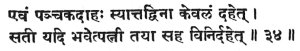
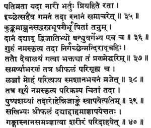
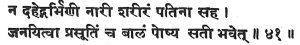
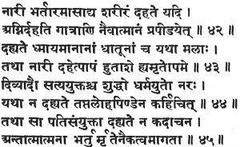
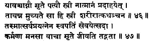
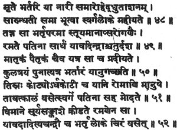

  
[Intangible Textual Heritage](../../index)  [Hinduism](../index) 
[Index](index)  [Previous](gpu11)  [Next](gpu13) 

------------------------------------------------------------------------

[Buy this Book on
Kindle](https://www.amazon.com/exec/obidos/ASIN/B002L16PNW/internetsacredte)

------------------------------------------------------------------------

  
*The Garuda Purana*, by Ernest Wood and S.V. Subrahmanyam, \[1911\], at
Intangible Textual Heritage

------------------------------------------------------------------------

p. 83

### CHAPTER X.

#### The Collecting of the Bones from the Fire.

1\. Garuḍa said: Tell me, O Lord, the rites for burning the bodies of
the good, and describe also the greatness of the wife who is faithful.

2\. The Blessed Lord said: Listen, O Tārkṣya. I will tell you all about
the ceremonies for the upper body, by doing which sons and grandsons are
released from the hereditary debt.

3\. There is no need for numerous gifts, but one should perform the
funeral ceremonies for his parents; the son who does so obtains fruit
like that of the Agniṣṭoma. [1](#fn_93)

4-6. Then the son, abandoning sorrow, should have the shave, along with
all his relatives, in order to remove all sins.

The son who does not have the shave when the mother or father has
died,--how can he be called a son, the helper through the ocean of
changefulness.

Therefore he must have the shave by all means, except the nails and the
hair of the armpits. Then, having bathed with his relatives he must put
on clean cloths.

p. 84

7-9. Then, bringing river water, he should bathe the corpse and next
adorn it with sandal-paste, garlands, or the clay of the Ganges;

Having covered it with new cloths he, with his sacred thread on the
right shoulder, should pronounce the family name, and dedicate
rice-balls and presents,

At the place of death, in the name of the so-called dead, he should
offer them. By this the earth and its presiding deity become pleased.

10\. Ḥe should wake offering at the threshold in the name of him who is
become a traveller; by this the evil ones amongst the tens of millions
of elementals can do no harm.

11-13. Then the daughter-in-law [1](#fn_94) and
others should go round it and worship it; then along with the other
relatives the son should bear it on his shoulder.

The son who bears his father on his shoulder to the burning-ground
obtains the fruit of the horse-sacrifice at every step.

He who carries his dead father on shoulder or back or hip pays off the
debt of constant parental kindnesses.

14\. Then, half-way, after cleaning and sprinkling, he should make a
halt. Having bathed the corpse, he should make an offering for him.

p. 85

15\. Oblations should be made in order that goblins, demons and fiends,
and others in the various directions, shall not cause disturbance of
that body which is to be sacrificed.

16-19. Then it should be taken to the burning-ground, and laid down with
its head to the north. Some place should be cleaned there, for the
burning of the body, as follows:

Having swept the ground and washed it with cow-dung, having taken out
some earth and erected an altar and sprinkled it with water, and having
placed the fire as prescribed,

And having worshipped with flowers and coloured rice the Shining One
known as the eater of flesh, [1](#fn_95) he
should make an oblation as prescribed, beginning with 'loman,'--

"Oh, Thou, Supporter of Beings, Womb of the World, Nourisher of
Creatures. This one belonging to the changing world is dead; lead Thou
him to heaven!"

20-22. Having thus prayed to the fire, he should make there a funeral
pyre with sandal wood, the holy bath wood, and with the wood of palāsha
and aśwattha.

Having placed the departed on the funeral pyre, he should offer in the
name of the departed two rice ball; in the hand of the dead,

p. 86

on the funeral pyre. From the time he is released on the funeral pyre
the condition as departed begins.

Those who know the ways of the departed call him a seeker. An offering
should be made on the funeral pyre, either in this name, or in that of
Departed.

23\. Thus the dead gets the benefit of the offering of five rice-balls;
otherwise the above-mentioned come to disturb.

24\. The son, having dedicated five rice-balls to the departed, and
having brought the oblation with the grasses, should give them to the
fire, if there is not Pañchaka. [1](#fn_96)

25-27. Who dies in the Pañchaka does not attain a good condition.
Burning should not be done then; if it is done, another death occurs.

Beginning from the middle of Dhaniṣṭhā, in the five Pañchaka mansions
ending with Revatī [2](#fn_97) is not a suitable
time for burning. If burning takes place, evil occurs.

Harm befalls the house in which death takes place in the Rikṣa mansion,
and some trouble arises for the sons and family.

28\. I will explain to you the rites for the warding off of all ills, in
case burning takes place in the middle of Rikṣa.

p. 87

20-33. Then one should place near the corpse images, O Tārkṣya, make of
darbha grass, and consecrated with the four Rikṣa mantras.

Purified gold should be used, and sacrifice performed with Rikṣa
mantras, with the mantra "Pretājayata," and with leaf-vessels.

Then the burning along with the images should be done, and the son, on
the day of the offering of the rice-balls, should perform the
pacificatory rites for him.

For warding off ills he should give a vessel full of sesamum, gold,
silver, diamonds, and a bronze vessel filled with clarified butter, in
order.

Who, after having thus performed the pacificatory ceremonies, does the
burning,--no harm befalls him; and the departed goes to the supreme
condition.

 [87-34](#fn_98)

 [87-35](#fn_99)

p. 88

 [88-41](#fn_100)

 [88-42](#fn_101)

 [88-46](#fn_102)

p. 89

 [89-48](#fn_103)

 [89-53](#fn_104)

p. 90

56-50. Whether half or wholly burnt, his skull should be split open, in
the case of householders with a piece of wood, in that of ascetics with
a cocoanut.

His son, so that he may attain the world of the forefathers, having
split open the brahmarandra [1](#fn_105) should
make an oblation of clarified butter with this mantra:

"Thou art born from him; [2](#fn_106) may he be
born again from you. He is an offering to the heaven-world. O Fire,
blaze forth!"

Thus having made an oblation of clarified butter, with mantras and
sesamum offerings, he should weep loudly, that he may become happy

60-61. When the burning is finished the women should bathe, then the
sons, and offer water mixed with sesamum, in the name of the family.

He should eat the leaves of the nimba-tree and recount the virtues of
the dead. They should walk home, the women in front and the men behind.

62\. Having bathed again at home, he should give food to a cow and
eat-from a leaf-plate--but not any food already in the house.

63\. Having cleaned the place of death with cow-dung, he should keep a
lamp burning there, turned to the south, up to the twelfth day.

p. 91

34-66. For three days, at sunset, O Tārkṣya, he should offer, at the
cross-roads or on the burning-ground, milk and water in an earthen pot.

Holding the unbaked earthen pot, filled with milk and water, bound
with-three sticks, he should repeat this mantra:

"Thou hast been burned with the fires of the burning-ground. Thou hast
been forsaken by relatives. Here is milk and here water; bathe and
drink!"

67\. On the fourth day the collection [1](#fn_107) should be made, by those who maintain
household fires, and by those who do not. If there is nothing to
prevent, on the second or the third day he should do as follows:

p. 92

68-78. Having gone to the burning-ground, having bathed and become pure,
having put on a woollen garment, and wearing the sacred ring, [1](#fn_108)

The son should make the grain oblation to the denizens of the
burning-ground, and walk round three times, repeating the mantra
beginning with "Yamāyatva."

Then having sprinkled milk over the place of the funeral pyre, O Lord of
Birds, he should sprinkle water, and begin to pick up the heap of bones.

Having placed them on palasha leaves, he should sprinkle them with milk
and water, and, having put them into an earthen pot, perform Śrāddha as
prescribed.

Having prepared a triangular plot of ground, and cleansed it with
cow-dung, he, facing south, should offer three rice-balls, in the three
directions.

Having collected the ashes from the pyre, taking a three-legged stool he
should place on it a jar with mouth uncovered, containing water.

Then he should make, for the departed, an oblation of cooked rice with
curds and clarified butter, water and sweetmeats, as prescribed.

He should take fifteen steps in the northerly direction and, digging a
hole there, place in it, O Bird, the jar of bones.

Then he should offer over it a rice-ball, which destroys the pain of
burning, and, taking the vessel from the hole, carry it to a tank of
water.

Then he should several times sprinkle the bones with water and milk, and
worship them well, with sandal-paste and saffron.

Having put them into a leaf-box, touched with it his heart and head and
walked round it saluting it; he should drop it into the middle of the
Ganges.

p. 93

79-84. He whose bones sink in the water of the Ganges within ten days,
never returns from the world of Brahma.

As long as a man's bones float on the water of the Ganges,--for so many
thousands of years he remains in the heaven-world.

When the wind which has touched the waves of the Ganges touches the
dead, his sin is at once destroyed.

Having worshipped, with great austerities, the divine Ganges, for the
uplifting of his forefathers, Bhagīratha [1](#fn_109) brought her down from the world of
Brahmā.

In the three worlds is celebrated the purifying fame of the Ganges, who
led to heaven the sons of Sagara [2](#fn_110)
who had been reduced to ashes.

Those men who die after committing sins attain the heaven-world by their
bones falling into the Ganges.

85-86. There was a certain hunter, a destroyer of all sorts of creatures
who, killed by a lion in a great forest, went to the place called hell.

When his bones were dropped into the Ganges by a crow he ascended the
divine chariot and went to the abode of the Shining Ones.

87\. Hence the good son should himself drop the bones in the Ganges.
After the bones are collected he should perform the ten-days'
ceremonies.

p. 94

88-90. Now, if anybody meets his death in an uninhabited place, or in a
wood, or from dangerous thieves, and if his body is not found, then, on
the day this is heard of--

Having made an effigy of darbha grass, one should burn it alone, as
explained above, and then collect its ashes and drop them into the water
of the Ganges,

And from the same day the ten-days' [ceremonies](errata.htm#7) should be
performed and that date should be noted, for the performance of the
annual Śrāddha.

91\. If a woman dies in the fulness of pregnancy, her womb should be cut
open, and the child drawn out and placed on the ground, and she alone be
burned.

92-93. If a child dies on the bank of the Ganges, it should simply be
thrown into the Ganges; if in another place, it should be buried in the
ground, up to twenty-seven months old.

Older than that it should be burned and its bones strewn on the Ganges.
A gift of a water-pot should be made, and food should be given to
children.

p. 95

94-98. If the embryo perishes, there are no rites. If an infant dies,
one should give milk. if a child dies, then one should offer a jar,
milk-porridge and eatables.

If a youth dies, one should have young children fed. If a youth who has
taken the vow dies, one should have Brāhmiṇs, along with children, fed.

When one who has passed five years dies, whether vowed or not, one
should offer ten rice-balls, along with milk-food and lumps of sugar.

On the eleventh and twelfth days one should perform the ceremonies for a
youth, but without the rites of releasing a bull and of the great gift.

If the father is living, there is not joint rite for the youth, but on
the twelfth day one should perform the ceremony for him alone.

99\. Marriage, with women and Śūdras, is declared to take the place of
vows. Previous to the taking of vows, with all the castes, rites are
done according to age.

100\. He who is little attached to action, who is little bound by
sense-objects, and he who is young in age of body, requires but scanty
rites.

101\. In boyhood and in youth the cot, the bull and other sacrifices
should be performed; and the gifts of land, the great gift and the gift
of a cow should be made.

p. 96

102-107. With all ascetics there is no burning, no water rites; and the
ten-days' ceremonies should not be performed for them by their sons.

A man, by the mere holding of the staff, becomes Nārāyaṇa [1](#fn_111); because of carrying the three-fold
staff they never go into the condition of the departed.

Those who know are always free, by realisation of their own true nature,
hence they do not expect rice-balls to be given.

Therefore rice-balls and water should not be offered to them, but one
should perform the annual Śrāddha at the sacred waters, and Śrāddha at
Gayā, with devotion to the forefathers.

The Haṅsa, Paramahaṅsa, Kutīchaka, Bahūdaka; these are Sannyāsins, [2](#fn_112) O Tārkṣya, and when dead, they must be
buried in the ground.

If the Ganges, or other, is not available, it is declared that they
should be buried in the ground. Where great rivers exist, they should be
thrown into them.

------------------------------------------------------------------------

### Footnotes

[83:1](gpu12.htm#fr_95) A certain sacrifice.

[84:1](gpu12.htm#fr_96) His son's wife--the wife
of the son performing the rite.

[85:1](gpu12.htm#fr_97) The fire-deva.

[86:1](gpu12.htm#fr_98) A certain astrological
position; 5 days in each month.

[86:2](gpu12.htm#fr_99) The fifth Nakṣatra.

[87:87-34](gpu12.htm#fr_100)  

[87:87-35](gpu12.htm#fr_101)  

[88:88-41](gpu12.htm#fr_102)  

[88:88-42](gpu12.htm#fr_103)  

[88:88-46](gpu12.htm#fr_104)  

[89:89-48](gpu12.htm#fr_105)  

[89:89-53](gpu12.htm#fr_106)  

[90:1](gpu12.htm#fr_107) An opening at the top
of the head.

[90:2](gpu12.htm#fr_108) The funeral pyre is
lighted from the sacred household fire.

[91:1](gpu12.htm#fr_109) Of the bones.

[92:1](gpu12.htm#fr_110) A finger-ring of kusha
grass, put on the third finger of right hand.

[93:1](gpu12.htm#fr_111) A great king who is
said to have brought down the Ganges from heaven to earth.

[93:2](gpu12.htm#fr_112) There is a legend to
the effect that the 80,000 sons of Sagara were reduced to ashes by
Viṣṇu, and that they, the ancestors of Bhrigu, were released and
purified by him in the Ganges.

[96:1](gpu12.htm#fr_113) Viṣṇu.

[96:2](gpu12.htm#fr_114) These names are given
to advanced stages of human development.

------------------------------------------------------------------------

[Next: Chapter XI. An Account of the Ten-Days' Ceremonies](gpu13)

