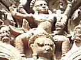

  
[Intangible Textual Heritage](../../index)  [Hinduism](../index.md) 
[Index](index)  [Previous](gpu12)  [Next](gpu14.md) 

------------------------------------------------------------------------

[Buy this Book on
Kindle](https://www.amazon.com/exec/obidos/ASIN/B002L16PNW/internetsacredte.md)

------------------------------------------------------------------------

  
*The Garuda Purana*, by Ernest Wood and S.V. Subrahmanyam, \[1911\], at
Intangible Textual Heritage

------------------------------------------------------------------------

p. 97

### CHAPTER XI.

#### An Account of the Ten-Days' Ceremonies.

1\. Garuḍa said: Tell me, O Keśava, what good results follow from the
performance of the ten-days' rite, and who should perform it if there is
no son.

2 The Blessed Lord said: Listen, O Tārkṣya, and I will tell you about
the ten-days' ceremony; having done which, a good son is released from
the hereditary debt.

3-8. The son, taking calm courage, should offer rice-balls to the
father, refraining from tears,

Because the departed has inevitably to drink the bitter tears let fall
by his relatives, and they should not weep when sorrow is useless.

Although there be sorrowing day and night for thousands of years, the
man who is dead may never be seen.

Death is certain for those who are born, and birth is certain for the
dead. This is inevitable and therefore a wise man should not grieve over
it.

p. 98

There is no way out, either human or divine; the being who has come
under the sway of death must be born again here.

If there were a way of averting the inevitable, then Nala, Rāma and
Yudiṣhṭhira would not have experienced miseries.

9-11. Nobody should form an excessive attachment to anybody; the body is
only a dream, what then of other persons’?

As a traveller, resorting to some shady place, rests awhile and then
departs again; so is the coming together of beings.

The good things eaten in the morning are destroyed by evening; how can
there be permanence in a body which is sustained by these foods?

12-17. Having considered this, which removes misery, and given up sorrow
arising from ignorance, the son should perform the rites.

If there is no son the wife, should perform them, and if no wife the
brother; or a Brāhmiṇ's pupil or a proper kinsman should perform them.

The ten-days' ceremonies, for the man who has no son, should be
performed by the sons or grandsons of his younger or his elder brother,
O Bird;

Manu declared that if, of brothers of the same father, only one has a
son, they are all considered, on account of that son, to have a son.

p. 99

If a man has several wives, but only one of them has a son, all of them
have a son, on account of that son.

For all who have no sons a friend may offer the rice-balls. The rites
[must](errata.htm#8.md) not be neglected. If there is nobody else, the
family priest may do them.

18\. A man or a woman who performs the rites for a friend, by this
sacrament for the helpless departed, obtains the fruit of tens of
millions of sacrifices.

19-21. The ten-days' ceremony for the father should be performed by the
son, O Bird. Even if the eldest son dies, the father should not, through
excessive affection, perform it.

Although there be many sons, only one shall perform the ten-days'
ceremony, the rice-ball offerings, and the other sixteen Śrāddhas,--

Only by one these ceremonies, even if the wealth has been divided. But
the annual Śrāddha should be performed severally if the wealth has been
divided.

22-24. Therefore should the eldest son perform with devotion the
ten-days’ ceremony, [1](#fn_113.md) eating one
meal, sleeping on the ground, devoted to Brāhmaṇ, [2](#fn_114.md) and pure.

The son obtains such fruit from the performance of the rite for the
father and mother, as is obtained by going round the shrines seven
times.

p. 100

The son who performs the rites for one year, beginning with the
ten-days' ceremony, obtains such fruit as is acquired by performing the
Śrāddha at Gayā.

25-30. Having gone to a well or a tank, in a garden, at a sacred
bathing-place, or in a temple, between nine and twelve noon, he should
bathe without reciting mantras.

Being purified, seated facing southward at the root of a tree, he should
make an altar [1](#fn_115.md) there, cleansed with
cow-dung.

He should place on it, over leaves, a twice-born [2](#fn_116.md) made of darbha and kuśa grasses, and
having worshipped it with water for the feet and other things, should
bow to it, saying the "Atasī."

Then having spread kuśa grass in front of it, as a seat for the
rice-ball, and having placed upon it a ball prepared in the family-name
of the departed,

Made of cooked rice or of barley meal,--the son should make the
offering. He should dedicate Usīra-root; sandal paste, the flowers of
the Bhṛiṅgarāja, incense, a lamp, eatables, mouth-perfumes and presents.

Crow-food, milk and water, and handfuls of castor-oil in a pot: "May all
this, that has been given by me to the departed in his earthly name,
persist."

p. 101

31-33. Food, cloths, water, wealth or other things, if given in the name
of the departed, confer eternity upon the dead.

Therefore, from the first day onwards, one should pronounce the name of
the departed woman or man, in accordance with the sapiṇḍa rite.

33\. In the same way that on the first day a rice-ball is given as
prescribed, so should the nine rice-balls be given.

34-36. On the ninth day all the authorised kinsmen at the proper time
should besmear themselves with oil, wishing the dead to reach heaven.

Having bathed in the open, taking with them panic grass and parched
grain, and having the women go in front, they should proceed to the
place of the dead,

And say: "May his family increase like the panic grass, and radiate like
the parched grain," and then leave in the house the mixed-panic grass
and grain.

37-38. On the tenth day a ball of flesh should be given, O Lord of
Birds, or a ball of māṣa, since flesh is forbidden in the Kali Yuga at
the ceremony for the forefathers.

On the tenth day he should shave, as also should the other relatives.
The son who performs the ceremony must again have a complete shave.

p. 102

39\. During the ten days he should feed a twice-born with seasoned
foods. Having meditated upon Hari, he should, with hands together, pray
for the release of the departed.

40\. There is no reason for fear for those who bow to Govinda, the
Eternal, clad in yellow robes, as beautiful as the atasī flower.

41-42. "O Beginningless and Endless Deva, O Bearer of the conch, discus
and mace, Indestructible, Lotus-eyed, be Thou the giver of release to
the departed."

Every day at the conclusion of the Śrāddha he should prayerfully repeat
this incantation. Having bathed, gone home, and given food to the cow,
he may eat.

------------------------------------------------------------------------

### Footnotes

[99:1](gpu13.htm#fr_115.md) One each day.

[99:2](gpu13.htm#fr_116.md) Celibate.

[100:1](gpu13.htm#fr_117.md) A square flat mound a
few inches high.

[100:2](gpu13.htm#fr_118.md) A rough image,
symbolical of the deceased twice-born person.

------------------------------------------------------------------------

[Next: Chapter XII. An Account of the Eleventh-day Rite](gpu14.md)

