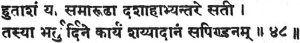

  
[Intangible Textual Heritage](../../index)  [Hinduism](../index.md) 
[Index](index)  [Previous](gpu14)  [Next](gpu16.md) 

------------------------------------------------------------------------

[Buy this Book on
Kindle](https://www.amazon.com/exec/obidos/ASIN/B002L16PNW/internetsacredte.md)

------------------------------------------------------------------------

  
*The Garuda Purana*, by Ernest Wood and S.V. Subrahmanyam, \[1911\], at
Intangible Textual Heritage

------------------------------------------------------------------------

p. 114

### CHAPTER XIII.

#### An Account of the Ceremony for all the Ancestors.

1\. Garuḍa said: Tell pre, O Lord, about the method of \[performing\]
the Sapiṇḍa rite. the removal of pollution, and the gift of accessories.

2\. The Blessed Lord said: Listen, O Tārkṣya, and I will explain to you
the entire Sapiṇḍa rite, by which the condition of preta is left behind
and the soul enters the class of the pitṛis.

3-5. Those whose piṇḍas have not been mixed together with the ancestors
called Śiva and the rest, [1](#fn_129.md) are not
uplifted by the various gifts made by the sons.

If the son is always impure, they are never purified; without the
Sapiṇḍa rite the impurity does not depart.

Therefore the Sapiṇḍa, at the end of the pollution period, should be
performed by the son. I will tell you about the ending of pollution to
be observed by all.

p. 115

6-9. A Brāhmiṇ becomes pure in ten days, a Kṣattriya in twelve days; a
Vaiśya in fifteen days, a Śūdra in a month.

The Sapiṇḍa relatives [1](#fn_130.md) are purified
from the death pollution in ten days; the Sākulya relatives [2](#fn_131.md) in three nights, and the gotrajās [3](#fn_132.md) are purified merely by bathing.

Those who are related within the fourth degree to the deceased are
purified in ten nights, those in the fifth degree, in six nights; the
sixth, four days; the seventh, three days;

The eighth, a single day; the ninth, a quarter of a day; the tenth,
merely till bathing;--so long lasts the pollution of death and birth
\[according to the distance of degrees from the deceased\].

10-11. If a person dies in a foreign land and one hears of his death,
then the impurity lasts for the remaining portion of ten days on which
he hears the news;

If after the lapse of ten days, he is polluted for three nights. If
after a year, he becomes pure even by bathing.

12\. If a second pollution comes daring that from the first death, then
the purification from the first pollution includes that from the second.

13\. If a boy who has not yet cut his teeth dies, purification is
immediate; before tonsure, one night, it is said; before the investiture
with the thread, three nights; and afterwards, ten nights.

14-16. If a girl dies between birth and tonsure, purification is
immediate, in all the castes alike;

p. 116

Up to betrothal a single day, and from that to old age three nights are
authoritative;

If after the betrothal ceremony three days for both families, it should
be understood; if after marriage, only the husband's family.

17-18. If the embryo dies before sixth month; in as many days the embryo
lived months, purity is regained.

After this the women are polluted, according to the caste. If the embryo
dies, purification of the Sapiṇḍa relatives is immediate.

19\. During the Kali Age--it is authoritatively declared in the
Śāstras--ten days' purification for all the castes, after births and
deaths.

20-22. Blessing the worship of the Shining Ones, reception of guests,
salutation, lying on a bed, and touching others should not he done
during the death pollution.

Sandhyā prayers, giving, reciting, fire-offering, religious study,
offering to the forefathers, feeding of Brāhmiṇs and the observance of
vows should not be done during the death pollution.

He who during pollution performs the daily, the occasional and the
specially desired ceremonies--of him the regular and other ceremonies
already done are lost.

23\. For one observing vows, engaged in mantras or in fire-offerings, or
a twice-born intent upon Brāhmaṇ, an ascetic or a king there is verily
no pollution.

p. 117

24-26. Food prepared before marriage festivals and sacrifices, and
before the pollution by birth or death, can be eaten; so Manu declared.

Whoever, during pollution, accepts through ignorance, suffers no evil,
but the giver even though it be to a mendicant that he gives, suffers
evil.

Whoever, hiding his pollution, gives food to a twice-born, and the
Brāhmiṇ who knowing it, accepts it,--are both subjected to suffering.

27\. Therefore, for the purifying from pollution, one should perform the
Sapiṇḍa ceremony for the father, who then goes to the world of the
forefathers to join the multitudes of forefathers.

28-30. The truth-knowing sages hare declared that the Sapiṇḍa ceremony
should be on the twelfth day, the third fortnight, the sixth month or at
the end of the year.

But I say, O Tārkṣya, following the scriptural ordinances, that for the
four castes the Sapiṇḍa should be on the twelfth day.

The twelfth day is preferable because of the endless variety of
conditions in the Kali Age, and because of the shortened life of men,
and the impermanence of the body.

31-33. If a Brāhmiṇ house-holder dies, then investiture with the sacred
thread, the fulfilment of vows, marriage and other ceremonies should not
be done,

p. 118

Until the Sapiṇḍa has been performed the mendicant should not accept
alms; and guest-offerings should not be accepted. The daily and the
occasional ceremonies should be discontinued.

By the omission of rites sinfulness arises; therefore one should perform
the Sapiṇḍa ceremony on the twelfth day, whether he be without fire or
with fire.

34\. The fruit which accrues from visiting all the sacred
bathing-places; the fruit which accrues from performing all sacrifices:
that fruit is obtained by doing the Sapiṇḍa ceremony on the twelfth day.

35\. Hence, having bathed, and having cleaned with cow-dung the place of
death, the son should perform the Sapiṇḍa ceremony, as laid down in the
scriptures.

36-30. Then he should worship the world-deities with foot-water,
oblations, [1](#fn_133.md) and āchamana. [2](#fn_134.md) Next, having given rice-balls to other
departed ones, he should sip water.

He should offer three rice-balls in order to his grandfather and others,
in the forms of Vasu, Rudra and Arka, and the fourth rice-ball to the
dead.

He should worship with sandal-paste, leaves of the holy basil, incenses,
lamps, agreeable fools, mouth-scents, good cloths and presents.

Having divided the rice-ball for the departed into three parts with a
thin bar of gold, he should mix them severally with the three rice-balls
given to the grand father and the others.

p. 119

40\. It is my decision, O Tārkṣya, that the Sapiṇḍa ought to be done;
the mother's with the grandmother's and the father's with the
grandfather's.

41-43. If the father dies while the grandfather still lives, three rice
balls should be offered to the great grandfather and his predecessors.

The father's rice-ball, divided into three parts should be mixed with
their rice-balls. If the mother dies before the grandmother--

Then he should perform the mother's Śrāddha in the same way as the
fathers; or should mix the rice-ball with both mine and great Lakṣmī's.

44\. The husband should perform the Sapiṇḍa ceremony for his, wife, if
she has no son; he should do the Sapiṇḍa for her along with the
mother-in-law and others.

45\. "The Sapiṇḍa rite for women should be done with that for the
husband, his father and grandfather"--that, O Tārkṣya, is not my
opinion; because the wife being already half the body of her husband
requires no Sapiṇḍa ceremony with regard to her husband.

46\. If, O Kāśyapa! husband and wife ascend the same funeral pyre, then,
having put grasses between them, he should perform it with that of the
mother-in-law and father-in-law.

47\. Only one son should perform the rites; first the offering of a
rice-ball and other things for the father, and after that, having bathed
again, the rite for the mother.

p. 120

 [120-48](#fn_135.md)

49-51. Having done the Sapiṇḍa, O Tārkṣya, he should make the offering
of water to the forefathers. He should utter "Let there be Swadhā,"
along with Vaidic mantras.

Afterwards he should always have a guest fed until he says
"hanta." [1](#fn_136.md) By this the forefathers,
the sages, the Shining Ones and the Dānavas are pleased.

As much as a mouthful is called "alms," four mouthfuls is "abundance,"
and four abundances is called "hantakāra."

52-53. During the Sapiṇḍa he should worship the feet of a twice-born
with sandal-paste and coloured rice, and make to him a gift, for his
continued satisfaction.

He should have maintenance for a year, clarified butter, food, gold,
silver, a good cow, a horse, an elephant, a chariot and a plot of ground
given to a preceptor.

54\. Then he should worship with mantras--after saying "Hail to
thee"--the planets, Devi, [2](#fn_137.md) and
Vinīyakam [3](#fn_138.md), with saffron, coloured
rice and eatables.

55\. The preceptor should then, with mantras, sprinkle water, and having
bound a thread upon the hand, should present the coloured rice also
consecrated with mantras.

p. 121

50-57. Then he should have Brāhmiṇs fed with various pleasant sweetened
foods, and he should give them presents, and twelve pots with water and
food.

After the feeding of the twice-born, water, a weapon, scales, and a rod
should be touched severally by the castes, who are respectively thus
purified.

58\. The Sapiṇḍa ceremony having been thus performed, the cloths worn
during the rite should be cast off; and white cloths having been donned,
the gift of a bed should he made.

59-64. All the Devās, [1](#fn_139.md) headed by
Indra, extol the gift of a bed. Therefore a bed should be given, during
life or else after death.

Made of the choicest wood, delightful, painted in beautiful colours,
strong, canopied with silken cloth, ornamented with gold leaves,

Having beautiful pillows stuffed with swans' down, together with a
coverlet made fragrant with the scent of flowers,

Well-bound with bright bands, broad and pleasant: such a bed as this
being made, it should be placed on the ground covered with cloth.

An umbrella, a row of silver lamps, an oxtail fan, a seat, a vessel, a
water-pot, a mirror, and a canopy of five colours,

p. 122

And all the other accompaniments of the bed he should place round it, in
their proper places.

65-66. On it he should have placed a golden Hari, together with Lakṣmī,
with all the ornaments, weapons and clothes.

And, in the case of women, having placed them on the bed, he should have
the red dye, saffron, clothes, ornaments, and all the other necessary
things.

67-68. Then a Brāhmiṇ, with his wife adorned with fragrances and
flowers, with ear and finger ornaments and golden necklaces,

Wearing a turban and an upper cloth and jacket, should be seated by him
on the comfortable bed, in front of Lakṣmī and Nārāyaṇa.

69-71. He should worship Hari and Lakṣmī with saffron and
flower-garlands, and adore the Guardians of the World, the Planetary
Spirits and Vināyaka.

Facing north, and holding flowers in his palms, he should pronounce this
mantra, standing in front of the Brāhmiṇ:

"Just as, O Kṛiṣṇa, your bed is the ocean full of milk, may this
likewise be not empty in my future births."

p. 123

72-74. Thus he should place the handsful of flowers before the Brāhmiṇ
and the image of Hari, and then the bed-gift with its accompaniments,
according to the rite.

He should give it to him who observes vows, is a teacher, and tells
about Brāhmiṇ, and say, "O Brāhmiṇ, receive these. How seldom does any
one so give!"

He should rock the twice-born and Lakṣmī and Hari, seated on the bed,
and then, having walked round and bowed, give them leave.

75\. If he is rich he should give a very beautiful house, furnished with
all the necessaries, so that he may sleep happily on the bed,

76\. If a living man makes with his own hand the gift of a bed, there
should be performed, while he is still living, on full moon day the
dedication of a bull.

77\. This bed should be given to one only, and never to several. Divided
or sold it drags down the giver.

78\. Having given a bed to a deserving person, he may obtain the fruit
of his desires. The father, and the son giving it, rejoices here and
hereafter.

79-80. At the celestial house of Indra, and at the abode of Yama, he
will arrive without doubt through the potency of the gift of a bed.

He will reside there free from trouble, seated in the best of chariots,
waited upon by numbers of celestial damsels, until the coming of the
deluge.

p. 124

81\. The merit from all the sacred bathing places, and on all the days
of the changes of the moon: even superior to these is the merit arising
from the gift of a bed.

82-86. Having this made the gift of a bed, the son should have
*Padadāna* given. Listen to my words, and I will tell you the method of
it.

An umbrella, shoes, clothes, a signet ring, a water-pot, a seat, a set
of five vessels--are called the seven kinds of padas.

This pada becomes complete with a staff, a copper vessel, uncooked rice,
foods, [valuables](errata.htm#12.md), and sacred threads.

Having, according to his means, obtained these thirteen padas he should
give, them to thirteen Brāhmiṇs on the twelfth day.

By this *padadāna* the righteous go to a good condition, and this
*padadāna* gives happiness to those who have gone on the way of Yama.

p. 125

87-93. There is there intense heat, by which the man is scorched, but
the gift of an umbrella makes pleasant shade above his head;

And on the path in the world of Yama, full of great thorns, those who
gave shoes go riding horses.

The miseries of cold and heat and wind are dreadful there, O Bird, but
by the power of the gift of clothes he goes happily along the way.

The messengers of Yama, very terrible, fierce and brown-black, do not
trouble on the road him who made the gift of a signet ring.

It is enveloped in great heat, is windless and without water; through
the gift of a water pot he, when thirsty, drinks water.

Who, for the dead, gives a water-vessel made of copper, certainly enjoys
the fruit which is obtained by thousands of gifts of wells.

Through properly giving to a twice-born a seat and a vessel, leisurely
going on the path he comfortably enjoys his provisions,

94-95. Having thus given, on the day of the Sapiṇḍa ceremony, this gift,
as prescribed, he should have many Brāhmiṇs fed, also chaṇḍalās and
other outcasts.

Then, after the *Sapinda* and before the annual ceremony, a water-pot
with rice-balls should be given every month.

911\. There is no re-doing of what is done excepting the rites for the
departed, [1](#fn_140.md) O Bird; but, for the
sake of the departed it may be done again, as a means of unfading
satisfaction.

97-99. Now I shall tell you the rules concerning the monthly, the annual
and the fortnightly ceremonies, and of dying on lunar days.

p. 126

If one dies at the full moon his rites fall on the fourth day. If one
dies on the fourth day his rites fall on the ninth.

If one dies on the ninth day, his day is the fourteenth. In these cases
one should perform the fortnightly Śrāddha on the twentieth day.

100-105. When in one month \[Kṣayamāsa\] two saṅkrāntis occur, in the
irregular month, the month being double, the Śrāddha is not
performed. [1](#fn_141.md)

When there are two months in one month, of those two, the two fortnights
and the thirty days are the same \[both must be performed.\] For the
first half day take the former \[the dark\]; for the second half,

p. 127

the latter. Thus are understood by the wise the two months which are in
the irregular month.

The Sapiṇḍa ceremony, O bird, should be done when there is no sankrānta;
similarly the monthly and the first annual Śrāddhas.

If there is an additional month in the middle of a year, then in the
thirteenth month the annual ceremony for the departed occurs.

When there is no [sankrānta](errata.htm#15.md), rice-balls are not used;
when there is sankrānta, rice-balls are proper. Thus the annual Śrāddha
should be done in both months.

106\. Thus, at the end of the first year one should perform the annual
Śrāddha, and in that, in addition, the twice-born should be fed.

107-110. After a year one should always offer three rice-balls at the
Śrāddha. The ceremony for one only should not be done; by it one becomes
the destroyer of his forefathers.

The Śrāddha at a sacred bathing-place, the Śrāddha at Gaya, the
Gajachchhāyam, for the fathers--these he should not do during the year,
nor at eclipses, nor on yuga days.

If the son performs the Śrāddha at Gayā, O Lord of Birds, it should be
done after a year, with devotion to the forefathers.

The forefathers are freed from the ocean of existence by the Śrāddha at
Gayā and, by favour of the Viṣṇu, they go to the supreme state.

p. 128

111-113. He should worship the feet of Viṣṇu with the shoots of the holy
basil, and in proper order offer rice-balls round them.

He who offers, on the head of Gayā, a rice-ball of the size of even a
śamī leaf helps over seven clans and one hundred and one fatuities.

He who, delighting the family, having gone to Gayā, performs the Śrāddha
and gives satisfaction to the forefathers, his life is fruitful.

111-115. O Lord of birds, the forefathers hear a song sung by the Holy
Ones in Kalāpa, the garden of Ikṣvāku, the son of Manu:--

"Are there none in your family, treading the good path, who, having gone
to Gayā, will offer us rice-balls, with devotion?"

116-119. The son who thus performs the rites for the other world, O
Tārkshya, is happy and becomes liberated, like the son of Kauśika.

The seven sons of Bharadwāja, having experienced a series of births,
were liberated by the favour of the forefathers, O Tārkshya, although
they killed a cow.

The seven hunters in the country of Daśārṇas; the deer on the mountain
of Kālinjira; the Chakravaka birds in Śaradvīpa: and the swans in the
Mānasa lake

Were born as Brāhmiṇs learned in the Vedas, on the field of the Kurus,
and all these sons of the twice-born attained liberation through
devotion to the forefathers.

p. 129

120\. Therefore a man should make every effort in devotion to the
forefathers, for by devotion to the forefathers he becomes happy either
in this or the other world.

121\. Thus I have told you, O Tārkṣya, all the ceremonies, concerning
the deceased, giving merit to and satisfying the desires of the son, and
giving liberation to the forefathers.

122\. Any man who is poor, but hears this account, even he, absolved
from sins, obtains the fruit of gifts.

123-126. He who performs, according to the rite, the Śrāddha offerings
described by me, and also hears the Garuḍa Purāṇa,--listen to the fruit
for him:--

The father gives good sons; the grandfather, wealth of cows and his
[great-grandfather](errata.htm#16.md) becomes the giver of riches.

The great-great-grandfather gives foods in abundance: all these,
gratified by the Śrāddha, granting the son's desires,

Go on the way of righteousness to the mansion of the King of Justice,
and there they remain, highly respected, in the assembly of
Righteousness.

127\. Sūta said: Having heard the result of the after-death gifts and
their mighty greatness, thus declared by the Blessed Viṣṇu, Garuḍa went
into raptures.

------------------------------------------------------------------------

### Footnotes

[114:1](gpu15.htm#fr_131.md) The grandfather, his
father and grandfather are considered as corresponding to Vasu, Rudra
and Āditya. Rudra is Śiva.

[115:1](gpu15.htm#fr_132.md) Cousins up to the
seventh, on the male line,--all males and unmarried females.

[115:2](gpu15.htm#fr_133.md) Cousins up to the
fourteenth, on the male line,--all males and unmarried females.

[115:3](gpu15.htm#fr_134.md) Cousins up to the
forty-second, on the male line,--all males and unmarried females.

[118:1](gpu15.htm#fr_135.md) Consisting of rice,
darbha grass, and flowers, with water.

[118:2](gpu15.htm#fr_136.md) See "Daily Practice
of the Hindus" for an account of āchamana.

[120:120-48](gpu15.htm#fr_137.md)  .

[120:1](gpu15.htm#fr_138.md) A benediction which
the recipient makes when he has had enough.

[120:2](gpu15.htm#fr_139.md) The consort of Śiva.

[120:3](gpu15.htm#fr_140.md) Gaṇeśa.

[121:1](gpu15.htm#fr_141.md) A high class of
superhuman beings.

[125:1](gpu15.htm#fr_142.md) If other ceremonies
have been badly done they may not be re-performed; but this may.

[126:1](gpu15.htm#fr_143.md) "The ceremonies are
performed according to the lunar months, but there are to be only twelve
of the monthly ones in a year. Astrological calculations are done with
solar months. Hence there is an intercalary month of 30 days every three
years. The sankrānta is a solar month, the passing of the sun through
one [zodiacal](errata.htm#13.md) constellation. The difference of solar and
lunar months is about 11 days in the year; hence an additional irregular
month occurs once in 27 months. In this long month; the malamasa, or
irregular portion, is the first half, while the second half is regular.
The kṣaya-māsa is a name for a month which occurs every 149th year, in
which there is no sankrānti,--thus there are only 12 months in that
year, not 13, although it is a year of intercalary month. In this case
the intercalary is added [and (?)](errata.htm#14.md) treated as such, but
the regular mouth is dropped. It is November, December, January or
February which is thus dropped, but the intercalary is always associated
with one of the other eight. The month preceding month which is dropped
has its two fortnights taken as belonging to the regular and the dropped
month respectively. If a man dies in the second fortnight in this case
the annual ceremony belongs to the month which was dropped. lf, on the
other hand, a main has died and his month is dropped the preceding month
is taken for the annual Śrāddha. If a man dies in the adigmāsa, then his
annual Śrāddha must be done in the dark half on the same day on which he
died; if his death occurred during the first half of the day, and on the
same day in the bright half if he died during the second half of the
day.

------------------------------------------------------------------------

[Next: Chapter XIV. An Account of the City of the King of
Justice](gpu16.md)

