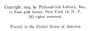

  
[Intangible Textual Heritage](../../index)  [Hinduism](../index) 
[Yoga](../yoga/index)  [Index](index)  [Next](gsoy01) 

------------------------------------------------------------------------

[Buy this Book at
Amazon.com](https://www.amazon.com/exec/obidos/ASIN/1425482597/internetsacredte)

------------------------------------------------------------------------

*Great Systems of Yoga*, by Ernest Wood, \[1954\], at Intangible Textual
Heritage

------------------------------------------------------------------------

*Books by the Same Author*

<table data-border="0">
<colgroup>
<col style="width: 100%" />
</colgroup>
<tbody>
<tr class="odd">
<td data-valign="top">
Practical Yoga: Ancient and Modern. 
The Glorious Presence: An Exposition of Vedanta. 
Mind and Memory Training. 
Concentration: A Practical Course. 
The Intuition of the Will.
</td>
</tr>
</tbody>
</table>

  [  
Click to enlarge](img/front.jpg)  
Mahāvēra  
*ca 11th Century*—NORTH CENTRAL INDIAN STONE  

# GREAT SYSTEMS OF YOGA

### Ernest Wood

#### Philosophical Library

#### New York

#### \[1954\]

Scanned at Intangible Textual Heritage. Proofed and formatted by John
Bruno Hare. This text is in the public domain in the United States
because it was not renewed at the US Copyright Office in a timely
fashion. These files may be used for any non-commercial purpose provided
this Notice of Attribution is left intact in all copies.

  [  
Click to enlarge](img/title.jpg)  
Title Page  

 
[  
Click to enlarge](img/verso.jpg)  
Verso  

------------------------------------------------------------------------

[Next: Table of Contents](gsoy01)
