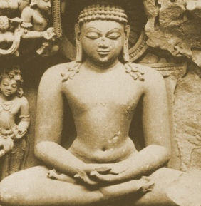

  
[Intangible Textual Heritage](../../index)  [Hinduism](../index) 
[Yoga](../yoga/index) 

------------------------------------------------------------------------

[Buy this Book at
Amazon.com](https://www.amazon.com/exec/obidos/ASIN/1425482597/internetsacredte)

------------------------------------------------------------------------

<table width="75%">
<colgroup>
<col style="width: 50%" />
<col style="width: 50%" />
</colgroup>
<tbody>
<tr class="odd">
<td width="50%" data-valign="TOP"></td>
<td width="50%" data-valign="CENTER"><h1 id="great-systems-of-yoga" data-align="CENTER">Great Systems of Yoga</h1>
<h2 id="by-ernest-wood" data-align="CENTER">by Ernest Wood</h2>
<h4 id="section" data-align="CENTER">[1954]</h4></td>
</tr>
</tbody>
</table>

------------------------------------------------------------------------

[Contents](#contents)    [Start Reading](gsoy00)

------------------------------------------------------------------------

|                                                                                                                           |
|---------------------------------------------------------------------------------------------------------------------------|
|  |

This is a short review of the major schools of yoga, including Hindu,
Buddhist and Sufi varieties. Wood, whose translation of the [The Garuda
Purana](../gpu/index) is also at this site, was a founding Theosophist
and wrote extensively on Hinduism, and Yoga in particular. His works on
the subject are written for Western readers, and where he needs to use
Sanskrit or other esoteric terms, he takes care to explain them. He was
a practicing Yogi for most of his lifetime.

------------------------------------------------------------------------

 [Title Page and Front Matter](gsoy00)  
[Table of Contents](gsoy01)  
[Preface](gsoy02)  
[Chapter One. The Ten Oriental Yogas](gsoy03)  
[Chapter Two. Patanjali's Raja Yoga](gsoy04)  
[Chapter Three. Shri Krishna's Gita-Yoga](gsoy05)  
[Chapter Four. Shankaracharya's Gnyana-Yoga](gsoy06)  
[Chapter Five. The Hatha and Laya Yogas](gsoy07)  
[Chapter Six. The Bhakti And Mantra Yogas](gsoy08)  
[Chapter Seven. The Occult Path of Buddha](gsoy09)  
[Chapter Eight. The Chinese Yoga](gsoy10)  
[Chapter Nine. The Sufi Yogis](gsoy11)  
[Index](gsoy12)  
