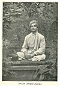
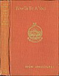
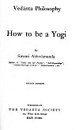
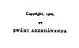

  
[Intangible Textual Heritage](../../index)  [Hinduism](../index) 
[Index](index)  [Next](hby01) 

------------------------------------------------------------------------

##### Vedânta Philosophy

# How to be a Yogi

###### By

## Swami Abhedananda

###### Author of "India and her People", "Self-Knowledge", "Divine Heritage of Man", "Reincarnation", etc.

#### FOURTH EDITION

#### PUBLISHED BY

#### THE VEDANTA SOCIETY

#### 135 West Both Street

#### NEW YORK

#### \[1902\]

**NOTICE OF ATTRIBUTION**  
Scanned at Intangible Textual Heritage, January, 2005. John Bruno Hare,
redactor. This text is in the public domain in the United States because
it was published prior to 1922. These files may be used for any
non-commercial purpose, provided this notice of attribution is left
intact.

 

[  
Click to enlarge](img/front.jpg)  
SWAMI ABHEDANANDA  

[  
Click to enlarge](img/cover.jpg)  
Cover  

[  
Click to enlarge](img/title.jpg)  
Title Page  

[  
Click to enlarge](img/verso.jpg)  
Verso  

------------------------------------------------------------------------

[Next: Preface](hby01)
