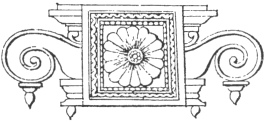

  
[Intangible Textual Heritage](../../index)  [Hinduism](../index.md) 
[Index](index)  [Previous](hmvp00)  [Next](hmvp02.md) 

------------------------------------------------------------------------

  
*Hindu Mythology, Vedic and Puranic*, by W.J. Wilkins, \[1900\], at
Intangible Textual Heritage

------------------------------------------------------------------------

p. vii

### PREFACE.

On reaching India, one of my first
inquiries was for a full and trustworthy account of the mythology of the
Hindus; but though I read various works in which some information of the
kind was to be found, I sought in vain for a complete and systematic
work on this subject. Since then two classical dictionaries of India
have been published, one in Madras and one in London; but though useful
books of reference, they do not meet the want that this book is intended
to supply. For some years I have been collecting materials with the
intention of arranging them in such a way that any one without much
labour might gain a good general idea of the names, character, and
relationship of the principal deities of Hinduism. This work does not
profess to supply new translations of the Hindu Scriptures, nor to give
very much information that is not already scattered through many other
books. In a few cases original extracts have been made; but, generally
speaking, my work has been to collect and arrange translations ready to
hand. It has been my endeavour to give a fair and impartial account of
these deities, as far as possible in the words of the sacred books; such
an account as I should expect an honest-minded Hindu to give of God from
a careful study of the Bible. I have honestly

p. viii

striven to keep free from prejudice and theological bias; and, wishing
to let the sacred books speak for themselves, have refrained from
commenting on the passages quoted, excepting where some explanation
seemed necessary. I have not selected those texts which describe the
darker side only of the Hindu gods, nor have such been altogether
suppressed. There was much that could not be reproduced. Of what was fit
for publication I have taken a proportionate amount, that this, together
with what is worthy of commendation, may give a faithful picture. To
magnify either the good or the evil is the work of the advocate—a work
I, in this book, distinctly disclaim. An honest effort has been made to
give a reliable account of the things commonly believed by millions of
our Hindu fellow-subjects.

In order to render the work more interesting and instructive, a number
of illustrations of the principal deities have been introduced. Most of
them have been copied from pictures drawn by the Hindus themselves, and
which may be seen in the houses of the people. No attempt has been made
to idealize them; they are, what they profess to be, *faithful
representations of the designs of Hindu artists*. For their kindness in
making these drawings from the original highly-coloured pictures, I am
very greatly indebted to my friends the Rev. A. J. Bamford, B.A., and
Messrs. H. T. Ottewill and C. A. Andrews, B.A.

By the introduction of a full index it is hoped that this work will
serve as a classical dictionary of India; whilst the classification of
the gods will enable the student to obtain a general view of Hindu
mythology, and of the relation in which one deity stands to others. And
as many legends are given at some length, the book can hardly fail to be
interesting to the general reader,

p. ix

who may not have time or opportunity to refer to the sacred writings
from which they are taken.

A word of explanation respecting the classification of the deities is
called for. It will be noticed that some of those described as belonging
to the Vedic Age appear under the same or other names in the Purānas;
whilst others spoken of as belonging to the Purānic Age have their
origin, traceable indeed with difficulty in some cases, in the Vedas. It
was a common practice with the writers of the later books to claim a
remote antiquity, and the authority of the Vedas, for the more recent
additions to the Pantheon. In some instances an epithet, descriptive of
one of the old deities, is attached as the name of a later one. And by
this means the old and the new are linked together. The Vedic gods are
those whose description is chiefly to be found in the Vedas, and whose
worship was more general in the Vedic Age; the Purānic are those who are
more fully described in the Purānas, and whose worship was more general
in the Purānic Age. Any very rigid classification it is impossible to
make.

W. J. W.

Calcutta, *February 22*, 1882.

 

------------------------------------------------------------------------

[Next: Preface to Second Edition](hmvp02.md)
