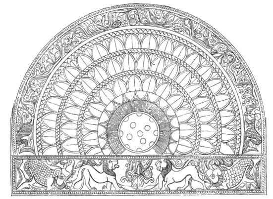
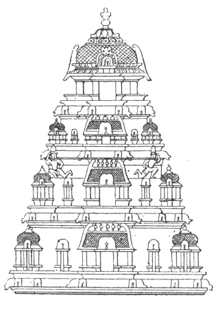

  
[Intangible Textual Heritage](../../index)  [Hinduism](../index) 
[Index](index)  [Previous](hmvp01)  [Next](hmvp03) 

------------------------------------------------------------------------

  
*Hindu Mythology, Vedic and Puranic*, by W.J. Wilkins, \[1900\], at
Intangible Textual Heritage

------------------------------------------------------------------------

p. x

 

p. xi

### PREFACE TO SECOND EDITION.

As a large edition of this work has been
sold out, and a new one called for, an opportunity is presented of
adding a few words to what was said eighteen years ago. The reception
given to it both in India and in England was most gratifying,
practically the only serious condemnation of it being that I had not
pronounced judgment on much that I had quoted from the Hindu sacred
books. This was a task that I distinctly disavowed in my preface. I set
out with the intention of rigidly abstaining from comment, commendatory
or condemnatory. I feel that a mere statement of much that was written
in books professedly inspired by God, carried its own condemnation. And
at the same time it was a pleasure to indicate how, amid much evil,
there was also much good. The sages of India were not in complete
darkness. As we examine the earlier writings, the light was bright
indeed contrasted with what came later. It is most instructive to notice
the marked deterioration in the quality of the teaching, deities as
described by the earlier sages being vastly better than their successors
declare them to be. "Non-Christian Bibles are all developments in the
wrong direction. They begin with some flashes of true light, and end in
darkness." As Max-Müller says, "The more we go back, the more we examine
the earliest

p. xii

germs of any religion, the purer I believe we shall find the conceptions
of the Deity."

In this edition there is some added matter. Errors have been corrected,
and an attempt made to render certain passages more clear that were
somewhat obscure. Substantially the book remains the same. An account of
the ordinary worship and the festivals of these gods will be found in
another work—"Modern Hinduism."

W. J. W.

1900\.

 

------------------------------------------------------------------------

[Next: Contents](hmvp03)
