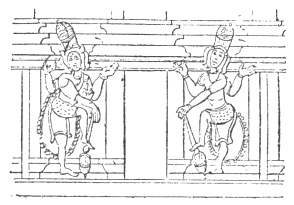

  
[Intangible Textual Heritage](../../index)  [Hinduism](../index) 
[Index](index)  [Previous](hmvp02)  [Next](hmvp04) 

------------------------------------------------------------------------

  
*Hindu Mythology, Vedic and Puranic*, by W.J. Wilkins, \[1900\], at
Intangible Textual Heritage

------------------------------------------------------------------------

p. xiii

### CONTENTS.

|                                     |                                                                        |                                 |
|-------------------------------------|------------------------------------------------------------------------|---------------------------------|
|                                     | PART I.—THE VEDIC DEITIES.                                             |                                 |
| CHAPTER. |                                                                        | PAGE |
| I.                                  | The Vedas                               | [3](hmvp05.htm#page_3)          |
| II\.                                | The Vedic Gods Generally                | [9](hmvp06.htm#page_9)          |
| III\.                               | Dyas and Prithivi                       | [13](hmvp07.htm#page_13)        |
| IV\.                                | Aditi and the Ādityas                   | [17](hmvp08.htm#page_17)        |
| V.                                  | Agni                                    | [21](hmvp09.htm#page_21)        |
| VI\.                                | Sun or Light Deities—                   |                                 |
|                                     | 1\. Surya                               | [30](hmvp10.htm#page_30)        |
|                                     | 2\. Pushan                              | [36](hmvp10.htm#page_36)        |
|                                     | 3\. Mitra and Varuna                    | [37](hmvp10.htm#page_37)        |
|                                     | 4\. The Asvins                          | [44](hmvp10.htm#page_44)        |
|                                     | 5\. Ushas                               | [48](hmvp10.htm#page_48)        |
| VII\.                               | The Storm Deities—                      |                                 |
|                                     | 1\. Indra                               | [53](hmvp11.htm#page_53)        |
|                                     | 2\. Indrāni                             | [63](hmvp11.htm#page_63)        |
|                                     | 3\. Parjanya                            | [63](hmvp11.htm#page_63)        |
|                                     | 4\. Vāyu                                | [64](hmvp11.htm#page_64)        |
|                                     | 5\. The Maruts                          | [67](hmvp11.htm#page_67)        |
| VIII\.                              | Soma                                    | [69](hmvp12.htm#page_69)        |
| IX\.                                | Tvastri or Visvakarma                   | [75](hmvp13.htm#page_75)        |
| X.                                  | Yama                                    | [78](hmvp14.htm#page_78)        |
|                                     |                                                                        |                                 |
|                                     | PART II.—THE PURĀNIC DEITIES.                                          |                                 |
| I.                                  | The Purānas                             | [89](hmvp15.htm#page_89)        |
| II\.                                | Brahma                                  | [93](hmvp16.htm#page_93)        |
|                                     | p. xiv                                      |                                 |
| CHAPTER  |                                                                        | PAGE |
| III\.                               | Brahmā                                  | [98](hmvp17.htm#page_98)        |
|                                     | Sarasvati                               | [107](hmvp17.htm#page_107)      |
| IV\.                                | Vishnu                                  | [116](hmvp18.htm#page_116)      |
|                                     | Lakshmi                                 | [127](hmvp18.htm#page_127)      |
| V.                                  | The Incarnations or Avatāras of Vishnu— |                                 |
|                                     | 1\. The Matsya or Fish Avatāra          | [134](hmvp19.htm#page_134)      |
|                                     | 2\. The Kūrma or tortoise Avatāra       | [141](hmvp19.htm#page_141)      |
|                                     | 3\. The Varāha or boar Avatāra          | [144](hmvp20.htm#page_144)      |
|                                     | 4\. The Nrisingha or Man-Lion Avatāra   | [149](hmvp22.htm#page_149)      |
|                                     | 5\. The Vāmana or Dwarf Avatāra         | [155](hmvp22.htm#page_155)      |
|                                     | 6\. The Parasurāma Avatāra              | [162](hmvp23.htm#page_162)      |
|                                     | 7\. The Rāma Chandra Avatāra            | [170](hmvp24.htm#page_170)      |
|                                     | 8\. The Krishna Avatāra                 | [197](hmvp25.htm#page_197)      |
|                                     | 8a. The Balarāma Avatāra                | [220](hmvp26.htm#page_220)      |
|                                     | 9\. The Buddha Avatāra                  | [225](hmvp28.htm#page_225)      |
|                                     | 10\. The Kalki Avatāra                  | [245](hmvp28.htm#page_245)      |
|                                     | Jagannāth                               | [248](hmvp29.htm#page_248)      |
|                                     | Chaitanya                               | [253](hmvp30.htm#page_253)      |
|                                     | Kāmadeva                                | [256](hmvp31.htm#page_256)      |
| VI\.                                | Siva                                    | [262](hmvp33.htm#page_262)      |
|                                     | Panchānana                              | [283](hmvp33.htm#page_283)      |
| VII\.                               | Umā                                     | [285](hmvp34.htm#page_285)      |
|                                     | Pārvati                                 | [289](hmvp34.htm#page_289)      |
|                                     | Durgā                                   | [296](hmvp34.htm#page_296)      |
|                                     | The chief forms of Durgā—               |                                 |
|                                     | 1\. Durgā                               | [307](hmvp34.htm#page_307)      |
|                                     | 2\. Dasabhujā                           | [307](hmvp34.htm#page_307)      |
|                                     | 3\. Singhavāhini                        | [308](hmvp34.htm#page_308)      |
|                                     | 4\. Mahishamārdini                      | [308](hmvp34.htm#page_308)      |
|                                     | 5\. Jagaddhātri                         | [308](hmvp34.htm#page_308)      |
|                                     | 6\. Kāli                                | [309](hmvp34.htm#page_309)      |
|                                     | 7\. Muktakesi                           | [317](hmvp34.htm#page_317)      |
|                                     | 8\. Tāra                                | [317](hmvp34.htm#page_317)      |
|                                     | 9\. Chinnamustaka                       | [317](hmvp34.htm#page_317)      |
|                                     | 10\. Jagadgauri                         | [317](hmvp34.htm#page_317)      |
|                                     | 11\. Pratyangirā                        | [318](hmvp34.htm#page_318)      |
|                                     | 12\. Annapurnā                          | [318](hmvp34.htm#page_318)      |
|                                     | 13\. Ganesajanani                       | [320](hmvp34.htm#page_320)      |
|                                     | 14\. Krishnakrora                       | [320](hmvp34.htm#page_320)      |
|                                     | The Saktis                              | [320](hmvp34.htm#page_320)      |
|                                     | p. xv                                        |                                 |
| CHAPTER  |                                                                        | PAGE |
| VIII\.                              | Sons of Siva and Pārvati—               |                                 |
|                                     | 1\. Ganesa                              | [323](hmvp35.htm#page_323)      |
|                                     | 2\. Kartikeya                           | [334](hmvp35.htm#page_334)      |
| IX\.                                | The Puranic Account of the Creation     | [342](hmvp36.htm#page_342)      |
| X.                                  | The Purānic Divisions of Time           | [353](hmvp37.htm#page_353)      |
|                                     |                                                                        |                                 |
|                                     | PART III.—THE INFERIOR DEITIES.                                        |                                 |
|                                     | I. The Divine Rishis—                   |                                 |
|                                     | 1\. Bhrigu                              | [363](hmvp38.htm#page_363)      |
|                                     | 2\. Pulastya                            | [368](hmvp38.htm#page_368)      |
|                                     | 3\. Pulaha                              | [369](hmvp38.htm#page_369)      |
|                                     | 4\. Kratu                               | [369](hmvp38.htm#page_369)      |
|                                     | 5\. Angiras                             | [369](hmvp38.htm#page_369)      |
|                                     | 6\. Marichi                             | [370](hmvp38.htm#page_370)      |
|                                     | 7\. Atri                                | [371](hmvp38.htm#page_371)      |
|                                     | 8\. Daksha                              | [372](hmvp38.htm#page_372)      |
|                                     | 9\. Vasishtha                           | [380](hmvp38.htm#page_380)      |
|                                     | 10\. Nārada                             | [382](hmvp38.htm#page_382)      |
| II\.                                | Kuvera                                  | [388](hmvp39.htm#page_388)      |
| III\.                               | The Demigods of the Rāmāyana—           |                                 |
|                                     | 1\. Sugriva                             | [394](hmvp40.htm#page_394)      |
|                                     | 2\. Hanumān                             | [401](hmvp40.htm#page_401)      |
|                                     | 3\. Nala                                | [406](hmvp40.htm#page_406)      |
|                                     | 4\. Nīla                                | [408](hmvp40.htm#page_408)      |
|                                     | 5\. Sushena                             | [408](hmvp40.htm#page_408)      |
| IV\.                                | The demigods of the Mahābhārata         | [411](hmvp41.htm#page_411)      |
| V.                                  | The planets—                            |                                 |
|                                     | 1\. Ravi, or Surya                      | [432](hmvp42.htm#page_432)      |
|                                     | 2\. Chandra, or Soma                    | [432](hmvp42.htm#page_432)      |
|                                     | 3\. Mangala                             | [432](hmvp42.htm#page_432)      |
|                                     | 4\. Budha                               | [433](hmvp42.htm#page_433)      |
|                                     | 5\. Vrihaspati                          | [433](hmvp42.htm#page_433)      |
|                                     | 6\. Sukra                               | [434](hmvp42.htm#page_434)      |
|                                     | 7\. Sani                                | [435](hmvp42.htm#page_435)      |
|                                     | 8\. Rāhu and Ketu                       | [435](hmvp42.htm#page_435)      |
|                                     | p. xvi                                      |                                 |
| CHAPTER  |                                                                        | PAGE |
| VI\.                                | The Asuras                              | [437](hmvp43.htm#page_437)      |
|                                     | Jalandhara                              | [441](hmvp43.htm#page_441)      |
| VII\.                               | Sacred animals and birds                | [448](hmvp44.htm#page_448)      |
|                                     | Garuda                                  | [449](hmvp44.htm#page_449)      |
|                                     | Jatāyus and Sampāti                     | [456](hmvp44.htm#page_456)      |
| VIII\.                              | Gangā                                   | [460](hmvp45.htm#page_460)      |
| IX\.                                | Sacred trees                            | [469](hmvp46.htm#page_469)      |
| X.                                  | Miscellaneous minor deities—            |                                 |
|                                     | 1\. Shitala                             | [473](hmvp47.htm#page_473)      |
|                                     | 2\. Manasā                              | [474](hmvp47.htm#page_474)      |
|                                     | 3\. Sastī                               | [477](hmvp47.htm#page_477)      |
|                                     | 4\. The Shālgrāma                       | [478](hmvp47.htm#page_478)      |
|                                     | 5\. The Dhenkī                          | [479](hmvp47.htm#page_479)      |
|                                     | 6\. Ka? Who?                            | [480](hmvp47.htm#page_480)      |
| XI\.                                | Superhuman, though not Divine Beings—   |                                 |
|                                     | 1\. Apsaras and Gandharvas              | [482](hmvp48.htm#page_482)      |
|                                     | 2\. Rākshasas                           | [485](hmvp48.htm#page_485)      |
|                                     | 3\. Jāin Deities                        | [488](hmvp48.htm#page_488)      |
|                                     | Index                                                                  | [491](hmvp49.htm#page_491)      |

 

------------------------------------------------------------------------

[Next: List of Illustrations](hmvp04)
