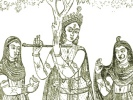

  
[Intangible Textual Heritage](../../index)  [Hinduism](../index) 
[Index](index)  [Previous](hmvp05)  [Next](hmvp07) 

------------------------------------------------------------------------

  
*Hindu Mythology, Vedic and Puranic*, by W.J. Wilkins, \[1900\], at
Intangible Textual Heritage

------------------------------------------------------------------------

p. 9

### CHAPTER II.

#### THE VEDIC GODS GENERALLY.

Yaska (probably the oldest commentator on
the Vedas) gives the following classification of the Vedic gods. "There
are three deities, according to the expounders of the Vedas: Agni, whose
place is on the earth; Vāyu or Indra, whose place is in the air; and
Surya, whose place is in the sky. These deities receive severally many
appellations in consequence of their greatness, or of the diversity of
their functions." [\*](#fn_3) In the Rig-Veda
itself this number is increased to thirty-three, of whom eleven are said
to be in heaven, eleven on earth, and eleven in mid-air. "Agni, the wise
god, lends an ear to his worshippers. God with the ruddy steeds, who
lovest praise, bring hither those three-and-thirty." This is the number
usually mentioned, though it is by no means easy to decide which are the
thirty-three intended, as the lists found in various places vary
considerably; whilst in another verse it is said that "three hundred,
three thousand, thirty-and-nine gods have worshipped Agni."

These deities, though spoken of as immortal, are not said to be
self-existent beings; in fact their parentage in most cases is given;
but the various accounts of their origin do not agree with each other.
Agni and Savitri

p. 10

are said to have conferred immortality upon the other gods; whilst it is
also taught that Indra obtained this boon by sacrifice. An interesting
account is given in the Satapatha Brāhmana [\*](#fn_4) of the means by which the gods obtained
immortality, and superiority over the asuras or demons. All of them,
gods and demons alike, were mortal, all were equal in power, all were
sons of Prajāpati the Creator. Wishing to be immortal, the gods offered
sacrifices liberally, and practised the severest penance; but not until
Prajāpati had taught them to offer a particular sacrifice could they
become immortal. They followed his advice, and succeeded. Wishing to
become greater than the asuras, they became truthful. Previously they
and the asuras spoke truthfully or falsely, as they thought fit; but
gradually, whilst they ceased from lying, the asuras became increasingly
false; the result was that the gods after protracted struggles gained
the victory. Originally the gods were all equal in power, all alike
good. But three of them desired to be superior to the rest, viz. Agni,
Indra, and Surya. They continued to offer sacrifices for this purpose
until it was accomplished. Originally there was not in Agni the same
flame as there is now. He desired, "May this flame be in me," and,
offering a sacrifice for the attainment of this blessing, obtained it.
In a similar manner Indra increased his energy, and Surya his
brightness. These three deities form what is commonly described as the
Vedic Triad. In later times other three took their place, though an
attempt is made to show them to be the same.

It will be noticed that each of the gods is in turn regarded by the
worshipper as superior to all the others. In the Vedas this superlative
language is constantly

p. 11

employed, and identical epithets are indiscriminately given to various
deities. Professor Max-Müller says, "When these individual gods are
invoked, they are not conceived as limited by the power of others, as
superior or inferior in rank. Each god, to the mind of the supplicants,
is as good as all the gods. He is felt at the time as a real divinity,
as supreme and absolute, in spite of the limitations which, to our mind,
a plurality of gods must entail on every single god. All the rest
disappear for a moment from the vision of the poet, and he only who is
to fulfil their desires, stands in full light before the eyes of the
worshippers. . . . It would be easy to find, in the numerous hymns of
the Rig-Veda, passages in which almost every single god is represented
as supreme and absolute."

The will of these gods is sovereign; no mortal can thwart their designs.
They exercise authority over all creatures. In their hands is the life
of mortals. They know the thoughts and intentions of men, and whilst
they reward the worshipper, they punish those who neglect them.

When the Puranic deities are described it will be noticed that the
representations of the deities of that age are far more clearly defined
than those of earlier times. Though the Vedic gods are spoken of as
possessing human forms and acting as human beings, there is considerable
vagueness in the outline. But as time goes on this is lost. The objects
of worship are no longer indistinct and shadowy, but are so minutely
described that their portraits could be easily painted. And as their
physical features are no longer left to the imagination, so their mental
and moral characters are fully delineated. They are of like passions
with those who depict them, only possessing vastly greater powers.

p. 12

Professor Williams says [\*](#fn_5) "that the
deified forces addressed in the Vedic hymns were probably not
represented by images or idols in the Vedic period, though doubtless the
early worshippers clothed their gods with human forms in their own
imaginations." Professor Müller [†](#fn_6) speaks
more positively: "The religion of the Veda knows of no idols. The
worship of idols in India is a secondary formation, a later degradation
of the more primitive worship of ideal gods." The guarded language of
Professor Williams seems to be better suited to the facts, as far as
they are known, for Dr. Bollensen [‡](#fn_7)
speaks quite as strongly on the other side. He writes, "From the common
appellation of the gods as *divo naras*, 'men of the sky,' or simply
*naras*, 'men,' and from the epithet *nripesas*, 'having the form of
men,' we may conclude that the Indians did not merely in imagination
assign human forms to their gods, but also represented them in a
sensible manner. Thus a painted image of Rudra (Rig-Veda, ii. 33, 9) is
described with strong limbs, many-formed, awful, brown, he is painted
with shining colours.'" "Still clearer appears the reference to
representations in the form of an image. 'I now pray to the gods of
these (Maruts).' Here it seems that the Maruts are distinguished from
their gods, *i.e.* their images.'" "There is in the oldest language a
word, '*Sandris*,' which properly denotes 'an image of the gods.'

We shall now proceed to the consideration in detail of the deities as
described in the Vedas.

------------------------------------------------------------------------

### Footnotes

[9:\*](hmvp06.htm#fr_3) Muir, O. S. T., v. 8.

[10:\*](hmvp06.htm#fr_4) Muir O. S. T., iv.
54-62.

[12:\*](hmvp06.htm#fr_5) "Indian Wisdom," p. 15.

[12:†](hmvp06.htm#fr_6) "Chips from a German
Workshop," i. 38.

[12:‡](hmvp06.htm#fr_7) Muir, C. S. T., v. 453

------------------------------------------------------------------------

[Next: Chapter III. Dyaus And Prithivi](hmvp07)
