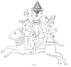
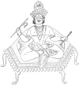

  
[Intangible Textual Heritage](../../index)  [Hinduism](../index.md) 
[Index](index)  [Previous](hmvp08)  [Next](hmvp10.md) 

------------------------------------------------------------------------

  
*Hindu Mythology, Vedic and Puranic*, by W.J. Wilkins, \[1900\], at
Intangible Textual Heritage

------------------------------------------------------------------------

p. 21

### CHAPTER V.

#### AGNI.

Agni, the god of Fire, is one of the most
prominent of the deities of the Vedas. With the single exception of
Indra, more hymns are addressed to him than to any other deity.
Professor Williams gives the following spirited description of Agni:—

"Bright, seven-rayed god, how manifold thy shapes  
 Revealed to us thy votaries: now we see thee  
 With body all of gold; and radiant hair  
 Flaming from three terrific heads, and mouths,  
 Whose burning jaws and teeth devour all things.  
 Now with a thousand glowing horns, and now  
 Flashing thy lustre from a thousand eyes,  
 Thou’rt borne towards us in a golden chariot,  
 Impelled by winds, and drawn by ruddy steeds,  
 Marking thy car's destructive course with blackness."

Various accounts are given of the origin of Agni. He is said to be a son
of Dyaus and Prithivi; he is called the son of Brahmā, and is then named
Abhimāni; and he is reckoned amongst the children of Kasyapa and Aditi,
and hence one of the Ādityas. In the later writings he is described as a
son of Angiras, king of the Pitris (fathers of mankind), and the
authorship of several hymns is ascribed to him. In pictures he is
represented as a red man, having three legs and seven

p. 22

arms, dark eyes, eyebrows and hair. He rides on a ram, wears a poita
(Brāhmanical thread), and a garland of fruit. Flames of fire issue from
his mouth, and seven streams of glory radiate from his body. The
following passage, for every sentence of which Dr. Muir [\*](#fn_20.md) quotes a text from the Vedas, gives a
good idea of the character and functions of this deity in the Vedic Age.

 
[  
Click to enlarge](img/02200.jpg.md)  
AGNI.  

Agni is an immortal who has taken up his abode with mortals as their
guest. He is the domestic priest who rises before the dawn, and who
concentrates in his own person and exercises in a higher sense all the
various sacrificial offices which the Indian ritual assigns to a

p. 23

number of different human functionaries. He is a sage, the divinest
among the sages, immediately acquainted with all the forms of worship;
the wise director, the successful accomplisher, and the protector of all
ceremonies, who enables men to serve the gods in a correct and
acceptable manner in cases where they could not do this with their own
unaided skill. He is a swift messenger, moving between heaven and earth,
commissioned both by gods and men to maintain their mutual
communication, to announce to the immortals the hymns, and to convey to
them the oblations of their worshippers; or to bring them (the
immortals) down from the sky to the place of sacrifice. He accompanies
the gods when they visit the earth, and shares in the reverence and
adoration which they receive. He makes the oblations fragrant; without
him the gods experience no satisfaction.

Agni is the lord, protector, king of men. He is the lord of the house,
dwelling in every abode. He is a guest in every home; he despises no
man, he lives in every family. He is therefore considered as a mediator
between gods and men, and as a witness of their actions; hence to the
present day he is worshipped, and his blessing sought on all solemn
occasions, as at marriage, death, etc. In these old hymns Agni is spoken
of as dwelling in the two pieces of wood which being rubbed together
produce fire; and it is noticed as a remarkable thing that a living
being should spring out of dry (dead) wood. Strange to say, says the
poet, the child, as soon as born, begins with unnatural voracity to
consume his parents. Wonderful is his growth, seeing that he is born of
a mother who cannot nourish him; but he is nourished by the oblations of
clarified butter which are poured into his mouth, and which he consumes.

p. 24

The highest divine functions are ascribed to Agni. Although in some
places he is spoken of as the son of heaven and earth, in others he is
said to have stretched them out; to have formed them, and all that flies
or walks, or stands or moves. He formed the sun, and adorned the heavens
with stars. Men tremble at his mighty deeds, and his ordinances cannot
be resisted. Earth, heaven, and all things obey his commands. All the
gods fear, and do homage to him. He knows the secrets of mortals, and
hears the invocations that are addressed to him.

The worshippers of Agni prosper, are wealthy, and live long. He watches
with a thousand eyes over the man who brings him food, and nourishes him
with oblations. No mortal enemy can by any wondrous power gain the
mastery over him who sacrifices to this god. He also confers and is the
guardian of immortality. In a funeral hymn, Agni is asked to warm with
his heat the unborn (immortal) part of the deceased, and in his
auspicious form to carry it to the world of the righteous. He carries
men across calamities, as a ship over the sea. He commands all the
riches in earth and heaven; hence he is invoked for riches, food,
deliverance, and in fact all temporal good. He is also prayed to as the
forgiver of sins that may have been committed through folly. All gods
are said to be comprehended in him; he surrounds them as the
circumference of a wheel does the spokes.

The main characteristics of this deity are taught in the following
verses by Dr. Muir:— [\*](#fn_21.md)

"Great Agni, though thine essence be but one,  
   Thy forms are three; as fire thou blazest here,  
   As lightning flashest in the atmosphere,  
 In heaven thou flamest as the golden sun

p. 25

"It was in heaven thou hadst thy primal birth;  
   By art of sages skilled in sacred lore  
   Thou wast drawn down to human hearths of yore,  
 And thou abid’st a denizen of earth.

"Sprung from the mystic pair, [\*](#fn_22.md) by
priestly hands  
   In wedlock joined, forth flashes Agni bright;  
   But, oh! ye heavens and earth, I tell you right,  
 The unnatural child devours the parent brands.

"But Agni is a god; we must not deem  
   That he can err, or dare to comprehend  
   His acts, which far our reason's grasp transcend;  
 He best can judge what deeds a god beseem.

"And yet this orphaned god himself survives:  
   Although his hapless mother soon expires,  
   And cannot nurse the babe as babe requires,  
 Great Agni, wondrous infant, grows and thrives.

"Smoke-bannered Agni, god with crackling voice  
   And flaming hair, when thou dost pierce the gloom  
   At early dawn, and all the world illume,  
 Both heaven and earth and gods and men rejoice.

"In every home thou art a welcome guest,  
   The household tutelary lord, a son,  
   A father, mother, brother, all in one,  
 A friend by whom thy faithful friends are blest.

"A swift-winged messenger, thou tallest down  
   from heaven to crowd our hearths the race divine,  
   To taste our food, our hymns to hear, benign,  
 And all our fondest aspirations crown.

"Thou, Agni, art our priest: divinely wise,  
   In holy science versed, thy skill detects  
   The faults that mar our rites, mistakes corrects,  
 And all our acts completes and sanctifies.

p. 26

"Thou art the cord that stretches to the skies,  
   The bridge that scans the chasm, profound and vast,  
   Dividing earth from heaven, o’er which at last  
 The good shall safely pass to Paradise.

"But when, great god, thine awful anger glows,  
   And thou revealest thy destroying force,  
   All creatures flee before thy furious course,  
 As hosts are chased by overpowering foes.

"Thou levellest all thou touchest; forests vast  
   Thou shear’st, like beards which barber's razor shaves.  
   Thy wind-driven flames roar loud as ocean's waves,  
 And all thy track is black when thou hast past.

"But thou, great Agni, dost not always wear  
   That direful form; thou rather lov’st to shine  
   Upon our hearths, with milder flame benign,  
 And cheer the homes where thou art nursed with care.

"Yes! thou delightest all those men to bless  
   Who toil unwearied to supply the food  
   Which thou so lovest—logs of well-dried wood,  
 And heaps of butter bring, thy favourite mess.

"Though I no cow possess, and have no store  
   Of butter, nor an axe fresh wood to cleave,  
   Thou, gracious god, wilt my poor gift receive:  
 These few dry sticks I bring—I have no more.

"Preserve us, lord; thy faithful servants save  
   From all the ills by which our bliss is marred;  
   Tower like an iron wall our homes to guard,  
 And all the boons bestow our hearts can crave.

"And when away our brief existence wanes,  
   When we at length our earthly homes must quit,  
   And our freed souls to worlds unknown shall flit,  
 Do thou deal gently with our cold remains.

"And then, thy gracious form assuming, guide  
   Our unborn part across the dark abyss  
   Aloft to realms serene of light and bliss,  
 Where righteous men among the gods abide."

p. 27

"In a celebrated hymn of the Rig-Veda, attributed to Visishtha, Indra
and the other gods are called upon to destroy the Kravyāds (the
flesh-eaters), or Rākshas, enemies of the gods. Agni himself is a
Kravyād, and as such takes an entirely different character. He is then
represented under a form as hideous as the beings he, in common with the
other gods, is called upon to devour. He sharpens his two iron tusks,
puts his enemies into his mouth, and devours them. He heats the edges of
his shafts, and sends them into the hearts of the Rākshasas." [\*](#fn_23.md)

"In the Mahābhārata, Agni is represented as having exhausted his vigour
by devouring too many oblations, and desiring to consume the whole
Khāndava forest, as a means of recruiting his strength. He was \[at
first\] prevented from doing this by Indra; but having obtained the
assistance of Krishna and Arjuna, he baffled Indra, and accomplished his
object." [†](#fn_24.md)

According to the Rāmāyana, in order to assist Vishnu when incarnate as
Rāma, Agni became the father of Nila by a monkey mother; and according
to the "Vishnu Purāna," he married Swāhā, by whom he had three
sons—Pāvaka, Pavamāna, and Suchi.

Agni has many names; those more generally known are the following:—

Vahni, "He who receives the *hom*, or burnt sacrifice."

Vītihotra, "He who sanctifies the worshipper."

Dhananjaya, "He who conquers (destroys) riches."

Jivalana, "He who burns."

Dhūmketu, "He whose sign is smoke."

p. 28

Chhāgaratha, "He who rides on a ram."

Saptajihva, "He who has seven tongues."

Brihaspati and Brahmanaspati are generally regarded as being identical
with Agni. Nearly the same epithets are applied to them, with this
additional one—of presiding over prayer. In some few hymns they are
addressed as separate deities. In "The Religions of India," M. Barth,
regarding these as names of one and the same deity, thus describes him:—

"Like Agni and Soma, he is born on the altar, and .thence rises upwards
to the gods; like them, he was begotten in space by Heaven and Earth;
like Indra, he wages war with enemies on the earth and demons in the
air; like all three, he resides in the highest heaven, he generates the
gods, and ordains the order of the universe. Tinder his fiery breath the
world was melted and assumed the form it has, like metal in the mould of
the founder. At first sight it would seem that all this is a late
product of abstract reflection; and it is probable, in fact, from the
very form of the name, that in so far as it is a distinct person, the
type is comparatively modern; in any case, it is peculiarly Indian; but
by its elements it is connected with the most ancient conceptions. As
there is a power in the flame and the libation, so there is in the
formula; and this formula the priest is not the only person to
pronounce, any more than he is the only one to kindle Agni or shed Soma.
There is a prayer in the thunder, and the gods, who know all things, are
not ignorant of the power in the sacramental expressions. They possess
all-potent spells that have remained hidden from men and are as ancient
as the first rites, and it was by these the world was formed at first,
and by which it is preserved up to the present. It is this omnipresent
power of prayer which Brahmanaspati personifies, and

p. 29

it is not without reason that he is sometimes confounded with Agni, and
especially with Indra. In reality each separate god and the priest
himself become Brahmanaspati at the moment when they pronounce the
mantras which gave them power over the things of heaven and of earth."

  [  
Click to enlarge](img/02900.jpg.md)

------------------------------------------------------------------------

### Footnotes

[22:\*](hmvp09.htm#fr_20.md) Muir, O. S. T., v. 119
ff.

[24:\*](hmvp09.htm#fr_21.md) Muir, O. S. T., v.
221.

[25:\*](hmvp09.htm#fr_22.md) The two pieces of wood
from which fire is produced.

[27:\*](hmvp09.htm#fr_23.md) Dowson, "Dictionary of
Hindu Mythology.''

[27:†](hmvp09.htm#fr_24.md) Ibid. *s.v.*

------------------------------------------------------------------------

[Next: Chapter VI. Sun or Light Deities](hmvp10.md)
