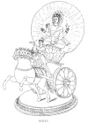
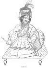
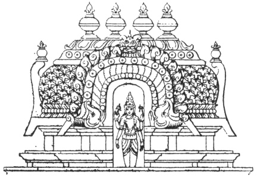

  
[Intangible Textual Heritage](../../index)  [Hinduism](../index.md) 
[Index](index)  [Previous](hmvp09)  [Next](hmvp11.md) 

------------------------------------------------------------------------

  
*Hindu Mythology, Vedic and Puranic*, by W.J. Wilkins, \[1900\], at
Intangible Textual Heritage

------------------------------------------------------------------------

p. 30

### CHAPTER VI.

#### SUN OR LIGHT DEITIES.

##### 1. SURYA.

Surya and Savitri are two names by which
the Sun is commonly addressed in the Vedic hymns. Sometimes one name is
used exclusively, sometimes they are used interchangeably, and sometimes
they are used as though they represented quite distinct objects. It is
supposed that Savitri refers to the sun when invisible; whilst Surya
refers to him when he is visible to the worshippers. This at any rate
gives *some* reason for the two names being employed, though it may not
explain the case satisfactorily in every instance.

Although the hymns in which Surya is addressed are not very numerous,
his worship was most common in the olden time, and has continued to the
present hour. It is to him that the Gayatri, the most sacred text of the
Vedas, is addressed at his rising by every devout Brāhman. Simple in its
phraseology, this short verse is supposed to exert magical powers. It is
as follows:—

"Let us meditate on that excellent glory of the
divine Vivifier;  
 May he enlighten (or stimulate) our understandings." [\*](#fn_25.md)

As a specimen of the language employed in some of the later writings in
reference to this verse, read the

p. 31

following few lines from the Skanda Purāna":—"Nothing in the Vedas is
superior to the Gayatri. No invocation is equal to the Gayatri, as no
city is equal to Kasi (Benares). The Gayatri is the mother of the Vedas,
and of Brāhmans. By repeating it a man is saved. By the power of the
Gayatri the Kshetriya

 
[  
Click to enlarge](img/03100.jpg.md)  
SURYA  

\[paragraph continues\] (Warrior caste)
Vishvamitra became a Brāhmarsi (Brāhman saint), and even obtained such
power as to be able to create a new world. What is there indeed that
cannot be effected by the Gayatri? For the Gayatri is Vishnu, Brahmā,
and Siva, and the three Vedas." [\*](#fn_26.md)

p. 32

\[paragraph continues\] With promise of
such blessings, it is not to be wondered at that the worship of Surya
should continue.

The following translation [\*](#fn_27.md) of hymns
from the Rig-Veda gives a fair specimen of the language used in
addresses to Surya

"Behold the rays of Dawn, like heralds, lead on
high  
 The Sun, that men may see the great all-knowing god.  
 The stars slink off like thieves, in company with Night,  
 Before the all-seeing eye, whose beams reveal his presence,  
 Gleaming like brilliant flames, to nation after nation.  
 With speed, beyond the ken of mortals, thou, O Sun!  
 Dost ever travel on, conspicuous to all.  
 Thou dost create the light, and with it dost illume  
 The universe entire; thou risest in the sight  
 Of all the race of men, and all the host of heaven.  
 Light-giving Varuna! thy piercing glance dost scan,  
 In quick succession, all this stirring, active world,  
 And penetrateth too the broad ethereal space,  
 Measuring our days and nights, and spying out all creatures.  
 Surya with flaming locks, clear-sighted god of day,  
 Thy seven ruddy mares bear on thy rushing car.  
 With these, thy self-yoked steeds, seven daughters of thy chariot  
 Onward thou dost advance. To thy refulgent orb  
 Beyond this lower gloom, and upward to the light  
 Would we ascend, O Sun! thou god among the gods."

Surya, as we have already noticed, is regarded as a son of Aditi; at
other times he is said to be a son of Dyaus. Ushas (the Dawn) is called
his wife, though in another passage he is said to be produced by the
Dawn. Some texts state that he is the Vivifier of all things; whilst
others state that he was formed and made to shine by Indra, Soma, Agni,
and others.

From the character ascribed to Savitri in some hymns, it seems more
natural to regard him as the sun shining in his strength, and Surya as
the sun when rising and

p. 33

setting. Savitri is golden-eyed, [\*](#fn_28.md)
golden-handed, golden- tongued. He rides in a chariot drawn by radiant,
white-footed steeds. He illuminates the earth; his golden arms stretched
out to bless, infusing energy into all creatures, reach to the utmost
ends of heaven. He is leader and king in heaven; the other gods follow
him, and he it is who gives them immortality. He is prayed to for
deliverance from sin, and to conduct the souls of the departed to the
abode of the righteous.

In the Purānic Age, Surya sustains quite a different character. He is
there called the son of Kasyapa and Aditi. He is described as a dark-red
man, with three eyes and four arms: in two hands are water-lilies; with
one he is bestowing a blessing, with the other he is encouraging his
worshippers. He sits upon a red lotus, and rays of glory issue from his
body. In addition to the daily worship that is offered him by Brāhmans
in the repetition of the Gayatri, he is worshipped once a year by the
Hindus of all castes, generally on the first Sunday in the month of
Māgh; and in seasons of sickness it is no uncommon thing for the
low-caste Hindus to employ a Brāhman to repeat verses in his honour, in
the hope that thus propitiated he will effect their recovery.

In the "Vishnu Purāna" [†](#fn_29.md) we find the
following account of Surya. He married Sangnā, the daughter of
Visvakarma; who, after bearing him three children, was so oppressed with
his brightness and glory that she was compelled to leave him. Before her
departure, she arranged with Chhāya (Shadow) to take her place. For
years Surya did not notice the change of wife. But one day, in a fit of
anger, Chhāya pronounced a curse upon Yama (Death), a child of Sangnā's,
which

p. 34

immediately took effect. As Surya knew that no mother's curse could
destroy her offspring, he looked into the matter and discovered that his
wife had forsaken him, leaving this other woman in her place. Through
the power of meditation, Surya found Sangnā in a forest in the form of a
mare; and, in order that he might again enjoy her society, he changed
himself into a horse. After a few years, growing tired of this
arrangement, they returned in proper form to their own dwelling. But in
order that his presence might be bearable to his wife, his father-in-law
Visvakarma, who was the architect of the gods, ground the Sun upon a
stone, and by this means reduced his brightness by one-eighth. The part
thus ground from Surya was not wasted. From it were produced the
wonder-working discus of Vishnu, the trident of Siva, the lance of
Kartikeya (the god of war), and the weapons of Kuvera (the god of
riches).

The "Bhavishya Purāna" says, "Because there is none greater than he
(*i.e.* Surya), nor has been, nor will be, therefore he is celebrated as
the supreme soul in all the Vedas." Again, "That which is the sun, and
thus called light or effulgent power, is adorable, and must be
worshipped by those who dread successive births and deaths, and who
eagerly desire beatitude." In the "Brahmā Purāna" [\*](#fn_30.md) is a passage in which the sun is alluded
to under twelve names, with epithets peculiar to each, as though they
were twelve distinct sun-deities:—

"The first form of the sun is Indra, the lord of the gods, and the
destroyer of their enemies; the second, Dhata, the creator of all
things; the third, Parjanya, residing in the clouds, and showering rain
on the earth from its beams; the fourth, Twasta, who dwells in all
corporeal forms; the fifth, Pushan, who gives nutriment

p. 35

to all beings; the sixth, Aryama, who brings sacrifices to a successful
conclusion; the seventh derives his name from almsgiving, and delights
mendicants with gifts; the eighth is called Vivasvan, who ensures
digestion; the ninth, Vishnu, who constantly manifests himself for the
destruction of the enemies of the gods; the tenth, Ansuman, who
preserves the vital organs in a sound state; the eleventh, Varuna, who,
residing in the waters, vivifies the universe; and the twelfth, Mitra,
who dwells in the orb of the moon, for the benefit of the three worlds.
These are the twelve splendours of the sun, the supreme spirit, who
through them pervades the universe, and irradiates the inmost souls of
men."

Surya is said to have Aruna (Rosy), the Dawn, the son of Kasyapa and
Kadru, as his charioteer.

According to the Rāmāyana, Sugriva, the king of the monkey host which
assisted Rāma in his great expedition to regain possession of Vita his
wife, was a son of Surya by a monkey. According to the Mahābhārata, the
hero Karna also was the son of this deity; and when he was in the form
of a horse, he became father of the Asvins, and communicated the white
Yajur-Veda.

When speaking of the planets, Surya will be noticed again under the name
of Ravi.

Among the many names and epithets by which this deity is known, the
following are the most common:—

Dinakara, "The Maker of the day."

Bhāskara, "The Creator of light."

Vivaswat, "The Radiant one."

Mihira, "He who waters the earth;" *i.e.* he draws up the moisture from
the seas so that the clouds are formed.

Grahapati, "The Lord of the stars."

Karmasākshi, "The Witness of (men's) works."

Mārtanda, "A descendant of Mritanda."

p. 36

##### 2. PUSHAN.

Pushan is the name of a sun-god to whom some hymns are exclusively
addressed, and whose praise at other times is sung in connection with
that of Indra and other gods. In these hymns his character is not very
clearly defined. He is said [\*](#fn_31.md) to
behold the entire universe; is addressed as the guide of travellers, and
the protector of cattle. He is called upon to protect his servants in
battle, and to defend them as of old. He is invoked in the marriage
ceremonial, and asked to take the bride's hand, to lead her away, and to
bless her in her conjugal relations. He is said also to conduct the
spirits of the departed from this world to the next. In one text he is
called "the nourisher," as Vishnu in later times was called "the
preserver." By far the greater number of prayers addressed to him seem
to regard him as the guide and protector of travellers, both along the
ordinary journeys of life and in the longer journey to the other world;
and as he is supposed to be constantly travelling about, he is said to
know the road by which they have to go.

The following is a specimen of the hymns addressed to Pushan in the
Rig-Veda:—"Conduct us, Pushan, over our road; remove distress, son of
the deliverer; go on before us. Smite away from before us the
destructive and injurious wolf which seeks after us. Drive away from our
path the waylayer, the thief and the robber. Tread with thy foot upon
the burning weapons of that deceitful wretch, whoever he be. O
wonder-working and wise Pushan, we desire that help of thine wherewith
thou didst favour our fathers! O god, who bringest all blessings, and
art distinguished by the golden spear,

p. 37

make wealth easy of acquisition! Convey us past our opponents; make our
paths easy to travel; gain strength for us here. Lead us over a country
of rich pastures; let no new trouble (beset our) path. Bestow, satiate,
grant, stimulate us; fill our belly. We do not reproach Pushan, we
praise him with hymns; and we seek riches from the wonder-working
god." [\*](#fn_32.md) "May we, O Pushan! meet with
a wise man who will straightway direct us and say, 'It is this.' May
Pushan follow our kine; may he protect our horses; may he give us food.
. . . Come hither, glowing god, the deliverer, may we meet." [†](#fn_33.md)

In the Purānas Pushan occupies a far less exalted position. It seems
almost like a burlesque to see him, who in the Vedas is reverently
approached as the giver of good to his worshippers, described as being
obliged to feed upon gruel, because his teeth have been knocked out of
his mouth. The earliest form of the legend describing this event is
found in the Taittiriya Sanhita. Rudra, the name by which Siva was then
known, not being invited to a great sacrifice that Daksha, his
father-in-law, was celebrating, in his anger shot an arrow which pierced
the sacrificial victim. Pushan ate his share, and in doing so broke his
teeth. In describing Daksha, [‡](#fn_34.md) an
account of this sacrifice will be given. In the "Vishnu Purāna" Pushan
appears as one of the Ādityas.

##### 3. MITRA AND VARUNA.

These deities are most frequently named together in the hymns; Varuna is
often addressed alone, but Mitra very seldom. The idea of the older
commentators was that Mitra represented and ruled over the day, whilst
Varuna was ruler of the night. "Varuna is sometimes

p. 38

visible to the gaze of his worshippers; he dwells in a house having a
thousand doors, so that he is ever accessible to men. He is said to have
good eyesight, for he knows what goes on in the hearts of men. He

 
[  
Click to enlarge](img/03800.jpg.md)  
VARUNA.  

is king of gods and men; is mighty and terrible; none can resist his
authority. He is sovereign ruler of the universe." "It is he who makes
the sun to shine in heaven; the winds that blow are but his breath; he
has hollowed out the channels of the rivers which flow at

p. 39

his command, and he has made the depths of the sea. His ordinances are
fixed and unassailable; through their operation the moon walks in
brightness, and the stars, which appear in the nightly sky, vanish in
daylight. The birds flying in the air, the rivers in their sleepless
flow, cannot attain a knowledge of his power and wrath. But he knows the
flight of the birds in the sky, the course of the far travelling wind,
the paths of ships on the ocean, and beholds all the secret things that
have been or shall be done. He witnesses men's truth and
falsehood." [\*](#fn_35.md)

The following is a metrical version of one of the hymns of the Rig-Veda
as given by Dr. Muir:— [†](#fn_36.md)

"The mighty lord on high our deeds as if at hand
espies;  
 The gods know all men do, though men would fain their deeds disguise:  
 Whoe’er stands, whoe’er moves, or steals from place to place,  
 Or hides him in his secret cell, the gods his movements trace.  
 Wherever two together plot, and deem they are alone,  
 King Varuna is there, a third, and all their schemes are known.  
 This earth is his, to him belong those vast and boundless skies,  
 Both seas within him rest, and yet in that small pool he lies.  
 Whoever far beyond the sky should think his way to win,  
 He could not there elude the grasp of Varuna the king.  
 His spies descending from the skies glide all this world around;  
 Their thousand eyes, all scanning, sweep to earth's remotest bound.  
 Whate’er exists in heaven and earth, whate’er beyond the skies,  
 Before the eye of Varuna the king unfolded lies.  
 The secret winkings all he counts of every mortal's eyes;  
 He wields this universal frame as gamester throws his dice.  
 Those knotted nooses which thou flingst, O god! the bad to snare,  
 All liars let them overtake, but all the truthful spare."

Professor Roth says of this hymn, "There is no hymn in the whole Vedic
literature which expresses the divine omniscience in such forcible
terms;" and it would not

p. 40

be easy to find in any literature many passages to surpass it in this
respect.

In other hymns we learn that the affairs of men are under his control;
he is asked to prolong life, to punish transgressors; and a hope is held
out that the righteous shall see him reigning in the spirit world in
conjunction with Yama, the ruler of that region. Varuna in fact has
attributes and functions ascribed to him in the Vedas, of a higher moral
character than any other of the gods, and therefore men call upon him
for pardon and purity. "Release us," they say, "from the sins of our
fathers, and from those which we have committed in our own persons." And
again, "Be gracious, O mighty god, be gracious. I have sinned through
want of power; be gracious."

In the hymns addressed to Mitra and Varuna together, almost the same
terms are employed as when Varuna is addressed alone. Both are spoken of
as righteous, and as the promoters of religion. They are said to avenge
sin and falsehood.

In the Vedic literature, though Varuna is not regarded chiefly as the
god of the ocean, as he is in the later writings, but rather, as the
above hymns show, as one of the gods of light, yet there are passages
which describe him as being connected with the waters of the atmosphere
and on the earth, which afford some foundation for the later conceptions
of his kingdom. Thus, for instance, we read, "May the waters which are
celestial, and those which flow; those for which channels are dug, and
those which are self-produced; those which are proceeding to the ocean,
and are bright and purifying, preserve me! May those (waters) in the
midst of which King Varuna goes . . . preserve me!" [\*](#fn_37.md) In other places

p. 41

he is said to dwell in the waters as Soma does in the woods. Professor
Roth gives a probable explanation as to the manner in which Varuna, who
was originally the god of the heavens, came to be regarded as the god of
the ocean. He says: [\*](#fn_38.md) "When, on the
one hand, the conception of Varuna as the all-embracing heaven had been
established, and, on the other hand, the observation of the rivers
flowing towards the ends of the earth and to the sea had led to the
conjecture that there existed an ocean enclosing the earth in its bosom,
then the way was thoroughly prepared for connecting Varuna with the
ocean."

In the Brāhmana of the Rig-Veda [†](#fn_39.md) is
an interesting legend showing that probably human sacrifices were at one
time offered to Varuna. A certain king named Harischandra had no son.
Being greatly distressed on this account, as a son was necessary to the
due performance of his funeral ceremonies, the king, acting upon the
advice of Nārada the sage, went to Varuna, saying—

"Let but a son be born, O king! to me,  
 And I will sacrifice that son to thee."

\[paragraph continues\] Varuna heard the
prayer, and granted a son. When the boy grew up, his father told him of
the vow he had made; but unfortunately the son was not willing to be
sacrificed, and left his home. Varuna, not being at all pleased at the
non-fulfilment of the king's vow, afflicted him with dropsy. For six
years the boy wandered in the forest; at length, happening to meet with
a poor Brāhman with his three sons, the prince proposed to purchase one
of them to offer to the god as a substitute for himself. The father
could not give up his firstborn,

p. 42

the mother would not yield her youngest; the middle one was therefore
taken. The prince then returned home, taking with him the Brāhman's son.
At first the king was delighted at the prospect of being able to keep
his promise to the deity; but a difficulty now arose as to who would
slay the boy. After some time, on the consideration of a large present
being made to him, the boy's father consented to do this The boy was
bound, the father ready to strike, when the boy asked permission to
recite some texts in praise of the gods. Of course this was granted; and
as a result the deities thus lauded were so pleased with the boy's
piety, that they interceded with Varuna to spare him. Varuna granted
their request, suffered the boy to live, and Harischandra recovered from
his sickness.

In the Purānas, as mentioned before, Varuna is described as the god of
the ocean. After a great conflict between the powers of heaven and
earth, when order was again restored, the "Vishnu Purāna" records the
position assigned to the various deities. In that account Varuna is said
to rule over the waters. In the same Purāna we read that an old Brāhman
named Richika was most anxious to obtain in marriage a daughter of King
Gādhi, who was really an incarnation of Indra. Gādhi refused to give his
daughter to Richika except on one condition: that he would present him
with a thousand fleet horses, each having one white ear. Horses of this
colour were special favourites of Indra; hence those sacrificed to him
usually had this peculiarity. The Brāhman is said to have propitiated
Varuna, the god of the ocean, who gave him the thousand steeds, by means
of which he was able to obtain the princess in marriage.

Varuna is represented in pictures as a white man

p. 43

sitting upon a fabulous marine monster called a *makara*. This animal
has the head and front legs of an antelope, and the body and tail of a
fish. In his right hand he carries a noose. He is occasionally
worshipped in seasons of drought, and by fishermen as they cast their
nets, but nowadays no images of him are made.

The following legend is found in the "Padma Purāna." [\*](#fn_40.md) On one occasion Rāvana, the demon king of
the island, was travelling home to Ceylon, carrying with him a stone
linga, the emblem of Siva. He was desirous of setting up the worship of
the great god there, and was taking the image from the Himalayas for
this purpose. But the gods, fearing he would grow too powerful through
his devotion to Siva, wished to frustrate his purpose. Siva, in giving
the stone, made Rāvana promise that wherever it first touched the
ground, after leaving Siva's abode, it should remain. Aware of this
fact, the gods tried to induce him to let it rest on the earth before he
reached Ceylon. At last it was agreed that Varuna should enter Rāvana's
body, so that, in attempting to free himself, he might be compelled to
loose his hold of the *linga*. Accordingly Varuna entered Rāvana, and
caused him such intense pain that he could scarcely bear it. When thus
suffering, Indra, in the form of an old Brāhman, passed by, and offered
to take hold of the stone. No sooner did Rāvana entrust it to hire, than
he let it fall to the ground. It is said that it sank into the earth,
the top of it being visible at Vaidyanāth in Birbhum to this day. The
river Khursu is said to have taken its rise from Varuna when he left
Rāvana at this place; and, as a result, the Hindus will not drink of its
waters.

Although Varuna is described in the Vedas as a

p. 44

holy being, according to the teaching of the Purānas his heaven is a
place of sensual delights. He sits with his queen Varunī on a throne of
diamonds; Samudrā (the sea), Gangā (the Ganges), and the gods and
goddesses of different rivers, lakes, springs, etc., form his court. And
stories are told of conduct the very opposite to what would be expected
in one who once was addressed in such language as is found in the Vedic
hymns. He is said, conjointly with Surya, to have been enamoured of
Urvasi, a nymph of Indra's heaven, by whom they had a son named Agastya,
one of the most eminent of Hindu ascetics.

Varuna is also known as Prachetas, the wise; Jalapati, the lord of
water; Yādapati, the lord of aquatic animals; Amburāja, the king of
waters; Pasī, the noose-carrier.

##### 4. THE ASVINS.

From the hymns addressed to these deities it is not at all easy to know
who or what they are. Yāska, the commentator of the Vedas, deriving the
name from a root meaning "to fill," says they are called Asvins because
they pervade everything, the one with light, the other with moisture.
Another commentator says they are called Asvins because they ride upon
horses. Some say that by them heaven and earth are indicated; others
that they are day and night; others, again, that they are the sun and
moon. Professor Roth says, "They hold a perfectly distinct position in
the entire body of the Vedic deities of light. They are the earliest
bringers of light in the morning sky, who hasten on in the clouds before
the Dawn and prepare the way for her." [\*](#fn_41.md) In some hymns they are said to be sons of
the sun (*vide* 

p. 45

\[paragraph continues\] Surya); in others
are called children of the sky; in others, again, as the offspring of
the ocean. They seem to represent the transition from night to
morning—night when it is passing into day.

The Asvins are said to have had Suryā, the daughter of Savitri, as their
common wife. She chose them, as her life was lonely. Her father had
intended her to marry Soma; but, as the gods were anxious to obtain so
beautiful a bride, it was agreed that they should run a race, Surya
being the prize of the winner. The Asvins were successful, and she
ascended their chariot. [\*](#fn_42.md) In another
passage Soma is said to have been her husband; the Asvins being friends
of the bridegroom.

The Asvins are regarded as the physicians of the gods, and are declared
to be able to restore to health the blind, the sick, the lame, and the
emaciated amongst mortals. They are the special guardians of the slow
and backward; the devoted friends of elderly women who are unmarried.
They are said to preside over love and marriage, and are implored to
bring together hearts that love. [†](#fn_43.md)

A number of legends are found illustrating the power of the Asvins in
healing the sick and assisting those in trouble, from which we learn
that they could restore youth and vigour to the aged and decrepit; they
rescued a man from drowning, and carried him in safety to his home. The
leg of Vispalā, that was cut off in battle, they replaced by an iron
one. At the request of a wolf, they restored sight to a man who had been
blinded by his father as a punishment for slaughtering a hundred and one
sheep, which he gave to the wolf to eat. They restored sight and power
to walk to one who was blind and lame. As a result of these and other
similar legends,

p. 46

the Asvins are invoked for "offspring, wealth, victory, destruction of
enemies, the preservation of the worshippers themselves, of their houses
and cattle."

The following legend of the cure they effected on Chyavana, from the
"Satapatha Brāhmana," [\*](#fn_44.md) will
illustrate the peculiar features of the work of the Asvins:—Chyavana,
having assumed a shrivelled form, was abandoned by his family. Saryāta,
a Rishi, with his tribe settled in the neighbourhood; when his sons
seeing the body of Chyavana, not knowing it was a human being, pelted it
with stones. Chyavana naturally resented this, and sowed dissension
amongst the family of Saryāta. Anxious to learn the cause of this,
Saryāta inquired of the shepherds near if they could account for it;
they told him that his sons had insulted Chyavana. Saryāta thereupon
took his daughter Sukanyā in his chariot, and, apologizing for what had
been done, gave his daughter to the decrepit man as a peace-offering.

Now the Asvins were in the habit of wandering about the world performing
cures, and, seeing Sukanyā, they were delighted with her beauty and
wished to seduce her. They said, "What is that shrivelled body by which
you are lying? Leave him and follow us." She replied that whilst he
lived she would not leave the man to whom her father had given her. When
they came to her a second time, acting on her husband's suggestion she
said, "You speak contemptuously of my husband, whilst you are incomplete
and imperfect yourselves." And on condition that they would make her
husband young again, she consented to tell them in what respect they
were imperfect and incomplete. Upon this they told her to take her
husband to a certain pond.

p. 47

\[paragraph continues\] After bathing
there, he came forth with his youth renewed. Sukanyā told the Asvins
that they were imperfect because they had not been invited to join the
other gods in a great sacrifice that was to be celebrated at
Kurukshetra. The Asvins proceeded to the place of sacrifice, and, asking
to be allowed to join in it, were told that they could not do so,
because they had wandered familiarly among men, performing cures. In
reply to this, the Asvins declared that the gods were making a headless
sacrifice. The gods inquiring how this could be, the Asvins replied,
"Invite us to join you, and we will tell you." To this the gods
consented.

In another account of this legend, it is said that, as the Asvins were
physicians, they were consequently unclean; hence no Brāhman must be a
physician, or he is thereby unfitted for the work of a priest; but as
the work of the Asvins was necessary, they were purified, and then
allowed to join the gods. They then restored the head of the sacrifice.

Professor Goldstücker [\*](#fn_45.md) says, "The
myth of the Asvins is one of that class of myths in which two distinct
elements, the cosmical and the human or historical, have gradually
become blended into one. . . . The historical or human element in it, I
believe, is represented by those legends which refer to the wonderful
cures effected by the Asvins, and to their performances of a kindred
sort; the cosmical element is that relating to their luminous nature.
The link which connects both seems to be the mysteriousness of the
nature and effects of light and of the healing art at a remote
antiquity. It would appear that these Asvins, like the Ribhus, were
originally renowned mortals, who, in the course of time, were translated
into the companionship of the gods."

p. 48

##### 5. USHAS.

This goddess, representative of the Dawn, is a favourite object of
celebration with the Vedic poets, and "the hymns addressed to her are
among the most beautiful—if not the most beautiful—in the entire
collection." [\*](#fn_46.md) She is described as
the daughter of the Sky, has Night for her sister, and is related to
Varuna. She is at times spoken of as the wife of the Sun; at other times
Agni is given as her lover; the Asvins are her friends. Indra is at one
time regarded as her creator; at another time he assumes a hostile
position, and even crushed her chariot with his thunderbolt.

Ushas is said [†](#fn_47.md) to travel in a shining
chariot drawn by ruddy horses or cows. Like a beautiful maiden dressed
by her mother, a dancing girl covered with jewels, a gaily-attired wife
appearing before her husband, or a beautiful girl corning from her bath,
she, smiling and confiding in the irresistible power of her attractions,
unfolds her bosom to the gaze of the beholders. She dispels the
darkness, disclosing the treasures it concealed. She illuminates the
world, revealing its most distant extremities. She is the life and
health of all things, causing the birds to fly from their nests, and,
like a young housewife, awaking all her creatures, sends them forth to
the pursuit of their varied occupations. She does good service to the
gods, by causing the worshippers to awake, and the sacrificial fires to
be lighted. She is asked to arouse only the devout and liberal, while
she allows the niggardly to sleep on. She is young, being born every
day; and yet she is old, being immortal, wearing out the lives of
successive generations, which

p. 49

disappear one after another, whilst she continues undying. The souls of
the departed are said to go to her and to the sun.

In the following lines [\*](#fn_48.md) will be
found the main teaching of the Vedas respecting this goddess:—

"Hail, ruddy Ushas, golden goddess, borne  
 Upon thy shining car, thou comest like  
 A lovely maiden by her mother decked,  
 Disclosing coyly all thy hidden grace  
 To our admiring eyes; or like a wife  
 Unveiling to her lord, with conscious pride,  
 Beauties which, as he gazes lovingly,  
 Seem fresher, fairer, each succeeding morn.  
 Through years and years thou hast lived on, and yet  
 Thou’rt ever young. Thou art the breath and life  
 Of all that breathes and lives, awaking day by day  
 Myriads of prostrate sleepers, as from death,  
 Causing the birds to flutter in their nests,  
 And rousing men to ply with busy feet  
 Their daily duties and appointed tasks,  
 Toiling for wealth, or pleasure, or renown."

In the following verses by Dr. Muir [†](#fn_49.md)
we have a still more vivid picture of this goddess as represented in the
Vedic hymns:—

"Hail, Ushas, daughter of the sky,  
   Who, borne upon thy shining car  
   By ruddy steeds from realms afar,  
 And ever lightening drawest nigh—

"Thou sweetly smilest, goddess fair,  
   Disclosing all thy youthful grace,  
   Thy bosom bright, thy radiant face,  
 And lustre of thy golden hair—

"She shines a fond and winning bride,  
   Who robes her form in brilliant guise,  
   And to her lord's admiring eyes  
 Displays her charms with conscious pride—

p. 50

"Or virgin by her mother decked,  
   Who, glorying in her beauty, shows  
   In every glance her power she knows  
 All eyes to fix, all hearts subject—

"Or actress, who by skill in song  
   And dance, and graceful gestures light,  
   And many-coloured vestures bright,  
 Enchants the eager, gazing throng—

"Or maid, who, wont her limbs to lave  
   In some cold stream among the woods,  
   Where never vulgar eye intrudes,  
 Emerges fairer from the wave—

"But closely by the amorous Sun  
   Pursued and vanquished in the race,  
   Thou soon art locked in his embrace,  
 And with him blendest into one.

"Fair Ushas, though through years untold  
   Thou hast lived on, yet thou art born  
   Anew on each succeeding morn,  
 And so thou art both young and old.

"As in thy fated ceaseless course  
   Thou risest on us day by day,  
   Thou wearest all our lives away  
 With silent, ever-wasting force.

"Their round our generations run:  
   The old depart, and in their place  
   Springs ever up a younger race,  
 Whilst thou, immortal, lookest on.

"All those who watched for thee of old  
   Are gone, and now ’tis we who gaze  
   On thy approach; in future days  
 Shall other men thy beams behold.

"But ’tis not thoughts so grave and sad  
   Alone that thou dost with thee bring,  
   A shadow o’er our hearts to fling  
 Thy beams returning make us glad.

p. 51

"Thy sister, sad and sombre Night,  
   With stars that in the blue expanse,  
   Like sleepless eyes, mysterious glance,  
 At thy approach is quenched in light;

"And earthly forms, till now concealed  
   Behind her veil of dusky hue,  
   Once more come sharply out to view,  
 By thine illuming glow revealed.

"Thou art the life of all that lives,  
   The breath of all that breathes; the sight  
   Of thee makes every countenance bright,  
 New strength to every spirit gives.

"When thou dost pierce the murky gloom,  
   Birds flutter forth front every brake,  
   All sleepers as from death awake,  
 And men their myriad tasks resume.

"Some, prosperous, wake in listless mood,  
   And others every nerve to strain  
   The goal of power or wealth to gain,  
 Or what they deem the highest good.

"But some to holier thoughts aspire,  
   In hymns the race celestial praise,  
   And light, on human Hearths to blaze,  
 The heaven-born sacrificial fire.

"And not alone do bard and priest  
   Awake—the gods thy power confess  
   By starting into consciousness  
 When thy first rays suffuse the east;

"And hasting downward from the sky,  
   They visit men devout and good,  
   Consume their consecrated food,  
 And all their longings satisfy.

"Bright goddess, let thy genial rays  
   To us bring store of envied wealth  
   In kine and steeds, and sons, with health,  
 And joy of heart, and length of days."

p. 52

In the later writings we find merely the name of Ushas. The people lost
much of their poetic fire; hence the more human and practical deities
caused the more poetical ones to pass into oblivion. Some of the figures
in the preceding extracts are most beautifully drawn. The changing
colours of the dawn are compared to the many-coloured robes of the
dancing girl; the golden tipped clouds that appear ere the sun shines in
his strength, are like the jewels of a bride decked for her husband;
whilst the quiet modesty of the dawn herself is like a shy maiden,
conscious indeed of her beauty, entering society under the protection of
her mother. And from the last four lines of the metrical sketch it will
be noticed that she was believed to be able to bestow upon her
worshippers cattle, horses, sons, health, joy, and length of days.

 

------------------------------------------------------------------------

### Footnotes

[30:\*](hmvp10.htm#fr_25.md) "Indian Wisdom," p.
20.

[31:\*](hmvp10.htm#fr_26.md) Kennedy's "Hindu
Mythology," p. 345.

[32:\*](hmvp10.htm#fr_27.md) "Indian Wisdom," p.
19.

[33:\*](hmvp10.htm#fr_28.md) Muir, O. S. T., v. 162
ff.

[33:†](hmvp10.htm#fr_29.md) Book iii. chap. ii.

[34:\*](hmvp10.htm#fr_30.md) Kennedy's "Hindu
Mythology," p. 349.

[36:\*](hmvp10.htm#fr_31.md) Muir, O. S. T., v. 171
ff.

[37:\*](hmvp10.htm#fr_32.md) Muir, O. S. T., v.
175.

[37:†](hmvp10.htm#fr_33.md) Ibid. v. 177.

[37:‡](hmvp10.htm#fr_34.md) Part iii. chap. i.

[39:\*](hmvp10.htm#fr_35.md) Muir, O. S. T., v. 58
ff.

[39:†](hmvp10.htm#fr_36.md) Ibid. v. 64.

[40:\*](hmvp10.htm#fr_37.md) Muir, O. S. T., v. 73.

[41:\*](hmvp10.htm#fr_38.md) Muir, O. S. T., v. 75.

[41:†](hmvp10.htm#fr_39.md) "Indian Wisdom," p. 29.

[43:\*](hmvp10.htm#fr_40.md) "Ward on the Hindoos,"
i. 57.

[44:\*](hmvp10.htm#fr_41.md) Muir, O. S. T., v.
235.

[45:\*](hmvp10.htm#fr_42.md) Muir, O. S. T., v.
236.

[45:†](hmvp10.htm#fr_43.md) Ibid. v. 234.

[46:\*](hmvp10.htm#fr_44.md) Muir, O. S. T., v.
250.

[47:\*](hmvp10.htm#fr_45.md) Chambers's
"Cyclopædia."

[48:\*](hmvp10.htm#fr_46.md) Muir, O. S. T., v.
181.

[48:†](hmvp10.htm#fr_47.md) Ibid. v. 194.

[49:\*](hmvp10.htm#fr_48.md) Indian Wisdom," p, 20.

[49:†](hmvp10.htm#fr_49.md) Muir, O. S. T., v. 196.

------------------------------------------------------------------------

[Next: Chapter VII. The Storm Deities](hmvp11.md)
