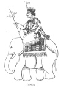
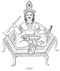

  
[Intangible Textual Heritage](../../index)  [Hinduism](../index.md) 
[Index](index)  [Previous](hmvp10)  [Next](hmvp12.md) 

------------------------------------------------------------------------

  
*Hindu Mythology, Vedic and Puranic*, by W.J. Wilkins, \[1900\], at
Intangible Textual Heritage

------------------------------------------------------------------------

p. 53

### CHAPTER VII.

#### THE STORM DEITIES.

##### 1. INDRA.

As was noticed previously, Indra, together with Agni and Surya, by means
of sacrifice obtained supremacy

 
[  
Click to enlarge](img/05300.jpg.md)  
INDRA.  

over the other gods; and if we may judge from the number of hymns
addressed to him in the Vedas, he was the most popular deity,

p. 54

He is the god of the firmament, in whose hands are the thunder and the
lightning; at whose command the refreshing showers fall to render the
earth fruitful. When it is borne in mind that in India for months
together the earth, exposed to the scorching rays of the sun, becomes so
hard that it is impossible for the fields to be ploughed or the seed to
be sown, it will not be regarded as wonderful that the god who is
supposed to bestow rain should frequently be appealed to, and that the
most laudatory songs should be addressed to him. To the poetic, minds of
the Vedic age, the clouds that the winds brought from the ocean were
enemies who held their treasures in their fast embrace until, conquered
by Indra, they were forced to pour them upon the parched soil. And very
naturally when, in answer to the cry of his worshippers, the genial
rains descended, and the earth was thereby changed from a desert to a
garden, songs of thanksgiving and praise, couched in the strongest
terms, were addressed to him. The attributes ascribed to him refer
principally to his physical superiority; and the blessings sought from
him are chiefly of a physical rather than a spiritual character.

Indra is not regarded as an uncreated deity. In some hymns he is spoken
of as the twin-brother of Agni, and therefore the son of Heaven and
Earth; whilst, in other hymns, heaven and earth are said to have been
formed by him. Although his parents are often referred to, it is but
seldom that they are named; and when they are named, they are not always
the same. He is the king of the gods; and in post-Vedic ages his reign
is said to extend for a hundred divine years only; at the end of which
time he may be superseded as king by some other of the gods, or even by

p. 55

man, if any be able to perform the severe penance necessary to obtain
this exalted position.

In pictures, Indra is often represented as a man with four arms and
hands; with two he holds a lance, in the third is a thunderbolt, whilst
the fourth is empty. He is also sometimes painted with two arms only,
and, having eyes all over his body, is then called Sahasrāksha (the
thousand-eye). He is generally depicted as riding upon the wonderful
elephant Airavata, who was produced at the churning of the ocean, [\*](#fn_50.md) carrying a thunderbolt in his right hand
and a bow in his left. In the Vedic Age his worship was far more popular
than it is at present.

The position and attributes of Indra as taught by the Vedas will be seen
from the following description, abbreviated from that given by Dr.
Muir:— [†](#fn_51.md)

"Come, Indra, come, thou much invoked,  
 Our potent hymn thy steeds has yoked.  
 Friend Indra, from the sky descend,  
 Thy course propitious hither bend.  
 But, Indra, though of us thou thinkest,  
 And our libations gladly drinkest,  
 We, mortal men, can only share  
 A humble portion of thy care.  
 We know how many potent ties  
 Enchain thee in thy paradise.  
 Thou hast at home a lovely wife,  
 The charm and solace of thy life.  
 Thou hast a ceaseless round of joys  
 Which all thy circling hours employs;  
 Joys such as gods immortal know,  
 Unguessed by mortals here below."

Being invoked by mortals, Indra is born. The Sky and the Earth trembled
at his appearance, and the Sky exclaimed

p. 56

"Thy father was a stalwart wight;  
 Of most consummate skill was he,  
 The god whose genius fashioned thee."

Immediately after his birth the god gave unmistakable evidence of his
divinity. Grasping his weapons, he cried—

"Where, mother, dwell those warriors fierce,  
 Whose haughty hearts these bolts must pierce?"

Borne in his chariot, hastened by the prayers of his people, the god
appears.

"Yet not one form alone he bears,  
 But various shapes of glory wears,  
 His aspect changing at his will,  
 Transmuted, yet resplendent still.  
 In warlike semblance see him stand,  
 Red lightnings wielding in his hand."

Ready prepared for him is a feast, the principal attraction of which is
the Soma juice. [\*](#fn_52.md) Indra was
particularly fond of this intoxicating drink. It is a most strange
circumstance that, whilst the Hindus of the present day are prohibited
from the use of intoxicants, Indra is described as being addicted to the
Soma; whilst the drink itself is deified and worshipped as a god. Indra
on his arrival is invited to quaff the invigorating cup:—

"Thou, Indra, oft of old hast quaffed  
 With keen delight our Soma draught.  
 All gods the luscious Soma love,  
 But thou all other gods above.  
 Thy mother knew how well this juice  
 Was fitted for her infant's use.  
 Into a cup she crushed the sap,  
 Which thou didst sip upon her lap.

p. 57

\[paragraph
continues\]  Yes, Indra, on thy natal morn,  
 The very hour that thou wast born,  
 Thou didst those jovial tastes display,  
 Which still survive in strength to-day."

Indra, after singing the praises of the Soma juice, drinks the proffered
cup, and as a result is most graciously disposed towards the
worshippers, ready to give whatever they ask. When thus strengthened by
the draught, he goes forth to meet the great enemy he came to conquer.
This enemy is Vritra (Drought). And in the conflict and victory are seen
the peculiar blessings to the earth and man that Indra is able to grant.
Vritra is thus described:—

                 "He whose magic powers  
 From earth withhold the genial showers;  
 Of mortal men the foe malign,  
 And rival of the race divine;  
 Whose demon hosts from age to age  
 With Indra war unceasing wage;  
 Who, times unnumbered crushed and slain,  
 Is ever newly born again,  
 And evermore renews the strife  
 In which again he forfeits life."

The battle is described at length; in which we have a graphic
description of the commencement of the rainy season, with the severe
thunderstorms which usually accompany this change of the seasons. At
last the conflict is over:

"And soon the knell of Vritra's doom  
 Was sounded by the clang and boom  
   Of Indra's iron shower.  
 Pierced, cloven, crushed, with horrid yell,  
 The dying demon headlong fell  
   Down from his cloud-built tower."

As a result of the victory of the god, the rains descend and the earth
is made fruitful:

p. 58

"Now bound by Sushna's spell no more,  
 The clouds discharge their liquid store;  
 And long by torrid sunbeams baked  
 The plains by copious showers are slaked;  
 The rivers swell, and seawards sweep  
 Their turbid torrents broad and deep.  
 The peasant views with deep delight,  
 And thankful heart, the auspicious sight.  
 His leafless fields, so sere and sad,  
 Will soon with waving crops be glad;  
 And mother Earth, now brown and bare,  
 A robe of brilliant green will wear."

After this blessing has been received, the sun shines, and earth again
is bright; the gods come with their congratulations to their king, and
men present their thanksgivings.

Such was Indra in ancient times; and though worshipped still, he
occupies a very inferior position in the present age. As mentioned
previously, according to the teaching of the later books, his rule over
the gods continues for a hundred divine [\*](#fn_53.md) years; at the expiration of which time he
may be superseded by another god, or even by a man. The Purānas teach
that, in each age of the world, a different being has enjoyed this
position. In the "Vishnu Purāna" [†](#fn_54.md) is
the following story of a man raising himself to the throne of Indra.

There was a war between the gods and demons; both parties inquired of
Brahmā, which would be victorious. Brahmā replied, "The side for which
Rāji (an earthly king) shall take up arms." The demons called first upon
Rāji to invoke his aid. He promised to assist them provided they would
make him their Indra or king. They could not promise this, as Prahlāda
their Indra's term of office was not yet expired. The same

p. 59

condition being proposed to the gods, they consented, and Rāji became
their Indra. He fought for them, and conquered. Upon this, Indra bowed
down before him, and, placing Rāji's foot upon his head, said, "Thou
hast preserved me from a great danger. I acknowledge thee as my father:
thou art king over all; I am thy son." Rāji, however, was contented to
remain as king on earth, and appointed Indra to continue as his
representative on the throne of heaven. On the death of Rāji, his sons
wished to assume the position their father had declined. This Indra
opposed, but was at length compelled to yield. After a time, being sad
because deprived of his share in the sacrifices of mortals, Indra met
with his spiritual preceptor Vrihaspati, and asked him for a morsel of
the sacrificial butter. The teacher replied that, had Indra applied to
him earlier, he would not have been reduced to such straits; but "as it
is," he said, "I will regain your sovereignty in a few days." Upon this
he commenced a sacrifice, with the special purpose of obtaining power
for Indra. The result was, that Rāji's sons were led into sin, they
became enemies of the Brāhmans, despised the Vedas, and neglected their
religious duties. When thus weakened, India fell upon and slew them.

The most effectual way by which a mortal could obtain the position of
Indra was by the sacrifice of a hundred horses; and, as will be seen in
the account of Gangā, [\*](#fn_55.md) the Indra of
that time did not object to play the part of a thief, so as to prevent
the completion of the rites by which he was to be deprived of his
sovereignty. The most common and generally successful method by which
these ambitious mortals were frustrated in their design was by his
sending down

p. 60

some celestial nymphs; called Apsaras, who, by their beauty, distracted
the thoughts of the devotees, and rendered them unfit to offer this
great sacrifice.

In the "Vishnu Purāna," [\*](#fn_56.md) there is a
legend of a conflict between Indra and Krishna, in which Indra is
overcome. Krishna, accompanied by his wife Satyabhāmā, visits Indra in
his heaven. On her arrival, this lady was most anxious to obtain
possession of the wonderful Pārijātā tree, which was produced at the
churning of the ocean, and planted in Indra's heavenly garden. This tree
was beautiful in form, was adorned with lovely and sweet-scented
flowers, and bore most luscious fruit. The flowers had this virtue,
that, worn in the hair by a wife, they enabled her to retain the love of
her husband; whilst those who ate the fruit of this tree could remember
what had occurred in their previous states of existence. At the request
of his wife, Krishna took the tree, and placed it upon Garuda, his
wonderful bird-vehicle. Immediately there was an uproar in heaven; but
though Indra and his attendant deities tried to prevent the removal of
his property, they could not do so. Krishna caught a thunderbolt of
Indra in his hand, and, returning home unhurt, planted the tree in his
garden.

The Rāmāyana has a story showing that Indra was believed to have been
guilty of the grossest immorality—the seduction of the wife of his
spiritual teacher. He is said to have visited the house of Gautama, in
the form of a sage, hoping to be mistaken by the preceptor's wife for
her husband, who was absent from home. But although Ahalyā knew him to
be Indra, she yielded to his wishes. As Indra was about to leave,
Gautama returned, and, knowing what had happened, cursed the

p. 61

god and his wife. Indra in consequence lost his man- hood; and Ahalyā
was doomed to live for many years

invisible in a forest, until Rāma should come to restore her to her
former state. [\*](#fn_57.md) Another account of
this curse of Gautama was that Indra was compelled to carry a thousand
disgraceful marks upon his body, that all might know the sin of which he
had been guilty. At the god's earnest request these were changed from
their original form into eyes; which by the ignorant came to be regarded
as an indication of his omniscience.

The heaven of Indra must not be passed over without notice, as it is
there the good on earth hope to go for a time, as a reward of their holy
lives. To go to Swarga, as his heaven is named, is not the highest
happiness a man can obtain, because he cannot remain there for ever.
When his allotted years of happiness are over, he must return to earth
and live other lives, until he becomes perfect and fit to enjoy the
highest felicity—absorption into the Divine Being. The "Vishnu
Purāna" [†](#fn_58.md) says: "Not in hell alone do
the souls of the deceased undergo pain: there is no cessation even in
heaven; for its temporary inhabitant is ever tormented with the prospect
of descending again to earth. Again must he be born upon earth, and
again must he die. Whatever is produced that is most acceptable to man
becomes a seed whence springs the tree of sorrow."

The home of Indra is situated on Mount Meru. [‡](#fn_59.md) It

p. 62

has beautiful houses for its inhabitants; and the splendour of its
capital is unequalled in the universe. Its gardens are stocked with
trees that afford a grateful shade, yield the most luscious fruits, and
are adorned with beautiful and fragrant flowers. Most beautiful nymphs
(Apsaras) charm the happy inhabitants, whilst choristers and musicians,
unrivalled in the universe, discourse sweet music. The city was built by
Visvakarma. It is eight hundred miles in circumference, and forty miles
high. Its pillars are diamonds; its palaces, thrones, and furniture,
pure gold. [\*](#fn_60.md)

In Bengal this deity is worshipped one day in each year. His image is
made of mud, prettily painted; on the day after it has been worshipped
it is cast into the river. At the commencement of a sacrifice, too, he
is invoked, in the hope that he will convey the prayers and offerings to
the deity specially worshipped at that time, or that he will conduct the
deity into the presence of the worshippers. In seasons of drought
special offerings are made to him in some parts of the country, that
through his power the clouds may pour their streams upon the parched
country.

The more common of Indra's other names are the following:—Sakra, the
able one; Divapati, the lord of the gods; Bajrī, he who wields the
thunderbolt; Vritrahā, the destroyer of Vritra; Meghavāhana, he who
rides on the clouds; Mahendra, the great Indra; Swargapati, the lord of
heaven.

p. 63

##### 2. INDRĀNI.

Of Indrāni, the wife of Indra (called also Sachi), very little is said.
In the Rig-Veda [\*](#fn_61.md) we read, "Among all
females Indrāni is the most fortunate; for her husband shall not at any
future time die of old age." This may be explained by the fact that
Indrāni is wife to all who successively attain to the throne of Indra.
There is always some one ruling in heaven; the office is perpetual, and
as she is the wife of the reigning king, whoever he may be, her husband
can never die of old age. Though kings may come and go, she continues
queen. She is said to have a son, Chitragupta by name, who was born of a
cow; for, owing to a curse pronounced by Umā, none of the goddesses
could become a mother. She practised austerities, in order that she
might not be childless; and by means of this expedient her desire was
gratified. At the birth of this child, the reputed mother suffered all
the pains attendant on childbirth, and was able to nurse him.

##### 3. PARJANYA.

There are a few hymns addressed to this deity in the Rig-Veda; but from
the character and functions ascribed to him it is difficult to see
wherein he differs from Indra. Professor Roth [†](#fn_62.md) says, "Taking a review of the whole, we
find that Parjanya is a god who presides over the lightning, the
thunder, the rain, and the procreation of plants and living creatures.
But it is by no means clear whether he is originally a god of the rain,
or a god of the thunder." In another essay he says Parjanya is "the god
of the thunderstorms and rain, the generator

p. 64

and nourisher of plants and living creatures. Seeing that the hymns
addressed to this deity are so very similar to those sung to Indra, may
not Parjanya (whose name signifies one acting for another) be merely
another name for Indra? " In these hymns are the following
passages, [\*](#fn_63.md) all of which are in
perfect harmony with those in honour of Indra:—"Laud Parjanya, worship
him with reverence—the procreative and stimulating fructifier. . . . He
splits the trees; he destroys the Rakshasas (cloud demons who withhold
the rains). The whole creation is afraid of his mighty stroke; even the
innocent man flees before the vigorous god, when Parjanya thundering
smites the evildoers. Like a charioteer urging forward his horses with a
whip, the god brings into view his showery scouts. From afar, the lions’
roarings arise when Parjanya charges the clouds with rain. The winds
blow, the lightnings fall, the plants shoot up, the heaven fructifies;
food is produced for all created things when Parjanya thundering
replenishes the earth with moisture. Raise aloft thy vast water-vessel,
and pour down showers; let the discharged rivulets roll on forward,
moisten the heaven and earth with fatness; let there be well-filled
drinking-places for the cows."

In all this there is not a single idea that was not expressed in the
hymns to Indra noticed previously. In the Purānas Indra is generally
styled the king of the gods; whilst Parjanya is spoken of as the ruler
over, and as dwelling in, the clouds.

##### 4. VĀYU.

Another of the storm-gods is Vāyu, the god of the winds. He is often
associated with Indra, and is

p. 65

regarded, equally with him, as representing or ruling over the
atmosphere. He won the race for the first draught of the Soma juice;
and, at Indra's request, allowed him to have a quarter of it. He does
not occupy a very prominent position in the Vedic hymns. In one
passage [\*](#fn_64.md) we read, "The two worlds
(heaven and earth) generated him for wealth." This may be intended to
teach his parentage; and Dr. Muir says that he is not aware of any other
passage where his

 
[  
Click to enlarge](img/06500.jpg.md)  
VĀYU.  

parentage is declared. He is said to be the son-in-law of Tvastri
(Visvakarma); but here a difficulty occurs: only one daughter of Tvastri
is mentioned, and, as was noticed in the account of Surya, he was said
to be husband of this girl.

Vāyu is described [†](#fn_65.md) as being most
handsome in form; one who moves noisily in a shining car, drawn by a
pair of red or purple horses. At times the number of horses is increased
to ninety-nine, a hundred, or even a thousand.

p. 66

\[paragraph continues\] This latter number
would probably be employed during a cyclone. He is seldom mentioned in
connection with the Maruts (storm-deities), though in one place he is
said to have begotten them by the rivers of heaven.

Another name for Vāyu in the Vedas is Vāta. The praise of Vāta is sung
in the following hymn:— [\*](#fn_66.md) (I
celebrate) the glory of Vāta's chariot; his noise comes rending and
resounding. Touching the sky, he moves onward, making all things ruddy;
and he comes propelling the dust of the earth. The gusts of air rush
after him, and congregate upon him as women in an assembly. Sitting
along with them on the same car, the god \[Indra\] who is king of this
universe is borne along. Hasting forward . . . he never rests. Friend of
the waters, first-born, holy, in what place was he born His sounds have
been heard, but his form is not (seen)."

In a later age, when it was thought necessary to connect the heroes,
whose exploits are then sung, with the gods, Vāyu, or Pavan as he is
then called, is said to have had a son, Hanumān, by a monkey mother.
Hanumān played a most conspicuous part in Rāma's expedition in search of
Sita. In the Mahābhārata, Bhīma (the Strong), one of the bravest of the
warriors whose history is given there, is also said to be a son of Vāyu.
Kunti, the mother of Bhīma, had a boon granted as a reward of her
devotion, that she could obtain a child by any of the gods she might
wish. As her husband, owing to a curse, could not become a father, she
employed this charm, and so Vāyu became the father of Bhīma.

Vāyu or Pavan (the Purifier) is represented in pictures as a white man
riding on a deer, and carries a white flag in his hand. In the Purānas
he is said to be son of Aditi.

Other names by which this deity is known are the

p. 67

following:—Anila, breath; Mārut, air that is necessary to life;
Sparsana, he who touches; Gandhavaha, he who carries odours.

##### 5. THE MARUTS.

In one passage in the Rig-Veda these gods are said to be one hundred and
eighty in number; in another text, twenty-seven is the number given;
whilst in the Purānas they are said to be forty-nine. In the Vedas they
are called the sons of Rudra. They are the companions of Indra; at times
they worship him, and thus acknowledge his superiority; at others they
seem to assert their inherent power, and remind Indra of the aid they
have given him. They are addressed in the following strain:— [\*](#fn_67.md) "Spears rest upon your shoulders, ye
Maruts; ye have anklets on your feet, golden ornaments on your breasts,
lustre in your ears, fiery lightnings in your hands, and golden helmets
placed on your heads." They are armed with golden weapons and
lightnings; they dart thunderbolts, gleam like flames of fire, and are
borne along with the fury of boisterous winds. They split Vritra
(Drought) to pieces, are clothed with rain, create darkness during the
day, water the earth, and avert heat. They cause the earth and the
mountains to quake. They were accustomed to the use of the soma; and
were appealed to, to bring healing remedies, which are described as
abiding in the (river) Sindhu, the seas, and the hills.

In the "Vishnu Purāna" [†](#fn_68.md) we find quite
a different account of the Maruts. They are there said to be the sons of
Kasyapa and Diti. Diti having lost her children, propitiated her
husband, who promised her a boon. She

p. 68

asked that she might have a son of irresistible prowess and valour, who
should destroy Indra. The Muni promised to grant this request on one
condition. "You shall bear a son," he said, "who shall slay Indra, if
with thoughts wholly pious, and person entirely pure, you carefully
carry the babe in your womb for a hundred years." Diti accepted the boon
with this condition. Indra hearing of this, tried his best to distract
her mind, and so prevent the birth of this wonderful child. When
ninety-nine years had passed, an opportunity offered itself. Diti
retired to rest one night without having washed her feet, and thus
violated a rule of ceremonial purity. Indra, ever-watchful, availing
himself of this neglect, was able to accomplish his purpose. With his
thunderbolt he cut the embryo into seven parts. The children cried
bitterly, and Indra was unable to console them. Incensed at their
obstinacy in crying, he cut each of these seven parts into seven, and
thus formed the forty-nine Maruts. The name Maruts was given to them
from the words "Ma rodih " (Weep not), used by Indra when trying to
quiet them; and they became subordinate deities—the associates of the
wielder of the thunderbolt.

It is not difficult to see how the dwellers in India should have
imagined that one god, even though he was the king of the gods, should
sometimes need assistance in the management of the winds. The farther
the Aryan immigrants travelled south and eastward, the fiercer were the
storms they experienced. Hence arose the hymns addressed to the lesser
deities who were invoked to assist Indra in his mighty task of
controlling them.

------------------------------------------------------------------------

### Footnotes

[55:\*](hmvp11.htm#fr_50.md) See part ii. chap. iv.

[55:†](hmvp11.htm#fr_51.md) Muir, O. S. T., v. 126.

[56:\*](hmvp11.htm#fr_52.md) See chap. viii.

[58:\*](hmvp11.htm#fr_53.md) See part ii, chap. x.

[58:†](hmvp11.htm#fr_54.md) Book iv. chap. ix.

[59:\*](hmvp11.htm#fr_55.md) Part iii. chap. viii.

[60:\*](hmvp11.htm#fr_56.md) Book v. chap. xxx.

[61:\*](hmvp11.htm#fr_57.md) One result of this sin
of India was the fact that a son of Rāvana, a demon king, who ruled in
Ceylon, was able to carry him off as a captive, when he made war upon
the gods; and it was not until Brahmā promised immortality to this
warrior, that he consented to release his prisoner. Brahmā gave this
prince the name of Indrajita (conqueror of Indra).

[61:†](hmvp11.htm#fr_58.md) Book vi. chap. v.

[61:‡](hmvp11.htm#fr_59.md) Meru is a fabulous
mountain, supposed to be the centre of the p.
62 earth. It is believed to be somewhere to the north of the
Himalayas. The heavens of the other gods are situated in its vicinity.
From the fact that they regarded heaven to be near their former home, it
would seen that the Indo-Aryans retained pleasant recollections of the
place whence they migrated; or perhaps the inaccessibility of these
mountains was a reason for heaven being placed on their summits.

[62:\*](hmvp11.htm#fr_60.md) "Mahābhārata," quoted
by Ward, ii. 36.

[63:\*](hmvp11.htm#fr_61.md) Muir, O. S. T., v. 82.

[63:†](hmvp11.htm#fr_62.md) Ibid. v, 142.

[64:\*](hmvp11.htm#fr_63.md) Muir, O. S. T., v.
140.

[65:\*](hmvp11.htm#fr_64.md) Muir, O. S. T., v.
140.

[65:†](hmvp11.htm#fr_65.md) Ibid. v. 143.

[66:\*](hmvp11.htm#fr_66.md) Muir, O. S. T., v.
146.

[67:\*](hmvp11.htm#fr_67.md) Muir, O. S. T., v. 147
ff.

[67:†](hmvp11.htm#fr_68.md) Book i. chap. xxi.

------------------------------------------------------------------------

[Next: Chapter VIII. Soma](hmvp12.md)
