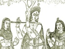

  
[Intangible Textual Heritage](../../index)  [Hinduism](../index) 
[Index](index)  [Previous](hmvp12)  [Next](hmvp14) 

------------------------------------------------------------------------

  
*Hindu Mythology, Vedic and Puranic*, by W.J. Wilkins, \[1900\], at
Intangible Textual Heritage

------------------------------------------------------------------------

p. 75

### CHAPTER IX.

#### TVASTRI OR VISVAKARMA.

Tvastri, or, as he is called in the later
works, Visvakarma, is the architect and workman of the gods—the Hindu
Vulcan. The heavenly places were formed by him, and the warlike gods are
indebted to him for their wonder-working weapons. He sharpens the iron
axe of Brahmanaspati (Agni), and forges the thunderbolts of Indra. He is
intimately associated with men; he forms husband and wife for each other
from the womb, and blesses the married couple with offspring. This
accounts for the fact that the wives of the gods are his most constant
companions. He made the world and all that is in it; and he is the
protector of the creatures he has made. He shares with the other gods in
the sacrifices offered by mortals. [\*](#fn_79)

Tvastri is in several passages connected with the Ribhus. These were
sons of a man named Sudhanvan; who, owing to their great skill in
working, obtained immortality and divine honours. The Ribhus made
Indra's chariot and horses; also by their great austerities restored
their parents to youth. They are spoken of as the pupils of Tvastri. It
was through their skill in manufacturing four sacrificial cups out of
one their

p. 76

master had fashioned that they became divine. This exhibition was made
at the command of the gods, and exaltation to deity the promised reward.
Tvastri was very angry at their success; and, ashamed of being seen, hid
himself amongst the women. It is said that he even tried to slay his
pupils. According to other accounts, he admired their skill and was
pleased at the result. Tvastri was the father-in-law of Vivasvat (the
Sun).

Indra is occasionally described as being in a state of hostility towards
Tvastri and his son Visvarūpa, and ultimately caused the death of both.
This Visvarūpa had three heads, called respectively, the Soma-drinker
the Wine-drinker, and the Food-eater. On one occasion he declared in
public that the sacrifices should be shared by the gods only; but in
private he said the asuras (demons) should share them too. And as it is
customary to keep promises that are privately made, Indra was afraid
that the asuras, obtaining a share of the sacrifices, would be so
strengthened as to be able to overthrow his kingdom; he therefore cut
off the heads of Visvarūpa with his thunderbolt. The three heads were
turned into birds: the Soma-drinker became a Kapinjala (a Francoline
partridge), for Soma was of a brown colour the Wine-drinker became a
Kalavinka (sparrow), because when men are intoxicated they make a noise
like a sparrow; the Food-eater became a Tittiri (partridge), which
consequently has a great variety of colour, for its body appears to be
sprinkled with glut-and honey. Tvastri, enraged because Indra had slain
his son, made a libation to the gods, but did not invite Indra to it.
Indra, noticing this slight, by force took the vessel containing the
Soma juice, and drank it. But he drank more than was good for him.
Tvastri, being angry, at once broke off the sacrifice, and used the few
drops of

p. 77

\[paragraph continues\] Soma left to give
effect to a curse. He employed the right formula for accomplishing the
death of Indra, but unfortunately laid stress upon the wrong word. So,
instead of slaying Indra, he was himself slain by him. [\*](#fn_80)

In the Purānas, Tvastri appears under the name of Visvakarma. In the
"Vishnu Purāna" he is styled "the author of a thousand arts, the
mechanist of the gods, the fabricator of ornaments, the chief of
artists, the constructor of the self-moving chariots of the deities, by
whose skill men obtain subsistence." Though not named as an Āditya in
the Vedas, he is generally reckoned as one in the Purānas. In other
places he is called a son of Brahmā. In pictures he is represented as a
white man with three eyes. In his right hand he carries a club. He wears
a crown, and is adorned with a necklace and bracelets of gold. He is
worshipped once, twice, thrice, or four times each year, according to
the devotion of his worshippers. Nowadays, no images of him are set up;
each man worships the implements of his trade, as representatives. The
carpenter bows down to his hammer, saw, etc.; the bricklayer to his
trowel; the peasant to his plough; the student to his books; the clerk
to his pen. When the worship is over, the day is spent in feasting and
enjoyment.

Though, as we have seen in the Vedas, he is regarded in some hymns as
the Creator and the Preserver, in the later books he occupies a much
lower position. Brahmā is styled the Creator, and Vishnu the
Preserver—whilst Visvakarma becomes a valued servant who fulfils the
behests of his superiors. It is for skill and power to work in their
ordinary avocations that his aid is now sought.

------------------------------------------------------------------------

### Footnotes

[75:\*](hmvp13.htm#fr_79) Muir, O. S. T., v.
224.

[77:\*](hmvp13.htm#fr_80) Muir, O. S. T., v.
232.

------------------------------------------------------------------------

[Next: Chapter X. Yama](hmvp14)
