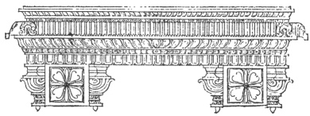

  
[Intangible Textual Heritage](../../index)  [Hinduism](../index.md) 
[Index](index)  [Previous](hmvp15)  [Next](hmvp17.md) 

------------------------------------------------------------------------

  
*Hindu Mythology, Vedic and Puranic*, by W.J. Wilkins, \[1900\], at
Intangible Textual Heritage

------------------------------------------------------------------------

p. 93

### CHAPTER II.

#### BRAHMA. [\*](#fn_91.md)

Brahma is regarded as the Supreme Being,
the God of gods; of whom Brahmā, Vishnu, and Siva are manifestations. It
is true that, in some verses of the Vedas, attributes ascribed to him
are also ascribed to other deities, and in some of the Purānas various
gods are said to be identical with the supreme Brahma; nevertheless
Brahma is regarded by the Hindus (for which opinion there is abundant
authority in their scriptures) as the Supreme God—the origin of all the
others, and of whom they are manifestations. Thus we read in the
"Atharva-Veda":— [†](#fn_92.md) "All the gods are
in (Brahma) as cows in a cow-house. In the beginning Brahma was this
\[universe\]. He created gods. Having created gods, he placed them in
these worlds, viz. Agni in this world, Vāyu in the atmosphere, and Surya
in the sky. And in the worlds which are yet higher, he placed the gods
which are still higher. Then Brahma proceeded to the higher sphere
\[which is explained by the commentator to mean the Satyaloka, the most
excellent and limit of all the worlds\]. The gods were originally
mortal; but when they were pervaded by Brahma, they became immortal." In
the "Taittiriya Brāhmana" it is said:

p. 94

\[paragraph continues\] "Brahma generated
the gods, Brahma (generated) this entire world. Within him are all these
worlds. Within him is this entire universe. It is Brahma who is the
greatest of beings. Who can vie with him? In Brahma, the thirty-three
gods; in Brahma, Indra and Prajāpati; in Brahma all things are contained
as in a ship."

Prof. Monier Williams [\*](#fn_93.md) says:—"Only a
few hymns of the Vedas appear to contain the simple conception of one
divine self, existent, omnipresent being; and even in these, the idea of
one god present in all nature is somewhat nebulous and undefined."
Further on he says: "In the Purusha Sūkta of the Rig-Veda, the one
spirit is called Purusha. The more common name in the later system is
Brāhman, neuter (nom. Brahma), derived from the root *brih*, 'to
expand,' and denoting the universally expanding essence, or universally
diffused substance of the universe . . . Brāhman, in the neuter, being
'simple, infinite being'—the only real eternal essence—which, when it
passes into actual manifested existence, is called Brahmā; when it
develops itself in the world, is called Vishnu; and when it again
dissolves itself into simple being, is called Siva; all the other
innumerable gods and demi-gods being also mere manifestations of the
neuter Brāhman, who is eternal."

In the "Vishnu Purāna" [†](#fn_94.md) Brahma is
translated as "abstract supreme spirit." Later on [‡](#fn_95.md) the question is asked, "How can creative
agency be attributed to Brahma, who \[as abstract spirit\] is without
qualities, illimitable, and free from imperfection?" The answer is, that
"the essential properties of existent things are objects of observation,
of which no foreknowledge is attainable; and creation and hundreds of
properties

p. 95

belong to Brahma as inseparable, parts of his essence, as heat is
inherent in fire." The Purāna goes on to say that creation is effected
through the agency of Brahmā, the first manifestation of Brahma; and
then declares that Vishnu is one with Brahmā.

Again, the same Purāna [\*](#fn_96.md) says: "There
are two states of this Brahma—one with, and one without shape; one
perishable, one imperishable; which are inherent in all beings. The
imperishable is the supreme being; the perishable is all the world. The
blaze of fire burning in one spot diffuses light and heat around; so the
world is nothing more than the manifested energy of the supreme Brahma;
and inasmuch as the light and heat are stronger or feebler as we are
near to the fire or far off from it, so the energy of the supreme is
more or less intense in the beings that are less or more remote from
him. Brahmā, Vishnu, and Siva are the most powerful energies of God;
next to them are the inferior deities; then the attendant spirits; then
men; then animals, birds, insects, vegetables; each becoming more and
more feeble as they are farther from their primitive source."

The "Vishnu Purāna" [†](#fn_97.md) gives the
following derivation of the word Brahma:—It "is derived from the root
*vriha* (to increase), because it is infinite (spirit), and because it
is the cause by which the Vedas (and all things) are developed." Then
follows this hymn to Brahma:—"Glory to Brahma, who is addressed by that
mystic word (*Om*), [‡](#fn_98.md) associated
eternally with the triple universe (earth, sky, and heaven), and who is
one with

p. 96

the four Vedas. Glory to Brahma, who alike in the destruction and
renovation of the world is called the great and mysterious cause of the
intellectual principle; who is without limit in time or space, and
exempt from diminution and decay. . .. He is the invisible, imperishable
Brahma; varying in form, invariable in substance; the chief principle,
self-engendered; who is said to illuminate the caverns of the heart; who
is indivisible, radiant, undecaying, multiform. To that supreme Brahma
be for ever adoration."

In perfect harmony with this teaching of the "Vishnu Purāna" is the
common belief of the Hindus. No phrase is more commonly used by them
when speaking of the divine being than this: "God (Brahma) is one
without a second." The word used by them for God as distinguished from
his manifestations, is Brahma; and when charged with Polytheism, and of
violating the primary law respecting the unity of God, they reply that
Brahmā, Vishnu, Siva, etc., are only manifestations of the supreme
Brahma. [\*](#fn_99.md)

In the earliest writings Brahma signified a hymn or mantra, whilst
Brahmā was the term used to denote a priest or worshipper. It is in the
later parts of the Vedas that Brahma is identified with the supreme, and
Brahmā becomes his great manifestation. Prajāpati, the lord of
creatures, was the Creator according to the earlier teaching of the
Vedas, and occupied the position in the earlier Pantheon that Brahmā did
in the later. In several texts of the Vedas the two are identified, and
thus authority is found for the idea that Brahmā is to be worshipped as
the Maker of all things.

p. 97

This Brahmā, though satisfactory to the priests, was not so to the
common people. In process of time local gods absorbed their worship, and
the non-Aryan deities of the people whom they had conquered exercised
their influence on the Aryans themselves. Rather than lose their hold of
the people, the priests adopted these new deities, and found a parentage
for them from amongst the old Vedic gods. By the time the Epics were
composed, Vishnu and Siva had been thus assimilated. The different names
by which these deities are now known may possibly have been the local
names of local or tribal gods; by retaining these the priests also
retained their hold upon the people. In the "Satapatha Brāhmana"
attempts are made to identify Siva with Agni, as though the writer
wished to show that the later triad—Brahmā, Vishnu, and Siva—was
identical with the older one composed of Agni, Indra-Vāyu, and Surya.

 

------------------------------------------------------------------------

### Footnotes

[93:\*](hmvp16.htm#fr_91.md) It will be noticed
that the final vowel in the name of this deity is *short*, whilst in
that of the first incarnation it is *long*.

[93:†](hmvp16.htm#fr_92.md) Muir, O. S. T., v. 387
ff.

[94:\*](hmvp16.htm#fr_93.md) "Indian Wisdom," p.
12.

[94:†](hmvp16.htm#fr_94.md) Page 2.

[94:‡](hmvp16.htm#fr_95.md) Book i. chap. iii.

[95:\*](hmvp16.htm#fr_96.md) Page 157.

[95:†](hmvp16.htm#fr_97.md) Page 273.

[95:‡](hmvp16.htm#fr_98.md) This word occurs at the
commencement of prayers and religious ceremonies. It is so sacred that
none must hear it pronounced. Originally the three letters (*a u m*) of
which it is formed typified the three Vedas; afterwards it became a
mystical symbol of the three deities—Brahmā, Vishnu, Siva.

[96:\*](hmvp16.htm#fr_99.md) The Theistic sect that
arose in Bengal during the present century, for a long time gloried in
the name Brahmo Somaj; *i.e.* the Society that worshipped the supreme
Brahma or God.

------------------------------------------------------------------------

[Next: Chapter III. Brahmā and Sarasvati](hmvp17.md)
