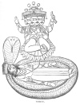
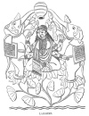
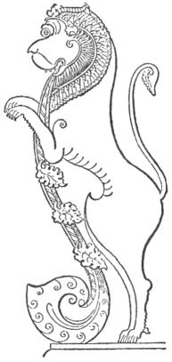

  
[Intangible Textual Heritage](../../index)  [Hinduism](../index) 
[Index](index)  [Previous](hmvp17)  [Next](hmvp19) 

------------------------------------------------------------------------

  
*Hindu Mythology, Vedic and Puranic*, by W.J. Wilkins, \[1900\], at
Intangible Textual Heritage

------------------------------------------------------------------------

p. 116

### CHAPTER IV.

#### VISHNU AND LAKSHMI.

##### VISHNU.

Vishnu is called the second person of the
Hindu Trimurti, or Triad: but though called *second*, it must not be
supposed that he is regarded as in any way inferior to Brahmā. In some
books Brahmā is said to be the first cause of all things, in others it
is as strongly asserted that Vishnu has this honour; while in others it
is claimed for Siva. As Brahmā's special work is creation, that of
Vishnu is preservation. In the following passage from the "Padma
Purāna," it is taught that Vishnu is the supreme cause, thus identifying
him with Brahma, and also that his special work is *to preserve:*—"In
the beginning of creation, the great Vishnu, desirous of creating the
whole world, became threefold; Creator, Preserver, Destroyer. In order
to create this world, the Supreme Spirit produced from the right side of
his body himself as Brahmā; then, in order to preserve the world, he
produced from his left side Vishnu; and in order to destroy the world,
he produced from the middle of his body the eternal Siva. Some worship
Brahmā, others Vishnu, others Siva; but Vishnu, one yet threefold,
creates, preserves, and destroys: therefore let the pious make no
difference between the three."

p. 117

The essence of the teaching of the "Vishnu Purāna" is given in a few
lines. [\*](#fn_121) "Listen to the complete
compendium of the Purāna according to its tenor. The world was produced
from Vishnu; it exists in him; he

 
[  
Click to enlarge](img/11700.jpg)  
VISHNU.  

is the cause of its continuance and cessation; he is the world."
Immediately afterwards is a hymn addressed to him which commences as
follows:—"Glory to the unchangeable, holy, eternal, supreme Vishnu, of
one

p. 118

universal nature, the mighty over all; to him who is Hirānyagarbha
(Brahmā), Hari (Vishnu), and Sankara (Siva); the Creator, Preserver, and
Destroyer of the world." As will be noticed later on, Siva is commonly
called Mahādeva (the great god). By those who make him the supreme
object of worship, Vishnu is commonly called Nārāyana, though this was
originally a name of Brahmā. These generally, to a large extent,
disregard his incarnations, and address their praise to him as the
greatest of all. And frequently he is indicated by the word Ishwar
(God), as though he were *the* God. But this term is far more frequently
employed for Siva.

"The word Vishnu in the Purānas is generally said to be derived from the
root *vis* (to enter); entering in or pervading the universe, agreeably
to the text of the Vedas: 'Having created that (world), he then
afterwards enters into it.' According to the 'Matsya Purāna,' the name
alludes to his entering into the mundane egg; according to the 'Padma
Purāna,' it refers to his entering into or combining with Prakriti, as
Purush or spirit." [\*](#fn_122)

In the "Bhāgavata Purāna" [†](#fn_123) is the
following legend to show the superiority of Vishnu:—"Once when the holy
sages were performing a sacrifice on the banks of the Sarasvati, a
dispute arose amongst them as to which of the three gods was greatest.
They sent Bhrigu, the son of Brahmā, to ascertain this point. He first
went to the heaven of Brahmā, and, desirous of discovering the truth,
entered his court without paying him the usual honours. Incensed at this
disrespect, Brahmā, glowed with anger; but recollecting that it was
caused by his own son, he assuaged the fire of wrath which had risen in
his mind. Bhrigu then proceeded to Kailasa;

p. 119

but when Maheshwara (Siva) hastened to embrace him as a brother, he
turned away from the proffered embrace. Enraged at such misconduct, the
god, seizing his trident, prepared to kill the divine sage; but Parvati
fell at his feet, and by her words appeased the anger of her lord.
Bhrigu next went to Vishnu's heaven, and kicked the god's breast, as he
lay slumbering in the lap of Lakshmi. The lord, rising from his couch,
and bowing respectfully to Bhrigu, thus addressed him: 'Welcome to thee,
O Brāhman! Be seated for a little, and deign to excuse the fault which
through ignorance I have committed \[in not performing duties due to a
guest\], and the hurt which your tender foot must have received!' Having
thus spoken, he rubbed the foot of Bhrigu with his own hands, and added,
'To-day am I a highly honoured vessel, since thou, O lord! hast
imprinted on my breast the dust of thy sin-dispelling foot.' When Vishnu
had finished speaking, Bhrigu was so affected by these benevolent words,
that he was unable to reply, and departed in silence, whilst tears of
devout emotion rushed from his eyes. On his narrating his adventures to
the saints on the banks of the Sarasvati, their doubts were immediately
dispelled; they believed Vishnu to be the greatest of the three gods,
because he was exempt from impatience and passion."

In the "Padma Purāna " [\*](#fn_124) Siva is
represented as admitting Vishnu's superiority to himself. Addressing his
wife, he says: "I will acquaint thee with the real essence and form of
Vishnu: know then that he is in truth Nārāyana, the Supreme Spirit, and
Parabrahma (the great Brahma), without beginning or end, omniscient, and
omnipresent; eternal, unchangeable, and supremely happy. He is Siva,
Hirānyagarbha, and

p. 120

\[paragraph continues\] Surya; he is more
excellent than all the gods, even than I myself., But it is impossible
for me, or Brahmā, or the gods, to declare the greatness of Vāsudeva,
the originator and lord of the universe."

In the "Varāha Purāna" [\*](#fn_125) the
special work of Vishnu as preserver is described:—"The supreme god
Nārāyana having conceived the thought of creating this universe,
considered also that it was necessary that it should be protected after
it was created; 'but as it is impossible for an incorporeal being to
exert action, let me produce from my own essence a corporeal being, by
means of whom I may protect the world.' Having thus reflected, the
pre-existing Nārāyana created from his own substance an ungenerated and
divine form, on whom he bestowed these blessings: 'Be thou the framer of
all things, O Vishnu! Be thou always the protector of the three worlds,
and the adored of all men. Be thou omniscient and almighty; and do thou
at all times accomplish the wishes of Brahmā, and the gods.' The Supreme
Spirit then resumed his essential nature. Vishnu, as he meditated on the
purpose for which he had been produced, sank into a mysterious slumber;
and as in his sleep he imagined the production of various things, a
lotus sprang from his navel. In the centre of this lotus Brahmā
appeared; and Vishnu, beholding the production of his body, was
delighted." The phraseology of this passage gives countenance to what
was said before, that in the worship of some of the Hindus, Nārāyana is
regarded as identical with Brahmā the Supreme.

In pictures Vishnu is represented as a black man with four arms: in one
hand he holds a club; in another a shell; in a third a chakra, or
discus, with

p. 121

which he slew his enemies; and in the fourth a lotus. He rides upon the
bird Garuda, and is dressed in yellow robes.

The following description of Vaikuntha, the heaven of Vishnu, is from
the Mahābhārata. [\*](#fn_126) It is made
entirely of gold, and is 80,000 miles in circumference. All its
buildings are made of jewels. The pillars and ornaments of the buildings
are of precious stones. The crystal waters of the Ganges fall from the
higher heavens on the head of Druva; from thence into the hair of the
seven Rishis; and from thence they fall and form a river. Here are also
five pools containing blue, red, and white lotuses. On a seat glorious
as the meridian sun, sitting on white lotuses, is Vishnu; and on his
right hand Lakshmi, who shines like a continued blaze of lightning, and
from whose body the fragrance of the lotus extends 800 miles.

This deity is worshipped not only under the name and in the form of
Vishnu, but also in one of his many incarnations. Whenever any great
calamity occurred in the world, or the wickedness of any of its
inhabitants proved an unbearable nuisance to the gods, Vishnu, as
Preserver, had to lay aside his invisibility, come to earth in some
form, generally human, and, when his work was done, he returned again to
the skies. There is no certainty as to the number of times he has become
incarnate. Some Purānas describe ten Avatāras, as they are called; some
mention twenty-four; and sometimes declare that they are innumerable.
Ten is the commonly received number, and these are the most important
ones. They will be considered in due order. Of these ten, nine have
already been accomplished; one, the Kalki, is still future. "Some of
these Avatāras are of an entirely cosmical

p. 122

character; others, however, are probably based on historical events, the
leading personage of which was gradually endowed with divine attributes,
until he was regarded as the incarnation of the deity himself." In the
"Matsya Purāna" [\*](#fn_127) is the following
legend, which gives a reason for the manifold and varied appearances of
this deity:—

"The asuras (demons, lit. non-suras) having been repeatedly defeated by
the suras (gods), and deprived of all share of the sacrifices, were
meditating to withdraw from the unavailing contest, when Sukra, their
preceptor, determined to propitiate Siva by a severe tapas (penance),
and procure from him a charm by means of which they could conquer.
Having left them for this purpose, the asuras said amongst themselves,
'As our preceptor has laid aside his arms and assumed the ascetic dress,
how shall we be able to gain a victory over the suras? Let us seek
refuge with the mother of Kavya (Sukra), and endure this distress till
he shall return; and then let us fight!' Having thus resolved, they
hastened to Kavya's mother, who, protecting them, said, 'Fear not!
remain near me, and no danger shall approach you!'

"The suras, seeing the asuras thus protected, were about to attack them,
when the goddess in anger thus addressed Indra: 'If thou desist not, I
will deprive you of the sovereignty of heaven.' Alarmed at her angry
words, and dreading her magic power, Indra was yielding to her desire,
when Vishnu appeared and said to him, Yield not, for I will assist you!'
The goddess observing that Indra was protected by Vishnu, angrily said,
'Now let the contending foes behold how the power of my devotions shall
subdue both Indra and

p. 123

\[paragraph continues\] Vishnu.' Finding
themselves likely to be overcome, they asked each other, 'How shall we
liberate ourselves from this difficulty?' Indra then said to Vishnu,
'Hasten to conquer before she has finished her invocations, or we shall
be defeated!' Then Vishnu, considering the detriment that must be
incurred by the gods should the mother of Kavya bring her incantations
to a successful issue, deemed that the slaying of a woman under such
circumstances was allowable, seized his discus, and smote off her head.
Bhrigu, seeing this horrid deed of the slaughter of a woman and the
death of his wife, was violently incensed, and thus cursed Vishnu:
'Since thou hast knowingly murdered a woman, thou shalt be born seven
times amongst men;' he afterwards somewhat modified its force as he
said, 'but each birth shall be for the advantage of the world, and for
the restoration of justice.'"

It is interesting to know the character of the tapas (penance) by which
Sukra hoped to gain power over the gods. He was to imbibe the smoke of a
fire of chaff with his head downwards for a thousand years. He
accomplished this difficult feat, and by it so pleased Siva, that he
gave him many boons, including that of superiority over the gods. But
the asuras did not profit long by this penance of their preceptor, as
they were deceived by the preceptor of the gods, who, assuming Sukra's
form, gave them bad advice, which they followed to their hurt.

In the "Vishnu Purāna" [\*](#fn_128) the
benefits to be hoped for from the worship of Vishnu are taught. The
question is asked, "By what acts can men free themselves from Yama?" The
reply given is that which was once told by a holy Muni who recollected
his former births,

p. 124

and by whom "what was, and what will be, was accurately told." "Yama,
beholding one of his servants with a noose in his hands, whispered to
him and said, 'Keep clear of the worshippers of Madhusudana (Vishnu). I
am lord of all men, the Vaishnavas (worshippers of Vishnu) excepted. I
was appointed by Brahmā to restrain mankind, and regulate the
consequences of good and evil in the universe. But he who worships Hari
is independent of me. He who through holy knowledge diligently adores
the lotus-foot of Hari is released from all the bonds of sin, and you
must avoid him as you would fire fed with oil.' And again: 'He who
pleases Vishnu obtains all terrestrial enjoyments, heaven, and a place
in heaven; and, what is best of all, final liberation: whatever he
wishes, and to whatever extent, whether much or little, he receives it
when Achyuta (the undecaying one) is content with him.'"

The means by which the favour of this god is to be obtained are then
explained:—"The supreme Vishnu is propitiated by a man who observes the
institutions of caste, order, and purificatory practices; no other path
is the way to please him. He who offers sacrifices, sacrifices to him;
he who murmurs prayer, prays to him; he who injures living creatures,
injures him: for Hari is all things. Kesava is most pleased with him who
does good to others; who never utters abuse, calumny, or untruth; who
never covets another's wife or another's wealth, and who bears ill-will
towards none; who never beats nor slays any animate or inanimate thing;
who is ever diligent in the service of the gods, of the Brāhmans, and of
his spiritual preceptor; who is ever desirous of the welfare of all
creatures, of his children, and of his own soul; in whose pure heart no
pleasure is derived from the imperfections of love and

p. 125

hatred. The man who conforms to the duties enjoined by scriptural
authority for every caste and condition of life is he who best worships
Vishnu; there is no other mode."

Of all the deities now reverenced in India, Vishnu in his many forms has
perhaps the largest number of worshippers; and the account of his life
and the praises presented to him occupy a very large portion of the
later Hindu scriptures. This pre-eminence was certainly not recognized
in the Vedic Age, as the following passage will show:—

"In the Rig-Veda are the following verses:—'May the gods preserve us
from the place from which Vishnu strode over the seven regions of the
earth. Vishnu strode over this \[universe\]; in three places he planted
his step; \[the world or his step\] was enveloped in his dust. Vishnu,
the unconquerable preserver, strode three steps.' [\*](#fn_129) In these verses there is probably the
germ of the Dwarf Incarnation, and also of the attribute of Preserver.
The interpretations of two commentators of the three strides of Vishnu
are as follows:—One regards him 'as a god, who, in what are called his
three strides, is manifested in a threefold form as Agni on earth, as
Indra or Vāyu in the atmosphere, and as the Sun in heaven;' [†](#fn_130) the other interprets Vishnu's three
strides as 'the rising, culmination, and setting of the sun.'" [‡](#fn_131)

Vishnu, in the Rig-Veda, is said "to have established the heavens and
the earth; to contain all the world in his strides; to have, with Indra,
made the atmosphere wide, stretched out the worlds, produced the Sun,
the Dawn, and Fire; to have received the homage of Varuna; whilst his
greatness is described as having no limit within

p. 126

the ken of present or future beings. The attributes ascribed to Vishnu
in some of these passages are such that, if the latter stood alone in
the Rig-Veda, they might lead us to suppose that he was regarded by the
Vedic Rishis as the chief of all the gods. But Indra is associated with
Vishnu even in some of those texts in which the latter is most highly
magnified: nay, in one place, the power by which Vishnu takes his three
strides is described as being derived from Indra; in another text,
Vishnu is represented as celebrating Indra's praise; whilst in another
verse, Vishnu is said to have been generated by Soma. It is also a fact
that the hymns and verses which are dedicated to the praises of Indra,
Agni, etc., are extremely numerous, whilst the entire hymns and separate
verses in which Vishnu is celebrated are much fewer . . . Vishnu is
introduced as the subject of laudation among a crowd of other
divinities, from which he is there in no way distinguished as being in
any respect superior. From this fact we may conclude that he was
regarded by those writers as on a footing of equality with the other
deities. Further, the Rig-Veda contains numerous texts in which the
Rishis ascribe to Indra, Varuna, and other gods, the same high and awful
attributes and functions which are spoken of in other hymns as belonging
to Vishnu. . . . If then we look to the large number of texts in which
some of the other gods are celebrated, and to the comparatively small
number of those in which Vishnu is exclusively or prominently magnified,
we shall come to the conclusion that the latter deity occupied a
somewhat subordinate place in the estimation and affections of the
ancient Rishis." [\*](#fn_132)

Amongst the thousand names of Vishnu, the following,

p. 127

in addition to those already given, are most commonly known:—

Madhusudana, the destroyer of Madhu; and Kaitabhajit, the conqueror of
Kaitabha. These were two demons who issued from Vishnu's ear as he lay
asleep on the serpent Sesha at the end of a Kalpa, [\*](#fn_133) and were about to destroy Brahmā, as he
sat on the lotus which sprang from Vishnu's navel, when this deity slew
them, and hence obtained these names

Vaikunthanāth, "The Lord of Paradise."

Kesava, "He who has excellent hair."

Madhava, "Made of honey; or a descendant of Madhu."

Swayambhu, "The self-existent one."

Pitamvara, "He who wears yellow garments."

Janārddana, "He who causes the people to worship."

Vishvamvara, "The protector of the world."

Hari, "The saviour; " lit. he who takes possession of.

Ananta, "The endless."

Dāmodara, "Bound with a rope."

Mukunda, "The deliverer."

Purusha, "The man," or "The spirit."

Purushottama, "The supreme man or spirit."

Yajneswara, "The lord of sacrifice."

##### LAKSHMI.

Lakshmi, or very commonly Sri, is the wife of Vishnu, and under various
names appears in this relation in his various incarnations. "As the lord
of the worlds, the god of gods, Janārddana descends amongst mankind in
various shapes; so does his coadjutor Sri. Thus, when Hari was born a
dwarf, the son of Aditi, Lakshmi

p. 128

appeared from the lotus as Padmā, or Kamalā; when he was born as Rāma
(Parasurāma) of the race of Bhrigu, she was Dharāni; when he was Rāghava
(Ramachandra), she was Sita; and when he was Krishna, she was Rukmini.
In the other descents of Vishnu she was his associate. If he takes a
celestial form, she appears as divine; if a mortal, she becomes a mortal
too, transforming her own person agreeably to whatever character it
pleases Vishnu to assume." [\*](#fn_134)

There are two somewhat contradictory accounts of her origin; the "Vishnu
Purāna" explains this. [†](#fn_135) "The
divinities Dhāta and Vidhātā were born to Bhrigu by Khyāti, as was a
daughter Sri, the wife of Nārāyana, the god of gods." The question is
asked, "It is commonly said that Sri was born from the sea of milk, when
it was churned for ambrosia; how then can you say that she was the
daughter of Bhrigu and Khyāti?" In answer to this question, a most
elaborate account of her virtues is given: "Sri, the bride of Vishnu,
the mother of the world, is eternal, imperishable; as he is
all-pervading, so she is omnipresent. Vishnu is meaning, she is speech;
Hari is polity, she is prudence; Vishnu is understanding, she is
intellect; he is righteousness, she is devotion; Sri is the earth, Hari
is its support. In a word, of gods, animals, and men, Hari is all that
is called male; Lakshmi is all that is termed female; there is nothing
else than they." Later on [‡](#fn_136) we read,
"Her first birth was as the daughter of Bhrigu and Khyāti; it was at a
subsequent period that she was produced from the sea, at the churning of
the ocean by the demons and the gods."

The account of the churning of the ocean, to which

p. 129

frequent reference is made in the Hindu scriptures, is found in the
Rāmāyana, and several of the Purānas; though there are some
discrepancies, they agree in the main. The reason for this great act is
as follows:— [\*](#fn_137) A saint named
Durvāras, a portion of Siva, was travelling, when he met a celestial
nymph with a sweet-smelling

 
[  
Click to enlarge](img/12900.jpg)  
LAKSHMI.  

garland, which at his request she gave to him. Excited with the scent,
he was dancing, when he met Indra, seated on his elephant. To please the
mighty god, the saint presented him with the garland, who placed it upon
his elephant's bead. The elephant in his turn

p. 130

becoming excited, seized the garland with his trunk and threw it upon
the ground. Durvāras, seeing his gift slighted, cursed the god in his
anger, and told him that his kingdom should be overwhelmed with ruin.
From that time Indra's power began to wane; for though he sought
forgiveness, the Brāhman's anger was not to be appeased. As the effects
of the curse were experienced by the gods, they, fearing they should be
overcome by the asuras, fled to Brahmā for help. He told them he could
not assist them; that Vishnu alone could do this, whom he advised them
to seek. Brahmā conducted them to Vishnu; and, having sufficiently
lauded him, caused him to lend a willing ear to their request. In the
following lines, [\*](#fn_138) put into verse,
from the "Vishnu Purāna," we have their prayer, Vishnu's advice and its
result:—

"The gods addressed the mighty Vishnu thus:  
 Conquered in battle by the evil demons,  
 We fly to thee for succour; soul of all,  
 Pity and by thy might deliver us!'  
 Hari, the lord, creator of the world,  
 Thus by the gods implored, all graciously  
 Replied, 'Your strength shall be restored, ye gods—  
 Only accomplish what I now command:  
 Unite yourselves in peaceful combination  
 With these your foes; collect all plants and herbs  
 Of diverse kinds from every quarter; cast them  
 Into the sea of milk; take Mandara,  
 The mountain, for a churning stick, and Vāsuki,  
 The serpent, for a rope; together churn  
 The ocean to produce the beverage—  
 Source of all strength and immortality—  
 Then reckon on mine aid: I will take care  
 Your foes shall share your toil, but not partake  
 In its reward, or drink th’ immortal draught.'

p. 131

\[paragraph
continues\]  Thus by the god of gods advised, the host  
 United in alliance with the demons.  
 Straightway they gathered various herbs, and cast them  
 Into the waters; then they took the mountain  
 To serve as churning-staff; and next the snake  
 To serve as cord, and in the ocean's midst  
 Hari himself, present in tortoise form,  
 Became a pivot for the churning-staff.  
 Then did they churn the sea of milk; and first  
 Out of the waters rose the sacred cow—  
 God-worshipped Surabhi—eternal fountain  
 Of milk and offerings of butter; next,  
 While holy Siddhas wondered at the sight,  
 With eyes all rolling, Vāruni uprose—  
 Goddess of Wine. Then from the whirlpool sprang  
 Fair Pārijāta, tree of Paradise, delight  
 Of heavenly maidens, with its fragrant blossoms  
 Perfuming the whole world. Th’ Apsarasas,  
 Troop of celestial nymphs, matchless in grace,  
 Perfect in loveliness, were next produced.  
 Then from the sea uprose the cool-rayed moon,  
 Which Mahādeva seized; terrific poison  
 Next issued from the waters—this the snake-gods  
 Claimed as their own. Then, seated on a lotus,  
 Beauty's bright goddess, peerless Sri, arose  
 Out of the waves; and with her, robed in white,  
 Came forth Dhanvantari, the gods’ physician.  
 High in his hand he bore the cup of nectar—  
 Life-giving draught—longed for by gods and demons."

On Sri's appearance the sages were enraptured, the heavenly choristers
sang her praises, and the celestial nymphs danced before her. Gangā and
the other sacred streams followed her, and the heavenly elephants took
up their pure waters in golden vessels and poured them upon her. The sea
of milk presented her with a wreath of unfading flowers; and the artist
of the gods decorated her with lovely ornaments. Thus bathed, attired,
and adorned, the goddess, in the presence of the gods, cast herself upon
the breast of Hari, and, reclining there,

p. 132

gazed upon the gods, who were enraptured with her. Siva was most violent
and wished to possess himself of her. From the demons she turned away;
hence they were miserable. Seeing the cup of nectar, they tried to seize
it, when Vishnu, assuming the appearance of a beautiful woman, attracted
their attention, whilst the gods quaffed the divine cup. The result was
that in the conflict which followed the gods were successful.

The following account of Sri is from the Rāmāyana:—

      "When many a year had fled,  
 Up floated, on her lotus bed,  
 A maiden fair, and tender-eyed,  
 In the young flush of beauty's pride.  
 She shone with pearl and golden sheen,  
 And seals of glory stamped her queen.  
 On each round arm glowed many a gem,  
 On her smooth brows a diadem.  
 Rolling in waves beneath her crown,  
 The glory of her hair rolled down.  
 Pearls on her neck of price untold,  
 The lady shone like burnished gold.  
 Queen of the gods, she leapt to land,  
 A lotus in her perfect hand,  
 And fondly, of the lotus sprung,  
 To lotus-bearing Vishnu clung.  
 Her, gods above and men below  
 As Beauty's Queen and Fortune know." [\*](#fn_139)

As noticed in this last extract, Lakshmi, or Sri, is regarded as the
goddess of Love, Beauty, and Prosperity. When a man is growing rich, it
is said that Lakshmi has come to dwell with him; whilst those in
adversity are spoken of as "forsaken of Lakshmi." In pictures she is
painted as a lady of a bright golden colour, seated on a lotus, with two
arms.

"The name of Lakshmi as that of a goddess does not

p. 133

occur in the Rig-Veda, though the word itself is found in its
signification as prosperity." [\*](#fn_140)

Lakshmi is known also by the following names:—

Haripriyā, "The beloved of Hari."

Padma, "The Lotus," and Padmālaya, "She who dwells on a lotus."

Jaladhijā, "The ocean-born."

Chanchalā, "The fickle one."

Lokamāta, "The mother of the world."

 

------------------------------------------------------------------------

### Footnotes

[117:\*](hmvp18.htm#fr_121) "Vishnu Purāna," p.
607.

[118:\*](hmvp18.htm#fr_122) "Vishnu Purāna," p.
3, note.

[118:†](hmvp18.htm#fr_123) Kennedy, "Hindu
Mythology," p. 240.

[119:\*](hmvp18.htm#fr_124) Kennedy, "Hindu
Mythology," p. 246.

[120:\*](hmvp18.htm#fr_125) Kennedy, "Hindu
Mythology," p. 246.

[121:\*](hmvp18.htm#fr_126) Ward. ii. 14.

[122:\*](hmvp18.htm#fr_127) Kennedy, "Hindu
Mythology," p. 244.

[123:\*](hmvp18.htm#fr_128) Pp. 287-290.

[125:\*](hmvp18.htm#fr_129) Muir, O. S. T., iv.
63.

[125:†](hmvp18.htm#fr_130) Ibid. iv. 78 ff.

[125:‡](hmvp18.htm#fr_131) Ibid.

[126:\*](hmvp18.htm#fr_132) Muir, O. S. T., iv.
98.

[127:\*](hmvp18.htm#fr_133) See part ii. chap.
x.

[128:\*](hmvp18.htm#fr_134) "Vishnu Purāna," p.
80.

[128:†](hmvp18.htm#fr_135) Page 59.

[128:‡](hmvp18.htm#fr_136) Page 80.

[129:\*](hmvp18.htm#fr_137) "Vishnu Purāna,"
book i. chap. ix.

[130:\*](hmvp18.htm#fr_138) "Indian Wisdom," p.
499.

[132:\*](hmvp18.htm#fr_139) Griffiths's
"Rāmāyana," i. 204.

[133:\*](hmvp18.htm#fr_140) Muir, O. S. T., iv.
348.

------------------------------------------------------------------------

[Next: 1. The Matsya or Fish Avatāra](hmvp19)
