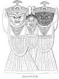

  
[Intangible Textual Heritage](../../index)  [Hinduism](../index) 
[Index](index)  [Previous](hmvp29)  [Next](hmvp31) 

------------------------------------------------------------------------

  
*Hindu Mythology, Vedic and Puranic*, by W.J. Wilkins, \[1900\], at
Intangible Textual Heritage

------------------------------------------------------------------------

##### JAGANNĀTH.

This deity is not reckoned as one of the Avatāras of Vishnu in the
Purānic lists. Tradition declares him to be, and common belief accepts
him as, an appearance of Vishnu himself, and not the incarnation of a
portion of his essence. There is, however, considerable reason

p. 249

for doubting whether originally Jagannāth—the Lord of the World—had any
connection with Vishnu. It is possible that he was the local divinity of
some now unknown tribe, whose worship was engrafted into Hinduism; and
the new god, when admitted into the Pantheon, was regarded as another
manifestation of Vishnu; or what is more probable, as Puri was a head
centre of Buddhism, when that system was placed under a ban and its
followers persecuted, the temple was

 
[  
Click to enlarge](img/24900.jpg)  
JAGANNĀTH.  

utilized for Hinduism, and Jagannāth, nominally a Hindu deity, was
really Buddhistic; the strange, unfinished image being nothing else than
a disguised form of the symbols of the central doctrine of the Buddhist
faith. Possibly, in order to be free from persecution, it was taught
that this was a form of Vishnu. There are several legends professing to
account for the form in which he is worshipped, and for the peculiar
sanctity of Puri, the chief place of his worship.

p. 250

\[paragraph continues\] There is a
peculiarity in, the phraseology employed by the people who visit his
shrine: they speak of going to see Jagannāth, not to worship him as is
the case with other gods; and it is the sight of the image in the
temple, or as it is being bathed, or drawn in its ponderous car, that is
so eagerly desired as a means by which sin in the worshipper is
destroyed.

Professor Goldstücker [\*](#fn_227) gives the
following legend from the Ain-i-Akbari, in which some of the ordinary
notions of the people respecting Jagannāth are described. A king
desirous of founding a city sent a learned Brāhman to select a proper
site. The Brāhman after a long search reached the seashore, and there
saw a crow diving into the water, which, having washed its body, made
obeisance to the sea. Understanding the language of birds, he learned
from the crow that if he remained there a short time, he would
comprehend the wonders of the land. The king, apprised of this
occurrence, built a large city and temple on the spot near where the
crow had appeared. One night the Rāja in a dream heard a voice saying to
him: "On a certain day cast thine eyes on the seashore, when there will
arise from the water a piece of wood 52 in. long and 18 in. broad: this
is the true form of the deity; take it up and keep it hidden in thine
house seven days, and in whatever shape it shall then appear, place it
in the temple and worship it." The Rāja acted upon the advice given in
his dream; and, when he had set up the image received from the sea,
called it Jagannāth, the Lord of the World, and it became the object of
worship of all ranks of people.

Ward [†](#fn_228) gives a somewhat fuller
account. When Krishna was accidentally shot by the hunter Jara, his

p. 251

bones were left to rot under the tree where he died, until some pious
person collected and placed them in a box. [\*](#fn_229) There they remained, until Indradhumna,
a king who was earnestly striving to propitiate Vishnu, was directed to
form an image, and place in it these bones, with the assurance that he
would afterwards obtain a rich reward for his religious deeds.
Indradhumna wishing to follow this advice, prayed to Visvakarma to
assist him by making the image. The architect of the gods consented to
do this, but was most careful in explaining to the king that if any one
looked at him, or in any way disturbed him whilst he was at work, he
would immediately desist, and leave the image in an unfinished state.
The king promised to observe this condition, and Visvakarma commenced
his work. In one night he raised a grand temple in the blue mountains of
Orissa, and then began to make the image. For fifteen days the king
managed, with difficulty, to restrain his impatience, but then foolishly
tried to see the god at work. The angry deity at once ceased, as he had
threatened, and the image was left with a most ugly face, and with- out
hands or feet. The king, exceedingly grieved as he saw the result of his
curiosity, went in his distress to Brahmā, who comforted him with the
promise that he would render the image famous in its present form. The
king invited the gods to be present at its inauguration.

p. 252

\[paragraph continues\] Several accepted
the invitation, Brahmā himself officiated as priest, and gave eyes and a
soul to the god. Thus the fame of Jagannāth was completely established.
The original image of this deity is closely copied in other places
besides Puri; and by his side there is generally an image of Krishna's
favourite brother Balarāma, and his sister Subhadrā.

The following is translated from a Bengali account of
Jagannāth:—Nārāyana (Vishnu) and his wife having taken up their abode in
the blue mountains of Orissa, where he was known by the name of
Nilmādhava, was visited by great numbers of gods and men, and the
neighbourhood obtained the name of Mokshyakhettra (the field of
emancipation from births). A king named Indradhumna, a son of the Sun, a
devout worshipper of Vishnu, being anxious to pay a visit to Nilmādhava,
before starting, sent Vidyapati, the brother of his family priest, to
learn the way to Orissa, that he might act as guide. On his return he
gave such an account of all he had seen, that the king was more anxious
to go than ever. Having made his arrangements, taking his family with
him, the king went under the guidance of Vidapati, but, on his arrival
there, was most grievously disappointed to learn that the god had
withdrawn himself from the public gaze. As he cried with sorrow and
vexation, a voice from the sky reached his ear: "As you cannot see
Nilmādhava, make a wooden image and worship that; Nārāyana will inhabit
it, and by the sight of the image you and others will obtain final
emancipation." The king followed this advice. As he was preparing to
make the image, Nārāyana himself, in the form of an old Brāhman named
Visvakarma, came and offered to form the image in fifteen days. The
offer was accepted, and within the specified time

p. 253

the image of Jagannāth, with those of his brother and sister, was made.

The peculiarity of the worship of Jagannāth is that his image is not
only worshipped in its proper temple but on three days of the year is
exposed to public view. On the first of these days, called the Snān
Jāttra (Bathing Festival), the idol is taken from its shrine, and on a
lofty platform, in sight of vast multitudes, bathed by the priests. This
exposure is supposed to be productive of a cold, so that, ten days
after, the Rath Jāttra (Car Festival) is held; at this time the image is
placed on an immense car made expressly for the purpose, and taken to
the temple of another god for a change of air. The car is drawn by the
excited crowd; the poorer and more ignorant people believing it to be a
meritorious act to assist in dragging it. After remaining for a few
days, the third festival (the Return) is held, at which, with somewhat
diminished fervour, the idol is dragged back to its home. Puri is the
place where it is believed the deity is seen with greater benefit to the
worshippers; but it is considered that there is considerable religious
merit obtained by seeing, and assisting to draw, his car in places
nearer home. Every town and almost every large village has its festival
of this god; and with the promise of so desirable a gift—salvation from
sin—it is not to be wondered at that there should be a great wish to see
him.

------------------------------------------------------------------------

### Footnotes

[250:\*](hmvp30.htm#fr_227) Chambers's
Cyclopædia, *s.v.*

[250:†](hmvp30.htm#fr_228) Vol. ii. 163.

[251:\*](hmvp30.htm#fr_229) What appears far
more likely is that some valued relics of Buddha were placed in the
image, but as it was dangerous at that time to avow any connection with
him and his worship, these relics were said to be the bones of Krishna.
To touch a dead body, according to Hinduism, is pollution; it seems,
therefore, altogether opposed to the spirit of Hinduism to enshrine a
bone in an image. Only by some such fiction could the relics of Buddha
be saved. There is much in the rites at Puri to countenance the idea
that though professedly Hindu it is really a Buddhist shrine.

------------------------------------------------------------------------

[Next: Chaitanya](hmvp31)
