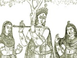

  
[Intangible Textual Heritage](../../index)  [Hinduism](../index.md) 
[Index](index)  [Previous](hmvp30)  [Next](hmvp32.md) 

------------------------------------------------------------------------

  
*Hindu Mythology, Vedic and Puranic*, by W.J. Wilkins, \[1900\], at
Intangible Textual Heritage

------------------------------------------------------------------------

##### CHAITANYA.

Chaitanya is believed by his followers to have been an incarnation of
Vishnu; and as he lived in historical times, about 300 years ago, it is
interesting to notice

p. 254

how a human being came to be regarded as divine. He is worshipped in
Nadiya in Bengal, and it is a singular fact, that, at his shrine, there
is a very small image of Krishna, of whom he was a disciple and apostle,
whilst the image of Chaitanya is large and conspicuous. The Hindus who
acknowledge this god say that, amongst the many incarnations of Vishnu,
four are most important. The first, in the Satya-yuga, called the
Suklavarna (the white), was Ananta; the second, in the Treta-yuga,
called the Raktavarna (the red), was that of Kapiladeva; the third, in
the Dwārpara-yuga, called the Krishnavarna (the black), was Krishna; and
the last, in the Kāli-yuga, called the Pitavarna (the yellow), was
Chaitanya.

The founder of the sect, of which Chaitanya was the most illustrious
member, was a Brāhman named Adaitya, who lived at Santipore in Bengal.
Another leader, named Nityananda, was born at Nadiya a short time before
Chaitanya. Chaitanya's father was a Brāhman, named Jagannāth Misra; his
mother's name was Suchi; their first son, Visvambhara, was a religious
mendicant. When their renowned son was born, his mother was rather old;
and as the child seemed weak, in accordance with a custom which
prevailed in those times, he was hung in a basket on a tree to die.
Adaitya happening to pass by the house at the time, imagining that the
child thus exposed might be the incarnation of deity he was expecting,
and which he had foretold, wrote with his foot on the soft earth the
incantation employed at the initiation of a disciple into the mysteries
of the worship of Krishna. The mother, impressed by this act, lifted the
child from the tree, who immediately took kindly to his food, which he
had before neglected, and showed signs of strength and vigour.

p. 255

Chaitanya made great progress in learning. At sixteen he married
Vishnupriyā, with whom he lived until he was forty-four years of age,
when he was persuaded by Adaitya and other mendicants to renounce his
*poitā* (Brāhmanical thread) and join them in their religious life. This
was to lose his high position as a Brāhman. Leaving home, parents and
wife, he removed to Benares, and many thought him guilty of a great
crime in forsaking a large family that was dependent upon him for
support. On his arrival at that city he began to teach the doctrines of
his sect and gathered many disciples. He called them
Vaishnavas—worshippers of Vishnu—and although his teaching was
diametrically opposed in many important matters to orthodox Hinduism he
was eminently successful. Many who had formerly chiefly worshipped Siva
and other deities, adopting his teaching, made Krishna the supreme. The
main tenets of his teaching were these: That men should renounce a
secular life, and spend their time in visiting shrines; that they
abandon the distinctions of caste, and eat freely with all who joined
their sect, whatever their caste might be; and that they honour the name
of Vishnu, and exercise *bhakti* (or trust) in that god as the means of
salvation. He allowed widows to remarry; forbade the eating of flesh and
fish, and the worshipping of those deities to whom animal sacrifices
were offered; and further, that his disciples should not hold fellowship
with those who offered such sacrifices. It is a curious coincidence that
about the same time that Luther was preaching salvation by faith, in
Europe, Chaitanya in India was giving prominence to the doctrine that
salvation was to be obtained through faith (*bhakti*) in Krishna.

From Benares Chaitanya went to Puri, the great

p. 256

shrine of Jagannāth, where he proclaimed his doctrines to the many
pilgrims he met there; and whilst there it is said that he obtained four
additional arms. Adaitya and Nityananda, who had induced him to assume
the position of leader, remained for some years in Benares doing similar
work; but though they afterwards returned to the secular state, their
descendants are greatly respected by the members of this sect. It is
reckoned that about one-fifth of the Hindus of Bengal are followers of
this teacher. Immoral women generally profess to be his disciples. By
their conduct they have excommunicated themselves from orthodox Hindu
society, and being outcasts cannot secure the proper performance of
their funeral rites. As members of this casteless sect these rites are
not refused them.

------------------------------------------------------------------------

[Next: Kamadeva](hmvp32.md)
