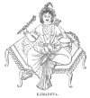
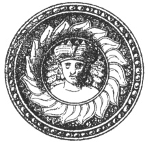

  
[Intangible Textual Heritage](../../index)  [Hinduism](../index.md) 
[Index](index)  [Previous](hmvp31)  [Next](hmvp33.md) 

------------------------------------------------------------------------

  
*Hindu Mythology, Vedic and Puranic*, by W.J. Wilkins, \[1900\], at
Intangible Textual Heritage

------------------------------------------------------------------------

##### KAMADEVA.

Kāmadeva, the Indian Cupid, is generally regarded as the son of Vishnu
and Lakshmi, under the forms of Krishna and Rukmini, but he is also
described in some places as a son of Brahmā. The latter account of his
origin arises probably from the following. In the "Rig-Veda," [\*](#fn_230.md) Kama is described as the first movement
that arose in the One, after it had come into life through the power of
fervour or abstraction. In the "Atharva-Veda," this Kama or desire, not
of sexual enjoyment, but of good in general, is celebrated as a great
power superior to all the gods, and is supplicated for deliverance from
enemies. According to one hymn in the "Rig-Veda," Kama is worshipped and
said to be unequalled by the gods; according to another, he is the god
of sexual love, like Eros of the Greeks, and Cupid of the Latins. In

p. 257

the latter aspect he is thus addressed: "May Kāma, having well directed
the arrow, which is winged with pain, barbed with longing, and has
desire for its shaft, pierce thee in the heart." It is in this character
that he appears in the Purānas.

Kama is known in Hindu mythology as a victim of Siva's anger. A demon
named Tāraka, having greatly distressed the gods, they wished to destroy
him. But only a son of Siva could accomplish this. In consequence of his
intense grief at the loss of his wife Sati, Siva had

 
[  
Click to enlarge](img/25700.jpg.md)  
KĀMADEVA.  

unfortunately become insensible to love. The gods therefore instigated
Kama to assist by wounding him with his arrows. At last he was
successful, just as Pārvati (Sati in a new form) was near, who at once
captivated the stricken deity. Angry with Kama for his presumption, he
caused a flame to issue from his third eye, which consumed the god who
had interrupted his devotions. In the "Vamana Purāna" [\*](#fn_231.md) is a lengthy account of the effect of
Kāma's arrows. The wounded

p. 258

god could find no rest. He threw himself in the Kalindi river, but "the
waters were dried up and changed into blackness; and ever since, its
dark stream, though holy, has flown through the forest like the string
that binds a maiden's hair." As he wandered about from place to place
seeking relief, the wives of the saints in the forest of Daruvanam
forsook their homes and followed him.

  [  
Click to enlarge](img/25800.jpg.md)  
SIVA SLAYING KĀMADEVA.  

This led their husbands to curse Siva, who, being enraged at the evil
Kama had done to him, consumed him.

The Bhāgavata [\*](#fn_232.md) continues the story
as follows:—Rati, the wife of Kāma, being almost mad with grief at the
loss of her husband, entreated Pārvati to intercede with Siva that he
might restore him to life. Pārvati encourages her by showing how her
wish will

p. 259

be gratified. " He will be born as the son of Sri Krishna, and his name
will be Pradyumna. A demon named Sambara will carry him off and cast him
into the sea. Having entered the body of a fish, he will re-appear in
the food of Sambara. Go, take up your abode in the house of Sambara, and
when your husband arrives, take him and bring him up; eventually he will
slay Sambara and will live happily with you." Acting on this advice,
Rati became a servant in the house of the demon.

From the "Vishnu Purāna" [\*](#fn_233.md) we
gather the completion of this story: When Pradyumna was but six days
old, he was stolen from the lying-in chamber by Sambara, terrible as
death; for the demon knew (having been told by the sage Nārada) that
Pradyumna, if he lived would be his destroyer. Sambara cast him into the
sea, the haunt of the huge creatures of the deep. A large fish swallowed
him, and he was born again from his body: for the fish was caught by
fishermen and by them delivered to the great asura, Sambara. His wife
Māyādevi (the Bhāgavata says, servant), the mistress of his household,
superintended the operations of the cooks, and, when the fish was cut
open, saw a beautiful child.

Whilst wondering who this could be, and how it came there, Nārada
appeared to satisfy her curiosity, and said to the graceful dame: "This
is the son of him by whom the whole world is created and destroyed; the
son of Vishnu, who was stolen by Sambara from the lying-in chamber, and
tossed by him into the sea, where he was swallowed by the fish. He is
now in thy power; do thou, beautiful woman, tenderly rear the jewel of
mankind." Thus counselled by Nārada, Māyādevi took charge of the boy,
and carefully reared him from childhood, being fascinated by the beauty
of his person. The

p. 260

affection became still more impassioned when he was decorated with the
bloom of adolescence. The gracefully-moving Māyādevi, then fixing her
heart and eyes upon the high-minded Pradyumna, gave him, whom she
regarded as herself, all her magic and illustrative arts.

"Observing these. marks of passionate affection, the son of Krishna said
to the lotus-eyed Māyādevi: 'Why do you indulge in feelings so
unbecoming the character of a mother? " To which she replied: 'Thou art
not a son of mine; thou art the son of Vishnu, whom Kāla Sambara carried
away and threw into the sea; thou wast swallowed by a fish, but wast
rescued by me from its belly. Thy fond mother is still weeping for
thee.' When the valiant Pradyumna heard this, he was filled with wrath,
and defied Sambara to battle. In the conflict the son of Mādhava slew
the hosts of Sambara. Seven times he foiled the delusions of the
enchanter, and, making himself master of the eighth, turned it against
Sambara and killed him. By the same faculty he ascended into the air,
and proceeded to his father's house, where he alighted, along with
Māyāvati, in the inner apartments. When the women beheld Pradyumna, they
thought it was Krishna himself. Rukmini, her eyes dimmed with tears,
spoke tenderly to him, and said: 'Happy is she who has a son like this,
in the bloom of youth. Such would be the age of my Pradyumna, if he were
alive. Who is the fortunate mother adorned by thee? And yet from thy
appearance, and from the affection I feel for thee, thou art assuredly
the son of Hari.'

"At this moment Krishna and Nārada arrived; and the latter said to
Rukmini: 'This is thine own son, who has come hither after killing
Sambara, by whom when an infant he was stolen. This is the virtuous
Māyāvati,

p. 261

his wife, and not the wife of Sambara. Hear the reason. When Manmatha
(Kāma), the deity of love, perished, the goddess of beauty, desirous to
secure his revival, assumed a delusive form, and by her charms
fascinated the demon Sambara, and exhibited herself to him in various
illusory enjoyments. This thy son is the descended Kama; and this is the
goddess Rati, his wife.'"

Kama is usually represented as a beautiful youth, holding in his hands a
bow and arrows of flowers. He travels about through the three worlds
accompanied by his wife Rati, the cuckoo, the humming-bee, spring
personified, and gentle breezes. Although in Bengal no images are made
to represent him, he is worshipped at the time of marriage, and
happiness in the married state, and offspring, are sought from him. Part
of the hymn referred to above from the "Atharva-Veda" is recited in the
Hindu marriage ritual.

Kama has many names indicative of the influence he is supposed to exert
amongst men. Amongst others may be mentioned:—

Madan, "He who intoxicates with love."

Manmatha, "He who agitates the mind."

Mara, "He who wounds."

Pradyumna, "He who conquers all."

Ananga, "He who is without a body."

Kushumesu, "He whose arrows are flowers."

 

------------------------------------------------------------------------

### Footnotes

[256:\*](hmvp32.htm#fr_230.md) Muir, O. S. T., v.
402.

[257:\*](hmvp32.htm#fr_231.md) Kennedy, "Hindu
Mythology."

[258:\*](hmvp32.htm#fr_232.md) Kennedy, "Hindu
Mythology."

[259:\*](hmvp32.htm#fr_233.md) Page 574.

------------------------------------------------------------------------

[Next: Chapter VI. Siva](hmvp33.md)
