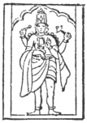

  
[Intangible Textual Heritage](../../index)  [Hinduism](../index.md) 
[Index](index)  [Previous](hmvp36)  [Next](hmvp38.md) 

------------------------------------------------------------------------

  
*Hindu Mythology, Vedic and Puranic*, by W.J. Wilkins, \[1900\], at
Intangible Textual Heritage

------------------------------------------------------------------------

p. 353

### CHAPTER X.

#### THE PURĀNIC DIVISIONS OF TIME.

The three main divisions of time employed
in the Hindu Scriptures are Yugas, Manvantaras, and Kalpas. [\*](#fn_312.md)
These will now be described.

There are four Yugas, which together extend to 12,000 *divine* years.
Their respective duration is as follows:—

|                  |         |               |
|------------------|---------|---------------|
| The Krita Yuga   | = 4,800 | divine years. |
| The Tretā Yuga   | = 3,600 | „ „           |
| The Dvāpara Yuga | = 2,400 | „ „           |
| The Kāli Yuga    | = 1,200 | „ „           |

"One year of mortals is equal to one day of the gods." As 360 is taken
as the number of days in the year—

|                  |               |     |           |                   |
|------------------|---------------|-----|-----------|-------------------|
| The Krita Yuga   | = 4,800 x 360 | =   | 1,728,000 | years of mortals. |
| The Tretā, Yuga  | = 3,600 x 360 | =   | 1,296,000 | „ „               |
| The Dvāpara Yuga | = 2,400 x 360 | =   | 864,000   | „ „               |
| The Kāli Yuga    | = 1,200 x 360 | =   | 432,000   | „ „               |

One Mahāyuga, or Great Age, including the four lesser Yugas, therefore,
being 12,000 divine years = 4,320,000 years of mortals. "A thousand such
Mahāyugas are a

p. 354

day of Brahmā," and his nights are of equal duration; a *Kalpa*,
therefore, or Day, of Brahmā extends over 4,320,000,000 ordinary years.
"Within each Kalpa 14 Manus reign; a Manvantara, or period of a Manu,
therefore, is consequently one-fourteenth part of a Kalpa, or day of
Brahmā.

"In the present Kalpa, six Manus, of whom Swyambhuva was the first, have
already passed away; the present being Vaivasata. In each Manvantara
(period of a Manu), seven Rishis, certain deities, an Indra and a Manu,
and the kings, his sons, are created and perish. A thousand systems of
the four Yugas occur coincidentally with these fourteen Manvantaras, and
consequently about 71 systems of four Yugas elapse during each
Manvantara, and measure the lives of the Manus and the deities of the
period. At the close of this day of Brahmā, a collapse of the universe
takes place, which lasts through a night of Brahmā, equal in duration to
his day, during which period the worlds are converted into one great
ocean, when the lotus-born god (Brahmā), expanded by his deglutition of
the universe, and contemplated by the Yogis and gods in Janaloka, sleeps
on the serpent Sesha. At the end of that night he awakes and creates
anew.

"A year of Brahmā is composed of the proper number of such days and
nights, and a hundred of such years constitute his whole life. The
period of his life is called *Para*, and the half of it *Parārddha*, or
the half of a *Para*. One Parārddha, or half of Brahmā's existence, has
now expired, terminating with the great Kalpa called the Padma Kalpa.
The now existing Kalpa, or day of Brahmā, called Varāha (or that of the
boar), is the first of the second Parārddha of Brahmā's existence. The
dissolution which occurs at the end of each Kalpa,

p. 355

or day of Brahmā, is called *naimittika*, incidental, occasional, or
contingent." [\*](#fn_313.md)

The dissolution of existing beings is of three kinds: "incidental,
elemental, and absolute." [†](#fn_314.md) The
first is *naimittika*, occasional, incidental, or Brāhmya, as occasioned
by the intervals of Brahmā's days; the destruction of creatures, though
not of the substance of the world, occurring during the night. The
second is the general resolution of the elements into their primitive
source, or Prakriti, the Prākritika destruction, and occurs at the end
of Brahmā's life. The third, the absolute, or final, Ālyantika, is
individual annihilation, Moksha, exemption for ever from future
existence.

The process of destruction is described as follows:—

"At the end of a thousand periods of four ages the earth is for the most
part exhausted. A total death then ensues, which lasts a hundred years,
and in consequence of the failure of food all beings become languid and
exanimate, and at last entirely perish. The eternal Vishnu then assumes
the character of Rudra, the destroyer, and descends to reunite all his
creatures with himself. He enters into the seven rays of the sun, drinks
up all the waters of the globe, and causes all moisture whatever, in
living bodies or in the soil, to evaporate, thus drying up the whole
earth. The seas, the rivers, the mountain-torrents, and springs are all
exhaled, and so are all the waters of Pātāla, the regions .below the
earth.

"Thus fed, through his intervention, with abundant moisture, the seven
solar rays dilate to seven suns, whose radiance glows above, below, and
on every side, and sets the three worlds and Pātāla on fire. The three
worlds, consumed by these suns, become rugged and deformed

p. 356

throughout the whole extent of their mountains, rivers, and seas; and
the earth, bare of verdure and destitute of moisture, alone remains,
resembling in appearance the back of a tortoise. The destroyer of all
things, Hari, in the form of Rudra, who is the flame of time, becomes
the scorching breath of the serpent Sesha, and thereby reduces Pātāla to
ashes. The great fire, when it has burnt all the divisions of Pātāla,
proceeds to the earth and consumes it also. A vast whirlpool of eddying
flame then spreads to the region of the atmosphere and the sphere of the
gods, and wraps them in ruin. The three spheres show like a frying-pan
amidst the surrounding flames, that prey upon all movable or stationary
things. The inhabitants of the two upper spheres, having discharged
their functions, and being annoyed by the heat, remove to the sphere
above, or Maharloka. When that becomes heated, its tenants, who after
the full period of their stay, are desirous of ascending to higher
regions, depart for the Janaloka." [\*](#fn_315.md)

The "Vāyu Purāna" [†](#fn_316.md) gives more
explicit teaching on this subject.

"Those sainted mortals who have diligently worshipped Vishnu and are
distinguished for piety, abide at the time of dissolution in Maharloka,
with the Pitris, the Manus, the seven Rishis, the various orders of
celestial spirits and the gods. These, when the heat of the flames that
destroy the world reaches to Maharloka, repair to Janaloka in their
subtle forms, destined to become re-embodied in similar capacities as
their former, when the world is renewed, at the beginning of the
succeeding Kalpa. This continues throughout the life of Brahmā; at the
expiration of his life all are destroyed; but those who have then
attained a residence in the Brahmaloka,

p. 357

by having identified themselves in spirit with the Supreme, are finally
resolved into the sole existing Brahma."

The "Vishnu Purāna" [\*](#fn_317.md) continues as
follows: "Janārddana, in the person of Rudra, having consumed the whole
world, breathes forth heavy clouds. Mighty in size, and loud in thunder,
they fill all space. Showering down torrents of water, these clouds
quench the dreadful fires which involve the three worlds, and then they
rain uninterruptedly for a hundred years and deluge the whole world.
Pouring down in drops as large as dice, these rains overspread the
earth, and fill the middle region and inundate heaven. The world is now
enveloped in darkness, and all things, animate and inanimate, having
perished, the clouds continue to pour down their waters for more than a
hundred years."

The four Yugas mentioned above—viz. the Krita, Tretā, Dvāpara, and
Kāli—have characteristic qualities. The Krita is the golden, and Kāli
the iron age. The Mahābhārata [†](#fn_318.md)
gives these characteristics very distinctly. Hanumān, the monkey-god, is
the speaker, describing the four ages to Bhīmasena, one of the Pandus.

"The Krita is that age in which righteousness is eternal. In the time of
that most excellent of Yugas (everything) had been done (*Krita*), and
nothing (remained) to be done. Duties did not then languish, nor did the
people decline. Afterwards through (the influence of) time, this Yuga
fell into a state of inferiority. In that age there were neither gods,
Dānavas, Gandharvas, Yākshasas, Rākshasas, nor Pannagas; no buying and
selling went on, no efforts were made by men; the fruit (of the earth
was obtained) by their mere wish; righteousness and abandonment of the
world (prevailed).

p. 358

\[paragraph continues\] No disease or
decline of the organs of sense arose through the influence of age; there
was no malice, weeping, pride, or deceit; no contention, no hatred,
cruelty, fear, affliction, jealousy, or envy. Hence the Supreme Brahma
was the transcendent resort of these Yogins. Then Nārāyana, the soul of
all beings, was white. In that age were born creatures devoted to their
duties. They were alike in the object of their trust, in observance, and
in their knowledge. At that period the castes, alike in their functions,
fulfilled their duties, were unceasingly devoted to one deity, and used
one formula (mantra), one rule, and one rite. They had but one Veda.

"Understand now the Tretā, in which sacrifice commenced, righteousness
decreased by a fourth, Vishnu became red; and men adhered to truth, and
were devoted to a righteousness dependent on ceremonies. Then sacrifices
prevailed, with holy arts and a variety of rites. In the Tretā men acted
with an object in view, seeking after reward for their rites and their
gifts, and no longer disposed to austerities, and to liberality from (a
simple feeling of) duty. In this age, however, they were devoted to
their own duties and to religious ceremonies.

"In the Dvāpara age righteousness was diminished by two quarters, Vishnu
became yellow, and the Veda fourfold. Some studied four Vedas, some
three, others two, and some none at all. The scriptures being thus
divided, ceremonies were celebrated in a great variety of ways; and the
people, being: occupied with austerity and the bestowal of gifts, became
full of passion (*rājasī*). Owing to ignorance of the one Veda, Vedas
were multiplied. And now from the decline of goodness (*Sattva*), few
only adhered to truth. When men had fallen away from goodness, many
diseases, desires, and calamities, caused by destiny, assailed them, by
which they were

p. 359

severely afflicted, and driven to, practise austerities. Others,
desiring enjoyments and heavenly bliss, offered sacrifices. Thus, when
they had reached the Dvāpara, men declined through unrighteousness.

"In the Kāli, righteousness remained to the extent of one-fourth only.
Arrived in that age of darkness, Vishnu became black; practices enjoined
by the Vedas, works of righteousness, and rites of sacrifices ceased.
Calamities, diseases, fatigue, faults, such as anger, etc., distresses,
anxiety, hunger, fear, prevailed. As the ages revolve, righteousness
again declines; when this takes place, the people also decline. When
they decay, the impulses which actuate them also decay. The practices
generated by this declension of the Yugas frustrate men's aims. Such is
the Kāli Yuga, which has existed for a short time. Those who are
long-lived act in conformity with the character of the age." In the
"Bhishmaparvan" there is a paragraph in which it is said that "Four
thousand years are specified as the duration of life in the Krita Yuga,
three thousand in the Tretā, and two thousand form the period at present
established on earth in the Dvāpara. There is no fixed measure in the
Tishya (Kali)." [\*](#fn_319.md)

It should be noticed that the immense duration of the ages as quoted
above from the "Vishnu Purāna" is peculiar to the Purānas. In the text
of the Mahābhārata "no mention is made of the years comprising the
different Yugas being *divine years*," [†](#fn_320.md) though the earlier books certainly
favour far more extravagant notions of chronology than those which
Western nations accept.

It is interesting to notice that in the account of the Krita Yuga, or
Age of Righteousness, it is said that the castes were alike in their
functions. This must evidently

p. 360

mean that the modern caste distinctions did not then exist, and that all
were devoted to the worship of one deity with one rule and one rite,
evidently pointing to the time when their forefathers were monotheists.
And in the judgment of the writer this happy condition was in the age of
which the prevailing characteristic was righteousness.

 

------------------------------------------------------------------------

### Footnotes

[353:\*](hmvp37.htm#fr_312.md) See "Vishnu
Purāna," book i. chap. iii., and book vi. chap. i.

[355:\*](hmvp37.htm#fr_313.md) Muir, O. S. T., i.
45.

[355:†](hmvp37.htm#fr_314.md) "Vishnu Purāna," p.
630, note.

[356:\*](hmvp37.htm#fr_315.md) "Vishnu Purāna," p.
631.

[356:†](hmvp37.htm#fr_316.md) Ibid., p. 632, note.

[357:\*](hmvp37.htm#fr_317.md) Page 633.

[357:†](hmvp37.htm#fr_318.md) Muir, O. S. T., i.
144.

[359:\*](hmvp37.htm#fr_319.md) Muir, O. S. T., i.
148.

[359:†](hmvp37.htm#fr_320.md) Ibid., i. 148.

------------------------------------------------------------------------

[Next: Chapter I. The Divine Rishis](hmvp38.md)
