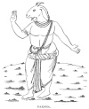
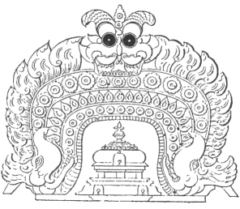

  
[Intangible Textual Heritage](../../index)  [Hinduism](../index.md) 
[Index](index)  [Previous](hmvp37)  [Next](hmvp39.md) 

------------------------------------------------------------------------

  
*Hindu Mythology, Vedic and Puranic*, by W.J. Wilkins, \[1900\], at
Intangible Textual Heritage

------------------------------------------------------------------------

p. 361

# PART III.

# THE INFERIOR DEITIES.

p. 362

  [  
Click to enlarge](img/36200.jpg.md)  
THE TULSI.  

p. 363

# THE INFERIOR DEITIES.

### CHAPTER I.

#### THE DIVINE RISHIS.

##### 1. BHRIGU.

"WHEN Brahmā wished to populate the world, he created mind-born sons,
like himself; viz. Bhrigu, Pulastya, Pulaha, Kratu, Angiras, Marichi,
Daksha, Atri, and Vasishtha: these are the nine Brahmās or Brahmārishis
celebrated in the Purānas." [\*](#fn_321.md)
Originally seven only were mentioned in the Mahābhārata; but the lists
found in different parts of that Epic do not agree with each other.
These seven are supposed to be visible in the Great Bear, as their wives
shine in the Pleiades. These Brahmārishis are also called Prajāpatis
(lords of offspring), Brahmāputras (sons of Brahmā), and Brāhmanas. The
"Vishnu Purāna" teaches that Bhrigu married his niece Khyāti, a daughter
of Daksha, who bore to him Sri or Lakshmi; but as it was the common
belief that she was one of the products of the churning of the ocean,
the reciter of the Purāna is asked to explain this discrepancy. The
substance of his answer was, that

p. 364

\[paragraph continues\] "of gods, animals,
and man, Hari is all that is called male, Lakshmi is all that is termed
female."

In his account of the creation, Manu mentions ten Maharishis as having
been created by himself, one of whom is Bhrigu, who in his turn created
seven other Manus, from whom all that is has sprung. [\*](#fn_322.md) The Mahābhārata says: "Six great Rishis
are known as the mind-born sons of Brahmā;" but Bhrigu is not named
amongst them. In another passage it describes him as a son of Varuna,
but Brahmā is there identified with Varuna. At a sacrifice at which
Brahmā officiated, a portion of Varuna was thrown into the sacrificial
fire, whence there arose three men endowed with bodies. Bhrigu sprang
first from *bhrik* (the blazing of the fire), Angiras from the cinders,
and Kavi from a heap of ashes. The god called Mahādeva, Varuna, and
Pavana, claimed these three as his own. Agni and Brahmā also claimed
them. [†](#fn_323.md) It was agreed that Bhrigu
was Varuna's son. Agni received Angiras, and Brahmā took Kavi. In
another part of that poem it is said, "We have heard that the great and
venerable Rishi Bhrigu was produced by Brahmā from fire at the sacrifice
of Varuna." [‡](#fn_324.md) The "Bhāgavata Purāna"
says that "he sprang from the skin of the Creator;" and the Mahābhārata,
in another verse, declares that "the venerable Bhrigu, having split
Brahmā's heart, issued forth."

At the great sacrifice of Daksha, to which Siva was not invited, Bhrigu
officiated as priest; and because he reviled that god and his followers,
and justified Daksha in slighting him, he suffered the loss of his
beard.

The Mahābhārata gives a legend of Bhrigu cursing Indra. The Indra of
that age, named Nahusha, being

p. 365

filled with pride, lost the benefit of his previous good works, and in
his presumption caused the Rishis to carry him about. When it came to
Agastya's turn to carry him, Bhrigu said to him, "Why do we submit to
the insults of this wicked king of the gods?" Agastya replied that none
of the Rishis had cursed Nahusha, because he had received as a boon the
power to subject to his service any on whom he fixed his eye; but that
at the same time he was quite ready to act upon any suggestion Bhrigu
might make. Bhrigu then told him that he had been sent by Brahmā to take
vengeance on Nahusha, who would that very day attach Agastya to his car
and kick him; but incensed at this insult, he (Bhrigu) would by a curse
condemn the oppressor to become a serpent.

The mighty Nahusha summoned Agastya from the banks of the Sarasvati to
carry him. The glorious Bhrigu then said to Maitrāvarum (Agastya),
"Close thy eyes, whilst I enter into the knot of thy hair!" With the
view of overthrowing the king, Bhrigu hid himself in the hair of
Agastya, who then stood motionless as a stock. Nahusha came to Agastya,
when the sage desired to be attached to the vehicle, and agreed to carry
the king of the gods wherever he pleased. Nahusha attached him, but
Bhrigu did not venture to look at him, knowing his power of subduing by
a glance. Agastya kept his temper; even when urged by a goad, he
remained unmoved. The king at last kicked him; then Bhrigu, invisible in
the hair of Agastya, became enraged, and violently cursed him: "Since,
fool, thou hast in thine anger smitten the great Muni on the head with
thy foot, therefore become a serpent, and fall swiftly to the
earth." [\*](#fn_325.md) Thus cursed, Nahusha fell
to

p. 366

the earth; had the sage been seen by Indra, he would have been unable to
punish the oppressor.

Bhrigu on another occasion cursed Agni. The Mahābhārata says:—A woman
named Pulomā was betrothed to a demon; Bhrigu, seeing her beauty,
married her according to Vedic rites, and carried her off secretly. The
demon, by the aid of Agni, discovered the bride's hiding-place, and took
her away to his home. For rendering the demon this assistance, Bhrigu,
cursing Agni, said, "From this day, you shall eat everything." Agni
asked Bhrigu why he had cursed him, seeing that by speaking the truth he
had simply done his duty; and reminded him that "when a person is asked
a question, and intentionally speaks what is false, he, with seven
preceding and seven succeeding generations, is cast into hell; and that
he who withholds information is equally guilty." He goes on to say, "I,
too, can curse, but respecting Brāhmans restrain my anger. I am really
the mouth of the gods and ancestors. When ghī is offered to them, they
partake of it through me as their mouth; how then can I be said to eat
everything?" Bhrigu hearing this consented to modify his curse, by
saying that, "as the Sun by his light and heat purifies all nature, so
Agni should purify all that passed through him."

Bhrigu is said to have performed a most wonderful deed; the transforming
of a Kshattriya king into a Brāhman. The Mahābhārata [\*](#fn_326.md) gives the following account of this
unique work:—"Divodāsa, King of Kāsi (Benares), was attacked by the sons
of Vitāhavya, and all his family slain in battle. The afflicted monarch
therefore resorted to the sage Bharadvāja, who performed for him a
sacrifice, in consequence of which a son named

p. 367

\[paragraph continues\] Pratardana was
born to him. Pratardana, becoming an accomplished warrior, was sent by
his father to take vengeance on the Vitāhavyas. Vitāhavya had now to fly
to another sage, Bhrigu, who promised his protection. The avenger
Pratardana, however, followed, and demanded that the refugee should be
given up. Bhrigu, the most eminent of religious men, filled with
compassion, said, 'There is no Kshattriya here; all these are Brāhmans.'
Hearing this true assertion of Bhrigu, Pratardana was glad, and, gently
touching the sage's feet, rejoined, 'Even thus, O glorious saint, I have
gained my object, for I have compelled this king to relinquish his
caste.' This Vitāhavya, by the mere word of Bhrigu, became a Brāhman
Rishi, and an utterer of the Vedas."

The names of nineteen Bhrigus are given in the "Matsya Purāna," who are
said to be composers of hymns; Bhrigu himself being one of the narrators
of the Mahābhārata. Professor Roth [\*](#fn_327.md) speaks of the Bhrigus as a class of
mythological beings, who belonged to the aërial or middle class of gods.
They were the discoverers of fire, and then brought it to men. He adds
that the race has a connection with history, as one of the chief
Brāhmanical families bears the name, and allusions are made to the fact
in the hymns of the Rig-Veda.

In the Rāmāyana there are not many references to Bhrigu; he is there
called a Maharishi; and Rāma is induced to slay a female demon by the
remembrance that Vishnu slew Brigu's wife when she aspired to Indra's
throne. He is the saint whom the childless wives of Sāgar worshipped in
order to obtain a son; and he gave to one lady one, to the other sixty
thousand. Parasurāma was one of his most illustrious descendants.

p. 368

##### 2. PULASTYA.

Pulastya, another of Brahmā's mind-born sons, is reverenced because it
was through him that the Purānas were made known to men. The reason of
his being regarded as the Revealer of Scripture is taught in the "Vishnu
Purāna," [\*](#fn_328.md) where the narrator
Parāsara, in answer to a question of his disciple Maitreya, says: "You
recall to my mind what was of old narrated by my father's father,
Vasishtha. I had heard that my father had been devoured by a Rākshas,
employed by Visvamitra: violent anger seized me, and I commenced a
sacrifice for the destruction of the Rākshasas; hundreds of them were
reduced to ashes by the rite, when, as they were about to be entirely
extirpated, my grandfather Vasishtha thus spake to me: 'Enough, my
child; let thy wrath be appeased; the Rākshasas are not culpable: thy
father's death was the work of destiny.'"

Parāsara ceased from his sacrifice, and his grandfather was pleased;
then Pulastya coming said to him: "Since, in the violence of animosity,
you have listened to the words of your progenitor, and exercised
clemency, you shall become learned in every science. Since you have
forborne, even though incensed, to destroy my posterity, I will bestow
on you another boon; you shall become the author of a summary of the
Purānas, shall know the true nature of the deities, and your
understanding through my favour shall be perfect and free from doubts."
Parāsara relates the Purāna as told him formerly "by Vasishtha and the
wise Pulastya."

Pulastya married Prithi, a daughter of Daksha, by whom he had a son, the
sage Agastya; the Bhāgavata

p. 369

calls his wife Havisbhu, whose sons were Agastya and Visravas, the
father of Kuvera, Rāvana, and other Rākshasas.

The reason of Parāsara's attack upon the Rākshasas is given in a legend
in the Mahābhārata. King Kalmāshapada, meeting with Sakti (Parāsara's
father) in a narrow path in a forest, wished him to get out of his way.
This the sage refused to do; whereupon the king thrashed him with his
whip; in return Sakti cursed him, and he became a cannibal Rākshas. When
in this form, the king killed and ate Sakti and all the other sons of
Vasishtha. Sakti's wife being pregnant at the time of his death,
Parāsara was born soon after and brought up with his grandfather. When
he grew up, he commenced the slaughter of the Rākshasas, but was
restrained by Vasishtha, Pulastya, and others.

##### 3. PULAHA.

This Rishi does not figure largely in Hindu mythology. He married a
daughter of Daksha named Kshamā (Patience), by whom he had three sons.

##### 4. KRATU.

Kratu is no more widely known than Pulaha. He married Sannati
(Humility), another daughter of Daksha, by whom he had "sixty thousand
Bālakhilyas, pigmy sages no bigger than the joint of the thumb; chaste,
pious, and resplendent as the rays of the sun." [\*](#fn_329.md)

##### 5. ANGIRAS.

Angiras is famed as the author of several hymns of Rig-Veda. He first
married Smriti (Memory), by

p. 370

whom he had four daughters, and afterwards he married Swaddha (Oblation)
and Sati, also Daksha's daughters. His so-called daughters, the
Pratyangirasa Bichas, are thirty-five verses addressed to presiding
divinities. There is some ambiguity in the use of his name; it comes
from the same root as Agni, of which deity it is used as an epithet; it
is also used of Agni's father, and is the name of a son of Agneya,
Agni's daughter. Angiras is supposed to have been associated with Bhrigu
in introducing fire-worship into India.

##### 6. MARICHI.

Marichi is better known through his descendants than from any work of
his own, his most illustrious child being Kasyapa, as a son of whom
Vishnu came, in his incarnation as a dwarf. Amongst Kasyapa's thirteen
wives were Diti and Aditi, who by him became the mothers of gods. "There
were twelve celebrated deities in a former age called Tushitas, who, on
the approach of the present period, or during the reign of the last Manu
Chakshusa, said amongst themselves, 'Come, let us quickly enter into the
womb of Aditi, that we may be born in the next Manvantara, for thereby
we shall again enjoy the rank of gods. Accordingly they were born the
sons of Kasyapa, the son of Marichi by Aditi; thence named the twelve
Ādityas, whose names were Vishnu, Sakra, Aryaman, Dhuti, Tvastri,
Pushan, Vivasvat, Savitri, Mitra, Varuna, Ansa, and Bhaga." [\*](#fn_330.md)

An explanation of the fact that gods undergo successive births is found
in the "Vāyu Purāna." In the beginning of the Kalpa, twelve gods, named
Jayas, were created by Brahmā as his deputies and assistants in

p. 371

creation. They, lost in meditation, neglected his commands, on which he
declared that they should be reborn in each Manvantara until the
seventh. [\*](#fn_331.md) The writer of the
"Vishnu Purāna" tries to explain this fact: "These classes of divinities
are born again at the end of a thousand ages according to their own
pleasure, and their appearance and disappearance are spoken of as a
birth and death; but they exist age after age in the same manner as the
sun sets and rises again."

By his wife Diti, Kasyapa had two sons, Hiranyakasipu and Hiranyāksha,
whom Vishnu, here said to be the son of her sister Aditi; became
incarnate to destroy; these mortal enemies were therefore cousins.

##### 7. ATRI.

Atri was the author of many Vedic hymns, especially those "praising
Agni, Indra, the Asvins, and the Viswadevas." He married Anasūyā, who
bore him Durvāsas, the sage who was slighted by Indra. Soma, the moon,
is said to proceed from the eyes of his father Atri.

When this sage and his wife were old, they received a visit at their
hermitage from Rāma, Sita, and Lakshman, who were then wandering from
place to place—

"He came to Atri's pure retreat,  
 Paid reverence to his holy feet,  
 And from the saint such welcome won  
 As a fond father gives his son." [†](#fn_332.md)

Atri, in introducing his wife to his illustrious guests, thus describes
her—

"Ten thousand years this votaress, bent  
 On sternest rites of penance, spent;

p. 372

\[paragraph
continues\]  She, when the clouds withheld their rain,  
 And drought ten years consumed the plain,  
 Caused grateful roots and fruits to grow  
 And ordered Gangā here to flow;  
 So from their cares the saints she freed,  
 Nor let these checks their rites impede.  
 She wrought in heaven's behalf, and made  
 Ten nights of one, the gods to aid." [\*](#fn_333.md)

Anasūyā then joins with her husband in welcoming the exiles to their
hermitage, and, delighted with the princess, tells her to ask a boon.
As, however, Sitā appeared to want nothing particular, the aged saint
said—

                  "My gift to-day  
 Thy sweet contentment shall repay:  
 Accept this precious robe to wear,  
 Of heavenly fabric, rich and rare;  
 These gems thy limbs to ornament,  
 This precious balsam sweet of scent.  
 O Maithil dame! this gift of mine  
 Shall make thy limbs with beauty shine,  
 And, breathing o’er thy frame, dispense  
 Its pure and lasting influence.  
 This balsam, on thy fair limbs spread,  
 New radiance on thy lord shall shed,  
 As Lakshmi's beauty lends a grace  
 To Vishnu's own celestial face." [†](#fn_334.md)

##### 8. DAKSHA.

Daksha, the father of Umā, the consort of Siva, has attained
pre-eminence amongst his brethren largely through the greatness of his
son-in-law. He, too, is a mind-born son of Brahmā; or, according to
other accounts, sprang from the thumb of his father. He is

p. 373

one of the chief Prajāpatis. Before speaking of Daksha, as the term
Prajāpati is of frequent occurrence, it will not be out of place here to
describe the position of these beings.

The term Prajāpati means a lord of creatures; the Prajāpatis, therefore,
are regarded as the progenitors of mankind. The word is used in much the
same manner

 
[  
Click to enlarge](img/37300.jpg.md)  
DAKSHA.  

as Patriarch in the Christian Scriptures. Sometimes Brahmā alone is
intended by the term Prajāpati; he is *the* "lord of creatures;"
sometimes it is employed for the first-formed men from whom the human
race sprang. The word was originally employed as an epithet of Savitri
and Soma, as well as of Hiranyāgarbha, or Brahmā. It afterwards,
however, came to denote a separate deity, who appears in three places in
the

p. 374

\[paragraph continues\] Rig-Veda.
Prajāpati is sometimes identified with the universe, and described (in
the same way as Brahma, or entity, or non-entity in other places) as
having alone existed in the beginning, as the source out of which
creation was evolved: "*e.g.* Prajāpati was this universe; Vach was a
second to him. She became pregnant, she departed from him, she produced
these creatures. She again entered into Prajāpati." [\*](#fn_335.md) At the same time he is "sometimes
described as a secondary or subordinate deity, and treated as one of
thirty-three deities."

By the time Manu wrote, creation had come to be regarded as the special
work of Brahmā, hence the term Prajāpati is applied to him in the
Dharmasastra, and in the later writings it is given to those who sprang
from him, and carried on his work of populating the world.

The Mahābhārata [†](#fn_336.md) gives two distinct
accounts of the origin of Daksha:—"Daksha, the glorious Rishi, tranquil
in spirit, and great in austere fervour, sprang from the right thumb of
Brahmā. From the left thumb sprang the great Muni's wife, by whom he
begot fifty daughters." "Born with all splendour, like that of the great
Rishis, the ten sons of Prachetas (another Prajāpati) are reputed to
have been virtuous and holy, and by them the glorious beings (trees,
plants, etc.), were formerly burnt up by fire springing from their
mouth. From them was born Daksha Prāchetasa; and from Daksha, the parent
of the world, (were produced) these creatures. Cohabiting with Virini,
the Muni Daksha begat a thousand sons like himself, famous for their
religious observances." In the Harivansa, Vishnu is identified with
Daksha. At the end of a thousand Yugas the Brāhmans of a previous age,
"perfect in knowledge and contemplation, became involved in the

p. 375

dissolution of the world. Then. Vishnu, sprung from Brahma, removed
beyond the sphere of sense, absorbed in contemplation, became the
Prajāpati Daksha, and formed numerous creatures." [\*](#fn_337.md)

Fuller particulars of Daksha's origin we find in the "Vishnu
Purāna." [†](#fn_338.md) "From Brahmā, continuing
to meditate, were born mind-engendered progeny, with forms and faculties
derived from his corporeal nature, embodied spirits produced from the
person of that all-wise deity. But as they did not multiply themselves,
Brahmā created other mind-born sons like himself, viz. Bhrigu, etc.
Considerable variety prevails in this list of Prajāpatis, but the
variations are of the nature of additions made to an apparently original
enumeration of but seven, whose names generally occur. The names
mentioned in all the Purānas make up altogether seventeen. The simple
statement that the first Prajāpatis sprang from the mind or will of
Brahmā has not contented the depraved taste of the mystics, and in some
of the Purānas, as the Bhāgavata, Vāyu and Linga, they are said to be
derived from the body of their progenitor; Bhrigu from his skin, Marichi
from his mind, Atri from his eyes, Angiras from his mouth, Pulastya from
his ear, Pulaha from his navel, Kratu from his hand, Vasishtha from his
breath, Daksha from his thumb, and Nārada from his lips. They do not
exactly agree, however, in the \[description of the places\] whence
these beings proceed." [‡](#fn_339.md)

The "Vishnu Purāna" [§](#fn_340.md) also speaks of
Daksha as a son of the Prāchetasas, and gets over the difficulty by the
statement that he was born first as a son of Brahmā, and afterwards as
the son of the Prāchetasas. These

p. 376

progenitors of Daksha were the sons of a mighty patriarch named
Prachinaverhis, so called "from his placing upon the earth the sacred
grass pointing to the East." At the termination of a season of rigid
penance, he married Savarnā, the daughter of the ocean, who had by him
ten sons, styled Prāchetasas, who were skilled in military science;
"they all observed the same duties, practised religious austerities, and
remained immersed in the bed of the sea for ten thousand years." The
reason for this prolonged penance was the fact that their father had
been enjoined by Brahmā to increase the human family. In harmony with
his promise of obedience, he told his sons that the performance of
severe penance was the best way of fulfilling Brahmā's order; "for
whoever worships Vishnu, the bestower of good, attains undoubtedly the
object of his desires: there is no other mode."

As the sons were immersed in the ocean, intent on the worship of Vishnu,
that deity appeared to them, and, hearing their request, said, "Receive
the boon you have desired; for I, the giver of good, am content with
you." Whilst the Prāchetasas were absorbed in their devotions, "the
trees grew and overshadowed the unprotected earth, the people perished,
the winds could not blow, the sky was shut out from view by the boughs,
and mankind unable to labour for ten thousand years. When the sages saw
this, wind (which tore up the trees) and flames (which then consumed
them) issued from their mouths, and the forests were soon cleared away.
Soma, the sovereign of the vegetable world, seeing nearly all the trees
destroyed, went to the patriarchs and said, Restrain your indignation,
and listen to me. I will make an alliance between you and the trees.
Prescient of futurity, I have nourished this maiden, the daughter

p. 377

of the woods. She is called Mārishā, and, as your bride, she shall be
the multiplier of the race of Druva. From a portion of your and my
lustre the patriarch Daksha shall be born, who, endowed with a part of
me and composed of your vigour, shall be resplendent as fire, and shall
multiply the human race.'"

Soma then informs the brothers respecting Mārishā's origin. "There was
formerly a sage named Kandu, eminent in wisdom and austerity, on the
banks of the Gomati. Indra sent the nymph Pramlochā to divert the sage
from his devotions: they lived together for 150 years, during which time
the Muni was given up to pleasure. The nymph at the close of this period
asked leave to depart, but the Muni entreated her to continue with him.
And though at the end of several centuries she preferred the same
request, again and again she was asked to remain.

"On one occasion, as the sage was going forth from their cottage in a
great hurry, the nymph asked where he was going. 'The day,' he replied,
'is drawing fast to a close. I must perform the Sandhya worship, or a
duty will be neglected.' The nymph smiled mirthfully as she rejoined,
'Why do you talk, grave sir, of this day drawing to a close; your day is
a day of many years, a day that must be a marvel to all: explain what
this means.' The Muni said, 'Fair maiden, you came to the river-side at
dawn. I beheld you then, and you entered the hermitage. It is now the
revolution of evening, and the day is gone. What is the meaning of this
laughter? Tell me the truth.' Pramlochā answered, 'You say rightly,
venerable Brāhman, that I carne hither at morning dawn, but several
hundred years have passed since the time of my arrival. This is the
truth.'" She informed him that they had lived

p. 378

together nine hundred and seven years, six months, and three days. The
Muni sees now that the nymph must have been sent by Indra purposely to
interrupt his devotions, and deprive him of the divine knowledge he had
desired. And though very angry with her at first, he bids her depart in
peace, as he says, "The sin is wholly mine."

"Thus addressed by the Muni, Pramlochā stood trembling, whilst big drops
of perspiration started from every pore, till he angrily cried to her,
'Begone, begone!' She then, reproached by him, went forth from his
dwelling, and, passing through the air, wiped the perspiration from her
person with the leaves of the trees. The nymph went from tree to tree,
and as with dusky shoots that crowned their summits she dried her limbs,
which were covered with moisture, the child she had conceived by the
Rishi came forth from the pores of her skin in drops of perspiration.
The trees received the living dews, and the winds collected them into
one mass. 'This,' said Soma, 'I matured by my rays, and gradually it
increased in size, till the exhalation that had rested on the tree-tops
became the lovely girl named Mārishā. The trees will give her to you,
Prāchetasas; let your indignation be appeased. She is the progeny of
Kandu, the child of Pramlochā, the nursling of the trees, the daughter
of the wind and moon.'"

Soma then informs the Prāchetasas that Mārishā, in her previous birth,
was the widow of a prince, but left childless. She therefore earnestly
worshipped Vishnu, who told her to desire some boon. She replied, "I
pray thee that in succeeding births I may have honourable husbands, and
a son equal to a patriarch among men, . . . . and may I be born out of
the ordinary course." Vishnu promised her: "In another life you

p. 379

shall have ten husbands of mighty prowess, and renowned for glorious
acts; and you shall have a son magnanimous and valiant, distinguished by
the rank of a patriarch, from whom the various races of men shall
multiply, and by whose posterity the universe shall be filled. You,
virtuous lady, shall be of marvellous birth, and delighting the hearts
of men." Thus having spoken, the deity disappeared, and Soma informs his
hearers that it was this princess who was born as Mārishā.

"Soma having concluded, the Prāchetasas took Mārishā, as he had enjoined
them, righteously to wife, [relinquishing](errata.htm#1.md) their
indignation against the trees, and upon her they begot the eminent
patriarch Daksha, who had (in a former life) been born as the son of
Brahmā. This great sage, for the furtherance of creation and the
increase of mankind, created progeny. Obeying the command of Brahmā, he
made movable and immovable things, the bipeds and quadrupeds, and
subsequently by his will gave birth to females, ten of whom he bestowed
on Dharma, thirteen on Kasyapa, and twenty-seven, who regulate the
course of time, on Soma (the moon). Of these the gods, the Titans, the
snake gods, cattle and birds, the singers and dancers of the courts of
heaven, the spirits of evil and other beings, were born. From that
period forward living creatures were engendered in an ordinary manner;
before the time of Daksha, they were variously propagated by the will,
by sight, by touch, and by the influence of religious austerities by
devout sages and holy saints."

Daksha's first attempts at populating the world were unsuccessful. A
thousand sons were born to him by Asikni, but these were induced by
Nārada not to propagate offspring. A thousand other sons by the same
wife were

p. 380

born, who also were advised by Nārada not to be troubled with children.
The Prajāpati, incensed, cursed Nārada, and proceeded to create sixty
daughters by Asikni, whom he gave to various husbands, by whom they had
children. At length, when a time of peace and prosperity prevailed on
the earth, and the gods had their proper places assigned to them, to
Daksha was given the position as chief of the Prajāpatis—progenitors of
mankind.

In the account of Siva it was noticed that as a punishment for the
insults Daksha had offered to his illustrious son-in-law, the great god
changed his head for that of a goat; a perpetual sign of his ignorance
and stupidity.

##### 9. VASISHTHA.

Vasishtha, together with Pulastya, is said to have narrated the "Vishnu
Purāna," and he, too, is believed to have been the writer of many of the
Vedic hymns. It was he who allayed the anger of Parāsara when that sage
was about to extirpate the Rākshas race, because one of their kings had
slain his father. He is said to have been the Vyāsa, or arranger of the
Vedas, in the Dvāpara Age; this work of arranging having a different
agent in each age.

Vasishtha served as the family priest of several kings. One of these,
named Saudāsa, when out hunting, seeing a couple of tigers, shot one of
them with an arrow. It happened that these tigers were really Rākshasas,
for, as the one shot by Saudāsa was dying, it assumed a fiendish shape;
the other, threatening vengeance, disappeared. Not long after this, as
the king was engaged in a sacrifice, Vasishtha being out of the room,
the Rākshas who escaped, assuming the form of Vasishtha,

p. 381

came to the king and said, "Now that the sacrifice is ended, give me
something to eat.; let it be cooked, and I will presently return." The
Rākshas next transformed himself into the cook, and, having prepared a
dish of human flesh, brought it to the king. When the real Muni entered,
the king offered him the dish; but he discovered, by the force of
meditation, that it was human flesh that was presented to him. Indignant
at the insult, cursing the king, he said, "Your appetite shall be
excited by similar food to that now offered me." The king was astonished
at this outburst of anger, and Vasishtha, seeing this, by further
meditation, discovered the whole trick; but as he could not entirely
recall the effects of his curse, he modified it so that it was to work
for twelve years only. [\*](#fn_341.md) It was
this same king who was cursed by Vasishtha's son Sakti to become a
Rākshas, and who, in that state, devoured the sage that cursed him.

Vasishtha also cursed a king named Nimi. As the king was about to
commence a sacrifice that was to continue for a thousand years, he asked
Vasishtha to officiate as priest; but the Muni being engaged in a
similar work for Indra, he could not do so for the next five hundred
years. The king proceeded with his sacrifice, engaging Gautama as
priest. As soon as his engagement was over with Indra, the sage, coming
to conduct Nimi's sacrifice, found another priest had been appointed. He
was so angry that, cursing the king, he declared that he should cease to
exist in a bodily form. On learning what was done, the king in return
pronounced a similar curse upon the sage. Both took effect; but as
Vasishtha's spirit became united to the spirits of Mitra and Varuna,
when these deities were smitten with the beauty of the nymph Urvasi, the

p. 382

spirit of the sage fell from them, and he became again incorporated
through her. [\*](#fn_342.md) A verse in the
Rig-Veda ascribes Vasishtha's birth to Mitra and Varuna, in harmony with
the legend just quoted: "Thou, O Vasishtha, art a son of Mitra and
Varuna, born a Brāhman from the soul of Urvasi. All the gods placed in
the vessel thee—the drop which had fallen through divine contemplation."

There are several stories of quarrels between this sage and Visvamitra,
who was anxious to obtain the position of priest to Saudāsa, which was
held by Vasishtha. At another time, when he was priest to Harischandra,
he was so greatly incensed at the treatment the king had received at
Visvamitra's hands that he cursed him, and he became a crane. His rival
returned the compliment, and he too became a bird. In this form the
sages fought so violently that it was necessary for Brahmā to pacify
them. The real cause of all this unpleasantness was the fact that
Visvamitra was a Kshattriya by birth, who, by penance and various rites,
had obtained admission into the Brāhmanical caste. Previous to his
exaltation he was a king. Being desirous of obtaining a wonderful cow
that belonged to Vasishtha, which had the power to grant whatever her
owner desired, as he could not overcome the Brāhmans, owing to their
superhuman power, he first sought to raise himself to equality with
them, and at length his efforts were crowned with success.

##### 10. NĀRADA.

Nārada's name is not found in the list of Brahmā's sons in the "Vishnu
Purāna," yet he is generally regarded

p. 383

as one, though, according to some authorities, he had a different
origin. He is the messenger of the gods, and is often described as
imparting information that was only known to them. It was he who
persuaded the sons of Daksha not to beget offspring, and who was cursed
for his interference; it was he who informed Kansa of the approaching
birth of Krishna, which led that king to slay the children of Vasudeva:
hence his common name is Kalikāraka, the strife-maker, and in modern
plays he is introduced as a spy and marplot. The name Nārada is
frequently employed as a term of abuse. It is used to describe a
quarrelsome, meddling person.

"A distinguished son of Brahmā, named Nārada, whose actions are the
subject of a Purāna, bears a strong resemblance to Hermes or Mercury. He
was a wise legislator, great in arts and arms, an eloquent messenger of
the gods, either to one another or to favoured mortals, and a musician
of exquisite skill. His inventing the *vina*, or Indian lute, is thus
described in the poem entitled 'Māgha:' 'Nārada sat watching from time
to time his large *vina*, which, by the impulse of the breeze, yielded
notes that pierced successively the regions of his ear, and proceeded by
musical intervals.' The Law Tract, supposed to have been revealed by
Nārada, is at this hour cited by Pundits, and we cannot therefore
believe him to have been the patron of thieves, though an innocent theft
of Krishna's cattle, by way of putting his divinity to the test, he
strangely imputed, in the Bhāgavata Purāna,' to his father
Brahmā." [\*](#fn_343.md)

The accounts of Nārada's origin vary considerably. According to the
Bhāgavata, he was the third incarnation of Vishnu. Manu declares that he
was one of the Maharishis whom he created at the beginning of the

p. 384

age. Moor [\*](#fn_344.md) quotes as . follows:
"Brahmā said, 'Rise up, Rudra, and form man to govern the world.' Rudra
obeyed; but the men he made were fiercer than tigers, having nothing but
the destructive quality in their composition. Anger was their only
passion. Brahmā, Vishnu, and Rudra then joined their different powers,
and created ten men whose names were Nārada," etc. The "Siva Purāna"
teaches that Nārada sprang from the thigh of his father: "Brahmā, in
view of peopling the world, produced four beings, who, being refractory,
caused their parent to weep. To comfort him, Siva, in the character of
Rudra, issued from a fold in his forehead, with five heads and ten arms,
and, endowing Brahmā with additional might, he (Brahmā) produced Bhrigu
and the seven Rishis, and after that Nārada from his thigh." [†](#fn_345.md)

In another birth Nārada was the son of Kasyapa [‡](#fn_346.md) and a daughter of Daksha. Daksha was
greatly incensed when he dissuaded the Prajāpati's sons from peopling
the world, and declared that he should not have a resting-place; hence
his wandering nature.

On one occasion Nārada was cursed by his own father, and he in return
cursed Brahmā. "Brahmā exhorted his son Nārada to take a wife, and
assist in peopling the world. Nārada, who was a votary of Krishna,
becomes angry, affirms that devotion to that god is the sole way to
attain felicity, and denounces his father as an erring instructor.
Brahmā, in reply, curses Nārada, and dooms him to a life of sensuality,
and subjection to women. Nārada pays back the imprecation as follows:
'Wretch! become no object of adoration: how shall any

p. 385

one be devoted to the forms of thy worship? Thou shalt without doubt
lust after her who is no fit object of thy desires!' Through this curse
of Nārada, the creator of the world ceased to be an object of worship.
Beholding the beauty of his daughter, he ran after her. Nārada, having
made obeisance to his lotus-born father, forsook his Brāhmanical body,
and became a Gandharva, [\*](#fn_347.md) a
chorister of Indra's heaven."

In the Mahābhārata, Nārada figures as a religious teacher; and in the
"Uttara Kānda" of the Rāmāyana is a specimen of his teaching. [†](#fn_348.md) A Brāhman, carrying the dead body of his
son, came to the door of Rāma's palace at Ayodha; and bewailing his
loss, as he himself was unconscious of any fault, he believed it to be
owing to some misconduct on the part of the king. Rāma summoned his
councillors, when the divine sage Nārada spoke as follows: "Hear, O
king, how the boy's untimely death occurred; and, having heard the truth
regarding what ought to be done, do it." The story, briefly told, is as
follows: "A presumptuous Sudra, paying no regard to the fact that during
the age in which he lived the prerogative of practising
self-mortification had not descended to the humble class to which he
belonged, had been guilty of seeking to secure a store of religious
merit by its exercise. Rāma, after considerable search, comes upon a
person who was engaged in the manner described by Nārada. The Sudra
avows his caste, and his desire to conquer for himself the rank of a
god, by the self-mortification he was undergoing. Rāma instantly cuts
off the offender's head; the gods applaud the deed, and, having been
encouraged by them to ask a boon, Rāma requests that the Brāhman's boy
may be

p. 386

resuscitated. He is informed that he was restored to life the very
moment that the Sudra was slain."

Nārada was the friend and companion of Krishna, and was famed for his
musical talents, but, becoming presumptuous on account of them, he
emulated the divine strains of Krishna, who severely punished him for
his presumption by placing his vina in the paws of a bear, when it
emitted sounds far sweeter than those of the minstrelsy of the mortified
musician. Krishna played many practical jokes on his friend; on one
occasion he went so far as to metamorphose him into a woman. [\*](#fn_349.md)

Great honour is given to Nārada because he is said to have revealed to
Valmiki the "Rāmāyana," which opens as follows:—

"To sainted Nārad, prince of those  
 Whose lore in words of wisdom flows,  
 Whose constant care and chief delights  
 Were scripture and ascetic rites,  
 The good Valmiki, first and best  
 Of hermit saints, these words addressed:  
 'In all the world, I pray thee, who  
 Is virtuous, heroic, true?  
 Firm in his vows, of grateful mind,  
 To every creature good and kind?  
 Bounteous and holy, just and wise,  
 Alone most fair to all men's eyes?  
 Grant, saint divine, the boon I ask,  
 For thee, I ween, an easy task,  
 To whom the power is given to know  
 If such a man breathes here below.'  
 Then Nārad, clear before whose eye  
 The present, past, and future lie,  
 Made ready answer!" [†](#fn_350.md)

p. 387

Nārada proceeds to narrate the life of Rāma to Valmiki, who feels that
the task of writing down what was told him is too great a" work for his
powers, until Brahmā himself appears, and encourages him to proceed—

"Then come, O best of seers, relate  
 The life of Rāma, good and great;  
 The tale that saintly Nārad told  
 In all its glorious length unfold." [\*](#fn_351.md)

 

------------------------------------------------------------------------

### Footnotes

[363:\*](hmvp38.htm#fr_321.md) "Vishnu Purāna," p.
49.

[364:\*](hmvp38.htm#fr_322.md) Muir, O. S. T., i.
36.

[364:†](hmvp38.htm#fr_323.md) Ibid., i. 445.

[364:‡](hmvp38.htm#fr_324.md) Ibid.

[365:\*](hmvp38.htm#fr_325.md) Muir, O. S. T., i.
314.

[366:\*](hmvp38.htm#fr_326.md) Muir, O. S. T., i.
229.

[367:\*](hmvp38.htm#fr_327.md) Muir, O. S. T., i.
442.

[368:\*](hmvp38.htm#fr_328.md) Page 4.

[369:\*](hmvp38.htm#fr_329.md) "Vishnu Purāna," p.
83.

[370:\*](hmvp38.htm#fr_330.md) "Vishnu Purāna," p.
122.

[371:\*](hmvp38.htm#fr_331.md) Page 123.

[371:†](hmvp38.htm#fr_332.md) Griffiths's
"Rāmāyana," ii. 468.

[372:\*](hmvp38.htm#fr_333.md) Griffiths's
"Rāmāyana," ii. 473.

[372:†](hmvp38.htm#fr_334.md) Ibid., ii. 474.

[374:\*](hmvp38.htm#fr_335.md) Muir, O. S. T., v.
390.

[374:†](hmvp38.htm#fr_336.md) Ibid. i. 224.

[375:\*](hmvp38.htm#fr_337.md) Muir, O. S. T., i.
153.

[375:†](hmvp38.htm#fr_338.md) Page 49.

[375:‡](hmvp38.htm#fr_339.md) Wilson in note, p.
49, "Vishnu Purāna."

[375:§](hmvp38.htm#fr_340.md) Page 116.

[381:\*](hmvp38.htm#fr_341.md) "Vishnu Purāna," p.
381.

[382:\*](hmvp38.htm#fr_342.md) "Vishnu Purāna," p.
388.

[383:\*](hmvp38.htm#fr_343.md) Sir W. Jones,
"Asiatic Researches," i. 264.

[384:\*](hmvp38.htm#fr_344.md) "Hindu Pantheon,"
p. 91.

[384:†](hmvp38.htm#fr_345.md) Ibid., p. 78.

[384:‡](hmvp38.htm#fr_346.md) "Vishnu Purāna," p.
118.

[385:\*](hmvp38.htm#fr_347.md) "Nārada
Pancharatna," Muir, O. S. T., preface, iv. p. 6.

[385:†](hmvp38.htm#fr_348.md) Ibid. i. 117.

[386:\*](hmvp38.htm#fr_349.md) Moor, "Hindu
Pantheon," p. 205.

[386:†](hmvp38.htm#fr_350.md)Griffiths's
"Rāmāyana," i. 3.

[387:\*](hmvp38.htm#fr_351.md) Griffiths's
"Rāmāyana," i. 22.

------------------------------------------------------------------------

[Next: Chapter II. Kuvera](hmvp39.md)
