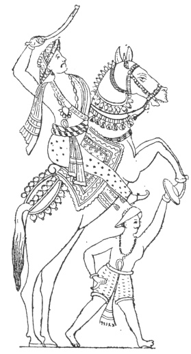

  
[Intangible Textual Heritage](../../index)  [Hinduism](../index.md) 
[Index](index)  [Previous](hmvp38)  [Next](hmvp40.md) 

------------------------------------------------------------------------

  
*Hindu Mythology, Vedic and Puranic*, by W.J. Wilkins, \[1900\], at
Intangible Textual Heritage

------------------------------------------------------------------------

p. 388

### CHAPTER II.

#### KUVERA.

Kuvera, the god of riches, does not
occupy a very conspicuous position in the mythology of the Hindus. No
images or pictures of him are to be had, though he is frequently
referred to in the Rāmāyana as the lord of gold and wealth. "Brahmā had
a mental son named Pulastya, who again had a mental son named Gaviputra
Vaisravana (Kuvera). The latter deserted his father, and went to Brahmā,
who as a reward made him immortal, and appointed him to be the god of
riches, with Lanka for his capital, and the car Pushpaka for his
vehicle. [\*](#fn_352.md) This car was of immense
size, and moved at its owner's will at a marvellous speed; Rāvana took
it by force from Kuvera, at whose death it was restored by Rāma to its
original possessor.

"Pulastya being incensed at this desertion (of his son Kuvera)
reproduced the half of himself in the form of Vaisravas, who looked upon
Vaisravana with indignation. The latter strove to pacify his father, and
with this view gave him three elegant Rākshasīs to attend on him:
Pushpotkatā, who had two sons, Rāvana and Kumbhakarna; Mālinī, who bore
Vibhīshana; and Rākā, who bore Khara and Sūparnakha. These sons were all

p. 389

valiant, skilled in the Vedas and observers of religious rites, but,
perceiving the prosperity of Vaisravana, were filled with jealousy.
Excepting Khara and Sūparnakha, they began to practise austerities to
propitiate Brahmā, and at the end of a thousand years Rāvana cut off his
own head and threw it as an oblation into the fire. Brahmā appeared to
put a stop to their austerities, and to offer them boons (except that of
immortality). He ordained that Rāvana should have heads and shapes at
will and be invincible, except by men; that Kumbhakarna should enjoy a
long sleep. Having obtained these powers, Rāvana expelled Vaisravana
from Lanka. Kuvera retired to Gandamārdana. Rāvana having been installed
as king, and begun to exercise his power tyrannically, the Rishis resort
to Brahmā, who promises that, as Rāvana could not be killed by gods or
asuras, the four-armed Vishnu, the chief of warriors, should by his
(Brahmā's) appointment descend to earth for his destruction." [\*](#fn_353.md)

The Rāmāyana (Uttara Kānda) [†](#fn_354.md) makes
Kuvera the grandson, not the son, of Pulastya. In the Krita Yuga the
pious Pulastya, being teased with the singing and dancing of different
damsels, proclaimed that any one of them whom he saw near his hermitage
should become a mother. This threat had not been heard by the daughter
of Trinavindu, who came near the hermitage, and incurred Pulastya's
threatened punishment. Her father, on learning her condition, gave her
as wife to Pulastya, and she bore him a son named Visravas; who,
becoming a sage, married a daughter of the Muni Bharadvaja, whose son
Brahmā, named Vaisravana (Kuvera). He performed austerities for
thousands of years, and received as a boon from Brahmā that he should be
the

p. 390

god of riches, and one of the guardians of the world. At the suggestion
of his father Visravas, he took possession of Lanka for his abode, which
was formerly built by Visvakarma for the Rākshasas, who through fear of
Vishnu had recently forsaken it.

A Rākshas prince named Sumali, who had been driven to Pātāla, happening
to visit the earth, saw Kuvera travelling in his chariot to visit his
father. This leads him to devise a plan by which he might regain his
former position. He sends his daughter Kaikasi to woo Visravas; she is
kindly received and becomes the mother of Rāvana, Kumbhakarna,
Sūparnakha and Vibhishana. When Kaikasi saw the splendour of Kuvera, she
urges Rāvana to resemble him in glory; who, in order to effect this,
undergoes most severe austerities for a thousand years, when Brahmā
grants him as a boon invincibility against all beings more powerful than
men, and other gifts. Kuvera on Rāvana's demand yields the city of
Lanka.

It was noticed above that Kuvera was one of the guardians of the world;
these are commonly said to be four in number. Rāma mentions their names:

"May he whose hands the thunder wield \[Indra\],  
 Be in the East thy guard and shield:  
 May Yama's care the South befriend,  
 And Varuna's arm the West defend;  
 And let Kuvera, Lord of Gold,  
 The North with firm protection hold." [\*](#fn_355.md)

\[paragraph continues\] When eight
guardians are spoken of, the additional four are these: Agni has charge
of the South-East, Surya of the South-West, Soma of the North-East, and
Vāyu of the North-West.

p. 391

Kuvera is called the King of the Yākshasas—savage beings who, because
the moment they were born said, "Let us eat," were called Yākshasas.
These beings were ever on the watch for prey, and ate those they slew in
battle.

Throughout the Rāmāyana there are brief references to Kuvera as the
giver of riches, and also to the beauty of his palace and gardens. Thus
Bharadvāja the sage, desirous of giving Rāma and Lakshman a fitting
reception, said—

"Here let Kuvera's garden rise,  
 Which far in Northern Kuru lies;  
 For leaves let cloth and gems entwine,  
 And let its fruit be nymphs divine." [\*](#fn_356.md)

His garden is a place "where the inhabitants enjoy a natural perfection,
attended with complete happiness, obtained without exertion. There is
there no vicissitude, nor decrepitude, nor death, nor fear; no
distinction of virtue and vice, none of the inequalities denoted by the
words 'best,' 'worst,' and 'intermediate,' nor any change resulting from
the succession of the four Yugas. There is neither grief, weariness,
anxiety, hunger, nor fear. The people live in perfect health, free from
every suffering, for ten or twelve thousand years." [†](#fn_357.md) As Sugriva was sending forth his armies
to search for Sita, he thus speaks of this garden to Satabal, the leader
of the army of the North—

"Pursue your onward way, and haste  
 Through the dire horrors of the waste,  
 Until triumphant with delight  
 You reach Kailāsa's glittering height.

p. 392

\[paragraph
continues\]  There stands a palace decked with gold,  
 For King Kuvera wrought of old,  
 A home the heavenly artist planned,  
 And fashioned with his cunning hand.  
 There lotuses adorn the flood  
 With full-blown flower and opening bud,  
 Where swans and mallards float, and gay  
 Apsarasas [\*](#fn_358.md) come down to play.  
 There King Vaisravan's self, the lord  
 By all the universe adored,  
 Who golden gifts to mortals sends,  
 Lives with the Guhyakas, [†](#fn_359.md) his
friends." [‡](#fn_360.md)

As Rāma and Lakshman were wandering in the forest, they were attacked by
a giant named Virādha; but as they could not slay him with their
weapons, they buried him alive, and as a result he regained his proper
form. Formerly Kuvera had cursed him, for "loving Rambhā's charms too
well," to assume the hideous form in which Rāma met with him, and the
only relief Kuvera would give him was—

"When Rāma, Dasaratha's son,  
 Destroys thee, and the fight is won,  
 Thy proper shape once more assume,  
 And heaven again shall give thee room." [§](#fn_361.md)

When Rāvana had risen to the summit of his power, he made the gods
perform various offices in his house: thus Indra prepared garlands, Agni
was his cook, Surya gave light by day and Chandra by night, and Kuvera
became his cash-keeper.

Kuvera married Yakshi or Charvi; and two of his sons, through a curse of
the sage Nārada, became trees, in which condition they remained until
Krishna, when

p. 393

an infant, uprooted them. Nārada met with them in a forest, bathing with
their wives, in a state of intoxication. The wives, ashamed of
themselves, fell at Nārada's feet and sought for pardon; but as their
husbands disregarded the presence of the sage, they suffered the full
effects of his curse.

 

------------------------------------------------------------------------

### Footnotes

[388:\*](hmvp39.htm#fr_352.md) "Mahābhārata:
"Muir, O. S. T., iv. 481.

[389:\*](hmvp39.htm#fr_353.md) Muir, O. S. T., v.
483.

[389:†](hmvp39.htm#fr_354.md) Ibid., iv. 488.

[390:\*](hmvp39.htm#fr_355.md) Griffiths's
"Rāmāyana," ii. 20.

[391:\*](hmvp39.htm#fr_356.md) Griffiths's
"Rāmāyana," ii. 358.

[391:†](hmvp39.htm#fr_357.md) "Bhāgavata Purāna:"
Muir, O. S. T., i. 492.

[392:\*](hmvp39.htm#fr_358.md) Nymphs of Paradise.

[392:†](hmvp39.htm#fr_359.md) Guardians of
treasures.

[392:‡](hmvp39.htm#fr_360.md) Griffiths's "
Rāmāyana," iv. 24.

[392:§](hmvp39.htm#fr_361.md) Ibid., iii. 14.

------------------------------------------------------------------------

[Next: Chapter III. The Demigods of the Rāmāyana](hmvp40.md)
