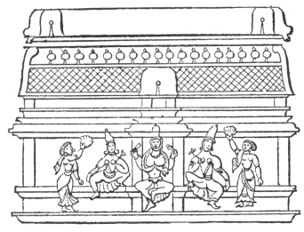

  
[Intangible Textual Heritage](../../index)  [Hinduism](../index.md) 
[Index](index)  [Previous](hmvp41)  [Next](hmvp43.md) 

------------------------------------------------------------------------

  
*Hindu Mythology, Vedic and Puranic*, by W.J. Wilkins, \[1900\], at
Intangible Textual Heritage

------------------------------------------------------------------------

p. 431

### CHAPTER V.

#### THE PLANETS.

"At the great festivals of the Hindus a
small offering is made to all the planets at once; but, excepting on
these occasions, they are never worshipped together. They are, however,
frequently worshipped separately by the sick and unfortunate who suppose
themselves to be under the baneful influence of one or other of them. At
these times they are worshipped one after the other in regular
succession." [\*](#fn_393.md) Seven of the planets
give names to the days of the week; the other two represent the
ascending and descending nodes. Surya and Chandra (Soma) have already
been noticed at length among the Vedic Deities; they are again described
briefly along with the planets, under the names they bear in this
connection.

"To Surya or Ravi are offered in the burnt sacrifice small pieces of the
shrub *arka* (*Asclepias gigantica*); to Chandra those of the *palasa*
(*Butea frondosa*); to Mangala (Mars) those of the *khudiru* (*Mimosa
catechu*); to Budha (Mercury) those of the *apārmārga* (*Achryranthes
aspera*); to Vrihaspati (Jupiter) those of the *asvattha* (*Ficus
religiosa*); to Sukra (Venus) those of the *ūrumbara;* to Sani (Saturn)
those of the *Sami* (*Mimosa albida*); to Rāhu (the ascending node)
blades of *Durva* 

p. 432

grass; and to Keta (the descending node) blades of *Kusa* grass." [\*](#fn_394.md)

"The image of Surya is a round piece of mixed metal twelve fingers in
diameter; of Chandra, a piece like a half-moon, a cubic from end to end;
of Mangala, a triangular piece six fingers in width; of Budha, a golden
bow two fingers in breadth; of Vrihaspati, a piece like a lotus; of
Sukra, a square piece of silver; of Sani, an iron scimitar; of Rāhu, an
iron makara (a fabulous animal, half stag and half fish); and of Ketu,
an iron snake." [†](#fn_395.md)

1\. Ravi (the Sun), hence Ravibāra
(Sunday), is the son of Kasyapa and Aditi. Though as Surya he is daily
worshipped, as Ravi he is only worshipped at the greater festivals. "The
'Jyotish-tatwa,' a great work on astrology, says that if a person is
born under the planet Ravi, he will possess an anxious mind, be subject
to disease and other sufferings, be an exile, a prisoner, and suffer the
loss of wife, children, and property." [‡](#fn_396.md)

2\. Chandra or Soma, hence Somavāra (Monday). "If a person be
born under the planet Soma he will have many friends; will possess
elephants, horses, and palanquins; be honourable and powerful; will live
on excellent food, and rest on superb couches." A race of kings are said
to be the descendants of Soma, by his wife Rohini (the Hyades), who are
called the children of the moon.

3\. Mangala, hence Mangalavāra (Tuesday),
is represented as a red man with four arms, riding on a sheep; he wears
a red necklace and clothes of the same colour. " If a person be born
under the planet Mangala, he will be full of anxious thoughts, wounded
with offensive weapons, imprisoned, oppressed with fear of robbers,
fire, etc., and will lose his lands, trees, and good name." This deity
is identical with Kartikeya.

p. 433

4\. Budha, [\*](#fn_397) hence Budhavāra (Wednesday.md), was the
son of Soma by Tārā, the wife of Vrihaspati, the preceptor of the gods.
At his birth, on the confession of his mother that he was Soma's son,
her husband reduced her to ashes. Brahmā afterwards raised her to life,
and, being purified by the fire, her husband received her back. Samudra
(the Sea), incensed at his son for the great crime of dishonouring his
preceptor's wife, disinherited him; but owing to his sister [†](#fn_398.md) Lakshmi's influence, part of his sin was
removed, and he became bright as the moon when three days old; and,
through her intercession with Pārvati, he was restored to heaven, by
being placed on Siva's forehead, who, thus ornamented, went to a feast
of the gods. Vrihaspati on seeing Chandra again in heaven was greatly
incensed, but was appeased on Brahmā's declaring that the lascivious god
should be excluded from heaven and placed among the stars; and that the
sin which had obscured his glory should remain for ever. " If a person
be born under the planet Budha, he will be fortunate, obtain an
excellent wife," etc.

5\. Vrihaspati, hence Vrihaspativāra
(Thursday), was the preceptor of the gods, and is regarded as identical
with Agni, almost the same epithets being applied to both in the Vedic
hymns. In later times he is said to be a Rishi, a son of Angiras. "If a
person be born under this planet, he will be endowed with an amiable
disposition, possess palaces, gardens, lands, and be rich in money and
corn. He will possess much religious merit, and have all his wishes
gratified. Brāhmans, however, will not be so fortunate as those of other
castes, for Vrihaspati

p. 434

being a Brāhman does not wish to exalt those of his own caste."

6\. Sukra, hence Sukravāra (Friday), was
the son of Bhrigu. He was the preceptor and the priest of the demons,
and blind in one eye. The reason of this affliction is told in the
following legend: When Vishnu, in the Dwarf Incarnation, went to Bāli,
king of the daityas, to solicit a blessing, Sukra, as Bāli's preceptor,
forbade the king to give him anything. The king being determined to give
what was asked, it was the duty of the priest to read the customary
formula and to pour out water from a vessel as a ratification of the
gift. Sukra, anxious to prevent his master from giving what was asked,
as he foresaw that it would prove his ruin, entered the water in an
invisible form, and by his magical powers prevented it from falling.
Vishnu, aware of the device, put a straw into the vessel, which,
entering Sukra's eye, gave him so much pain that he could remain there
no longer; so the water fell, the gift was ratified, and Sukra lost an
eye. "If a person be born under the planet Sukra, he will have the
faculty of knowing things past, present, and future. He will have many
wives, a kingly umbrella (an emblem of royalty), and other kings will
worship him."

Sukra is said to have possessed the power of raising the dead, as the
following legend [\*](#fn_399.md) shows:—Devajāni,
the daughter of Sukra, was deeply in love with Kacha, a son of
Vrihaspati and a pupil of her father, who had been sent to Sukra for the
express purpose of learning from him the incantation for raising the
dead. One day Devajāni sent Kacha to gather flowers from a wood
belonging to some giants, who, on previous occasions had eaten him; but
Sukra, by the above incantation, had

p. 435

restored him to life. The giants now resolved to make Sukra himself eat
the boy; for which purpose, they cut him into small pieces, boiled him
in spirits, and invited Sukra to an entertainment. As Kacha did not
return with the flowers, Devajāni with many tears told her father that,
if he did not restore her lover, she would certainly destroy herself.
Sukra learned by the power of meditation that he had eaten the boy, but
did not know how to restore him to life, without the attempt being fatal
to himself. At length, whilst the boy was in his stomach, he restored
him to life, and then taught him the incantation he was so wishful to
learn. Kacha, tearing open Sukra's stomach, came forth, and immediately
using the wonderful incantation restored his teacher to life.

7\. Sani, hence Sanivāra (Saturday), is
said to be the son of Surya, and Chhāya, the servant whom his wife
Savarnā substituted for herself; or, according to other accounts, he
sprang from Balarāma and Revati. He is represented as a black man,
clothed in black garments, riding on a vulture, with four arms. "If a
person be born under the planet Sani, he will be slandered, his riches
dissipated, his son, wife, and friends destroyed; he will live at
variance with others and endure many sufferings." Many stories are told
of his evil influence, consequently the Hindus are under fear of evil
from this planet. It was Sani who was said to have burnt off Ganesa's
head.

8\. Rāhu (the ascending node) was the son
of Vrihaspati and Sinhikā. He is described as a black man, riding on a
lion. "If a person be born under the planet Rāhu, his wisdom, riches,
and children will be destroyed; he will be exposed to many afflictions
and be subject to his enemies." According to the popular notions of the
Hindus, at the time of an eclipse Rāhu devours the sun and moon; hence,
as soon as an eclipse is noticed, the

p. 436

people make a dreadful noise, shouting, blowing horns, and beating
drums, to cause Rāhu to restore these luminaries. The reason of this
custom is probably found in the following story: Rāhu was originally an
asura or giant, who took his present form at the churning of the sea. As
the gods and demons churned, Surya and Chandra, who were sitting
together, hinted to Vishnu, when the amrita appeared, that one of the
demons had tasted it. Vishnu immediately cut off the head of the
offender; but as he had drunk of the water of life, neither head nor
trunk could perish. The head, taking the name of Rāhu, and the trunk,
that of Ketu, were placed in heaven as the ascending and descending
nodes, and leave was granted, as a means of revenge on Surya and
Chandra, that on certain occasions Rāhu should approach these gods and
render them unclean, so that their bodies at these times become thin and
black. [\*](#fn_400.md)

 

------------------------------------------------------------------------

### Footnotes

[431:\*](hmvp42.htm#fr_393.md) Ward, E. 70.

[432:\*](hmvp42.htm#fr_394.md) Ward, ii. 70.

[432:†](hmvp42.htm#fr_395.md) Ibid., 71.

[432:‡](hmvp42.htm#fr_396.md) Page 72.

[433:\*](hmvp42.htm#fr_397.md) This Budha must not
be confounded with Buddha, the Incarnation of Vishnu.

[433:†](hmvp42.htm#fr_398) Soma (the Moon.md) and
Lakshmi were produced together at the churning of the ocean.

[434:\*](hmvp42.htm#fr_399.md) Ward, ii. 71.

[436:\*](hmvp42.htm#fr_400.md) Ward, ii. 81.

------------------------------------------------------------------------

[Next: Chapter VI. The Asuras](hmvp43.md)
