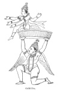
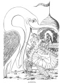

  
[Intangible Textual Heritage](../../index)  [Hinduism](../index) 
[Index](index)  [Previous](hmvp43)  [Next](hmvp45) 

------------------------------------------------------------------------

  
*Hindu Mythology, Vedic and Puranic*, by W.J. Wilkins, \[1900\], at
Intangible Textual Heritage

------------------------------------------------------------------------

p. 448

### CHAPTER VII.

#### SACRED ANIMALS AND BIRDS.

Some of the animals regarded as sacred
have already been mentioned in connection with the deities to whom they
are specially dear, and in whose worship they participate. They are
regarded as the Vāhans, or vehicles, upon which these gods and goddesses
travel. Thus Indra rides upon the elephant Airavata; Siva on the bull
Nandi; Yama on a buffalo; Durgā, as Singhavāhini, on a lion, as Durgā on
a tiger; Agni on a ram; Vāyu on an antelope; Ganesa on a rat, and Sasti
on a cat. Virabhadra, the emanation of Siva which destroyed Daksha's
sacrifice, rode on a dog, and Kāmadeva travelled either on the monster
Makara or a parrot. The jackal is regarded as a representative of Durgā,
who in this form assisted in preserving Krishna, on the night of his
birth, from Kansa's anger. Monkeys, as representatives of Hanumān, are
very commonly worshipped; the dog, though worshipped by some, by others
is regarded as unclean.

Amongst birds, the goose is the Vāhan of Brahmā, the peacock that of
Kartikeya, Sani rides upon a vulture; the Brāhmani kite is said to be a
form of Durgā, and the Khanjana, or wagtail, represents Vishnu, because
the mark on its throat is thought to resemble the Shālgrāma; the owl,
too, is worshipped at the festivals of

p. 449

\[paragraph continues\] Kartikeya, Brahmā,
and Lakshmi. Garuda, the Vāhan of Vishnu, and Jatāyus and Sampāti, the
vultures who assisted Rāma, will be described separately.

The cow, though not regarded as the Vāhan of any deity, is worshipped
too. Brahmā is said to have created cows and Brāhmans at the same time;
the Brāhman to officiate at worship, and the cow to provide milk, ghī,
etc., as offerings, whilst cow-dung is necessary for various purifying
ceremonies. Regular worship of the cow takes place yearly, at which
similar ceremonies are performed to those which are employed at the
worship of images; the horns and bodies of the cows are painted, and
they are then bathed in the rivers. Some people are said to worship the
cow daily.

##### GARUDA.

Garuda or Superna is a mythical being, half-man and half-eagle, the
Vāhan of Vishnu. Though not strictly divine, he appears frequently in
Vishnu's exploits, and, being worshipped together with his lord, it is
necessary to give some description of his birth and deeds.

When Daksha's sons refused to people the world, he produced sixty
daughters, thirteen of whom he gave to Kasyapa the sage; of these, two
come into prominence in connection with Garuda. Vinatā bore him two
celebrated sons, Garuda and Aruna: the former, also called Superna, was
the king of the feathered tribes, and the remorseless enemy of the
serpent race. Aruna became famous as the charioteer of the Sun. "The
progeny of Kadru (the other sister) were a thousand powerful many-headed
snakes, of immeasurable might, subject to Garuda." [\*](#fn_410) The mother of Garuda is said to have
laid an egg; hence her son assumed a bird-like form.

p. 450

Another legend makes "Garuda the son of Kasyapa and Diti. This
all-prolific dame laid an egg, which, it was predicted, would yield her
a deliverer from some great evil. After the lapse of five hundred years,
Garuda sprang from the egg, flew to Indra's abode, extinguished the fire
that surrounded it, conquered its

 
[  
Click to enlarge](img/45000.jpg)  
GARUDA.  

guards, and bore off the amrita, which enabled him to liberate his
captive mother. A few drops of the immortal beverage falling on some
*Kusa* grass, it became eternally consecrated; and the serpents greedily
licking it, so lacerated their tongues with the sharp grass, that they
have ever since remained forked. But the boon of immortality was ensured
to them by their partaking

p. 451

of the amrita." [\*](#fn_411) "As soon as
Garuda was born, his body expanded till it touched the sky; the other
animals were terrified. His eyes were like the lightning. The mountains
were driven away with the wind caused by the flapping of his wings. The
rays which issued from his body set the four quarters of the world on
fire; the affrighted gods imagining that Garuda must be an incarnation
of Agni, resorted to that deity for protection." [†](#fn_412)

Garuda is the mortal enemy of snakes. His mother Vinatā quarrelled with
her sister, Kadru, the mother of the snakes, respecting the colour of
the horse that was produced at the churning of the ocean; since that
time there has been constant enmity between their descendants. On the
occasion of his marriage, the serpents, alarmed at the thought of his
having children who might destroy them, made. a fierce attack on him;
but the result was that he slew them all, save one, which he has ever
since worn as an ornament round his neck. To this day superstitious
Hindus repeat the name of Garuda three times before going to sleep at
night, as a safeguard against snakes.

The following legend from the Mahābhārata [‡](#fn_413) gives the account of his liberating his
mother from servitude, and of his appointment as the Vāhan of Vishnu.
His mother, having lost her wager with her sister respecting the colour
of the sea-produced horse, was reduced to servitude to the serpents,
who, being anxious to become immortal, promised to liberate her on
condition that her son Garuda should bring them Chandra (the Moon),
whose bright spots are filled with amrita. Before starting on this
expedition he went to his mother for

p. 452

food, who advised him to go to the seashore and gather whatever he could
find, but entreated him to be most careful not to eat a Brāhman; adding,
"Should you at any time feel a burning sensation in your stomach, be
sure you have eaten a Brāhman."

After receiving this warning, he set off on his journey. Passing through
a country inhabited by fishermen, he at one inspiration drew in houses,
trees, cattle, men, and other animals. But among the inhabitants
swallowed, one was a Brāhman, who caused such an intolerable burning in
his stomach that Garuda, unable to bear it, called in the greatest haste
for him to come out. The Brāhman refused unless his wife, a fisherman's
daughter, might accompany him. To this Garuda consented.

Pursuing his journey, Garuda met his father Kasyapa (he shines as the
Pole Star), who directed him to appease his hunger at a certain lake
where an elephant and tortoise were fighting. The tortoise was eighty
miles long, and the elephant one hundred and sixty. Garuda with one claw
seized the elephant, with the other the tortoise, and perched with them
on a tree eight hundred miles high. But the tree was unable to bear the
ponderous weight, and, unhappily, thousands of pigmy Brāhmans were then
worshipping on one of its branches. Trembling lest he should destroy any
of them, he took the bough in his beak, continuing to hold the elephant
and tortoise in his claws, and flew to a mountain in an uninhabited
country, where he finished his repast on the tortoise and elephant.

Garuda having surmounted astonishing dangers, at last seized the Moon
and concealed it under his wing. On his return, however, being attacked
by Indra and the gods, he overcame all, excepting Vishnu. Even Vishnu
was so severely put to it in the contest, that he

p. 453

came to terms with Garuda, made him immortal, and promised him a higher
seat than his own; while on his part Garuda became the Vāhan or carrier
of Vishnu. Since then, Vishnu rides upon Garuda, while the latter, in
the shape of a flag, sits at the top of Vishnu's car.

In the Rāmāyana Garuda is represented as doing great service to Rāma and
his followers, and his powers and peculiarities are repeatedly referred
to. Thus, in the description of Hanumān it is said, that

"Like a thunderbolt in frame was he,  
 And swift as Garud's self could flee." [\*](#fn_414)

In like manner it is said of two heroes:

"Sugriva, offspring of the Sun,  
 And Bāli, Indra's mighty one,  
 They, both endowed with Garud's might,  
 And skilled in all the arts of fight,  
 Wandered in arms the forest through,  
 And lions and snakes and tigers slew." [†](#fn_415)

When Ansumān found the ashes of the sixty thousand sons of Sāgar, [‡](#fn_416) who, owing to Kapila's curse, had been
destroyed, and was in distress because he could obtain no water with
which to offer oblations for the dead, he sees their uncle—

"King Garud, best beyond compare,  
 Of birds who wing the fields of air.  
 Then thus unto the weeping man  
 The son of Vinatā began:  
 'Grieve not, O hero, for their fall,  
 Who died a death approved of all.'" [§](#fn_417)

Garuda then tells Ansumān that if he can succeed in inducing Gangā to
descend from heaven, and with her

p. 454

streams to touch these ashes, the dead shall return to life, and finally
ascend to Indra's heaven.

In the description of the city of Ayodha, when Rāma had gone into the
forest, is a reference to Garuda's antipathy to snakes:—

           "The city wore  
 No look of beauty as before—  
 Like a dull river or a lake  
 By Garud robbed of every snake." [\*](#fn_418)

In the following lines is an account of Garuda's resting on a tree when
he was carrying off the elephant and the tortoise as narrated above.
Rāvana impelled by the accounts of Sitā's beauty, goes to see her, and
on his journey

"He saw a fig-tree like a cloud,  
 With mighty branches earthward bowed.  
 It stretched a hundred leagues, and made  
 For hermit bands a welcome shade.  
 Thither the feathered king of yore  
 An elephant and tortoise bore,  
 And lighted on a bough to eat  
 The captives of his taloned feet.  
 The bough, unable to sustain  
 The crushing weight and sudden strain,  
 Loaded with sprays and leaves of spring,  
 Gave way beneath the feathered king.  
      \*         \*         \*         \*  
 The feathered monarch raised the weight  
 Of the huge bough, and bore away  
 The loosened load and captured prey.  
      \*         \*         \*         \*  
 His soul conceived the high emprise  
 To snatch the amrit from the skies.  
 He rent the nets of iron first,  
 Then through the jewel chamber burst,  
 And bore the drink of heaven away  
 That watched in Indra's palace lay." [†](#fn_419)

p. 455

In the great conflict with Rāvana, as Rāma and his brother were wounded
and well-nigh dead, owing to a flight of serpents sent by Indrajit,
Garuda appeared to restore them, and thus enabled them to carry on the
war. His approach and work are thus described:—

            "The rushing wind grew loud,  
 Red lightnings flashed from banks of cloud,  
 The mountains shook, the wild waves rose,  
 And, smitten by resistless blows,  
 Uprooted fell each stately tree  
 That fringed the margin of the sea.  
 All life within the waters feared:  
 Then, as the Vānars gazed, appeared  
 King Garud's self, a wondrous sight,  
 Disclosed in flames of fiery light.  
 From his fierce eye in sudden dread  
 All serpents in a moment fled;  
 And those transformed to shafts, that bound  
 The princes, vanished in the ground.  
 On Raghu's sons his eyes he bent,  
 And hailed the lords omnipotent.  
 Then o’er them stooped the feathered king,  
 And touched their faces with his wing.  
 His healing touch their pangs allayed,  
 And closed each rent the shafts had made.  
 Again their eyes were bright and bold;  
 Again the smooth skin shone like gold." [\*](#fn_420)

For this great work of restoration Rāma expressed his gratitude,
whereupon Garuda replied—

"In me, O Raghu's son, behold  
 One who has loved thee from of old.  
 Garud, the lord of all that fly,  
 Thy guardian and thy friend am I.  
 Not all the gods in heaven could loose  
 These numbing bonds, this serpent noose,  
 Wherewith fierce Rāvan's son, renowned  
 For magic arts, your limbs had bound.

p. 456

\[paragraph
continues\]  Those arrows fixed in every limb  
 Were mighty snakes, transformed by him.  
 Bloodthirsty race, they live beneath  
 The earth, and slay with venomed teeth."

Garuda is represented in pictures and sculpture in various ways.
Sometimes he has the head and wings of a bird, with a human body;
sometimes he has a bird's claws; and at others he has a human face, and
the body of a bird.

##### JATAYUS AND SAMPATI.

Garuda had two sons, named Jatāyus and Sampāti, who also assisted Rāma.
As he, Lakshman and Sati reached the hermitage in the forest where they
intended to remain, they saw "a mighty vulture, of size and strength
unparalleled." Struck with his appearance, Rāma inquired who he was,
when Jatāyus informed them of his parentage, and offered to be their
friend:

"Thy ready helper will I be  
 And guard thy house, if thou agree:  
 When thou and Lakshman urge the chase,  
 By Sitā's side shall be my place." [\*](#fn_421)

This offer was accepted; and when Rāma saw the stag which Rāvana sent to
attract him from his home, he went after it with the greater sense of
security because Jatāyus was there to guard his wife. When Rāvana seized
Sitā, she cried out to Jatāyus—

"Oh see, the king who rules the race  
 Of giants, cruel, fierce, and base!  
 Rāvan, the spoiler, bears me hence,  
 The helpless prey of violence." [†](#fn_422)

p. 457

Jatāyus first tries by reasoning to lead Rāvana to restore Sitā to her
home, and warned him that death would result from his act of violence.
When, however,

 
[  
Click to enlarge](img/45700.jpg)  
JATĀYUS.  

neither advice nor threats availed, he prepared to fight.

"With clash and din and furious blows  
 Of murderous battle met the foes:  
      \*         \*         \*         \*

p. 458

\[paragraph
continues\]  Then fierce the dreadful combat raged,  
 As fiend and bird in war engaged,  
 As if two winged mountains sped  
 To dire encounter overhead." [\*](#fn_423)

Jatāyus succeeded in breaking Rāvana's bow, but—

"A second bow soon armed his hand,  
 Whence pointed arrows swift and true  
 In hundreds, yea, in thousands flew." [†](#fn_424)

The giant's arrows wounded the vulture; the vulture in return threw
darts which injured Rāvana, struck the steeds of the chariot, and broke
the chariot itself; whilst with his beak and claws he tore the coachman
to pieces. Rāvana descended from his chariot and fought on foot; but
gradually the strength of Jatāyus, who was weak with age, gave way.
Rāvana, therefore, re-ascends the chariot, and is about to fly through
the air, when the vulture a second time intercepts his flight, and—

"Swooped down upon the giant's back:  
 Down to the bone the talons went;  
 With many a wound the flesh was rent." [‡](#fn_425)

Jatāyus was able to tear off the ten left arms of Rāvana, but
unfortunately others grew to replace them. At length Rāvana seizes his
sword, and, after giving the vulture a mortal blow, hurries off with
Sitā to Lanka.

When Rāma and Lakshman commence their search for Sitā, they come upon
the dying bird, and, seeing the marks of blood upon him, at first think
that he has been guilty of carrying off the lady; but, after hearing
from him the story of Rāvana's visit and flight, they watch the bird
expire, and perform his funeral rites.

In their search, reaching the seashore, but still ignorant

p. 459

of Sitā's whereabouts, some of their monkey followers see an immense
vulture, weak with age, who, hearing them mention Jatāyus' name,
inquires of his welfare. When told that he had been slain by Rāvana, the
vulture informs them that this victim of the giant was no other than his
own brother; and in revenge assists them, by informing them where Rāvana
and Sitā were at that moment. He told them that he had Garuda's power to
see immense distances, and, mounting into the sky, saw Lanka, and told
the Vānar chiefs that the object of their search was there. Hearing
this, Hanumān was despatched to communicate with Sitā, and to assure her
of Rāma's coming to rescue her.

  [  
Click to enlarge](img/45900.jpg)  
THE LOTUS.  

------------------------------------------------------------------------

### Footnotes

[449:\*](hmvp44.htm#fr_410) "Vishnu Purāna," p.
119.

[451:\*](hmvp44.htm#fr_411) Moor's "Hindu
Pantheon," 341.

[451:†](hmvp44.htm#fr_412) Ward, ii. 200.

[451:‡](hmvp44.htm#fr_413) Ibid., ii. 201.

[453:\*](hmvp44.htm#fr_414) Griffiths's
"Rāmāyana," i. 94.

[453:†](hmvp44.htm#fr_415) Ibid., i. 96.

[453:‡](hmvp44.htm#fr_416) See Gangā.

[453:§](hmvp44.htm#fr_417) Griffiths's
"Rāmāyana," i. 186.

[454:\*](hmvp44.htm#fr_418) Griffiths's
"Rāmāyana," ii. 167.

[454:†](hmvp44.htm#fr_419) Ibid., iii. 162.

[455:\*](hmvp44.htm#fr_420) Griffiths's
"Rāmāyana," v. 153.

[456:\*](hmvp44.htm#fr_421) Griffiths's
"Rāmāyana," iii. 68.

[456:†](hmvp44.htm#fr_422) Ibid., 230.

[458:\*](hmvp44.htm#fr_423) "Griffiths's
Rāmāyana," iii. 236.

[458:†](hmvp44.htm#fr_424) Ibid., 237.

[458:‡](hmvp44.htm#fr_425) Ibid., 240.

------------------------------------------------------------------------

[Next: Chapter VIII. Gangā](hmvp45)
