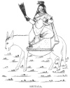
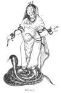
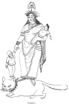

  
[Intangible Textual Heritage](../../index)  [Hinduism](../index) 
[Index](index)  [Previous](hmvp46)  [Next](hmvp48) 

------------------------------------------------------------------------

  
*Hindu Mythology, Vedic and Puranic*, by W.J. Wilkins, \[1900\], at
Intangible Textual Heritage

------------------------------------------------------------------------

p. 473

### CHAPTER X.

#### MISCELLANEOUS MINOR DEITIES.

##### 1. SHITALA.

Shitala is the Bengali name for the
small-pox, and for the deity who is supposed to have charge of that
disease. The meaning of the word is "She who makes cold."

 
[  
Click to enlarge](img/47300.jpg)  
SHITALA.  

This goddess is represented as a golden-complexioned woman sitting on a
lotus, or riding on an ass, dressed in red clothes. Before an image of
this kind, or more

p. 474

commonly a pan of water merely, Shitala is worshipped in the hope that
she will preserve her worshippers from this dire disease.

In the spring of the year, the Hindus formerly inoculated their children
for this disease when they were about two years of age. The Brāhman who
performed the operation made presents to render Shitala propitious, and
promised, in case the work was successful, to give still greater gifts.
At the close of the operation the flowers that were presented to the
goddess were placed in the hair of the child as a charm. On behalf of
those afflicted with small-pox, offerings are made daily; and when the
patient is thought to be dangerously ill, he is placed in front of an
image of Shitala, bathed in, and given to drink, water that has been
offered to her. Beggars go about with a stone, partly gilded, which they
teach is sacred to Shitala, and, in seasons when the disease is
prevalent, receive presents from the superstitious. [\*](#fn_442)

##### 2. MANASĀ.

Manasā is the sister of Vasuki, king of the snakes; the wife of
Jaratkāru, a sage; and being the queen of the snakes is regarded as the
protectress of men from those reptiles. Another name by which she is
known is Vishahara, "the destroyer of poison." Generally, offerings are
made to her without any image being made, a branch of a tree, a pan of
water, an earthen snake being her representative; when her image is
made, it is that of a woman clothed with snakes, sitting on a lotus, or
standing upon a snake. A song founded upon the following story concludes
the worship of this deity.

p. 475

A merchant named Chānda not only refused to worship Manasā, but
professed the profoundest contempt for her. In process of time six of
his sons died from snake-bites. To avoid a similar fate, his eldest son
Lakindara dwelt in an iron house; but Manasā caused a snake to enter
through a crevice, which bit him on his wedding-day and caused his death
too. His widow, however, escaped, and went weeping to her mother-in-law,

 
[  
Click to enlarge](img/47500.jpg)  
MANASĀ.  

who, with the neighbours, vainly tried to induce Chānda to propitiate
the goddess through whose influence so much evil had come to the family;
Manasā herself urged his friends to prevail upon him not to remain so
hostile to her. At last he so far yielded to

p. 476

their wishes as to throw a single flower with his left hand towards her
image, which so delighted her that she restored his sons to life, and
from that time, as men came to know of her power, her worship has become
celebrated. [\*](#fn_443)

The Mahābhārata gives the following particulars regarding her marriage.
Jagatakāru, her husband, was an eminent sage, who had practised great
austerities, bathed in all the holy tanks, abstained from matrimony,
and, as a result of his penance and fasting, had a dry and shrivelled
body. In the course of his wanderings, he came to a place where he saw a
number of men hanging from a tree with their heads downwards over a deep
abyss, with a rat gnawing the rope by which they were suspended, and
learned that they were his own ancestors, doomed to endure this misery
because, their children being dead, they had no one to release them
(*i.e.* by performing religious ceremonies); and he, who, by having a
son might have set them free, was given up to a life of austerity, and
refused to marry. When they are told that Jagatakāru is the man through
whose abstinence they are suffering, they entreat him to seek a wife and
secure their deliverance. He consents to do so on condition that the
parents of the girl he marries give her to him willingly. Vāsuki hearing
of this, offers his sister to the sage, who marries her and has a son
named Asika. This son effected the deliverance of his ancestors and also
rendered good service to the serpent race in saving them from
destruction when Janamejaya was wishful to exterminate them.

p. 477

##### 3. SASTĪ.

Sastī is peculiarly the goddess of married women; she is the giver of
children, assists at childbirth, and is the guardian of young children.
She is represented as a golden-complexioned woman with a child in her
arms, riding upon a cat; hence no Hindu woman would under

 
[  
Click to enlarge](img/47700.jpg)  
SASTI.  

any circumstances injure that animal, lest she should offend the goddess
and be made to suffer for it. Six times a year festivals in honour of
Sastī are held; in addition to which, women who have lost their children
by death worship her monthly. When a child is six days old, the father
worships her; and when three

p. 478

weeks old, the mother presents offerings to her. The ordinary
representative of Sastī is a stone about the size of a man's head,
placed under a Banyan tree, which is decorated with flowers, and
offerings of rice, fruit, etc., are made to it. [\*](#fn_444)

##### 4. THE SHĀLGRĀMA.

By the worshippers of Vishnu, the Shālgrāma is regarded as a most sacred
object. It does not derive its sacredness from consecrating rites, as
images and other representatives of deities, but is believed to be
inherently holy. It is a black ammonite, found in Mount Gandakī in
Nepal. The popular belief is that in this mountain there are insects
which perforate the stones; and when perforated, falling into the river
Gandaka, they are taken out by means of nets. The more common ones are
about the size of a watch, and their price varies according to their
size, hollowness, and inside colouring, according to which peculiarities
special names are given. For the rarer kinds as much as Rs. 2000 are
given; and as it is the common belief of the people that the possessor
of one of these, and a shell called Dakshināvarta (*i.e.* a shell whose
convolutions are towards the right), can never be poor, it is not to be
wondered at that large prices should be paid for them. As it is also
believed that in parting with them they invite misfortune, it is natural
that few should wish to part with them; to sell them for gain is
regarded as a most dishonourable deed.

A reason for the sacredness of the Shālgrāma is found in the "Bhāgavata
Purāna." Sani commenced his reign with a request to Brahmā to become
subject to him;

p. 479

\[paragraph continues\] Brahmā referred
him to Vishnu, who asked him to call upon him the next day. When he
called, finding that Vishnu had transformed himself into a mountain, he
became a worm named Vajrakīta, and afflicted him for twelve years. At
the expiration of that time Vishnu resumed his proper shape, and ordered
that henceforth the stones of this mountain (Gandakī) should be
worshipped as representatives of himself. [\*](#fn_445)

The Brāhmans usually worship Vishnu in this form in their daily *puja*
at home. In the hot season a vessel is suspended over it, and the water
continually dropping on it keeps it cool; another vessel is placed under
it to catch the water, which is drunk in the evening by the worshipper.
The marks of it are shown to men when dying, in the belief that the
concentration of the mind on them at this time will ensure the soul a
safe passage to Vishnu's heaven. [†](#fn_446)

##### 5. THE DHENKĪ.

The Dhenkī is a log of wood fixed to a pivot, used for husking rice,
pounding bricks for mortar, etc. It is generally worked by women, who,
by standing on the one end, raise it to a certain height and then let it
fall by its own weight. It is said to be the Vāhan or vehicle of Nārada,
and it is believed that, owing to his blessing, it became an object of
worship. A religious teacher, when initiating a disciple into the
mysteries of Hinduism, told him to say, "Dhenkī, Dhenkī." Nārada,
hearing this, was delighted, and coming upon his Vāhan gave him another
incantation by which he became

p. 480

perfect and was admitted into heaven. It is worshipped at the time of
marriage, at the investiture of a son with the Poita or Brāhmanical
thread, at the ceremony of giving rice to a child, and on other festive
occasions. At the close of the last century a Rāja of Naladanga is said
to have spent Rs. 300,000 in celebrating the worship of the Dhenkī.

##### 6. KA? WHO?

The Athenians were not alone in worshipping the "Unknown God." "The
authors of the Brāhmanas had so completely broken with the past, that,
forgetful of the poetical character of the hymns (of the Vedas), and the
yearning of the poets after the unknown god, they exalted the
interrogative pronoun itself into a deity, and acknowledged a god, Ka?
or 'Who?' In the 'Taittiriya Brāhmana,' in the 'Kanshītaki Brāhmana,' in
the 'Tāndya Brāhmana,' and in the 'Satapatha Brāhmana,' wherever
interrogative verses occur, the author states that Ka is Prajāpati, or
the lord of creatures. Nor did they stop here. Some of the hymns in
which the interrogative pronoun occurred were called Kadvat, *i.e.*,
having kad or quid. But soon a new adjective was formed, and not only
the hymns, but the sacrifices also, offered to the god, were called
Kāya, or 'Who-ish.' At the time of Pānini (the great grammarian), this
word had acquired such legitimacy as to call for a separate rule
explaining its formation. The commentator here explains Ka by Brāhman.
After this, we can hardly wonder that in the later Sanskrit literature
of the Purānas, Ka appears as a recognized god, with a genealogy of his
own, perhaps even a wife; and that in the laws of Manu one of the
recognized forms of marriage, genet ally known by the name of the
Prajāpati

p. 481

marriage, occurs under the monstrous title of Kāya." [\*](#fn_447) In the Mahābhārata Ka is identified
with Daksha, and in the "Bhāgavata Purāna" it is applied to Kasyapa,
probably on account of their similarity to Prajāpati.

 

  [  
Click to enlarge](img/48100.jpg)  
THE NIM.  

 

------------------------------------------------------------------------

### Footnotes

[474:\*](hmvp47.htm#fr_442) Ward, ii. 139.

[476:\*](hmvp47.htm#fr_443) Ward, ii. 142.

[478:\*](hmvp47.htm#fr_444) Ward, ii. 143.

[479:\*](hmvp47.htm#fr_445) For another account
of the origin of the worship of the Shālgrāma, see the account of Tulsi,
chap. ix.

[479:†](hmvp47.htm#fr_446) Ward, ii. 221.

[481:\*](hmvp47.htm#fr_447) Max-Müller, quoted
in Dowson's Classical Dictionary, *s.v.* "Ka?"

------------------------------------------------------------------------

[Next: Chapter XI. Superhuman, Though Not Divine Beings](hmvp48)
