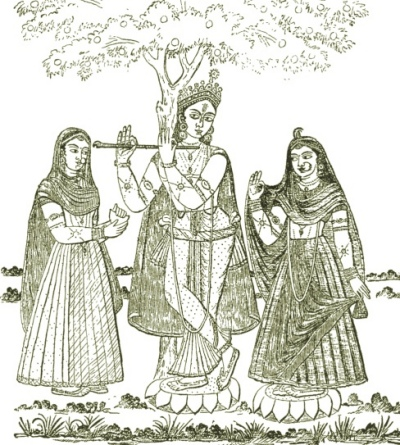

  
[Intangible Textual Heritage](../../index)  [Hinduism](../index.md) 

------------------------------------------------------------------------

<table width="75%">
<colgroup>
<col style="width: 50%" />
<col style="width: 50%" />
</colgroup>
<tbody>
<tr class="odd">
<td width="50%" data-valign="TOP"></td>
<td width="50%" data-valign="CENTER"><h1 id="hindu-mythology-vedic-and-puranic" data-align="CENTER">Hindu Mythology, Vedic and Puranic</h1>
<h2 id="by-w.j.-wilkins" data-align="CENTER">by W.J. Wilkins</h2>
<h4 id="section" data-align="CENTER">[1900]</h4></td>
</tr>
</tbody>
</table>

------------------------------------------------------------------------

[Contents](#contents)    [Start Reading](hmvp00.md)    [Page
Index](pageidx)    [Text \[Zipped\]](hmvp.txt.gz.md)

------------------------------------------------------------------------

This is a comprehensive study of Hindu mythology. Due to the huge number
of gods and goddesses, and their changing role through centuries of
Indian spiritual life, this is a complex subject. This book covers Hindu
mythology during the Vedic and Puranic periods. Wilkins starts with the
very earliest pantheon of the Vedas, such as Surya, the storm-god
Maruts, Agni, Soma, Yama, and the dawn Goddess Ushas. From there he
moves into the later, and very intricate, Puranic mythology. This
includes detailed treatment of the central triad of Brahmâ, Vishnu and
Shiva, along with dozens of other Gods and Goddesses, nature spirits,
half-divine heros of the epics, and so on. Wilkins covers the dozen of
so principal avatars of Vishu, including Krishna and (suprisingly)
Buddha, and prophecies of the mysterious Kalki avatar, yet to come. The
dozens of line drawings are good reference art for each of the major
deities. If you are attempting a read through of the Rig-Veda, the
Mahabharata or Ramayana, this the book will clear up much
confusion.--J.B. Hare, May 17th, 2009.

------------------------------------------------------------------------

 [Title Page](hmvp00.md)  
[Preface](hmvp01.md)  
[Preface to Second Edition](hmvp02.md)  
[Contents](hmvp03.md)  
[List of Illustrations](hmvp04.md)  

### Part I. The Vedic Deities

[Chapter I. The Vedas](hmvp05.md)  
[Chapter II. The Vedic Gods Generally](hmvp06.md)  
[Chapter III. Dyaus And Prithivi](hmvp07.md)  
[Chapter IV. Aditi, and the Ādityas](hmvp08.md)  
[Chapter V. Agni](hmvp09.md)  
[Chapter VI. Sun or Light Deities](hmvp10.md)  
[Chapter VII. The Storm Deities](hmvp11.md)  
[Chapter VIII. Soma](hmvp12.md)  
[Chapter IX. Tvastri or Visvakarma](hmvp13.md)  
[Chapter X. Yama](hmvp14.md)  

### Part II. The Purānic Deities

[Chapter I. The Purānas](hmvp15.md)  
[Chapter II. Brahma](hmvp16.md)  
[Chapter III. Brahmā and Sarasvati](hmvp17.md)  
[Chapter V. Vishnu and Lakshmi](hmvp18.md)  

### Chapter V. The Incarnations or Avatāras of Vishnu

[1. The Matsya or Fish Avatāra](hmvp19.md)  
[2. The Kūrma or Tortoise Avatāra](hmvp20.md)  
[3. The Varāha or Boar Avatāra](hmvp21.md)  
[4. The Nrisingha or Man-Lion Avatāra](hmvp22.md)  
[5. The Vāmana or Dwarf Avatāra](hmvp23.md)  
[6. The Parasurāma Avatāra](hmvp24.md)  
[7. The Rāma Chandra Avatāra](hmvp25.md)  
[8. The Krishna Avatāra](hmvp26.md)  
[8A. The Balarāma Avatāra](hmvp27.md)  
[9. The Buddha Avatāra](hmvp28.md)  
[10. The Kalki Avatāra](hmvp29.md)  
[Jagannāth](hmvp30.md)  
[Chaitanya](hmvp31.md)  
[Kamadeva](hmvp32.md)  

 

[Chapter VI. Siva](hmvp33.md)  
[Chapter VII. Umā](hmvp34.md)  
[Chapter VIII. Sons of Siva and Pārvati](hmvp35.md)  
[Chapter IX. The Puranic Account of the Creation](hmvp36.md)  
[Chapter X. The Purānic Divisions of Time](hmvp37.md)  

### Part III. The Inferior Deities

[Chapter I. The Divine Rishis](hmvp38.md)  
[Chapter II. Kuvera](hmvp39.md)  
[Chapter III. The Demigods of the Rāmāyana](hmvp40.md)  
[Chapter IV. The Demigods of the Mahābhārata](hmvp41.md)  
[Chapter V. The Planets](hmvp42.md)  
[Chapter VI. The Asuras](hmvp43.md)  
[Chapter VII. Sacred Animals and Birds](hmvp44.md)  
[Chapter VIII. Gangā](hmvp45.md)  
[Chapter IX. Sacred Trees](hmvp46.md)  
[Chapter X. Miscellaneous Minor Deities](hmvp47.md)  
[Chapter XI. Superhuman, Though Not Divine Beings](hmvp48.md)  
[Index](hmvp49.md)  
