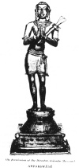

  
[Intangible Textual Heritage](../../index)  [Hinduism](../index) 
[Index](index)  [Previous](htss03)  [Next](htss05) 

------------------------------------------------------------------------

  
*Hymns of the Tamil Saivite Saints*, by F. Kingsbury and G.P. Phillips,
\[1921\], at Intangible Textual Heritage

------------------------------------------------------------------------

p. 34

 
[  
Click to enlarge](img/03400.jpg)  
Apparswāmī  

p. 35

### APPARSWAMI AND HIS HYMNS

p. 36

##### II.

##### TIRUNĀVUKKARASU SWĀMI

(More commonly referred to as APPARSWĀMI)

Sambandar, whose works we have been
studying, had a friend older than himself, named Appar, or
Tirunāvukkarasu, belonging to that Veḷḷāla caste which to this day makes
a very solid element in the population of the Tamil country. Left an
orphan at an early age, Appar was brought up by a loving elder sister as
a pious devotee of Śiva. Great was the sister's grief when Appar forsook
the faith of his fathers and became a religious teacher among the Janis.
But her earnest prayers at last prevailed, and Appar not only came back
to Śaivism himself, but was the means of reconverting to Śaivism the
king of his country. His full name was Tirunāvukkarasu, or 'King of the
Tongue', but his young friend Sambandar called him Appār, or Father, and
the name stuck to him. He too wandered throughout the Tamil country,
sometimes alone, sometimes in company with Sambandar, singing his way
from shrine to shrine. Pictures show him holding in his hand a little
tool for scraping grass, with which he used to scrape the stones of the
temple courts. The Jains persecuted him, and many stories tell of his
miraculous escapes from their hands.

p. 37

His hymns show a truly religious nature, with a deep-rooted sense of sin
and need, and an exalted joy in God. There is real critical acumen in
the old epigram which represents Śiva as appraising the three great
writers of the Dēvāram, or Śaivite hymn-book: "Sambandar praised
himself; Sundarar praised Me for pelf; My Appar praised Me Myself."

p. 38 p. 39

God, the essentially unsearchable, in His grace will reveal Himself to
men. (See the first of the legends told in the Introduction.) Athihai
Viraṭṭānam, in the South Arcot District, is the shrine here
commemorated.

25\. Vishṇu, spouse of Lakshmi, and four-ways-facing Brahm,  
   Searched the heights and depths, but Thy feet could never sec.  
Yet, O only Lord, who in Athihai dost dwell,  
   Formless, in Thy grace, grant the sight of them to me.

------------------------------------------------------------------------

The notable thing about our next verse is not so much the legend of the
crushing of Rāvaṇa, who tried to storm the mountain Kailāsa, where Śiva
had His heaven, but rather the thought of the devotee being stamped as
the property of his god, a thought which recurs in other hymns.
According to tradition Apparswami did receive the Hindu equivalent of
St. Francis’ stigmata, the mark of Śiva's bull as if branded on his
body. We cannot help recalling St. Paul's expression in Galatians vi.
17.

26\. All other worlds his sceptre swayed,  
  But when Kailāsa he would rule  
Thy crushing foot presumption paid.  
  O stamp me with. Thy sacred bull,  
White as Himāl’ya's snowy hill.  
  Accent me, O our truth divine,  
There where the moon outsoareth still  
  Groves of Tūṅgānaimāḍam's shrine.

p. 40 p. 41

Here is the divine vision as the enraptured Śaivite sees it.

27\. See, there His bright trident appears to me;  
  See, there is the moon in His tangled hair;  
His garland of flowers from the kondai tree,  
  And the ear-ring white in His either ear,  
The cloak that He tore from the elephant wild,  
  His glittering crown and His body's sheen.  
Ash-smeared, He is ever the undefiled,  
  In Pūvaṇam circled by groves all green.

------------------------------------------------------------------------

The singer, standing at the shrine of Tiruvalur (Ārūr) in the Tanjore
district, muses over the ancient connection of his lord with the holy
place, suggesting that it began before the creation, before Śiva wrought
his greatest marvels, perhaps even before the one Supreme, Īśvara,
expanded into the triad Brahmā, Vishṇu and Rudra.

28\. When was that ancient day our Lord  
  Chose Ārūr should His temple be?  
Was’t when He stood ’mid praising worlds  
  Alone, or when the One grew three?  
Was’t when in wrath He burned up Death,  
  Or turned on Lust His flaming eye?  
Or when creative, immanent,  
  He called to being earth and sky?  
Was’t when, his young deer in his hand,  
  He came, with Umā as His part?  
Or ere He joined that lady fair  
  Took He our Ārūr to His heart?

p. 42 p. 43

It is often said, not without truth, that Hinduism fails to create a
strong sense of sin. But there are great exceptions: witness the
following verses, samples of many, taken from a hymn which trembles with
feeling. The author is sunk in sin. Or he has been like a swing, flying
first toward evil and then towards God; but now, joy! the cord has
snapped, and he lies fixed at his Lord's feet. Yet the old mood returns;
his soul is bound and drugged with sleep, and life has no joys to offer
unless God will save.

##### The Soul's Bitter Cry

29\. In right I have no power to live,  
  Day after day I'm stained with sin;  
I read, but do not understand;  
  I hold Thee not my heart within.  
O light, O flame, O first of all,  
  I wandered far that I might see,  
Athihai Vīraṭṭānam's Lord,  
  Thy flower-like feet of purity.

30\. Daily I'm sunk in worldly sin;  
  Naught know I as I ought to know;  
Absorbed in vice as ’twere my kin,  
  I see no path in which to go.  
O Thou with throat one darkling gem,  
  Gracious, such grace to me accord,  
That I may see Thy beauteous feet,  
  Athihai Vīraṭṭānam's Lord.

31\. My fickle heart one love forsakes,  
  And forthwith to some other clings;  
Swiftly to some one thing it sways,  
  And e’en as swiftly backward swings.  
O Thou with crescent in Thy hair,  
  Athihai Vīraṭṭānam's Lord,  
Fixed at Thy feet henceforth I lie,  
  For Thou hast broken my soul's cord.

p. 44 p. 45

32\. The bond of lust I cannot break;  
  Desire's fierce torture will not die;  
My soul I cannot stab awake  
  To scan my flesh with seeing eye.  
I bear upon me load of deeds,  
  Load such as I can ne’er lay down.  
Athihai Vīraṭṭānam's Lord,  
  Weary of joyless life I've grown.

------------------------------------------------------------------------

Fresh pictures in another hymn set forth his sad condition. God's
vessels are full of the sweetness of grace, but his spoon has no handle.
He feels himself in the deadly grasp of fate, like the frog in the cruel
mouth of the snake which is slowly swallowing it down. Or he is on a
raft on the sea of life, wrecked on the rock of lust.

33\. While violence is in my heart,  
  Care of my body cage is vain.  
My spoon no handle hath when I  
  Thy honey's grace to drink am fain.  
As in the serpent's mouth the frog,  
  Caught in life's terrors, wild I rave.  
Thou, King of holy Ottiyūr,  
  Wilt Thou not care for me and save?

34\. When on life's angry waves I launch,  
  My heart's the raft I take to me,  
My mind's the pole I lean upon,  
  Vexation's freight I bear to sea.  
I strike upon the rock of lust!  
  O then, though witless quite I he,  
Grant, King of holy Ottiyūr,  
  Such wisdom that I think of Thee.

p. 46 p. 47

It would be hard to find a more comprehensive confession of sin than our
next stanza from another hymn.

35\. Evil, all evil, my race, evil my qualities all,  
Great am I only in sin, evil is even my good.  
Evil my innermost self, foolish, avoiding the pure,  
Beast am I not, yet the ways of the beast I can never forsake.  
I can exhort with strong words, telling men what they should hate,  
Yet can I never give gifts, only to beg them I know.  
Ah! wretched man that I am, whereunto came I to birth?

------------------------------------------------------------------------

We give next a series of stanzas in various metres from different hymns,
in which the saint utters in song some of the joy which his religion has
brought him. God has revealed mysteries to him which tongue cannot tell,
and dwells in his life's innermost places. God is to him the fabled
katpaha tree, supplying his every need. God is his all in all, and His
presence is sweeter than melody or evening moonlight.

36\. The moving water He made stand unmoving in His hair;  
  And He my thoughtless heart hath fixed it thought of Him alone:  
He taught me that which none can learn, what none can see laid bare;  
  What tongue tells not He told; me He pursuer and made His own.  
    The spotless pure, the holy One, my fell disease He healed,  
    And in Pūnturutti to me e’en me, Himself revealed.

p. 48 p. 49

37\. O wealth, my treasure, sweetness, lustre fair of heavenly hosts,  
  Of lustre glory that excels, embodied One, my kin,  
My flesh, yea heart within my flesh, image within my heart,  
  My all-bestowing tree, my eye, pupil my eye within,  
Picture seen in that pupil, lord of Āḍutuṛai cool,  
  Immortals’ king, keep far from me strong pain of fruits of sin.

38\. Thou to me art parents, Lord,  
  Thou all kinsmen that I need,  
Thou to me art loved ones fair,  
  Thou art treasure rich indeed.  
Family, friends, home art Thou,  
  Life and joy I draw from Thee,  
False world's good by Thee I leave,  
  Gold, pearl, wealth art Thou to me.

39\. As the vīṇa's pure sound, as the moonlight at even,  
  As the south wind's soft breath, as the spring's growing heat,  
As the pool hovered over by whispering bees,  
  So sweet is the shade at our Father-Lord's feet.

p. 50 p. 51

40\. No man holds sway o’er us,  
  Nor death nor hell fear we;  
No tremblings, griefs of mind,  
  No pains nor cringings see.  
Joy, day by day, unchanged  
  Is ours, for we are His,  
His ever, who doth reign,  
  Our Śaṅkara, in bliss.  
Here to His feet we've come,  
  Feet as plucked flow’re’ts fair;  
See how His ears divine  
  Ring and white couch-shell wear.

41\. Though they give me the jewels from Indra's abode,  
  Though they grant me dominion o’er earth, yea o’er heaven,  
If they be not the friends of our lord Mahādēv,  
  What care I for wealth by such ruined hands giv’n?  
But if they love Śiva, who hides in His hair  
  The river of Gaṅga, then whoe’er they be,  
Foul lepers, or outcastes, yea slayers of kine,  
  To them is my homage, gods are they to me.

------------------------------------------------------------------------

Often the Hindu devotee asks and re-asks the fundamental question 'Who
am I?', coming to the saddest of conclusions, but setting against the
background of his delusive life of self the great reality of God, to
worship whom is to find release from the prison-house of personality.

p. 52 p. 53

42\. Thy father, mother, brethren, wife,  
  Ask thyself who are they?  
Thy children; yea, thy very self,  
  Who art thou, canst thou say?  
How cam’st thou here, how wilt depart?  
  Love not this world unreal.  
Ye anxious souls, this lesson learn,  
  To one pure name appeal.  
Our father He, crowned with the moon  
  And snake. Who Him adore,  
Prone lying, with ''Hail Śiva, hail,''  
  In heav’n live evermore.

Our next hymn with the short-lined verses (nos. 43 to 48) is a kind of
Śaivite consecration hymn, mentioning successively various parts of the
body—head, eyes, cars—to be given to the worship of Śiva. Verse 46 must
sound sadly to a Śaivite, for it is frequently sung in the ears of the
dying, as a plaintive appeal to think of God. Verse 47 rises far above
the usual ideas of future absorption to the thought of a blissful state
of communion with and praise of God.

43\. Head of mine, bow to Him,  
  True Head, skull garlanded,  
A skull was His strange begging-bowl,  
  Bow low to Him, my head.

44\. Eyes of mine, gaze on Him  
  Who drank the dark sea's bane.  
Eight arms He brandishes in dance,  
  At Him agaze remain.

p. 54 p. 55

45\. Ears of mine, hear His praise,  
  Śiva, our flaming king.  
Flaming as coral red His form:  
  Ears, hear men praises sing.

46\. What kinsmen in that hour  
  When life departs, have we?  
Who but Kuṭṭālam's dancing lord  
  Can then our kinsman be?

47\. How proud shall I be there,  
  One of His heavenly host,  
At His fair feet who holds the deer,  
  How proud will he my boast!

48\. I sought Him and I found.  
  Brahm sought in vain on high.  
Vishṇu delved vainly underground.  
  Him in my soul found I.

The mystic can never be a satisfied ceremonialist. These Śaivite
devotees commonly praise the god of a particular shrine in language
which might suggest that Śiva is only to be found there. And everyone
who knows India remembers the ceaseless streams of pilgrims journeying
to the Ganges or the Cauvery (Tamil Kāviri), to Rāmēśwaram or Cape
Comorin or a hundred other holy places. But with a fine inconsistency
these ancient singers sometimes point men away from externalities to a
worship inward and spiritual; witness the following hymn. As to the
terms used, in v. 50, Vedas are the religious works of the highest
authority, Śāstras are philosophical and practical works based on them,
while Vēdāngas are sciences subordinate to the Vedas, and there are six
of them.

p. 56 p. 57

49\. Why bathe in Gaṅga's stream, or Kāviri?  
    Why go to Comorin in Koṅgu's land?  
Why seek the waters of the sounding sea?  
  Release is theirs, and theirs alone, who call  
  In every place upon the Lord of all.

50\. Why chant the Vedas, hear the Śāstras’ lore?  
    Why daily teach the books of righteousness?  
Why the Vēdāngas six say o’er and o’er?  
  Release is theirs, and theirs alone, whose heart  
  From thinking of its Lord shall ne’er depart.

51\. Why roam the jungle, wander cities through?  
    Why plague life with unstinting; penance hard?  
Why eat no flesh, and gaze into the blue?  
  Release is theirs, and theirs alone,  
  Who cry Unceasing to the Lord of wisdom high.

52\. Why fast and starve, why suffer pains austere?  
    Why climb the mountains, doing penance harsh?  
Why go to bathe in waters far and near?  
  Release is theirs, and theirs alone, who call  
  At every time upon the Lord of all.

------------------------------------------------------------------------

It looks like a sudden drop when the same writer in our next hymn seems
to say that everything depends upon the pronunciation of the five sacred
syllables which can be translated 'Hail, Śiva!' In the later development
of Śaivism the pronunciation of these syllables was exalted into a
primary religious duty. But in the creative period in which these hymns
were written the name probably stood for the person, so that we have
here a religious 'calling upon the name of

p. 58 p. 59

the Lord' in the devotion of worship. In the first stanza there is a
remarkable use of the term 'Word.' Modern Śaivites identify this 'Word'
with Umā, Śiva's consort. We can compare the Sanskrit Vāk (Word) in the
Ṛig Vēda.

The last lines of verse 53 are connected in the minds of Śaivites with a
story that Apparswāmi was actually sunk in the sea by Jain persecutors,
with two great stones tied to him, but on crying 'Hail, Śiva! he floated
to the surface.

The five products of the cow referred to in verse 54 are all used
together in ceremonial purification—milk, curds, ghee, urine, and dung.

53\. O Lord of Scripture, whom the Word doth help,  
Celestial light of heaven, so I but praise,  
With hands meetly upraised, Thy golden feet,  
Then though men tie on me two weighty stones,  
And sink me in the ocean's depth, e’en then  
The cry 'Hail, Śiva,' would salvation be.

54\. The lotus is the glory of all flowers;  
The glory of all kine is Hara's use  
Of that which they put forth. Glory of kings  
Is the unswerving straightness of their deeds.  
But if we ask the glory of the tongue,  
’Tis to cry out aloud, 'Hail, Śiva, hail.'

55\. For men who all renounce, ’tis glory true  
To wear the sacred ash. For Brāhmans pure  
The Vēdas and Vēdāṅgas are their pride.  
The white moon's glory is to shine serene  
On the long locks of Śiva, while for *us*  
True glory is to cry 'Hail, Śiva, hail.'

p. 60 p. 61

Tradition connects our next stanza with a story of Apparswāmi being
smitten with an inward disease when he forsook Śaivism and became a
Jain. Thè pain proved, says the legend, a convincing argument which
reconverted him, whereupon he was promptly cured. But internal evidence
proves this hymn to have been composed long after his return to Śaivism.
Nandi is the name of Śiva's bull.

56\. Thou takest not my deadly pain away,  
  My torments, Nandi-rider, never cease;  
At Thy feet would I worship night and day,  
  But since my bowels writhe, and ne’er find peace,  
    I can no more! O Sire, to Thee I cry,  
    Who dwell’st by Keḍila, in Athihai.

------------------------------------------------------------------------

Nature sometimes spoke to our author of God. The union of sexes even in
animals one day spoke to him as a revelation of divine things.

57\. I'll follow those who going to the shrine their praises sound,  
  With blooms and water for the god who wears the moon so mild  
All lovely in His locks, a garland wreathed His neck around,  
  And with Him sing they Pārvati, the mountain god's fair child.  
    Once as I went to Aiyāṛu, with light and reverent tread,  
    I saw come two young elephants, male by loved female led,  
    And in that sight I saw God's foot, saw secret things unsaid.

p. 62 p. 63

God is the great yogi, the wielder of mystic powers.

58\. "O greatly loved, our King, our Lord, from all eternity,  
  Our portion, our true mystic," thus from day to day I sing.  
O golden one, O hill of coral, I in love of Thee  
  Have wandered far and wide, Athihai Vīraṭṭanam's king,  
Have wandered far the shining blossom of Thy foot to see.

------------------------------------------------------------------------

One whole hymn, from which our next verse is taken, is a prayer for the
opening of a door. Tradition has it that the great locked temple door at
Vedāranyam swung open in answer to this song.

59\. Umā is Thy portion, whose words are like song.  
  In fair Maṛaikkāḍu men circle round Thee  
In worship. O graciously open this door  
  That we Thy true servants Thy glory may see.

------------------------------------------------------------------------

Here is a very popular stanza. There used to be a beggar in Madras who
recited it, and it alone, all day long.

p. 64 p. 65

60\. He is ever hard to find, but He lives in the thought of the good;  
He is the innermost secret of Scripture, inscrutable, unknowable;  
He is honey and milk and the shining light. He is the king of the
Devas,  
Immanent in Vishṇu, in Brahmā, in flame and in wind,  
Yea in the mighty sounding sea and in the mountains.  
He is the great One who chooses Perumpattapuliyūr for His own.  
If there be days when my tongue. is dumb and speaks not of Him,  
Let no such days be counted in the record of my life.

------------------------------------------------------------------------

Whatever karma may teach of the inevitable consequence of evil, devotees
hold that they may count on receiving divine forgiveness, for which the
gracious nature of God is a sufficient pledge and guarantee.

61\. Thy throat the black sea's poison drank, as ’twere ambrosia
sweet,  
  O deer-skin wearer, Umā's lord, king of the gods on high;  
  Kailāsa's hill is Thine abode, and when Thy lovers cry  
"Forgive our sin," great One, forgiveness is Thy duty meet;  
    For with Thee is great grace, lord of celestial beings all,  
    Who dwell'st in Āvaḍutuṛai, where peacocks dance and call.

p. 66 p. 67

The dreadful fate in store for irreligious men that is of being slowly
killed by sore sickness, then being born again to a joyless life that
circles round once more to death in unending cycles of dreariness.

The 'letters five' in no. 63 refer to the five-syllabled phrase
na-mah-Śi-vā-ya, whose praise is chanted in vv. 53-55.

62\. The ill-starred town without a house of God,  
  Wherein white ash on no man's brow doth glow,  
The town where pious praises are unsung,  
  Where are no wayside shrines men's faith to show,  
Where none blow joyfully the conch-shell white,  
  Where spread no canopies, no flags appear,  
Where none make flowery offerings ere they eat,  
  Call it no town, ’tis but a jungle drear.

63\. If men speak not His name in letters five,  
  Nor e’er the fire-formed Śiva's praise repeat,  
And never walk in reverence round His shrine,  
  And pluck no flowers for offering ere they eat,  
If they for healing wear no sacred ash,  
  I'll tell you whereunto such men were born,  
’Twas that foul plagues might torture them to death,  
  Then death bring rebirths endlessly forlorn.

------------------------------------------------------------------------

Our last fragment from Apparswāmi is in the minor key, in which so many
of his refrains are pitched. It seems to prove, contrary to tradition,
that Appar was once a married man.

64\. Immersed in painful cherishing  
  Of child and wedded wife,  
No room is there in me to feel  
  Thy power, Lord of my life.  
O whereunto came I to birth?  
  To cherish this false world?  
Or watch it, bubble-like, appear,  
  Then be to nothing hurled?

------------------------------------------------------------------------

[Next: Sundaramūrti Swāmi and his Hymns](htss05)

