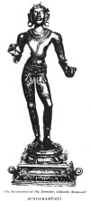

  
[Intangible Textual Heritage](../../index)  [Hinduism](../index.md) 
[Index](index)  [Previous](htss04)  [Next](htss06.md) 

------------------------------------------------------------------------

  
*Hymns of the Tamil Saivite Saints*, by F. Kingsbury and G.P. Phillips,
\[1921\], at Intangible Textual Heritage

------------------------------------------------------------------------

p. 68

 
[  
Click to enlarge](img/06800.jpg.md)  
SUNDARAMŪRTI  

p. 69

### SUNDARAMŪRTI SWAMI AND HIS HYMNS

p. 70 p. 71

### III.

### SUNDARAMŪRTI SWAMI

(Abbreviated as SUNDARAR)

The third of these hymn-writers, named in
full Sundaramūrti Swāmi, was, like Sambandar, a Brahman. He was born in
the South Arcot District, and is generally believed to have flourished
in the first quarter of the ninth century A.D. He evidently sat loose to
caste scruples, for neither of his two wives was a Brahman. One was a
dancing-girl in the Śaivite temple at Tiruvārūr, the modern Tiruvalur in
the Tanjore District, while the other was a Vēḷāḷa woman of
Tiruvottiyūr, now a suburb of Madras. His life seems to have been no
happier than life in polygamy usually is, and to add to his difficulties
he sometimes found himself without food for his ladies to eat. He
frankly praised God for what he could get, and on the whole his hymns
are on a lower spiritual plane than those of the first two writers,
though there are some which bear the marks of real spiritual experience.
Of the sixty-three saints whom Śaivites hold in special honour, Sundarar
seems to have been the last, for he sang the praises of the other
sixty-two.

p. 72 p. 73

Sundarar, as our first sample of him shews, was not only later than the
two authors whom we have been studying; he was the last of the
sixty-three canonized saints of Śaivism. A serious weakness of the
religion here shews its head. Śiva has his favourites, who can do no
wrong. The stanza is given in prose, for these names cannot fit into any
English metrical line. The first two will be recognised as names of the
poets whose work we have been considering. Nāḷaippōvān is Nandan, the
pariah saint. Silandi (= spider) is Kōchchengaṭ Chola, who figures
largely in early Tamil history.

65\. Ñānasambandar and Tirunāvukkarasar, skilled in the Tamil tongue,
Nāḷaippōvān, learned Sūdan, Sākkiyan, Silandi, Kaṇṇappan, Kaṇampullan,
these may do wrong, but yet Thou count’st it right. Hence have I come to
the sounding anklets of Thy feet, O lord of Tiruppungūr with its pools
where blossoms many a golden lotus gem.

------------------------------------------------------------------------

To English ears the metre of the next two verses, which are common
favourites, has a curious sound. It is a close reproduction of the
Tamil, so close that the tune of the Tamil hymn could be sung to the
English words.

66\. Golden art Thou in Thy form, girt around with the fierce tiger's
skin,  
Fair shines Thy tangle of hair, crowned with blooms from the kondai's
bright tree,  
Sov’reign, great jewel art Thou, the red ruby of Mal̤apāḍi,  
Mother, on Thee, none but Thee, can my heart evermore fixèd be.

p. 74 p. 75

67\. Clad in the little loin-cloth, my body with holy ash white,  
Lo I have come to Thy foot; O my head, I beseech Thee, take me.  
Portion of sword-eyed Umā, Thou red ruby of Mal̤apāḍi,  
Friend, ’tis on Thee, none but Thee, can my heart evermore fixèd be.

------------------------------------------------------------------------

Is the Śiva manifested at one shrine so distinct from the Śiva
manifested at another as to endanger the unity of God? If tradition is
right, the danger is very real, for Sundarar was already worshipping at
one shrine, Tiruvottiyūr, when he remembered the lord of Ārūr, and
deciding to go to him like a returning prodigal, sang this stanza.

68\. Ah sinful, I have left the path of love and service pure!  
  Now know I well the meaning of my sickness and my pain.  
  I will go worship. Fool! how long can I so far remain  
From Him, my pearl, my diamond rare, the king of great Ārūr.

------------------------------------------------------------------------

The joy in God which shines in our next hymn evidently rests on some
experience of divine grace which we should have liked to hear more
definitely described.

69\. O madman with the moon-crowned hair,  
  Thou lord of men, thou fount of grace,  
How to forget Thee could I bear?  
  My soul hath aye for Thee a place.  
Veṇṇey-nallūr, in "Grace's shrine"  
  South of the stream of Peṇṇai, there  
My father, I became all thine;  
  How could I now myself forswear?

p. 76 p. 77

70\. I roamed, a cur, for many days  
  Without a single thought of Thee,  
Roamed and grew weary, then such grace  
  As none could win Thou gayest me.  
Veṇṇey-nallūr, in "Grace's shrine"  
  Where bamboos fringe the Peṇṇai, there  
My Shepherd, I became all thine;  
  How could I now myself forswear?

71\. Henceforth for me no birth, no death,  
  No creeping age, bull-rider mine.  
Sinful and full of lying breath  
  Am I, hut do Thou mark me Thine.  
Veṇṇey-nallūr, in "Graces shrine"  
  South of the wooded Peṇṇai, there  
My Master, I became all thine;  
  How could I now myself forswear?

------------------------------------------------------------------------

The varying mood of the saint, now joyous and triumphant, now
plaintively looking for death, is reflected in the next two verses from
one hymn.

72\. Linked to naught else in life, my mind thinks only of Thy holy
feet.  
  I'm born anew, from this time forth I pass the way of birth no more.  
In Koḍumuḍi, lord austere, where wise men Thee with praises greet,  
  Should I forget Thee, my own tongue 'Hail, Śiva'! crying, would adore.

p. 78 p. 79

73\. When will the end draw nigh, sense fade, life close, and I the bier
ascend?  
  This, naught but this, is all my thought. But, lord of speech, Thou
light on high,  
Where the bright streams of Kāviri to Koḍumuḍi coolness lend,  
  Should I forget Thee, my own tongue to Thee would loud 'Hail, Śiva'
cry.

------------------------------------------------------------------------

God should deliver His own from death. The appeal here is to the
familiar story of Markandeya (see No. 3). Yama is the god of death who
gathers in the souls of men.

74\. The young saint refuge sought from Death;  
  To save him, Thou grim Death did’st slay,  
Such deeds Thy might accomplisheth,  
  And I who have beheld them pray  
"O Father, should dread Yama press  
  On me, forbid him. ’Tis my slave";  
Do Thou in green Pungūr confess.  
  I've reached Thy foot, and Thou can’st save."

------------------------------------------------------------------------

Sundarar is sure that Śiva will understand his perplexities in supplying
the needs of his fair ladies. For does not Śiva Himself bear the burden
of two ladies, Pārvati his consort, and Gangā (lady Ganges) in his hair?
Sundarar, in the legend with which these verses are connected, when one
of his wives was suffering hunger, miraculously received some uncooked
rice from Śiva. This was not enough; to complete the miracle Śiva must
remove the rice for him to Ārūr the abode of his fair one. This too was
done in answer to the hymn of which the next two stanzas are a sample.

p. 80 p. 81

75\. Ever I think but of Thee;  
  Daily in worship I bow;  
She of the sword-piercing eyes,  
  Leave her not suffering now.  
Kōḷili's lord, Thou didst give  
  Rice in Kuṇḍaiyūr this day.  
No man to bring it have I,  
  Bid it be sent me, I pray.

76\. Thou art half woman Thyself;  
  Gaṅgā is in Thy long hair.  
Full well canst Thou comprehend  
  Burden of women so fair.  
Kuṇḍaiyūr circled with gems,  
  There didst Thou give rice to-day.  
Source of all, wonderful one,  
  Bid it be sent me, I pray.

------------------------------------------------------------------------

The saint advises his fellow-poets to sing the praises of Śiva rather
than the praises of men because they seldom reward the poets. Śiva
rewards them here and hereafter. The Pāri mentioned in 78 was a
chieftain in the Tamil country in the early centuries of our era, famed
for his liberality.

77\. Though ye fawn on men of lies,  
  They to saints will nothing give;  
Sing not them, O poets wise,  
  But if ye would wealth receive  
Sing the Sire of Puhalūr;  
  Here your wants will be supplied,  
Pain will flee; there evermore  
  Ye will kings in heav’n abide.

p. 82 p. 83

78\. Call the weak by Bhima's name,  
  Style him Arjun with his bow,  
Give the mean man Pāri's fame,  
  Not a gift will he bestow.  
Sing, O bards, our holy God,  
  White with ash, in Puhalūr.  
In the deathless one's abode  
  Ye shall reign for evermore.

------------------------------------------------------------------------

Life and experience have no value, no reality. God alone is real, the
refuge from the unreal.

79\. Our life is all unreal,  
  Its end is only dust,  
Out of the sea of birth  
  Come ruin, pain and lust.  
Delay not to do good  
  But praise Ketāram's king,  
Whom Vishṇu and great Brahm  
  Vainly sought sorrowing.

------------------------------------------------------------------------

[Next: Manikka Vāsahar and his Hymns](htss06.md)

