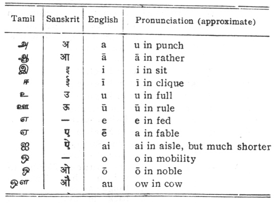
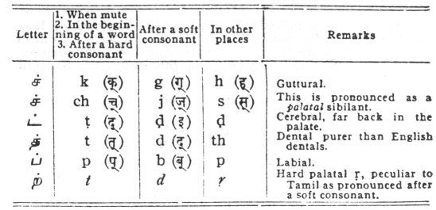

  
[Intangible Textual Heritage](../../index)  [Hinduism](../index.md) 
[Index](index)  [Previous](htss07)  [Next](htss09.md) 

------------------------------------------------------------------------

  
*Hymns of the Tamil Saivite Saints*, by F. Kingsbury and G.P. Phillips,
\[1921\], at Intangible Textual Heritage

------------------------------------------------------------------------

p. 129

### APPENDIX II

### SYSTEM OF TRANSLITERATION AND PRONUNCIATION OF TAMIL LETTERS

 

##### CONSONANTS

*NḄ.*—The Tamil alphabet is not fully phonetic as are the Sanskrit and
the other Dravidian alphabets. Several letters indicate different sounds
in different connections.

 

p. 130

 

Sanskrit words, unless they have become modified by long Tamil usage,
as, for example, in the author's name Māṇikka Vāsahar, are
transliterated according to Sanskrit pronunciation, on the system used
in other books in this series, the Sanskrit alphabet being represented
as follows:—

|     |     |     |     |     |
|-----|-----|-----|-----|-----|
| k   | kh  | g   | gh  | ṅ   |
| ch  | chh | j   | jh  | ñ   |
| ṭ   | ṭh  | ḍ   | ḍh  | ṇ   |
| t   | th  | d   | dh  | n   |
| p   | ph  | b   | bh  | m   |
| y   | r   | 1   | y   |     |
| ś   | sh  | s   | h   |     |
| ṛi  | ṁ   | ḥ   |     |     |

------------------------------------------------------------------------

[Next: Index](htss09.md)

