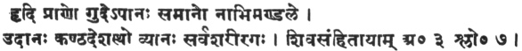
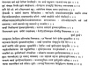
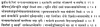

  
[Intangible Textual Heritage](../../index)  [Hinduism](../index.md) 
[Yoga](../yoga/index)  [Index](index)  [Previous](hyp03)  [Next](hyp05.md) 

------------------------------------------------------------------------

[Buy this Book at
Amazon.com](https://www.amazon.com/exec/obidos/ASIN/8121505755/internetsacredte.md)

------------------------------------------------------------------------

*Hatha Yoga Pradipika*, tr. by Pancham Sinh, \[1914\], at Intangible
Textual Heritage

------------------------------------------------------------------------

p. 13

### CHAPTER II.

*On Prâṇâyâma*.

\|\| २ \|\| दवितीयोपदेशः

\|\| 2 \|\| dvitīyopadeśaḥ

अथासने दॄधे योगी वशी हित-मिताशनः \|  
गुरूपदिष्ह्ट-मार्गेण पराणायामान्समभ्यसेत \|\| १ \|\|

athāsane dṝdhe yoghī vaśī hita-mitāśanaḥ \|  
ghurūpadiṣhṭa-mārgheṇa prāṇāyāmānsamabhyaset \|\| 1 \|\|

Posture becoming established, a Yogî, master of himself, eating salutary
and moderate food, should practise Prâṇâyâma, as instructed by his guru.
1.

छले वाते छलं छित्तं निश्छले निश्छलं भवेत\|\|  
योगी सथाणुत्वमाप्नोति ततो वायुं निरोधयेत \|\| २ \|\|

chale vāte chalaṃ chittaṃ niśchale niśchalaṃ bhavet\|\|  
yoghī sthāṇutvamāpnoti tato vāyuṃ nirodhayet \|\| 2 \|\|

Respiration being disturbed, the mind becomes disturbed. By restraining
respiration, the Yogî gets steadiness of mind 2.

यावद्वायुः सथितो देहे तावज्जीवनमुछ्यते \|  
मरणं तस्य निष्ह्क्रान्तिस्ततो वायुं निरोधयेत \|\| ३ \|\|

yāvadvāyuḥ sthito dehe tāvajjīvanamuchyate \|  
maraṇaṃ tasya niṣhkrāntistato vāyuṃ nirodhayet \|\| 3 \|\|

So long as the (breathing) air stays in the body, it is called life.
Death consists in the passing out of the (breathing) air. It is,
therefore, necessary to restrain the breath. 3.

मलाकलासु नाडीष्हु मारुतो नैव मध्यगः \|  
कथं सयादुन्मनीभावः कार्य-सिद्धिः कथं भवेत \|\| ४ \|\|

malākalāsu nāḍīṣhu māruto naiva madhyaghaḥ \|  
kathaṃ syādunmanībhāvaḥ kārya-siddhiḥ kathaṃ bhavet \|\| 4 \|\|

The breath does not pass through the middle channel (suṣumnâ), owing to
the impurities of the nâdîs. How can then success be attained, and how
can there be the unmanî avasthâ. 4.

शुद्धमेति यदा सर्वं नाडी-छक्रं मलाकुलम \|  
तदैव जायते योगी पराण-संग्रहणे कष्हमः \|\| ५ \|\|

śuddhameti yadā sarvaṃ nāḍī-chakraṃ malākulam \|  
tadaiva jāyate yoghī prāṇa-saṃghrahaṇe kṣhamaḥ \|\| 5 \|\|

When the whole system of nâdîs which is full of impurities, is cleaned,
then the Yogî becomes able to control the Prâṇa. 5.

पराणायामं ततः कुर्यान्नित्यं सात्त्विकया धिया \|  
यथा सुष्हुम्णा-नाडीस्था मलाः शुद्धिं परयान्ति छ \|\| ६ \|\|

prāṇāyāmaṃ tataḥ kuryānnityaṃ sāttvikayā dhiyā \|  
yathā suṣhumṇā-nāḍīsthā malāḥ śuddhiṃ prayānti cha \|\| 6 \|\|

Therefore, Prâṇâyâma should be performed daily with sâtwika buddhi
(intellect free from raja and tama or activity and sloth), in order to
drive out the impurities of the suṣumnâ. 6.

p. 14

*Method of performing Prâṇâyâma*.

बद्ध-पद्मासनो योगी पराणं छन्द्रेण पूरयेत \|  
धारयित्वा यथा-शक्ति भूयः सूर्येण रेछयेत \|\| ७ \|\|  
पराणं सूर्येण छाकॄष्ह्य पूरयेदुदरं शनैः \|  
विधिवत्कुम्भकं कॄत्वा पुनश्छन्द्रेण रेछयेत \|\| ८ \|\|

baddha-padmāsano yoghī prāṇaṃ chandreṇa pūrayet \|  
dhārayitvā yathā-śakti bhūyaḥ sūryeṇa rechayet \|\| 7 \|\|  
prāṇaṃ sūryeṇa chākṝṣhya pūrayedudaraṃ śanaiḥ \|  
vidhivatkumbhakaṃ kṝtvā punaśchandreṇa rechayet \|\| 8 \|\|

Sitting in the Padmâsana posture the Yogî should fill in the air through
the left nostril (closing the right one); and, keeping it confined
according to one's ability, it should be expelled slowly through the
sûrya (right nostril). Then, drawing in the air through the sûrya (right
nostril) slowly, the belly should be filled, and after performing
Kumbhaka as before, it should be expelled slowly through the chandra
(left nostril). 7 and 8.

येन तयजेत्तेन पीत्वा धारयेदतिरोधतः \|  
रेछयेछ्छ ततो\|अन्येन शनैरेव न वेगतः \|\| ९ \|\|

yena tyajettena pītvā dhārayedatirodhataḥ \|  
rechayechcha tato\|anyena śanaireva na veghataḥ \|\| 9 \|\|

Inhaling thus through the one, through which it was expelled, and having
restrained it there, till possible, it should be exhaled through the
other, slowly and not forcibly. 9.

पराणं छेदिडया पिबेन्नियमितं भूयो\|अन्यथा रेछयेत  
पीत्वा पिङ्गलया समीरणमथो बद्ध्वा तयजेद्वामया \|  
सूर्य-छन्द्रमसोरनेन विधिनाभ्यासं सदा तन्वतां  
शुद्धा नाडि-गणा भवन्ति यमिनां मास-तरयादूर्ध्वतः \|\| १० \|\|

prāṇaṃ chediḍayā pibenniyamitaṃ bhūyo\|anyathā rechayet  
pītvā pingghalayā samīraṇamatho baddhvā tyajedvāmayā \|  
sūrya-chandramasoranena vidhinābhyāsaṃ sadā tanvatāṃ  
śuddhā nāḍi-ghaṇā bhavanti yamināṃ māsa-trayādūrdhvataḥ \|\| 10 \|\|

If the air be inhaled through the left nostril, it should be expelled
again through the other, and filling it through the right nostril,
confining it there, it should be expelled through the left nostril. By
practising in this way, through the right and the left nostrils
alternately, the whole of the collection of the nâdîs of the yamîs
(practisers) becomes clean, *i.e.*, free from impurities, after 3 months
and over. 10.

परातर्मध्यन्दिने सायमर्ध-रात्रे छ कुम्भकान \|  
शनैरशीति-पर्यन्तं छतुर्वारं समभ्यसेत \|\| ११ \|\|

prātarmadhyandine sāyamardha-rātre cha kumbhakān \|  
śanairaśīti-paryantaṃ chaturvāraṃ samabhyaset \|\| 11 \|\|

Kumbhakas should be performed gradually 4 times during day and night,
*i.e.*, (morning, noon, evening and midnight), till the number of
Kumbhakas for one time is 80 and for day and night together it is 320.
11.

कनीयसि भवेद्स्वेद कम्पो भवति मध्यमे \|  
उत्तमे सथानमाप्नोति ततो वायुं निबन्धयेत \|\| १२ \|\|

kanīyasi bhavedsveda kampo bhavati madhyame \|  
uttame sthānamāpnoti tato vāyuṃ nibandhayet \|\| 12 \|\|

In the beginning there is perspiration, in the middle stage there is
quivering, and in the last or the 3rd stage one obtains steadiness; and
then the breath should be made steady or motionless. 12.

p. 15

जलेन शरम-जातेन गात्र-मर्दनमाछरेत \|  
दॄढता लघुता छैव तेन गात्रस्य जायते \|\| १३ \|\|

jalena śrama-jātena ghātra-mardanamācharet \|  
dṝḍhatā laghutā chaiva tena ghātrasya jāyate \|\| 13 \|\|

The perspiration exuding from exertion of practice should be rubbed into
the body (and not wiped), as by so doing the body becomes strong. 13.

अभ्यास-काले परथमे शस्तं कष्हीराज्य-भोजनम \|  
ततो\|अभ्यासे दॄढीभूते न तादॄङ-नियम-गरहः \|\| १४ \|\|

abhyāsa-kāle prathame śastaṃ kṣhīrājya-bhojanam \|  
tato\|abhyāse dṝḍhībhūte na tādṝng-niyama-ghrahaḥ \|\| 14 \|\|

During the first stage of practice the food consisting of milk and ghee
is wholesome. When the practice becomes established, no such restriction
is necessary. 14.

यथा सिंहो गजो वयाघ्रो भवेद्वश्यः शनैः शनैः \|  
तथैव सेवितो वायुरन्यथा हन्ति साधकम \|\| १५ \|\|

yathā siṃho ghajo vyāghro bhavedvaśyaḥ śanaiḥ śanaiḥ \|  
tathaiva sevito vāyuranyathā hanti sādhakam \|\| 15 \|\|

Just as lions, elephants and tigers are controlled by and by, so the
breath is controlled by slow degrees, otherwise (*i.e.*, by being hasty
or using too much force) it kills the practiser himself. 15.

पराणायामेन युक्तेन सर्व-रोग-कष्हयो भवेत \|  
अयुक्ताभ्यास-योगेन सर्व-रोग-समुद्गमः \|\| १६ \|\|

prāṇāyāmena yuktena sarva-rogha-kṣhayo bhavet \|  
ayuktābhyāsa-yoghena sarva-rogha-samudghamaḥ \|\| 16 \|\|

When Prâṇayama, etc., are performed properly, they eradicate all
diseases; but an improper practice generates diseases. 16.

हिक्का शवासश्छ कासश्छ शिरः-कर्णाक्ष्हि-वेदनाः \|  
भवन्ति विविधाः रोगाः पवनस्य परकोपतः \|\| १७ \|\|

hikkā śvāsaścha kāsaścha śiraḥ-karṇākṣhi-vedanāḥ \|  
bhavanti vividhāḥ roghāḥ pavanasya prakopataḥ \|\| 17 \|\|

Hiccough, asthma, cough, pain in the head, the ears, and the eyes; these
and other various kinds of diseases are generated by the disturbance of
the breath. 17.

युक्तं युक्तं तयजेद्वायुं युक्तं युक्तं छ पूरयेत \|  
युक्तं युक्तं छ बध्नीयादेवं सिद्धिमवाप्नुयात \|\| १८ \|\|

yuktaṃ yuktaṃ tyajedvāyuṃ yuktaṃ yuktaṃ cha pūrayet \|  
yuktaṃ yuktaṃ cha badhnīyādevaṃ siddhimavāpnuyāt \|\| 18 \|\|

The air should be expelled with proper tact and should be filled in
skilfully; and when it has been kept confined properly it brings
success. 18.

*NḄ.*—The above caution is necessary to warn the aspirants against
omitting any instruction; and, in their zeal to gain success or siddhis
early, to begin the practice, either by using too much force in filling
in, confining and expelling the air, or by omitting any instructions, it
may cause unnecessary pressure on their ears, eyes, &c„ and cause pain.
Every word in the instructions is full of meaning and is necessarily
used in the slokas, and should be followed very carefully and with due
attention. Thus there will be nothing to fear whatsoever. We are
inhaling and exhaling the air throughout our lives without any sort of
danger, and Prâṇayama being only a regular form of it, there should be
no cause to fear.

p. 16

यदा तु नाडी-शुद्धिः सयात्तथा छिह्नानि बाह्यतः \|  
कायस्य कॄशता कान्तिस्तदा जायते निश्छितम \|\| १९ \|\|

yadā tu nāḍī-śuddhiḥ syāttathā chihnāni bāhyataḥ \|  
kāyasya kṝśatā kāntistadā jāyate niśchitam \|\| 19 \|\|

When the nâdîs become free from impurities, and there appear the outward
signs of success, such as lean body and glowing colour, then one should
feel certain of success. 19.

यथेष्ह्टं धारणं वायोरनलस्य परदीपनम \|  
नादाभिव्यक्तिरारोग्यं जायते नाडि-शोधनात \|\| २० \|\|

yatheṣhṭaṃ dhāraṇaṃ vāyoranalasya pradīpanam \|  
nādābhivyaktirāroghyaṃ jāyate nāḍi-śodhanāt \|\| 20 \|\|

By removing the impurities, the air can be restrained, according to
one's wish and the appetite is increased, the divine sound is awakened,
and the body becomes healthy. 20.

मेद-शलेष्ह्माधिकः पूर्वं षहट-कर्माणि समाछरेत \|  
अन्यस्तु नाछरेत्तानि दोष्हाणां समभावतः \|\| २१ \|\|

meda-śleṣhmādhikaḥ pūrvaṃ ṣhaṭ-karmāṇi samācharet \|  
anyastu nācharettāni doṣhāṇāṃ samabhāvataḥ \|\| 21 \|\|

If there be excess of fat or phlegm in the body, the six kinds of kriyâs
(duties) should be performed first. But others, not suffering from the
excess of these, should not perform them. 21.

धौतिर्बस्तिस्तथा नेतिस्त्राटकं नौलिकं तथा \|  
कपाल-भातिश्छैतानि षहट-कर्माणि परछक्ष्हते \|\| २२ \|\|

dhautirbastistathā netistrāṭakaṃ naulikaṃ tathā \|  
kapāla-bhātiśchaitāni ṣhaṭ-karmāṇi prachakṣhate \|\| 22 \|\|

The six kinds of duties are: Dhauti, Basti, Neti, Trâtaka, Nauti and
Kapâla Bhâti. These are called the six actions वटूकमि 22.

कर्म षहट्कमिदं गोप्यं घट-शोधन-कारकम \|  
विछित्र-गुण-सन्धाय पूज्यते योगि-पुणगवैः \|\| २३ \|\|

karma ṣhaṭkamidaṃ ghopyaṃ ghaṭa-śodhana-kārakam \|  
vichitra-ghuṇa-sandhāya pūjyate yoghi-pungghavaiḥ \|\| 23 \|\|

These six kinds of actions which cleanse the body should be kept secret.
They produce extraordinary attributes and are performed with earnestness
by the best of Yogîs. 23.

*The Dhauti* (धौति)

तत्र धौतिः  
छतुर-अङ्गुल-विस्तारं हस्त-पञ्छ-दशायतम \|  
गुरूपदिष्ह्ट-मार्गेण सिक्तं वस्त्रं शनैर्ग्रसेत \|  
पुनः परत्याहरेछ्छैतदुदितं धौति-कर्म तत \|\| २४ \|\|

tatra dhautiḥ  
chatur-angghula-vistāraṃ hasta-pañcha-daśāyatam \|  
ghurūpadiṣhṭa-mārgheṇa siktaṃ vastraṃ śanairghraset \|  
punaḥ pratyāharechchaitaduditaṃ dhauti-karma tat \|\| 24 \|\|

A strip of cloth, about 3 inches wide and 15 cubits long, is pushed in
(swallowed), when moist with warm water, through the passage shown by
the guru, and is taken out again. This is called Dhauti Karma. 24.

*NḄ.*—The strip should be moistened with a little warm water, and the
end should be held with the teeth. It is swallowed slowly, little by
little; thus, first day 1 cubit, 2nd day 2 cubits, 3rd day 3 cubits, and
so on. After swallowing it the stomach should be given a good, round
motion from left to right, and then it should be taken out slowly and
gently.

p. 17

कास-शवास-पलीह-कुष्ह्ठं कफरोगाश्छ विंशतिः \|  
धौति-कर्म-परभावेण परयान्त्येव न संशयः \|\| २५ \|\|

kāsa-śvāsa-plīha-kuṣhṭhaṃ kapharoghāścha viṃśatiḥ \|  
dhauti-karma-prabhāveṇa prayāntyeva na saṃśayaḥ \|\| 25 \|\|

There is no doubt, that cough, asthma, enlargement of the spleen,
leprosy, and 20 kinds of diseases born of phlegm, disappear by the
practice of Dhauti Karma. 25.

*The Basti* (बस्तिकर्म)

अथ बस्तिः  
नाभि-दघ्न-जले पायौ नयस्त-नालोत्कटासनः \|  
आधाराकुनछनं कुर्यात्क्ष्हालनं बस्ति-कर्म तत \|\| २६ \|\|

atha bastiḥ  
nābhi-daghna-jale pāyau nyasta-nālotkaṭāsanaḥ \|  
ādhārākuñchanaṃ kuryātkṣhālanaṃ basti-karma tat \|\| 26 \|\|

Squatting in navel-deep water, and introducing a six inches long, smooth
piece of ½ an inch diameter pipe, open at both ends, half inside the
anus; it (anus) should he drawn up (contracted) and then expelled. This
washing is called the Basti Karma. 26.

गुल्म-पलीहोदरं छापि वात-पित्त-कफोद्भवाः \|  
बस्ति-कर्म-परभावेण कष्हीयन्ते सकलामयाः \|\| २७ \|\|

ghulma-plīhodaraṃ chāpi vāta-pitta-kaphodbhavāḥ \|  
basti-karma-prabhāveṇa kṣhīyante sakalāmayāḥ \|\| 27 \|\|

By practising this Basti Karma, colic, enlarged spleen, and dropsy,
arising from the disorders of Vâta (air), pitta (bile) and kapha
(phlegm), are all cured. 27.

धान्त्वद्रियान्तः-करण-परसादं  
दधाछ्छ कान्तिं दहन-परदीप्तम \|  
अशेष्ह-दोष्होपछयं निहन्याद  
अभ्यस्यमानं जल-बस्ति-कर्म \|\| २८ \|\|

dhāntvadriyāntaḥ-karaṇa-prasādaṃ  
dadhāchcha kāntiṃ dahana-pradīptam \|  
aśeṣha-doṣhopachayaṃ nihanyād  
abhyasyamānaṃ jala-basti-karma \|\| 28 \|\|

By practising Basti with water, the Dhâtâs, the Indriyas and the mind
become calm. It gives glow and tone to the body and increases the
appetite. All the disorders disappear. 28.

*The Neti* (नेति).

अथ नेतिः  
सूत्रं वितस्ति-सुस्निग्धं नासानाले परवेशयेत \|  
मुखान्निर्गमयेछ्छैष्हा नेतिः सिद्धैर्निगद्यते \|\| २९ \|\|

atha netiḥ  
sūtraṃ vitasti-susnighdhaṃ nāsānāle praveśayet \|  
mukhānnirghamayechchaiṣhā netiḥ siddhairnighadyate \|\| 29 \|\|

A cord made of threads and about six inches long, should be passed
through the passage of the nose and the end taken out in the mouth. This
is called by adepts the Neti Karma. 29.

कपाल-शोधिनी छैव दिव्य-दॄष्ह्टि-परदायिनी \|  
जत्रूर्ध्व-जात-रोगौघं नेतिराशु निहन्ति छ \|\| ३० \|\|

kapāla-śodhinī chaiva divya-dṝṣhṭi-pradāyinī \|  
jatrūrdhva-jāta-roghaughaṃ netirāśu nihanti cha \|\| 30 \|\|

The Neti is the cleaner of the brain and giver of divine sight. It soon
destroys all the diseases of the cervical and scapular regions. 30.

p. 18

*The Trâtaka* (तराटक).

अथ तराटकम  
निरीक्ष्हेन्निश्छल-दॄशा सूक्ष्ह्म-लक्ष्ह्यं समाहितः \|  
अश्रु-सम्पात-पर्यन्तमाछार्यैस्त्राटकं समॄतम \|\| ३१ \|\|

atha trāṭakam  
nirīkṣhenniśchala-dṝśā sūkṣhma-lakṣhyaṃ samāhitaḥ \|  
aśru-sampāta-paryantamāchāryaistrāṭakaṃ smṝtam \|\| 31 \|\|

Being calm, one should gaze steadily at a small mark, till eyes are
filled with tears. This is called Trataka by âchâryas. 31.

मोछनं नेत्र-रोगाणां तन्दाद्रीणां कपाटकम \|  
यत्नतस्त्राटकं गोप्यं यथा हाटक-पेटकम \|\| ३२ \|\|

mochanaṃ netra-roghāṇāṃ tandādrīṇāṃ kapāṭakam \|  
yatnatastrāṭakaṃ ghopyaṃ yathā hāṭaka-peṭakam \|\| 32 \|\|

Trâtaka destroys the eye diseases and removes sloth, etc. It should be
kept secret very carefully, like a box of jewellery. 32.

*The Nauli* (नौलि).

अथ नौलिः  
अमन्दावर्त-वेगेन तुन्दं सव्यापसव्यतः \|  
नतांसो भरामयेदेष्हा नौलिः सिद्धैः परशस्यते \|\| ३३ \|\|

atha nauliḥ  
amandāvarta-veghena tundaṃ savyāpasavyataḥ \|  
natāṃso bhrāmayedeṣhā nauliḥ siddhaiḥ praśasyate \|\| 33 \|\|

Sitting on the toes with heels raised above the ground, and the palms
resting on the ground, and in this bent posture the belly is moved
forcibly from left to right just, as in vomiting. This is called by
adepts the Nauli Karma. 33.

मन्दाग्नि-सन्दीपन-पाछनादि-  
सन्धापिकानन्द-करी सदैव \|  
अशेष्ह-दोष्ह-मय-शोष्हणी छ  
हठ-करिया मौलिरियं छ नौलिः \|\| ३४ \|\|

mandāghni-sandīpana-pāchanādi-  
sandhāpikānanda-karī sadaiva \|  
aśeṣha-doṣha-maya-śoṣhaṇī cha  
haṭha-kriyā mauliriyaṃ cha nauliḥ \|\| 34 \|\|

It removes dyspepsia, increases appetite and digestion, and is like the
goddess of creation, and causes happiness. It dries up all the
disorders. This Nauli is an excellent exercise in Haṭha Yoga. 34.

*The Kapâla Bhâti* कपाल भाति.

अथ कपालभातिः  
भस्त्रावल्लोह-कारस्य रेछ-पूरौ ससम्भ्रमौ \|  
कपालभातिर्विख्याता कफ-दोष्ह-विशोष्हणी \|\| ३५ \|\|

atha kapālabhātiḥ  
bhastrāvalloha-kārasya recha-pūrau sasambhramau \|  
kapālabhātirvikhyātā kapha-doṣha-viśoṣhaṇī \|\| 35 \|\|

When inhalation and exhalation are performed very quickly, like a pair
of bellows of a blacksmith, it dries up all the disorders from the
excess of phlegm, and is known as Kapâla Bhâti. 35.

षहट-कर्म-निर्गत-सथौल्य-कफ-दोष्ह-मलादिकः \|  
पराणायामं ततः कुर्यादनायासेन सिद्ध्यति \|\| ३६ \|\|

ṣhaṭ-karma-nirghata-sthaulya-kapha-doṣha-malādikaḥ \|  
prāṇāyāmaṃ tataḥ kuryādanāyāsena siddhyati \|\| 36 \|\|

When Prâṇâyâma is performed after getting rid of obesity born of the
defects phlegm, by the performance of the six duties, it easily brings
success 36.

p. 19

पराणायामैरेव सर्वे परशुष्ह्यन्ति मला इति \|  
आछार्याणां तु केष्हांछिदन्यत्कर्म न संमतम \|\| ३७ \|\|

prāṇāyāmaireva sarve praśuṣhyanti malā iti \|  
āchāryāṇāṃ tu keṣhāṃchidanyatkarma na saṃmatam \|\| 37 \|\|

Some âchâryâs (teachers) do not advocate any other practice, being of
opinion that all the impurities are dried up by the practice of
Prâṇâyâma. 37.

*Gaja Karaṇi* (गजकरणी)

अथ गज-करणी  
उदर-गत-पदार्थमुद्वमन्ति  
पवनमपानमुदीर्य कण्ठ-नाले \|  
करम-परिछय-वश्य-नाडि-छक्रा  
गज-करणीति निगद्यते हठज्ञैः \|\| ३८ \|\|

atha ghaja-karaṇī  
udara-ghata-padārthamudvamanti  
pavanamapānamudīrya kaṇṭha-nāle \|  
krama-parichaya-vaśya-nāḍi-chakrā  
ghaja-karaṇīti nighadyate haṭhajñaiḥ \|\| 38 \|\|

By carrying the Apâna Vâyû up to the throat, the food, etc., in the
stomach are vomited. By degrees, the system of Nâdîs (Śankhinî) becomes
known. This is called in Haṭha as Gaja Karaṇi. 38.

बरह्मादयो\|अपि तरिदशाः पवनाभ्यास-तत्पराः \|  
अभूवन्नन्तक-भयात्तस्मात्पवनमभ्यसेत \|\| ३९ \|\|

brahmādayo\|api tridaśāḥ pavanābhyāsa-tatparāḥ \|  
abhūvannantaka-bhyāttasmātpavanamabhyaset \|\| 39 \|\|

Brahmâ, and other Devas were always engaged in the exercise of
Prâṇâyâma, and, by means of it, got rid of the fear of death. Therefore,
one should practise prâṇâyâma regularly. 39.

यावद्बद्धो मरुद-देशे यावछ्छित्तं निराकुलम \|  
यावद्दॄष्ह्टिर्भ्रुवोर्मध्ये तावत्काल-भयं कुतः \|\| ४० \|\|

yāvadbaddho marud-deśe yāvachchittaṃ nirākulam \|  
yāvaddṝṣhṭirbhruvormadhye tāvatkāla-bhayaṃ kutaḥ \|\| 40 \|\|

So long as the breath is restrained in the body, so long as the mind is
undisturbed, and so long as the gaze is fixed between the eyebrows,
there is no fear from Death. 40.

विधिवत्प्राण-संयामैर्नाडी-छक्रे विशोधिते \|  
सुष्हुम्णा-वदनं भित्त्वा सुखाद्विशति मारुतः \|\| ४१ \|\|

vidhivatprāṇa-saṃyāmairnāḍī-chakre viśodhite \|  
suṣhumṇā-vadanaṃ bhittvā sukhādviśati mārutaḥ \|\| 41 \|\|

When the system of Nâdis becomes clear of the impurities by properly
controlling the prâṇa, then the air, piercing the entrance of the
Suśumṇâ, enters it easily. 41.

*Manomanî*. (मनोन्मनी)

अथ मनोन्मनी  
मारुते मध्य-संछारे मनः-सथैर्यं परजायते \|  
यो मनः-सुस्थिरी-भावः सैवावस्था मनोन्मनी \|\| ४२ \|\|

atha manonmanī  
mārute madhya-saṃchāre manaḥ-sthairyaṃ prajāyate \|  
yo manaḥ-susthirī-bhāvaḥ saivāvasthā manonmanī \|\| 42 \|\|

Steadiness of mind comes when the air moves Freely in the middle. That
is the manonmanî (मनोन्मनी) condition, which is attained when the mind
becomes calm. 42.

p. 20

तत-सिद्धये विधानज्ञाश्छित्रान्कुर्वन्ति कुम्भकान \|  
विछित्र कुम्भकाभ्यासाद्विछित्रां सिद्धिमाप्नुयात \|\| ४३ \|\|

tat-siddhaye vidhānajñāśchitrānkurvanti kumbhakān \|  
vichitra kumbhakābhyāsādvichitrāṃ siddhimāpnuyāt \|\| 43 \|\|

To accomplish it, various Kumbhakas are performed by those who are
expert in the methods; for, by the practice of different Kumbhakas,
wonderful success is attained. 43

*Different hinds of Kumbhakas*.

अथ कुम्भक-भेदाः  
सूर्य-भेदनमुज्जायी सीत्कारी शीतली तथा \|  
भस्त्रिका भरामरी मूर्छ्छा पलाविनीत्यष्ह्ट-कुम्भकाः \|\| ४४ \|\|

atha kumbhaka-bhedāḥ  
sūrya-bhedanamujjāyī sītkārī śītalī tathā \|  
bhastrikā bhrāmarī mūrchchā plāvinītyaṣhṭa-kumbhakāḥ \|\| 44 \|\|

Kumbhakas are of eight kinds, viz., Sûrya Bhedan, Ujjâyî, Sîtkarî,
Sîtalî, Bhastrikâ, Bhrâmarî, Mûrchhâ, and Plâvinî. 44

पूरकान्ते तु कर्तव्यो बन्धो जालन्धराभिधः \|  
कुम्भकान्ते रेछकादौ कर्तव्यस्तूड्डियानकः \|\| ४५ \|\|

pūrakānte tu kartavyo bandho jālandharābhidhaḥ \|  
kumbhakānte rechakādau kartavyastūḍḍiyānakaḥ \|\| 45 \|\|

At the end of Pûraka, Jâlandhara Bandha should be performed, and at the
end of Kumbhaka, and at the beginning of Rechaka, Uddiyâna Bandha should
be performed. 45

*NḄ.*—Pûraka is filling in of the air from outside.

Kumbhaka is the keeping the air confined inside. Rechaka is expelling
the confined air. The instructions for Puraka, Kumbhaka and Rechaka will
be found at their proper place and should he carefully followed.

अधस्तात्कुनछनेनाशु कण्ठ-सङ्कोछने कॄते \|  
मध्ये पश्छिम-तानेन सयात्प्राणो बरह्म-नाडिगः \|\| ४६ \|\|

adhastātkuñchanenāśu kaṇṭha-sangkochane kṝte \|  
madhye paśchima-tānena syātprāṇo brahma-nāḍighaḥ \|\| 46 \|\|

By drawing up from below (Mûla Bandha) and contracting the throat
(Jâlandhara Bandha) and by pulling back the middle of the front portion
of the body (*i.e.*, belly), the Prâṇa goes to the Brahma Nâdî
(Suṣumnâ). 46

The middle hole, through the vertebral column, through which the spinal
cord passes, is called the Suṣumnâ Nâdî of the Yogîs. The two other
sympathetic cords, one on each aide of the spinal cord, are called the
Idâ and the Pingalâ Nâdîs. These will be described later on.

आपानमूर्ध्वमुत्थाप्य पराणं कण्ठादधो नयेत \|  
योगी जरा-विमुक्तः सन्ष्होडशाब्द-वया भवेत \|\| ४७ \|\|

āpānamūrdhvamutthāpya prāṇaṃ kaṇṭhādadho nayet \|  
yoghī jarā-vimuktaḥ sanṣhoḍaśābda-vayā bhavet \|\| 47 \|\|

By pulling up the Apâna Vâyu and by forcing the Prâṇa Vâyu down the
throat, the Yogî, liberated from old age, becomes young, as it were 16
years old. 47

*Note*.— 

The seat of the Prâṇa is the heart; of the Apâna anus; of the Samâna the
region about the navel; of the Udâna the throat; while the Vyâna moves
throughout the body.

p. 21

*Sûrya Bhedana* (सूर्य भेदन).

अथ सूर्य-भेदनम  
आसने सुखदे योगी बद्ध्वा छैवासनं ततः \|  
दक्ष्ह-नाड्या समाकॄष्ह्य बहिःस्थं पवनं शनैः \|\| ४८ \|\|

atha sūrya-bhedanam  
āsane sukhade yoghī baddhvā chaivāsanaṃ tataḥ \|  
dakṣha-nāḍyā samākṝṣhya bahiḥsthaṃ pavanaṃ śanaiḥ \|\| 48 \|\|

Taking any comfortable posture and performing the âsana, the Yogî should
draw in the air slowly, through the right nostril. 48

आकेशादानखाग्राछ्छ निरोधावधि कुम्भयेत \|  
ततः शनैः सव्य-नाड्या रेछयेत्पवनं शनैः \|\| ४९ \|\|

ākeśādānakhāghrāchcha nirodhāvadhi kumbhayet \|  
tataḥ śanaiḥ savya-nāḍyā rechayetpavanaṃ śanaiḥ \|\| 49 \|\|

Then it should be confined within, so that it fills from the nails to
the tips of the hair, and then let out through the left nostril slowly.
49

*Note*.—This is to be done alternately with both the nostrils, drawing
in through the one, expelling through the other, and vice versa.

कपाल-शोधनं वात-दोष्ह-घनं कॄमि-दोष्ह-हॄत \|  
पुनः पुनरिदं कार्यं सूर्य-भेदनमुत्तमम \|\| ५० \|\|

kapāla-śodhanaṃ vāta-doṣha-ghnaṃ kṝmi-doṣha-hṝt \|  
punaḥ punaridaṃ kāryaṃ sūrya-bhedanamuttamam \|\| 50 \|\|

This excellent Sûrya Bhedana cleanses the forehead (frontal sinuses),
destroys the disorders of Vâta, and removes the worms, and, therefore,
it should be performed again and again. 50

*Note*.—

  [  
Click to enlarge](img/02101.jpg.md)

p. 22

  [  
Click to enlarge](img/02200.jpg.md)

Translation: I am going to describe the procedure of the practice of
Yoga, in order that Yogîs may succeed. A wise man should leave his bed
in the Uṣâ Kâla (*i.e.*, at the peep of dawn or 4 o'clock) in the
morning. 1.

Remembering his guru over his head, and his desired deity in his heart,
after answering the calls of nature, and cleaning his mouth, he should
apply Bhaṣma (ashes). 2.

In a clean spot, clean room and charming ground, he should spread a soft
âsana (cloth for sitting on). Having seated on it and remembering, in
his mind his guru and his God. 3.

Having extolled the place and the time and taking up the vow thus: 'To
day by the grace of God, I will perform Prâṇâyâmas with âsanas for
gaining samâdhi (trance) and its fruits.' He should salute the infinite
Deva, Lord of the Nâgas, to ensure success in the âsanas (postures).
4.

Salutation to the Lord of the Nâgas, who is adorned with thousands of
heads, set with brilliant jewels (maṇis), and who has sustained the
whole universe, nourishes it, and is infinite. After this he should
begin his exercise of âsanas and when fatigued, he should practise Śava
âsana. Should there be no fatigue, he should not practise it. 5.

Before Kumbhaka, he should perform Viparîta Karṇî mudrâ, in order that
he may be able to perform Jâlandhar bandha comfortably. 6.

Sipping a little water, he should begin the exercise of Prâṇâyâma, after
saluting Yogindras, as described in the Karma Parana, in the words of
Śiva. 7.

Such as "Saluting Yogindras and their disciples and gurû Vinâyaka, the
Yogî should unite with me with composed mind." 8.

While practising, he should sit with Siddhâsana, and having performed
*bandha* and Kumbhaka, should begin with 10 Prâṇâyâmas the first day,
and go on increasing 5 daily. 9.

With composed mind 80 Kumbhakas should be performed at a time; beginning
first with the chandra (the left nostril) and then sûrya (the right
nostril). 10.

This has been spoken of by wise men as Aṇuloma and Viloma. Having
practised Sûrya Bhedan, with Bandhas, the wise rust) should practise
Ujjâyî and then Sîtkârî Śîtalî, and Bhastrikâ, he may practice others or
not. 11-12.

He should practise mudrâs properly, as instructed by his guru. Then
sitting with Padmâsana, he should hear anâhata nâda attentively. 13.

He should *resign the fruits of all his practice reverently to God*,
and, on rising on the completion of the practice, a warm bath should be
taken. 14.

The bath should bring all the daily duties briefly to an end. At noon
also a little rest should be taken at the end of the exercise, and then
food should be taken. 15.

Yogîs should always take wholesome food and never anything unwholesome.
After dinner he should eat Ilâchî or lavanga. 16.

Some like camphor, and betel leaf. To the Yogîs, practising Prâṇâyâma,
betel leaf without powders, i, e., lime, nuts and kâtha, is beneficial.
17.

After taking food he should read books treating of salvation, or hear
Purâṇas and repeat the name of God. 18.

p. 23

In the evening the exercise should be begun after finishing sandyhâ, as
before, beginning the practice 3 ghatikâ or one hour before the sun
sets. 19.

Evening sandhyâ should always be performed after practice, and Haṭha
Yoga should be practised at midnight. 20.

Viparîta Karṇi is to be practised in the evening and at midnight, and
not just after eating, as it does no good at this time. 21.

*Ujjâyî* (उज्जायी)

अथ उज्जायी  
मुखं संयम्य नाडीभ्यामाकॄष्ह्य पवनं शनैः \|  
यथा लगति कण्ठात्तु हॄदयावधि स-सवनम \|\| ५१ \|\|

atha ujjāyī  
mukhaṃ saṃyamya nāḍībhyāmākṝṣhya pavanaṃ śanaiḥ \|  
yathā laghati kaṇṭhāttu hṝdayāvadhi sa-svanam \|\| 51 \|\|

Having closed the opening of the [Nâdî](errata.htm#1) (Larynx.md), the air
should be drawn in such a way that it goes touching from the throat to
the chest, and making noise while passing. 51.

पूर्ववत्कुम्भयेत्प्राणं रेछयेदिडया तथा \|  
शलेष्ह्म-दोष्ह-हरं कण्ठे देहानल-विवर्धनम \|\| ५२ \|\|

pūrvavatkumbhayetprāṇaṃ rechayediḍayā tathā \|  
śleṣhma-doṣha-haraṃ kaṇṭhe dehānala-vivardhanam \|\| 52 \|\|

It should be restrained, as before, and then let out through Idâ (the
left nostril). This removes śleṣmâ (phlegm) in the throat and increases
the appetite. 52.

नाडी-जलोदराधातु-गत-दोष्ह-विनाशनम \|  
गछ्छता तिष्ह्ठता कार्यमुज्जाय्याख्यं तु कुम्भकम \|\| ५३ \|\|

nāḍī-jalodarādhātu-ghata-doṣha-vināśanam \|  
ghachchatā tiṣhṭhatā kāryamujjāyyākhyaṃ tu kumbhakam \|\| 53 \|\|

It destroys the defects of the nâdîs, dropsy and disorders of Dhâtu
(humours). Ujjâyî should be performed in all conditions of life, even
while walking or sitting. 53.

*Sîtkârî* (सीत्कारी)

अथ सीत्कारी  
सीत्कां कुर्यात्तथा वक्त्रे घराणेनैव विजॄम्भिकाम \|  
एवमभ्यास-योगेन काम-देवो दवितीयकः \|\| ५४ \|\|

atha sītkārī  
sītkāṃ kuryāttathā vaktre ghrāṇenaiva vijṝmbhikām \|  
evamabhyāsa-yoghena kāma-devo dvitīyakaḥ \|\| 54 \|\|

Sîtkârî is performed by drawing in the air through the mouth, keeping
the tongue between the lips. The air thus drawn in should not be
expelled through the mouth. By practising in this way, one becomes next
to the God of Love in beauty. 54.

योगिनी छक्र-संमान्यः सॄष्ह्टि-संहार-कारकः \|  
न कष्हुधा न तॄष्हा निद्रा नैवालस्यं परजायते \|\| ५५ \|\|

yoghinī chakra-saṃmānyaḥ sṝṣhṭi-saṃhāra-kārakaḥ \|  
na kṣhudhā na tṝṣhā nidrā naivālasyaṃ prajāyate \|\| 55 \|\|

He is regarded adorable by the Yoginîs and becomes the destroyer of the
cycle of creation, He is not afflicted with hunger, thirst, sleep or
lassitude. 55.

p. 24

भवेत्सत्त्वं छ देहस्य सर्वोपद्रव-वर्जितः \|  
अनेन विधिना सत्यं योगीन्द्रो भूमि-मण्डले \|\| ५६ \|\|

bhavetsattvaṃ cha dehasya sarvopadrava-varjitaḥ \|  
anena vidhinā satyaṃ yoghīndro bhūmi-maṇḍale \|\| 56 \|\|

The Satwa of his body becomes free from all the disturbances. In truth,
he becomes the lord of the Yogîs in this world. 56.

Śîtalî (शीतली)

अथ शीतली  
जिह्वया वायुमाकॄष्ह्य पूर्ववत्कुम्भ-साधनम \|  
शनकैर्घ्राण-रन्ध्राभ्यां रेछयेत्पवनं सुधीः \|\| ५७ \|\|

atha śītalī  
jihvayā vāyumākṝṣhya pūrvavatkumbha-sādhanam \|  
śanakairghrāṇa-randhrābhyāṃ rechayetpavanaṃ sudhīḥ \|\| 57 \|\|

As in the above (Sîtkári), the tongue to be protruded a little out of
the lips, when the air is drawn in. It is kept confined, as before, and
then expelled slowly through the nostrils. 57.

गुल्म-पलीहादिकान्रोगान्ज्वरं पित्तं कष्हुधां तॄष्हाम \|  
विष्हाणि शीतली नाम कुम्भिकेयं निहन्ति हि \|\| ५८ \|\|

ghulma-plīhādikānroghānjvaraṃ pittaṃ kṣhudhāṃ tṝṣhām \|  
viṣhāṇi śītalī nāma kumbhikeyaṃ nihanti hi \|\| 58 \|\|

This Śîtalî Ḳumbhikâ cures colic, (enlarged) spleen, fever, disorders of
bile, hunger, thirst, and counteracts poisons. 58.

*The Bhastrikâ* (भस्त्रिका)

अथ भस्त्रिका  
ऊर्वोरुपरि संस्थाप्य शुभे पाद-तले उभे \|  
पद्मासनं भवेदेतत्सर्व-पाप-परणाशनम \|\| ५९ \|\|

atha bhastrikā  
ūrvorupari saṃsthāpya śubhe pāda-tale ubhe \|  
padmāsanaṃ bhavedetatsarva-pāpa-praṇāśanam \|\| 59 \|\|

The Padma Âsana consists in crossing the feet and placing them on both
the thighs; it is the destroyer of all sins. 59.

सम्यक्पद्मासनं बद्ध्वा सम-गरीवोदरः सुधीः \|  
मुखं संयम्य यत्नेन पराणं घराणेन रेछयेत \|\| ६० \|\|

samyakpadmāsanaṃ baddhvā sama-ghrīvodaraḥ sudhīḥ \|  
mukhaṃ saṃyamya yatnena prāṇaṃ ghrāṇena rechayet \|\| 60 \|\|

Binding the Padma-Âsana and keeping the body straight, closing the mouth
carefully, let the air be expelled through the nose. 60.

यथा लगति हॄत-कण्ठे कपालावधि स-सवनम \|  
वेगेन पूरयेछ्छापि हॄत-पद्मावधि मारुतम \|\| ६१ \|\|

yathā laghati hṝt-kaṇṭhe kapālāvadhi sa-svanam \|  
veghena pūrayechchāpi hṝt-padmāvadhi mārutam \|\| 61 \|\|

It should be filled up to the lotus of the heart, by drawing it in with
force, making noise and touching the throat, the chest and the head.
61.

पुनर्विरेछयेत्तद्वत्पूरयेछ्छ पुनः पुनः \|  
यथैव लोहकारेण भस्त्रा वेगेन छाल्यते \|\| ६२ \|\|

punarvirechayettadvatpūrayechcha punaḥ punaḥ \|  
yathaiva lohakāreṇa bhastrā veghena chālyate \|\| 62 \|\|

It should he expelled again and filled again and again as before, just
as a pair of bellows of the blacksmith is worked. 62.

p. 25

तथैव सव-शरीर-सथं छालयेत्पवनं धिया \|  
यदा शरमो भवेद्देहे तदा सूर्येण पूरयेत \|\| ६३ \|\|

tathaiva sva-śarīra-sthaṃ chālayetpavanaṃ dhiyā \|  
yadā śramo bhaveddehe tadā sūryeṇa pūrayet \|\| 63 \|\|

In the same way, the air of the body should be moved intelligently,
filling it through Sûrya when fatigue is experienced. 63.

यथोदरं भवेत्पूर्णमनिलेन तथा लघु \|  
धारयेन्नासिकां मध्या-तर्जनीभ्यां विना दॄढम \|\| ६४ \|\|

yathodaraṃ bhavetpūrṇamanilena tathā laghu \|  
dhārayennāsikāṃ madhyā-tarjanībhyāṃ vinā dṝḍham \|\| 64 \|\|

The air should be drawn in through the right nostril by pressing the
thumb against the left side of the nose, so as to close the left
nostril; and when filled to the full, it should be closed with the
fourth finger (the one next to the little finger) and kept confined.
64.

विधिवत्कुम्भकं कॄत्वा रेछयेदिडयानिलम \|  
वात-पित्त-शलेष्ह्म-हरं शरीराग्नि-विवर्धनम \|\| ६५ \|\|

vidhivatkumbhakaṃ kṝtvā rechayediḍayānilam \|  
vāta-pitta-śleṣhma-haraṃ śarīrāghni-vivardhanam \|\| 65 \|\|

Having confined it properly, it should be expelled through the Idâ (left
nostril). This destroys Vâta, pitta (bile) and phlegm and increases the
digestive power (the gastric fire). 65.

कुण्डली बोधकं कष्हिप्रं पवनं सुखदं हितम \|  
बरह्म-नाडी-मुखे संस्थ-कफाद्य-अर्गल-नाशनम \|\| ६६ \|\|

kuṇḍalī bodhakaṃ kṣhipraṃ pavanaṃ sukhadaṃ hitam \|  
brahma-nāḍī-mukhe saṃstha-kaphādy-arghala-nāśanam \|\| 66 \|\|

It quickly awakens the Kuṇḍalinî, purifies the system, gives pleasure,
and is beneficial. It destroys phlegm and the impurities accumulated at
the entrance of the Brahma Nâdî. 66.

सम्यग्गात्र-समुद्भूत-गरन्थि-तरय-विभेदकम \|  
विशेष्हेणैव कर्तव्यं भस्त्राख्यं कुम्भकं तविदम \|\| ६७ \|\|

samyaghghātra-samudbhūta-ghranthi-traya-vibhedakam \|  
viśeṣheṇaiva kartavyaṃ bhastrākhyaṃ kumbhakaṃ tvidam \|\| 67 \|\|

This Bhastrikâ should be performed plentifully, for it breaks the three
knots: Brahma granthi (in the chest), Viṣṇu granthi (in the throat), and
Rudra granthi (between the eyebrows) of the body. 67.

*The Bhrâmari* (भरामरी)

अथ भरामरी  
वेगाद्घोष्हं पूरकं भॄङ्ग-नादं  
भॄङ्गी-नादं रेछकं मन्द-मन्दम \|  
योगीन्द्राणमेवमभ्यास-योगाछ  
छित्ते जाता काछिदानन्द-लीला \|\| ६८ \|\|

atha bhrāmarī  
veghādghoṣhaṃ pūrakaṃ bhṝnggha-nādaṃ  
bhṝngghī-nādaṃ rechakaṃ manda-mandam \|  
yoghīndrāṇamevamabhyāsa-yoghāch  
chitte jātā kāchidānanda-līlā \|\| 68 \|\|

By filling the air with force, making noise like Bhringi (wasp), and
expelling it slowly, making noise in the same way; this practice causes
a sort of ecstacy in the minds of Yogîndras. 68.

p. 26

*The Mûrchhâ* (मूर्छा).

अथ मूर्छ्छा  
पूरकान्ते गाढतरं बद्ध्वा जालन्धरं शनैः \|  
रेछयेन्मूर्छ्छाख्येयं मनो-मूर्छ्छा सुख-परदा \|\| ६९ \|\|

atha mūrchchā  
pūrakānte ghāḍhataraṃ baddhvā jālandharaṃ śanaiḥ \|  
rechayenmūrchchākhyeyaṃ mano-mūrchchā sukha-pradā \|\| 69 \|\|

Closing the passages with Jâlandhar Bandha firmly at the end of Pûraka,
and expelling the air slowly, is called Mûrchhâ, from its causing the
mind to swoon and giving comfort. 69.

*The Plâvinî* (पलाविनी).

अथ पलाविनी  
अन्तः परवर्तितोदार-मारुतापूरितोदरः \|  
पयस्यगाधे\|अपि सुखात्प्लवते पद्म-पत्रवत \|\| ७० \|\|

atha plāvinī  
antaḥ pravartitodāra-mārutāpūritodaraḥ \|  
payasyaghādhe\|api sukhātplavate padma-patravat \|\| 70 \|\|

When the belly is filled with air and the inside of the body is filled
to its utmost with air, the body floats on the deepest water, like the
leaf of a lotus. 70.

पराणायामस्त्रिधा परोक्तो रेछ-पूरक-कुम्भकैः \|  
सहितः केवलश्छेति कुम्भको दविविधो मतः \|\| ७१ \|\|

prāṇāyāmastridhā prokto recha-pūraka-kumbhakaiḥ \|  
sahitaḥ kevalaścheti kumbhako dvividho mataḥ \|\| 71 \|\|

Considering Pûraka (Filling), Rechaka (expelling) and Kumbhaka
(confining), Prâṇâyâma is of three kinds, but considering it accompanied
by Pûraka and Rechaka, and without these, it is of two kinds only,
*i.e.*, Sahita (with) and Kevala (alone). 71.

यावत्केवल-सिद्धिः सयात्सहितं तावदभ्यसेत \|  
रेछकं पूरकं मुक्त्वा सुखं यद्वायु-धारणम \|\| ७२ \|\|

yāvatkevala-siddhiḥ syātsahitaṃ tāvadabhyaset \|  
rechakaṃ pūrakaṃ muktvā sukhaṃ yadvāyu-dhāraṇam \|\| 72 \|\|

Exercise in Sahita should be continued till success in Kevala is gained.
This latter is simply confining the air with ease, without Rechaka and
Pûraka. 72.

पराणायामो\|अयमित्युक्तः स वै केवल-कुम्भकः \|  
कुम्भके केवले सिद्धे रेछ-पूरक-वर्जिते \|\| ७३ \|\|

prāṇāyāmo\|ayamityuktaḥ sa vai kevala-kumbhakaḥ \|  
kumbhake kevale siddhe recha-pūraka-varjite \|\| 73 \|\|

In the practice of Kevala Prâṇâyâma when it can be performed
successfully without Rechaka and Pûraka, then it is called Kevala
Kumbhaka. 73.

न तस्य दुर्लभं किंछित्त्रिष्हु लोकेष्हु विद्यते \|  
शक्तः केवल-कुम्भेन यथेष्ह्टं वायु-धारणात \|\| ७४ \|\|

na tasya durlabhaṃ kiṃchittriṣhu lokeṣhu vidyate \|  
śaktaḥ kevala-kumbhena yatheṣhṭaṃ vāyu-dhāraṇāt \|\| 74 \|\|

There is nothing in the three worlds which may be difficult to obtain
for him who is able to keep the air confined according to pleasure, by
means of Kevala Kumbhaka. 74.

राज-योग-पदं छापि लभते नात्र संशयः \|  
कुम्भकात्कुण्डली-बोधः कुण्डली-बोधतो भवेत \|  
अनर्गला सुष्हुम्णा छ हठ-सिद्धिश्छ जायते \|\| ७५ \|\|

rāja-yogha-padaṃ chāpi labhate nātra saṃśayaḥ \|  
kumbhakātkuṇḍalī-bodhaḥ kuṇḍalī-bodhato bhavet \|  
anarghalā suṣhumṇā cha haṭha-siddhiścha jāyate \|\| 75 \|\|

He obtains the position of Râja Yoga undoubtedly. Kuṇḍalinî

p. 27

awakens by Kumbhaka, and by its awakening, Suṣumnâ becomes free from
impurities. 75.

हठं विना राजयोगो राज-योगं विना हठः \|  
न सिध्यति ततो युग्ममानिष्ह्पत्तेः समभ्यसेत \|\| ७६ \|\|

haṭhaṃ vinā rājayogho rāja-yoghaṃ vinā haṭhaḥ \|  
na sidhyati tato yughmamāniṣhpatteḥ samabhyaset \|\| 76 \|\|

No success in Râja Yoga without Haṭha Yoga, and no success in Haṭha Yoga
without Râja Yoga. One should, therefore, practise both of these well,
till complete success is gained. 76.

कुम्भक-पराण-रोधान्ते कुर्याछ्छित्तं निराश्रयम \|  
एवमभ्यास-योगेन राज-योग-पदं वरजेत \|\| ७७ \|\|

kumbhaka-prāṇa-rodhānte kuryāchchittaṃ nirāśrayam \|  
evamabhyāsa-yoghena rāja-yogha-padaṃ vrajet \|\| 77 \|\|

On the completion of Kumbhaka, the mind should be given rest. By
practising in this way one is raised to the position of (succeeds in
getting) Râja Yoga. 77.

*Indications of success in the practice of Haṭha Yoga*.

वपुः कॄशत्वं वदने परसन्नता  
नाद-सफुटत्वं नयने सुनिर्मले \|  
अरोगता बिन्दु-जयो\|अग्नि-दीपनं  
नाडी-विशुद्धिर्हठ-सिद्धि-लक्ष्हणम \|\| ७८ \|\|

vapuḥ kṝśatvaṃ vadane prasannatā  
nāda-sphuṭatvaṃ nayane sunirmale \|  
aroghatā bindu-jayo\|aghni-dīpanaṃ  
nāḍī-viśuddhirhaṭha-siddhi-lakṣhaṇam \|\| 78 \|\|

When the body becomes lean, the face glows with delight, Anâhatanâda
manifests, and eyes are clear, body is healthy, *bindu* under control,
and appetite increases, then one should know that the Nâdîs are purified
and success in Haṭha Yoga is approaching. 78.

End of Chapter II.

इति हठ-परदीपिकायां दवितीयोपदेशः \|

iti haṭha-pradīpikāyāṃ dvitīyopadeśaḥ \|

------------------------------------------------------------------------

[Next: Chapter III. On Mudrâs](hyp05.md)
