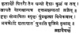
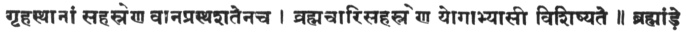

  
[Intangible Textual Heritage](../../index)  [Hinduism](../index.md) 
[Yoga](../yoga/index)  [Index](index)  [Previous](hyp04)  [Next](hyp06.md) 

------------------------------------------------------------------------

[Buy this Book at
Amazon.com](https://www.amazon.com/exec/obidos/ASIN/8121505755/internetsacredte.md)

------------------------------------------------------------------------

*Hatha Yoga Pradipika*, tr. by Pancham Sinh, \[1914\], at Intangible
Textual Heritage

------------------------------------------------------------------------

p. 28

### CHAPTER III.

*On Mudrâs*.

\|\| ३ \|\| तॄतीयोपदेशः

\|\| 3 \|\| tṝtīyopadeśaḥ

स-शैल-वन-धात्रीणां यथाधारो\|अहि-नायकः \|  
सर्वेष्हां योग-तन्त्राणां तथाधारो हि कुण्डली \|\| १ \|\|

sa-śaila-vana-dhātrīṇāṃ yathādhāro\|ahi-nāyakaḥ \|  
sarveṣhāṃ yogha-tantrāṇāṃ tathādhāro hi kuṇḍalī \|\| 1 \|\|

As the chief of the snakes is the support of the earth with all the
mountains and forests on it, so all the Tantras (Yoga practices) rest on
the Kuṇḍalinî. (The Vertebral column.) 1.

सुप्ता गुरु-परसादेन यदा जागर्ति कुण्डली \|  
तदा सर्वाणि पद्मानि भिद्यन्ते गरन्थयो\|अपि छ \|\| २ \|\|

suptā ghuru-prasādena yadā jāgharti kuṇḍalī \|  
tadā sarvāṇi padmāni bhidyante ghranthayo\|api cha \|\| 2 \|\|

When the sleeping Kuṇḍalinî awakens by favour of a guru, then all the
lotuses (in the six chakras or centres) and all the knots are pierced
through. 2.

पराणस्य शून्य-पदवी तदा राजपथायते \|  
तदा छित्तं निरालम्बं तदा कालस्य वञ्छनम \|\| ३ \|\|

prāṇasya śūnya-padavī tadā rājapathāyate \|  
tadā chittaṃ nirālambaṃ tadā kālasya vañchanam \|\| 3 \|\|

Suṣumnâ (Sûnya Padavî) becomes a main road for the passage of Prâṇa, and
the mind then becomes free from all connections (with its objects of
enjoyments) and Death is then evaded. 3.

सुष्हुम्णा शून्य-पदवी बरह्म-रन्ध्रः महापथः \|  
शमशानं शाम्भवी मध्य-मार्गश्छेत्येक-वाछकाः \|\| ४ \|\|

suṣhumṇā śūnya-padavī brahma-randhraḥ mahāpathaḥ \|  
śmaśānaṃ śāmbhavī madhya-mārghaśchetyeka-vāchakāḥ \|\| 4 \|\|

Suṣumnâ, Sunya Padavî, Brahma Randhra, Mahâ Patha, Śmaśâna, Śambhavî,
Madhya Mârga, are names of one and the same thing. 4.

तस्मात्सर्व-परयत्नेन परबोधयितुमीश्वरीम \|  
बरह्म-दवार-मुखे सुप्तां मुद्राभ्यासं समाछरेत \|\| ५ \|\|

tasmātsarva-prayatnena prabodhayitumīśvarīm \|  
brahma-dvāra-mukhe suptāṃ mudrābhyāsaṃ samācharet \|\| 5 \|\|

In order, therefore, to awaken this goddess, who is sleeping at the
entrance of Brahma Dwâra (the great door), mudrâs should be practised
well. 5.

*The mudrâs*.

महामुद्रा महाबन्धो महावेधश्छ खेछरी \|  
उड्डीयानं मूलबन्धश्छ बन्धो जालन्धराभिधः \|\| ६ \|\|

mahāmudrā mahābandho mahāvedhaścha khecharī \|  
uḍḍīyānaṃ mūlabandhaścha bandho jālandharābhidhaḥ \|\| 6 \|\|

Mahâ Mudrâ, Mahâ Bandha, Mahâ Vedha, Khecharî, Uḍḍiyâna Bandha, Mûla
Bandha, Jâlandhara Bandha. 6.

p. 29

करणी विपरीताख्या वज्रोली शक्ति-छालनम \|  
इदं हि मुद्रा-दशकं जरा-मरण-नाशनम \|\| ७ \|\|

karaṇī viparītākhyā vajrolī śakti-chālanam \|  
idaṃ hi mudrā-daśakaṃ jarā-maraṇa-nāśanam \|\| 7 \|\|

Viparîta Karaṇî, Vajroli, and Śakti Châlana. These are the ten Mudrâs
which annihilate old age and death. 7.

आदिनाथोदितं दिव्यमष्ह्टैश्वर्य-परदायकम \|  
वल्लभं सर्व-सिद्धानां दुर्लभं मरुतामपि \|\| ८ \|\|

ādināthoditaṃ divyamaṣhṭaiśvarya-pradāyakam \|  
vallabhaṃ sarva-siddhānāṃ durlabhaṃ marutāmapi \|\| 8 \|\|

They have been explained by Âdi Nâtha (Śiva) and give eight kinds of
divine wealth. They are loved by all the Siddhas and are hard to attain
even by the Marutas. 8.

*Note*.—The eight *Aiśwaryas* are: Aṇimâ (becoming small, like an atom),
Mahimâ (becoming great, like âkâs, by drawing in atoms of Prakṛiti),
Garimâ (light things, like cotton becoming very heavy like mountains.)

Prâpti (coming within easy reach of everything; as touching the moon
with the little finger, while standing on the earth.)

Prâkâmya (non-resistance to the desires, as entering the earth like
water.)

Îsatâ (mastery over matter and objects made of it.)

Vaśitwa (controlling the animate and inanimate objects.)

गोपनीयं परयत्नेन यथा रत्न-करण्डकम \|  
कस्यछिन्नैव वक्तव्यं कुल-सत्री-सुरतं यथा \|\| ९ \|\|

ghopanīyaṃ prayatnena yathā ratna-karaṇḍakam \|  
kasyachinnaiva vaktavyaṃ kula-strī-surataṃ yathā \|\| 9 \|\|

These Mudrâs should be kept secret by every means, as one keeps one's
box of jewellery, and should, on no account be told to any one, just as
husband and wife keep their dealings secret. 9.

*The mahâ mudrâ*.

अथ महा-मुद्रा  
पाद-मूलेन वामेन योनिं सम्पीड्य दक्ष्हिणाम \|  
परसारितं पदं कॄत्वा कराभ्यां धारयेद्दॄढम \|\| १० \|\|

atha mahā-mudrā  
pāda-mūlena vāmena yoniṃ sampīḍya dakṣhiṇām \|  
prasāritaṃ padaṃ kṝtvā karābhyāṃ dhārayeddṝḍham \|\| 10 \|\|

Pressing the Yoni (perineum) with the heel of the left foot, and
stretching forth the right foot, its toe should be grasped by the thumb
and first finger. 10.

कण्ठे बन्धं समारोप्य धारयेद्वायुमूर्ध्वतः \|  
यथा दण्ड-हतः सर्पो दण्डाकारः परजायते \|\| ११ \|\|  
ॠज्वीभूता तथा शक्तिः कुण्डली सहसा भवेत \|  
तदा सा मरणावस्था जायते दविपुटाश्रया \|\| १२ \|\|

kaṇṭhe bandhaṃ samāropya dhārayedvāyumūrdhvataḥ \|  
yathā daṇḍa-hataḥ sarpo daṇḍākāraḥ prajāyate \|\| 11 \|\|  
ṝjvībhūtā tathā śaktiḥ kuṇḍalī sahasā bhavet \|  
tadā sā maraṇāvasthā jāyate dvipuṭāśrayā \|\| 12 \|\|

By stopping the throat (by Jâlandhara Bandha) the air is drawn in from
the outside and carried down. Just as a snake struck with a stick
becomes straight like a stick, in the same way, *śakti* (suṣumnâ)
becomes straight at once. Then the Kuṇḍalinî, becoming as it were dead,
and,

p. 30

leaving both the Idâ and the Pingalâ, enters the suṣumnâ (the middle
passage). 11-12.

ततः शनैः शनैरेव रेछयेन्नैव वेगतः \|  
महा-मुद्रां छ तेनैव वदन्ति विबुधोत्तमाः \|\| १३ \|\|

tataḥ śanaiḥ śanaireva rechayennaiva veghataḥ \|  
mahā-mudrāṃ cha tenaiva vadanti vibudhottamāḥ \|\| 13 \|\|

It should be expelled then, slowly only and not violently. For this very
reason, the best of the wise men call it the Mahâ Mudrâ. This Mahâ Mudrâ
has been propounded by great masters. 13.

इयं खलु महामुद्रा महा-सिद्धैः परदर्शिता \|  
महा-कलेशादयो दोष्हाः कष्हीयन्ते मरणादयः \|  
महा-मुद्रां छ तेनैव वदन्ति विबुधोत्तमाः \|\| १४ \|\|

iyaṃ khalu mahāmudrā mahā-siddhaiḥ pradarśitā \|  
mahā-kleśādayo doṣhāḥ kṣhīyante maraṇādayaḥ \|  
mahā-mudrāṃ cha tenaiva vadanti vibudhottamāḥ \|\| 14 \|\|

Great evils and pains, like death, are destroyed by it, and for this
reason wise men call it the Mahâ Mudrâ. 14.

छन्द्राङ्गे तु समभ्यस्य सूर्याङ्गे पुनरभ्यसेत \|  
यावत-तुल्या भवेत्सङ्ख्या ततो मुद्रां विसर्जयेत \|\| १५ \|\|

chandrāngghe tu samabhyasya sūryāngghe punarabhyaset \|  
yāvat-tulyā bhavetsangkhyā tato mudrāṃ visarjayet \|\| 15 \|\|

Having practised with the left nostril, it should be practised with the
right one; and, when the number on both sides becomes equal, then the
mudrâ should be discontinued. 15.

न हि पथ्यमपथ्यं वा रसाः सर्वे\|अपि नीरसाः \|  
अपि भुक्तं विष्हं घोरं पीयूष्हमपि जीर्यति \|\| १६ \|\|

na hi pathyamapathyaṃ vā rasāḥ sarve\|api nīrasāḥ \|  
api bhuktaṃ viṣhaṃ ghoraṃ pīyūṣhamapi jīryati \|\| 16 \|\|

There is nothing wholesome or injurious; for the practice of this mudrâ
destroys the injurious effects of all the rasas (chemicals). Even the
deadliest of poisons, if taken, acts like nectar. 16.

कष्हय-कुष्ह्ठ-गुदावर्त-गुल्माजीर्ण-पुरोगमाः \|  
तस्य दोष्हाः कष्हयं यान्ति महामुद्रां तु यो\|अभ्यसेत \|\| १७ \|\|

kṣhaya-kuṣhṭha-ghudāvarta-ghulmājīrṇa-puroghamāḥ \|  
tasya doṣhāḥ kṣhayaṃ yānti mahāmudrāṃ tu yo\|abhyaset \|\| 17 \|\|

Consumption, leprosy, prolapsus anii, colic, and the diseases due to
indigestion,—all these irregularities are removed by the practice of
this Mahâ Mudrâ. 17.

कथितेयं महामुद्रा महा-सिद्धि-करा नॄणाम \|  
गोपनीया परयत्नेन न देया यस्य कस्यछित \|\| १८ \|\|

kathiteyaṃ mahāmudrā mahā-siddhi-karā nṝṇām \|  
ghopanīyā prayatnena na deyā yasya kasyachit \|\| 18 \|\|

This Mahâ Mudrâ has been described as the giver of great success
(Siddhi) to men. It should be kept secret by every effort, and not
revealed to any and everyone. 18.

p. 31

*The Mahâ Bandha*.

अथ महा-बन्धः  
पार्ष्ह्णिं वामस्य पादस्य योनि-सथाने नियोजयेत \|  
वामोरूपरि संस्थाप्य दक्ष्हिणं छरणं तथा \|\| १९ \|\|

atha mahā-bandhaḥ  
pārṣhṇiṃ vāmasya pādasya yoni-sthāne niyojayet \|  
vāmorūpari saṃsthāpya dakṣhiṇaṃ charaṇaṃ tathā \|\| 19 \|\|

Press the left heel to the perineum and place the right foot on the left
thigh. 19.

पूरयित्वा ततो वायुं हॄदये छुबुकं दॄढम \|  
निष्ह्पीड्यं वायुमाकुनछ्य मनो-मध्ये नियोजयेत \|\| २० \|\|

pūrayitvā tato vāyuṃ hṝdaye chubukaṃ dṝḍham \|  
niṣhpīḍyaṃ vāyumākuñchya mano-madhye niyojayet \|\| 20 \|\|

Fill in the air, keeping the chin firm against the chest, and, having
pressed the air, the mind should he fixed on the middle of the eyebrows
or in the suṣumnâ (the spine). 20.

धारयित्वा यथा-शक्ति रेछयेदनिलं  शनैः \|  
सव्याङ्गे तु समभ्यस्य दक्ष्हाङ्गे पुनरभ्यसेत \|\| २१ \|\|

dhārayitvā yathā-śakti rechayedanilaṃ  śanaiḥ \|  
savyāngghe tu samabhyasya dakṣhāngghe punarabhyaset \|\| 21 \|\|

Having kept it confined so long as possible, it should be expelled
slowly. Having practised on the left side, it should be practised on the
right side. 21.

मतमत्र तु केष्हांछित्कण्ठ-बन्धं विवर्जयेत \|  
राज-दन्त-सथ-जिह्वाया बन्धः शस्तो भवेदिति \|\| २२ \|\|

matamatra tu keṣhāṃchitkaṇṭha-bandhaṃ vivarjayet \|  
rāja-danta-stha-jihvāyā bandhaḥ śasto bhavediti \|\| 22 \|\|

Some are of opinion that the closing of throat is not necessary here,
for keeping the tongue pressed against the roots of the upper teeth
makes a good bandha (stop). 22.

अयं तु सर्व-नाडीनामूर्ध्वं गति-निरोधकः \|  
अयं खलु महा-बन्धो महा-सिद्धि-परदायकः \|\| २३ \|\|

ayaṃ tu sarva-nāḍīnāmūrdhvaṃ ghati-nirodhakaḥ \|  
ayaṃ khalu mahā-bandho mahā-siddhi-pradāyakaḥ \|\| 23 \|\|

This stops the upward motion of all the Nâdîs. Verily this Mahâ Bandha
is the giver of great Siddhis. 23.

काल-पाश-महा-बन्ध-विमोछन-विछक्ष्हणः \|  
तरिवेणी-सङ्गमं धत्ते केदारं परापयेन्मनः \|\| २४ \|\|

kāla-pāśa-mahā-bandha-vimochana-vichakṣhaṇaḥ \|  
triveṇī-sangghamaṃ dhatte kedāraṃ prāpayenmanaḥ \|\| 24 \|\|

This Mahâ Bandha is the most skilful means for cutting away the snares
of death. It brings about the conjunction of the Trivenî (Idâ, Pingalâ
and Suṣumnâ) and carries the mind to Kedâr (the space between the
eyebrows, which is the seat of Śiva). 24.

रूप-लावण्य-सम्पन्ना यथा सत्री पुरुष्हं विना \|  
महा-मुद्रा-महा-बन्धौ निष्ह्फलौ वेध-वर्जितौ \|\| २५ \|\|

rūpa-lāvaṇya-sampannā yathā strī puruṣhaṃ vinā \|  
mahā-mudrā-mahā-bandhau niṣhphalau vedha-varjitau \|\| 25 \|\|

As beauty and loveliness, do not avail a woman without husband, so the
Mahâ Mudrâ and the Mahâ-Bandha are useless without the Mahâ Vedha. 25.

p. 32

*The Mahâ Vedha*.

अथ महा-वेधः  
महा-बन्ध-सथितो योगी कॄत्वा पूरकमेक-धीः \|  
वायूनां गतिमावॄत्य निभॄतं कण्ठ-मुद्रया \|\| २६ \|\|

atha mahā-vedhaḥ  
mahā-bandha-sthito yoghī kṝtvā pūrakameka-dhīḥ \|  
vāyūnāṃ ghatimāvṝtya nibhṝtaṃ kaṇṭha-mudrayā \|\| 26 \|\|

Sitting with Mahâ Bandha, the Yogî should fill in the air and keep his
mind collected. The movements of the Vâyus (Prâṇa and Apâna) should be
stopped by closing the throat.) 26.

सम-हस्त-युगो भूमौ सफिछौ सनाडयेछ्छनैः \|  
पुट-दवयमतिक्रम्य वायुः सफुरति मध्यगः \|\| २७ \|\|

sama-hasta-yugho bhūmau sphichau sanāḍayechchanaiḥ \|  
puṭa-dvayamatikramya vāyuḥ sphurati madhyaghaḥ \|\| 27 \|\|

Resting both the hands equally on the ground, he should raise himself a
little and strike his buttocks against the ground gently. The air,
leaving both the passages (Idâ and Pingalâ), starts into the middle one.
27.

सोम-सूर्याग्नि-सम्बन्धो जायते छामॄताय वै \|  
मॄतावस्था समुत्पन्ना ततो वायुं विरेछयेत \|\| २८ \|\|

soma-sūryāghni-sambandho jāyate chāmṝtāya vai \|  
mṝtāvasthā samutpannā tato vāyuṃ virechayet \|\| 28 \|\|

The union of the Idâ and the Pingalâ is effected, in order to bring
about immortality. When the air becomes as it were dead (by leaving its
course through the Idâ and the Pingalâ) (*i.e.*, when it has been kept
confined), then it should be expelled. 28.

महा-वेधो\|अयमभ्यासान्महा-सिद्धि-परदायकः \|  
वली-पलित-वेप-घनः सेव्यते साधकोत्तमैः \|\| २९ \|\|

mahā-vedho\|ayamabhyāsānmahā-siddhi-pradāyakaḥ \|  
valī-palita-vepa-ghnaḥ sevyate sādhakottamaiḥ \|\| 29 \|\|

The practice of this Mahâ Vedha, the giver of great Siddhis, destroys
old age, grey hair, and shaking of the body, and therefore it is
practised by the best masters. 29.

एतत्त्रयं महा-गुह्यं जरा-मॄत्यु-विनाशनम \|  
वह्नि-वॄद्धि-करं छैव हयणिमादि-गुण-परदम \|\| ३० \|\|

etattrayaṃ mahā-ghuhyaṃ jarā-mṝtyu-vināśanam \|  
vahni-vṝddhi-karaṃ chaiva hyaṇimādi-ghuṇa-pradam \|\| 30 \|\|

These THREE are the great secrets. They are the destroyers of old age
and death, increase the appetite, confer the accomplishments of Anima,
etc. 30.

अष्ह्टधा करियते छैव यामे यामे दिने दिने \|  
पुण्य-संभार-सन्धाय पापौघ-भिदुरं सदा \|  
सम्यक-शिक्ष्हावतामेवं सवल्पं परथम-साधनम \|\| ३१ \|\|

aṣhṭadhā kriyate chaiva yāme yāme dine dine \|  
puṇya-saṃbhāra-sandhāya pāpaugha-bhiduraṃ sadā \|  
samyak-śikṣhāvatāmevaṃ svalpaṃ prathama-sādhanam \|\| 31 \|\|

They should, be practised in 8 ways, daily and hourly. They increase
collection of good actions and lessen the evil ones. People, instructed
well, should begin their practice, little by little, first. 31.

p. 33

*The Khechari*.

अथ खेछरी  
कपाल-कुहरे जिह्वा परविष्ह्टा विपरीतगा \|  
भरुवोरन्तर्गता दॄष्ह्टिर्मुद्रा भवति खेछरी \|\| ३२ \|\|

atha khecharī  
kapāla-kuhare jihvā praviṣhṭā viparītaghā \|  
bhruvorantarghatā dṝṣhṭirmudrā bhavati khecharī \|\| 32 \|\|

The Khechari Mudrâ is accomplished by thrusting the tongue into the
gullet, by turning it over itself, and keeping the eyesight in the
middle of the eyebrows. 32.

छेदन-छालन-दोहैः कलां करमेणाथ वर्धयेत्तावत \|  
सा यावद्भ्रू-मध्यं सपॄशति तदा खेछरी-सिद्धिः \|\| ३३ \|\|

chedana-chālana-dohaiḥ kalāṃ krameṇātha vardhayettāvat \|  
sā yāvadbhrū-madhyaṃ spṝśati tadā khecharī-siddhiḥ \|\| 33 \|\|

To accomplish this, the tongue is lengthened by cutting the frænum
linguæ, moving, and pulling it. When it can touch the space between the
eyebrows, then Khechari can be accomplished. 33.

सनुही-पत्र-निभं शस्त्रं सुतीक्ष्ह्णं सनिग्ध-निर्मलम \|  
समादाय ततस्तेन रोम-मात्रं समुछ्छिनेत \|\| ३४ \|\|

snuhī-patra-nibhaṃ śastraṃ sutīkṣhṇaṃ snighdha-nirmalam \|  
samādāya tatastena roma-mātraṃ samuchchinet \|\| 34 \|\|

Taking a sharp, smooth, and clean instrument, of the shape of a cactus
leaf, the frænum of the tongue should be cut a little (as much as a
hair's thickness), at a time. 34.

ततः सैन्धव-पथ्याभ्यां छूर्णिताभ्यां परघर्ष्हयेत \|  
पुनः सप्त-दिने पराप्ते रोम-मात्रं समुछ्छिनेत \|\| ३५ \|\|

tataḥ saindhava-pathyābhyāṃ chūrṇitābhyāṃ pragharṣhayet \|  
punaḥ sapta-dine prāpte roma-mātraṃ samuchchinet \|\| 35 \|\|

Then rock salt and yellow myrobalan (both powdered) should be rubbed in.
On the 7th day, it should again be cut a hair's breadth. 35.

एवं करमेण षहण-मासं नित्यं युक्तः समाछरेत \|  
षहण्मासाद्रसना-मूल-शिरा-बन्धः परणश्यति \|\| ३६ \|\|

evaṃ krameṇa ṣhaṇ-māsaṃ nityaṃ yuktaḥ samācharet \|  
ṣhaṇmāsādrasanā-mūla-śirā-bandhaḥ praṇaśyati \|\| 36 \|\|

One should go on doing thus, regularly for six months. At the end of six
months, the frænum of the tongue will be completely cut. 36.

कलां पराङ्मुखीं कॄत्वा तरिपथे परियोजयेत \|  
सा भवेत्खेछरी मुद्रा वयोम-छक्रं तदुछ्यते \|\| ३७ \|\|

kalāṃ parāngmukhīṃ kṝtvā tripathe pariyojayet \|  
sā bhavetkhecharī mudrā vyoma-chakraṃ taduchyate \|\| 37 \|\|

Turning the tongue upwards, it is fixed on the three ways (œsophagus,
windpipe and palate.) Thus it makes the Khechari Mudrâ, and is called
the Vyoma Chakra. 37.

रसनामूर्ध्वगां कॄत्वा कष्हणार्धमपि तिष्ह्ठति \|  
विष्हैर्विमुछ्यते योगी वयाधि-मॄत्यु-जरादिभिः \|\| ३८ \|\|

rasanāmūrdhvaghāṃ kṝtvā kṣhaṇārdhamapi tiṣhṭhati \|  
viṣhairvimuchyate yoghī vyādhi-mṝtyu-jarādibhiḥ \|\| 38 \|\|

The Yogî who sits for a minute turning his tongue upwards, is saved from
poisons, diseases, death, old age, etc. 38.

न रोगो मरणं तन्द्रा न निद्रा न कष्हुधा तॄष्हा \|  
न छ मूर्छ्छा भवेत्तस्य यो मुद्रां वेत्ति खेछरीम \|\| ३९ \|\|

na rogho maraṇaṃ tandrā na nidrā na kṣhudhā tṝṣhā \|  
na cha mūrchchā bhavettasya yo mudrāṃ vetti khecharīm \|\| 39 \|\|

He who knows the Khechari Mudrâ is not afflicted with disease, death,
sloth, sleep, hunger, thirst, and swooning. 39.

p. 34

पीड्यते न स रोगेण लिप्यते न छ कर्मणा \|  
बाध्यते न स कालेन यो मुद्रां वेत्ति खेछरीम \|\| ४० \|\|

pīḍyate na sa rogheṇa lipyate na cha karmaṇā \|  
bādhyate na sa kālena yo mudrāṃ vetti khecharīm \|\| 40 \|\|

He who knows the Khechari Mudrâ, is not troubled by diseases, is not
stained with karmas, and is not snared by time. 40.

छित्तं छरति खे यस्माज्जिह्वा छरति खे गता \|  
तेनैष्हा खेछरी नाम मुद्रा सिद्धैर्निरूपिता \|\| ४१ \|\|

chittaṃ charati khe yasmājjihvā charati khe ghatā \|  
tenaiṣhā khecharī nāma mudrā siddhairnirūpitā \|\| 41 \|\|

खेछर्या मुद्रितं येन विवरं लम्बिकोर्ध्वतः \|  
न तस्य कष्हरते बिन्दुः कामिन्याः शलेष्हितस्य छ \|\| ४२ \|\|

khecharyā mudritaṃ yena vivaraṃ lambikordhvataḥ \|  
na tasya kṣharate binduḥ kāminyāḥ śleṣhitasya cha \|\| 42 \|\|

The Siddhas have devised this Khechari Mudrâ from the fact that the mind
and the tongue reach âkâśa by its practice. 41.

छलितो\|अपि यदा बिन्दुः सम्प्राप्तो योनि-मण्डलम \|  
वरजत्यूर्ध्वं हॄतः शक्त्या निबद्धो योनि-मुद्रया \|\| ४३ \|\|

chalito\|api yadā binduḥ samprāpto yoni-maṇḍalam \|  
vrajatyūrdhvaṃ hṝtaḥ śaktyā nibaddho yoni-mudrayā \|\| 43 \|\|

If the hole behind the palate be stopped with Khechari by turning the
tongue upwards, then bindu cannot leave its place even if a woman were
embraced. 42.

ऊर्ध्व-जिह्वः सथिरो भूत्वा सोमपानं करोति यः \|  
मासार्धेन न सन्देहो मॄत्युं जयति योगवित \|\| ४४ \|\|

ūrdhva-jihvaḥ sthiro bhūtvā somapānaṃ karoti yaḥ \|  
māsārdhena na sandeho mṝtyuṃ jayati yoghavit \|\| 44 \|\|

If the Yogî drinks Somarasa (juice) by sitting with the tongue turned
backwards and mind concentrated, there is no doubt he conquers death
within 15 days. 43.

नित्यं सोम-कला-पूर्णं शरीरं यस्य योगिनः \|  
तक्ष्हकेणापि दष्ह्टस्य विष्हं तस्य न सर्पति \|\| ४५ \|\|

nityaṃ soma-kalā-pūrṇaṃ śarīraṃ yasya yoghinaḥ \|  
takṣhakeṇāpi daṣhṭasya viṣhaṃ tasya na sarpati \|\| 45 \|\|

If the Yogî, whose body is full of Somarasa (juice), were bitten by
Takshaka (snake), its poison cannot permeate his body. 44.

As fire is inseparably connected with the wood and light is connected
with the wick and oil, so does the soul not leave the body full of
nectar exuding from the Soma. 45.

*Note*.—Soma (Chandra) is described later on located in the
thousand-petalled lotus in the human brain, and is the same as is seen
on Śivas’ head in pictures, and from which a sort of juice exudes. It is
the retaining of this exudation which makes one immortal.

इन्धनानि यथा वह्निस्तैल-वर्ति छ दीपकः \|  
तथा सोम-कला-पूर्णं देही देहं न मुनछति \|\| ४६ \|\|

indhanāni yathā vahnistaila-varti cha dīpakaḥ \|  
tathā soma-kalā-pūrṇaṃ dehī dehaṃ na muñchati \|\| 46 \|\|

Those who eat the flesh of the cow and drink the immortal liquor daily,
are regarded by me men of noble family. Others are but a disgrace to
their families. 46.

p. 35

*Note*.— 
[  
Click to enlarge](img/03500.jpg.md)

Translation: Fortunate are the parents and blessed is the country and
the family where a Yogî is born. Anything given to such a Yogî, becomes
immortal. One, who discriminates between Puruṣa and Prakṛiti, purges the
sins of a million incarnations, by seeing, speaking, and touching such
men (*i.e.*, Yogî.)

 

A Yogî far exceeds a thousand householders, a hundred vânaprasthas, and
a thousand Brahmacharîs.

  [  
Click to enlarge](img/03502.jpg.md)

Who can know the reality of the Raja Yoga? That country is very sacred
where resides a man who knows it. By seeing and honouring him,
generations of ignorant men get mokṣa, what to speak of those who are
actually engaged in it. He who knows internal and external yoga,
deserves adoration from you and me, what if he is adored by the rest of
mankind!

Those who engage in the great yoga, once, twice or thrice daily, are to
be known as masters of great wealth (maheshwaras) or Lords.

गोमांसं भक्ष्हयेन्नित्यं पिबेदमर-वारुणीम \|  
कुलीनं तमहं मन्ये छेतरे कुल-घातकाः \|\| ४७ \|\|

ghomāṃsaṃ bhakṣhayennityaṃ pibedamara-vāruṇīm \|  
kulīnaṃ tamahaṃ manye chetare kula-ghātakāḥ \|\| 47 \|\|

गो-शब्देनोदिता जिह्वा तत्प्रवेशो हि तालुनि \|  
गो-मांस-भक्ष्हणं तत्तु महा-पातक-नाशनम \|\| ४८ \|\|

gho-śabdenoditā jihvā tatpraveśo hi tāluni \|  
gho-māṃsa-bhakṣhaṇaṃ tattu mahā-pātaka-nāśanam \|\| 48 \|\|

The word गी means tongue; eating it is thrusting it in the gullet which
destroys great sins. 47.

जिह्वा-परवेश-सम्भूत-वह्निनोत्पादितः खलु \|  
छन्द्रात्स्रवति यः सारः सा सयादमर-वारुणी \|\| ४९ \|\|

jihvā-praveśa-sambhūta-vahninotpāditaḥ khalu \|  
chandrātsravati yaḥ sāraḥ sā syādamara-vāruṇī \|\| 49 \|\|

Immortal liquor is the nectar exuding from the moon (Chandra situated on
the left side of the space between the eyebrows). It is produced by the
fire which is generated by thrusting the tongue. 48.

छुम्बन्ती यदि लम्बिकाग्रमनिशं जिह्वा-रस-सयन्दिनी  
स-कष्हारा कटुकाम्ल-दुग्ध-सदॄशी मध्वाज्य-तुल्या तथा \|  
वयाधीनां हरणं जरान्त-करणं शस्त्रागमोदीरणं  
तस्य सयादमरत्वमष्ह्ट-गुणितं सिद्धाङ्गनाकर्ष्हणम \|\| ५० \|\|

chumbantī yadi lambikāghramaniśaṃ jihvā-rasa-syandinī  
sa-kṣhārā kaṭukāmla-dughdha-sadṝśī madhvājya-tulyā tathā \|  
vyādhīnāṃ haraṇaṃ jarānta-karaṇaṃ śastrāghamodīraṇaṃ  
tasya syādamaratvamaṣhṭa-ghuṇitaṃ siddhāngghanākarṣhaṇam \|\| 50 \|\|

If the tongue can touch with its end the hole from which falls the rasa
(juice) which is saltish, bitter, sour, milky and similar to ghee and

p. 36

honey, one can drive away disease, destroy old age, can evade an attack
of arms, become immortal in eight ways and can attract fairies. 49.

ऊर्द्व्हास्यो रसनां नियम्य विवरे शक्तिं परां छिन्तयन \|  
उत्कल्लोल-कला-जलं छ विमलं धारामयं यः पिबेन  
निर्व्याधिः स मॄणाल-कोमल-वपुर्योगी छिरं जीवति \|\| ५१ \|\|

ūrdvhāsyo rasanāṃ niyamya vivare śaktiṃ parāṃ chintayan \|  
utkallola-kalā-jalaṃ cha vimalaṃ dhārāmayaṃ yaḥ piben  
nirvyādhiḥ sa mṝṇāla-komala-vapuryoghī chiraṃ jīvati \|\| 51 \|\|

He who drinks the clear stream of liquor of the moon (soma) falling from
the brain to the sixteen-petalled lotus (in the heart), obtained by
means of Prâṇa, by applying the tongue to the hole of the pendant in the
palate, and by meditating on the great power (Kuṇḍalinî), becomes free
from disease and tender in body, like the stalk of a lotus, and the Yogî
lives a very long life. 50.

यत्प्रालेयं परहित-सुष्हिरं मेरु-मूर्धान्तर-सथं  
तस्मिंस्तत्त्वं परवदति सुधीस्तन-मुखं निम्नगानाम \|  
छन्द्रात्सारः सरवति वपुष्हस्तेन मॄत्युर्नराणां  
तद्बध्नीयात्सुकरणमधो नान्यथा काय-सिद्धिः \|\| ५२ \|\|

yatprāleyaṃ prahita-suṣhiraṃ meru-mūrdhāntara-sthaṃ  
tasmiṃstattvaṃ pravadati sudhīstan-mukhaṃ nimnaghānām \|  
chandrātsāraḥ sravati vapuṣhastena mṝtyurnarāṇāṃ  
tadbadhnīyātsukaraṇamadho nānyathā kāya-siddhiḥ \|\| 52 \|\|

On the top of the Merû (vertebral column), concealed in a hole, is the
Somarasa (nectar of Chandra); the wise, whose intellect is not
overpowered by Raja and Tama guṇas, but in whom Satwa guṇa is
predominant, say there is the (universal spirit) âtma in it. It is the
source of the down-going Idâ, Pingalâ and Suṣumnâ Nâdis, which are the
Ganges, the Yamuna and the Sarasvati. From that Chandra is shed the
essence of the body which causes death of men. It should, therefore, be
stopped from shedding. This (Khechari Mudrâ) is a very good instrument
for this purpose. There is no other means of achieving this end. 51.

सुष्हिरं जञान-जनकं पञ्छ-सरोतः-समन्वितम \|  
तिष्ह्ठते खेछरी मुद्रा तस्मिन्शून्ये निरञ्जने \|\| ५३ \|\|

suṣhiraṃ jñāna-janakaṃ pañcha-srotaḥ-samanvitam \|  
tiṣhṭhate khecharī mudrā tasminśūnye nirañjane \|\| 53 \|\|

This hole is the generator of knowledge and is the source of the five
streams (Idâ, Pingalâ, &c.). In that colorless vacuum, Khecharî Mudrâ
should be established. 52.

एकं सॄष्ह्टिमयं बीजमेका मुद्रा छ खेछरी \|  
एको देवो निरालम्ब एकावस्था मनोन्मनी \|\| ५४ \|\|

ekaṃ sṝṣhṭimayaṃ bījamekā mudrā cha khecharī \|  
eko devo nirālamba ekāvasthā manonmanī \|\| 54 \|\|

There is only one seed germinating the whole universe from it; and there
is only one Mudrâ, called Khecharî. There is only one deva (god) without
any one's support, and there is one condition called Manonmaṇi. 53.

p. 37

*The Uḍḍiyâna Bandha*.

Uḍḍiyâna is so called by the Yogîs, because by its practice the Prâṇa
(Vâyu,) flies (flows) in the Suṣumnâ. 54.

अथ उड्डीयान-बन्धः  
बद्धो येन सुष्हुम्णायां पराणस्तूड्डीयते यतः \|  
तस्मादुड्डीयनाख्यो\|अयं योगिभिः समुदाहॄतः \|\| ५५ \|\|

atha uḍḍīyāna-bandhaḥ  
baddho yena suṣhumṇāyāṃ prāṇastūḍḍīyate yataḥ \|  
tasmāduḍḍīyanākhyo\|ayaṃ yoghibhiḥ samudāhṝtaḥ \|\| 55 \|\|

Uḍḍiyâna is so called, because the great bird, Prâṇa, tied to it, flies
without being fatigued. It is explained below. 55.

उड्डीनं कुरुते यस्मादविश्रान्तं महा-खगः \|  
उड्डीयानं तदेव सयात्तव बन्धो\|अभिधीयते \|\| ५६ \|\|

uḍḍīnaṃ kurute yasmādaviśrāntaṃ mahā-khaghaḥ \|  
uḍḍīyānaṃ tadeva syāttava bandho\|abhidhīyate \|\| 56 \|\|

उदरे पश्छिमं तानं नाभेरूर्ध्वं छ कारयेत \|  
उड्डीयानो हयसौ बन्धो मॄत्यु-मातङ्ग-केसरी \|\| ५७ \|\|

udare paśchimaṃ tānaṃ nābherūrdhvaṃ cha kārayet \|  
uḍḍīyāno hyasau bandho mṝtyu-mātanggha-kesarī \|\| 57 \|\|

The belly above the navel is pressed backwards towards the spine. This
Uḍḍiyâna Bandha is like a lion for the elephant of death. 56.

उड्डीयानं तु सहजं गुरुणा कथितं सदा \|  
अभ्यसेत्सततं यस्तु वॄद्धो\|अपि तरुणायते \|\| ५८ \|\|

uḍḍīyānaṃ tu sahajaṃ ghuruṇā kathitaṃ sadā \|  
abhyasetsatataṃ yastu vṝddho\|api taruṇāyate \|\| 58 \|\|

Uḍḍiyâna is always very easy, when learnt from a guru. The practiser of
this, if old, becomes young again. 57.

The portions above and below the navel, should be drawn backwards
towards the spine. By practising this for six months one can undoubtedly
conquer death. 58.

नाभेरूर्ध्वमधश्छापि तानं कुर्यात्प्रयत्नतः \|  
षहण्मासमभ्यसेन्मॄत्युं जयत्येव न संशयः \|\| ५९ \|\|

nābherūrdhvamadhaśchāpi tānaṃ kuryātprayatnataḥ \|  
ṣhaṇmāsamabhyasenmṝtyuṃ jayatyeva na saṃśayaḥ \|\| 59 \|\|

सर्वेष्हामेव बन्धानां उत्तमो हयुड्डीयानकः \|  
उड्डियाने दॄढे बन्धे मुक्तिः सवाभाविकी भवेत \|\| ६० \|\|

sarveṣhāmeva bandhānāṃ uttamo hyuḍḍīyānakaḥ \|  
uḍḍiyāne dṝḍhe bandhe muktiḥ svābhāvikī bhavet \|\| 60 \|\|

Of all the Bandhas, Uḍḍiyâna is the best; for by binding it firmly
liberation comes spontaneously. 59.

*The Mûla Bandha*.

Pressing Yoni (perineum) with the heel, contract up the anus. By drawing
the Apâna thus, Mûla Bandha is made. 60.

p. 38

अथ मूल-बन्धः  
पार्ष्ह्णि-भागेन सम्पीड्य योनिमाकुनछयेद्गुदम \|  
अपानमूर्ध्वमाकॄष्ह्य मूल-बन्धो\|अभिधीयते \|\| ६१ \|\|

atha mūla-bandhaḥ  
pārṣhṇi-bhāghena sampīḍya yonimākuñchayedghudam \|  
apānamūrdhvamākṝṣhya mūla-bandho\|abhidhīyate \|\| 61 \|\|

The Apâna, naturally inclining downward, is made to go up by force. This
Mûla Bandha is spoken of by Yogîs as done by contracting the anus. 61.

अधो-गतिमपानं वा ऊर्ध्वगं कुरुते बलात \|  
आकुनछनेन तं पराहुर्मूल-बन्धं हि योगिनः \|\| ६२ \|\|

adho-ghatimapānaṃ vā ūrdhvaghaṃ kurute balāt \|  
ākuñchanena taṃ prāhurmūla-bandhaṃ hi yoghinaḥ \|\| 62 \|\|

Pressing the heel well against the anus, draw up the air by force, again
and again till it (air) goes up. 62.

गुदं पार्ष्ह्ण्या तु सम्पीड्य वायुमाकुनछयेद्बलात \|  
वारं वारं यथा छोर्ध्वं समायाति समीरणः \|\| ६३ \|\|

ghudaṃ pārṣhṇyā tu sampīḍya vāyumākuñchayedbalāt \|  
vāraṃ vāraṃ yathā chordhvaṃ samāyāti samīraṇaḥ \|\| 63 \|\|

Prâṇa, Apâna, Nâda and Bindu uniting into one in this way, give success
in Yoga, undoubtedly. 63.

पराणापानौ नाद-बिन्दू मूल-बन्धेन छैकताम \|  
गत्वा योगस्य संसिद्धिं यछ्छतो नात्र संशयः \|\| ६४ \|\|

prāṇāpānau nāda-bindū mūla-bandhena chaikatām \|  
ghatvā yoghasya saṃsiddhiṃ yachchato nātra saṃśayaḥ \|\| 64 \|\|

By the purification of Prâṇa, and Apâna, urine and excrements decrease.
Even an old man becomes young by constantly practising Mûla Bandha.
64.

अपान-पराणयोरैक्यं कष्हयो मूत्र-पुरीष्हयोः \|  
युवा भवति वॄद्धो\|अपि सततं मूल-बन्धनात \|\| ६५ \|\|

apāna-prāṇayoraikyaṃ kṣhayo mūtra-purīṣhayoḥ \|  
yuvā bhavati vṝddho\|api satataṃ mūla-bandhanāt \|\| 65 \|\|

Going up, the Apâna enters the zone of fire, *i.e.*, the stomach. The
flame of fire struck by the air is thereby lengthened. 65.

*Note*.— 
[  
Click to enlarge](img/03800.jpg.md)

In the centre of the body is the seat of fire, like heated gold.

In men it is triangular, in quadrupeds square, in birds circular. There
is a long thin flame in this fire.

It is gastric fire.

अपान ऊर्ध्वगे जाते परयाते वह्नि-मण्डलम \|  
तदानल-शिखा दीर्घा जायते वायुनाहता \|\| ६६ \|\|

apāna ūrdhvaghe jāte prayāte vahni-maṇḍalam \|  
tadānala-śikhā dīrghā jāyate vāyunāhatā \|\| 66 \|\|

These, fire and Apâna, go to the naturally hot Prâṇa, which, becoming
inflamed thereby, causes burning sensation in the body. 66.

ततो यातो वह्न्य-अपानौ पराणमुष्ह्ण-सवरूपकम \|  
तेनात्यन्त-परदीप्तस्तु जवलनो देहजस्तथा \|\| ६७ \|\|

tato yāto vahny-apānau prāṇamuṣhṇa-svarūpakam \|  
tenātyanta-pradīptastu jvalano dehajastathā \|\| 67 \|\|

The Kuṇḍalinî, which has been sleeping all this time, becomes well
heated by this means and awakens well. It becomes straight like a
serpent, struck dead with a stick. 67.

p. 39

तेन कुण्डलिनी सुप्ता सन्तप्ता सम्प्रबुध्यते \|  
दण्डाहता भुजङ्गीव निश्वस्य ॠजुतां वरजेत \|\| ६८ \|\|

tena kuṇḍalinī suptā santaptā samprabudhyate \|  
daṇḍāhatā bhujangghīva niśvasya ṝjutāṃ vrajet \|\| 68 \|\|

It enters the Brahma Nâdî, just as a serpent enters its hole. Therefore,
the Yogî should always practise this Mûla Bandha. 68.

बिलं परविष्ह्टेव ततो बरह्म-नाड्यं तरं वरजेत \|  
तस्मान्नित्यं मूल-बन्धः कर्तव्यो योगिभिः सदा \|\| ६९ \|\|

bilaṃ praviṣhṭeva tato brahma-nāḍyaṃ taraṃ vrajet \|  
tasmānnityaṃ mūla-bandhaḥ kartavyo yoghibhiḥ sadā \|\| 69 \|\|

*The Jâlandhara Bandha*.

अथ जलन्धर-बन्धः  
कण्ठमाकुनछ्य हॄदये सथापयेछ्छिबुकं दॄढम \|  
बन्धो जालन्धराख्यो\|अयं जरा-मॄत्यु-विनाशकः \|\| ७० \|\|

atha jalandhara-bandhaḥ  
kaṇṭhamākuñchya hṝdaye sthāpayechchibukaṃ dṝḍham \|  
bandho jālandharākhyo\|ayaṃ jarā-mṝtyu-vināśakaḥ \|\| 70 \|\|

Contract the throat and press the chin firmly against the chest. This is
called Jâlandhara Bandha, which destroys old age and death. 69.

बध्नाति हि सिराजालमधो-गामि नभो-जलम \|  
ततो जालन्धरो बन्धः कण्ठ-दुःखौघ-नाशनः \|\| ७१ \|\|

badhnāti hi sirājālamadho-ghāmi nabho-jalam \|  
tato jālandharo bandhaḥ kaṇṭha-duḥkhaugha-nāśanaḥ \|\| 71 \|\|

It stops the opening (hole) of the group of the Nâdîs, through which the
juice from the sky (from the Soma or Chandra in the brain) falls down.
It is, therefore, called the Jâlandhara Bandha —the destroyer of a host
of diseases of the throat. 70.

जालन्धरे कॄते बन्धे कण्ठ-संकोछ-लक्ष्हणे \|  
न पीयूष्हं पतत्यग्नौ न छ वायुः परकुप्यति \|\| ७२ \|\|

jālandhare kṝte bandhe kaṇṭha-saṃkocha-lakṣhaṇe \|  
na pīyūṣhaṃ patatyaghnau na cha vāyuḥ prakupyati \|\| 72 \|\|

In Jâlandhara Bandha, the indications of a perfect contraction of throat
are, that the nectar does not fall into the fire (the Sûrya situated in
the navel), and the air is not disturbed. 71.

कण्ठ-संकोछनेनैव दवे नाड्यौ सतम्भयेद्दॄढम \|  
मध्य-छक्रमिदं जञेयं षहोडशाधार-बन्धनम \|\| ७३ \|\|

kaṇṭha-saṃkochanenaiva dve nāḍyau stambhayeddṝḍham \|  
madhya-chakramidaṃ jñeyaṃ ṣhoḍaśādhāra-bandhanam \|\| 73 \|\|

The two Nâdîs should be stopped firmly by contracting the throat. This
is called the middle circuit or centre (Madhya Chakra), and it stops the
16 âdhâras (*i.e.*, vital parts). 72.

*Note*.— 
[  
Click to enlarge](img/03900.jpg.md)

The sixteen vital parts mentioned by renowned Yogîs are the (1) thumbs,
(2) ankles, (3) knees, (4) thighs, (5) the prepuce, (6) organs of
generation, (17) the navel, (8) the heart, (9) the neck, (10) the
throat, (11) the palate, (12) the nose, (13) the middle of the eyebrows,
(14) the forehead, (15) the head and (16) the Brahma randhra.

मूल-सथानं समाकुनछ्य उड्डियानं तु कारयेत \|  
इडां छ पिङ्गलां बद्ध्वा वाहयेत्पश्छिमे पथि \|\| ७४ \|\|

mūla-sthānaṃ samākuñchya uḍḍiyānaṃ tu kārayet \|  
iḍāṃ cha pingghalāṃ baddhvā vāhayetpaśchime pathi \|\| 74 \|\|

By drawing up the mûlasthâna (anus,) Uḍḍiyâna Bandha should be
performed. The flow of the air should be directed to the Suṣumnâ, by
closing the Idâ, and the Pingalâ. 73.

p. 40

अनेनैव विधानेन परयाति पवनो लयम \|  
ततो न जायते मॄत्युर्जरा-रोगादिकं तथा \|\| ७५ \|\|

anenaiva vidhānena prayāti pavano layam \|  
tato na jāyate mṝtyurjarā-roghādikaṃ tathā \|\| 75 \|\|

The Prâna becomes calm and latent by this means, and thus there is no
death, old age, disease, etc. 74.

बन्ध-तरयमिदं शरेष्ह्ठं महा-सिद्धैश्छ सेवितम \|  
सर्वेष्हां हठ-तन्त्राणां साधनं योगिनो विदुः \|\| ७६ \|\|

bandha-trayamidaṃ śreṣhṭhaṃ mahā-siddhaiścha sevitam \|  
sarveṣhāṃ haṭha-tantrāṇāṃ sādhanaṃ yoghino viduḥ \|\| 76 \|\|

These three Bandhas are the best of all and have been practised by the
masters. Of all the means of success in the Haṭha Yoga, they are known
to the Yogîs as the chief ones. 75.

यत्किंछित्स्रवते छन्द्रादमॄतं दिव्य-रूपिणः \|  
तत्सर्वं गरसते सूर्यस्तेन पिण्डो जरायुतः \|\| ७७ \|\|

yatkiṃchitsravate chandrādamṝtaṃ divya-rūpiṇaḥ \|  
tatsarvaṃ ghrasate sūryastena piṇḍo jarāyutaḥ \|\| 77 \|\|

The whole of the nectar, possessing divine qualities, which exudes from
the Soma (Chandra) is devoured by the Sûrya; and, owing to this, the
body becomes old. 76.

To remedy this, the opening of the Sûrya is avoided by excellent means.
It is to be learnt best by instructions from a guru; but not by even a
million discussions. 77.

*The Viparîta Karaṇî*.

अथ विपरीत-करणी मुद्रा  
तत्रास्ति करणं दिव्यं सूर्यस्य मुख-वञ्छनम \|  
गुरूपदेशतो जञेयं न तु शास्त्रार्थ-कोटिभिः \|\| ७८ \|\|

atha viparīta-karaṇī mudrā  
tatrāsti karaṇaṃ divyaṃ sūryasya mukha-vañchanam \|  
ghurūpadeśato jñeyaṃ na tu śāstrārtha-koṭibhiḥ \|\| 78 \|\|

Above the navel and below the palate respectively, are the Sûrya and the
Chandra. The exercise, called the Viparîta Karaṇî, is learnt from the
guru's instructions. 78.

ऊर्ध्व-नाभेरधस्तालोरूर्ध्वं भानुरधः शशी \|  
करणी विपरीताखा गुरु-वाक्येन लभ्यते \|\| ७९ \|\|

ūrdhva-nābheradhastālorūrdhvaṃ bhānuradhaḥ śaśī \|  
karaṇī viparītākhā ghuru-vākyena labhyate \|\| 79 \|\|

This exercise increases the appetite; and, therefore, one who practises
it, should obtain a good supply of food. If the food be scanty, it will
burn him at once. 79.

नित्यमभ्यास-युक्तस्य जठराग्नि-विवर्धनी \|  
आहारो बहुलस्तस्य सम्पाद्यः साधकस्य छ \|\| ८० \|\|

nityamabhyāsa-yuktasya jaṭharāghni-vivardhanī \|  
āhāro bahulastasya sampādyaḥ sādhakasya cha \|\| 80 \|\|

Place the head on the ground and the feet up into the sky, for a second
only the first day, and increase this time daily. 80.

p. 41

अल्पाहारो यदि भवेदग्निर्दहति तत-कष्हणात \|  
अधः-शिराश्छोर्ध्व-पादः कष्हणं सयात्प्रथमे दिने \|\| ८१ \|\|

alpāhāro yadi bhavedaghnirdahati tat-kṣhaṇāt \|  
adhaḥ-śirāśchordhva-pādaḥ kṣhaṇaṃ syātprathame dine \|\| 81 \|\|

कष्हणाछ्छ किंछिदधिकमभ्यसेछ्छ दिने दिने \|  
वलितं पलितं छैव षहण्मासोर्ध्वं न दॄश्यते \|  
याम-मात्रं तु यो नित्यमभ्यसेत्स तु कालजित \|\| ८२ \|\|

kṣhaṇāchcha kiṃchidadhikamabhyasechcha dine dine \|  
valitaṃ palitaṃ chaiva ṣhaṇmāsordhvaṃ na dṝśyate \|  
yāma-mātraṃ tu yo nityamabhyasetsa tu kālajit \|\| 82 \|\|

After six months, the wrinkles and grey hair are not seen. He who
practises it daily, even for two hours, conquers death. 81.

*The Vajrolî*.

अथ वज्रोली  
सवेछ्छया वर्तमानो\|अपि योगोक्तैर्नियमैर्विना \|  
वज्रोलीं यो विजानाति स योगी सिद्धि-भाजनम \|\| ८३ \|\|

atha vajrolī  
svechchayā vartamāno\|api yoghoktairniyamairvinā \|  
vajrolīṃ yo vijānāti sa yoghī siddhi-bhājanam \|\| 83 \|\|

Even if one who lives a wayward life, without observing any rules of
Yoga, but performs Vajrolî, deserves success and is a Yogî. 82.

तत्र वस्तु-दवयं वक्ष्ह्ये दुर्लभं यस्य कस्यछित \|  
कष्हीरं छैकं दवितीयं तु नारी छ वश-वर्तिनी \|\| ८४ \|\|

tatra vastu-dvayaṃ vakṣhye durlabhaṃ yasya kasyachit \|  
kṣhīraṃ chaikaṃ dvitīyaṃ tu nārī cha vaśa-vartinī \|\| 84 \|\|

Two things are necessary for this, and these are difficult to get for
the ordinary people—(1) milk and (2) a woman behaving, as desired. 83.

मेहनेन शनैः सम्यगूर्ध्वाकुनछनमभ्यसेत \|  
पुरुष्हो\|अप्यथवा नारी वज्रोली-सिद्धिमाप्नुयात \|\| ८५ \|\|

mehanena śanaiḥ samyaghūrdhvākuñchanamabhyaset \|  
puruṣho\|apyathavā nārī vajrolī-siddhimāpnuyāt \|\| 85 \|\|

By practising to draw in the *bindu*, discharged during cohabitation,
whether one be a man or a woman, one obtains success in the practice of
Vajrolî. 84.

यत्नतः शस्त-नालेन फूत्कारं वज्र-कन्दरे \|  
शनैः शनैः परकुर्वीत वायु-संछार-कारणात \|\| ८६ \|\|

yatnataḥ śasta-nālena phūtkāraṃ vajra-kandare \|  
śanaiḥ śanaiḥ prakurvīta vāyu-saṃchāra-kāraṇāt \|\| 86 \|\|

By means of a pipe, one should blow air slowly into the passage in the
male organ. 85.

नारी-भगे पदद-बिन्दुमभ्यासेनोर्ध्वमाहरेत \|  
छलितं छ निजं बिन्दुमूर्ध्वमाकॄष्ह्य रक्ष्हयेत \|\| ८७ \|\|

nārī-bhaghe padad-bindumabhyāsenordhvamāharet \|  
chalitaṃ cha nijaṃ bindumūrdhvamākṝṣhya rakṣhayet \|\| 87 \|\|

By practice, the discharged *bindu* is drawn out. One can draw back and
preserve one's own discharged bindu. 86.

एवं संरक्ष्हयेद्बिन्दुं जयति योगवित \|  
मरणं बिन्दु-पातेन जीवनं बिन्दु-धारणात \|\| ८८ \|\|

evaṃ saṃrakṣhayedbinduṃ jayati yoghavit \|  
maraṇaṃ bindu-pātena jīvanaṃ bindu-dhāraṇāt \|\| 88 \|\|

The Yogî who can protect his *bindu* thus, overcomes death; because
death comes by discharging *bindu*, and life is prolonged by its
preservation. 87.

p. 42

सुगन्धो योगिनो देहे जायते बिन्दु-धारणात \|  
यावद्बिन्दुः सथिरो देहे तावत्काल-भयं कुतः \|\| ८९ \|\|

sughandho yoghino dehe jāyate bindu-dhāraṇāt \|  
yāvadbinduḥ sthiro dehe tāvatkāla-bhayaṃ kutaḥ \|\| 89 \|\|

By preserving *bindu*, the body of the Yogî emits a pleasing smell.
There is no fear of death, so long as the *bindu* is well-established in
the body. 88.

छित्तायत्तं नॄणां शुक्रं शुक्रायत्तं छ जीवितम \|  
तस्माछ्छुक्रं मनश्छैव रक्ष्हणीयं परयत्नतः \|\| ९० \|\|

chittāyattaṃ nṝṇāṃ śukraṃ śukrāyattaṃ cha jīvitam \|  
tasmāchchukraṃ manaśchaiva rakṣhaṇīyaṃ prayatnataḥ \|\| 90 \|\|

ॠतुमत्या रजो\|अप्येवं निजं बिन्दुं छ रक्ष्हयेत \|  
मेढ्रेणाकर्ष्हयेदूर्ध्वं सम्यगभ्यास-योग-वित \|\| ९१ \|\|

ṝtumatyā rajo\|apyevaṃ nijaṃ binduṃ cha rakṣhayet \|  
meḍhreṇākarṣhayedūrdhvaṃ samyaghabhyāsa-yogha-vit \|\| 91 \|\|

The *bindu* of men is under the control of the mind, and life is
dependent on the *bindu*. Hence, mind and *bindu* should be protected by
all means. 89.

*The Sahajolî*.

अथ सहजोलिः  
सहजोलिश्छामरोलिर्वज्रोल्या भेद एकतः \|  
जले सुभस्म निक्ष्हिप्य दग्ध-गोमय-सम्भवम \|\| ९२ \|\|

atha sahajoliḥ  
sahajoliśchāmarolirvajrolyā bheda ekataḥ \|  
jale subhasma nikṣhipya daghdha-ghomaya-sambhavam \|\| 92 \|\|

Sahajolî and Amarolî are only the different kinds of Vajrolî. Ashes from
burnt up cowdung should be mixed with water. 90.

वज्रोली-मैथुनादूर्ध्वं सत्री-पुंसोः सवाङ्ग-लेपनम \|  
आसीनयोः सुखेनैव मुक्त-वयापारयोः कष्हणात \|\| ९३ \|\|

vajrolī-maithunādūrdhvaṃ strī-puṃsoḥ svānggha-lepanam \|  
āsīnayoḥ sukhenaiva mukta-vyāpārayoḥ kṣhaṇāt \|\| 93 \|\|

Being free from the exercise of Vajrolî, man and woman should both rub
it on their bodies. 91.

सहजोलिरियं परोक्ता शरद्धेया योगिभिः सदा \|  
अयं शुभकरो योगो भोग-युक्तो\|अपि मुक्तिदः \|\| ९४ \|\|

sahajoliriyaṃ proktā śraddheyā yoghibhiḥ sadā \|  
ayaṃ śubhakaro yogho bhogha-yukto\|api muktidaḥ \|\| 94 \|\|

This is called Sahajolî, and should be relied on by Yogîs. It does good
and gives mokṣa. 92.

अयं योगः पुण्यवतां धीराणां तत्त्व-दर्शिनाम \|  
निर्मत्सराणां वै सिध्येन्न तु मत्सर-शालिनाम \|\| ९५ \|\|

ayaṃ yoghaḥ puṇyavatāṃ dhīrāṇāṃ tattva-darśinām \|  
nirmatsarāṇāṃ vai sidhyenna tu matsara-śālinām \|\| 95 \|\|

This Yoga is achieved by courageous wise men, who are free from sloth,
and cannot he accomplished by the slothful. 93.

*The Amarolî*.

अथ अमरोली  
पित्तोल्बणत्वात्प्रथमाम्बु-धारां  
विहाय निःसारतयान्त्यधाराम \|  
निष्हेव्यते शीतल-मध्य-धारा  
कापालिके खण्डमते\|अमरोली \|\| ९६ \|\|

atha amarolī  
pittolbaṇatvātprathamāmbu-dhārāṃ  
vihāya niḥsāratayāntyadhārām \|  
niṣhevyate śītala-madhya-dhārā  
kāpālike khaṇḍamate\|amarolī \|\| 96 \|\|

In the doctrine of the sect of the Kapâlikas, the Amarolî is the
drinking of the mid stream; leaving the 1st, as it is a mixture of too
much bile and the last, which is useless. 94.

p. 43

अमरीं यः पिबेन्नित्यं नस्यं कुर्वन्दिने दिने \|  
वज्रोलीमभ्यसेत्सम्यक्सामरोलीति कथ्यते \|\| ९७ \|\|

amarīṃ yaḥ pibennityaṃ nasyaṃ kurvandine dine \|  
vajrolīmabhyasetsamyaksāmarolīti kathyate \|\| 97 \|\|

He who drinks Amarî, snuffs it daily, and practices Vajrolî, is called
practising Amarolî. 95.

अभ्यासान्निःसॄतां छान्द्रीं विभूत्या सह मिश्रयेत \|  
धारयेदुत्तमाङ्गेष्हु दिव्य-दॄष्ह्टिः परजायते \|\| ९८ \|\|

abhyāsānniḥsṝtāṃ chāndrīṃ vibhūtyā saha miśrayet \|  
dhārayeduttamānggheṣhu divya-dṝṣhṭiḥ prajāyate \|\| 98 \|\|

पुंसो बिन्दुं समाकुनछ्य सम्यगभ्यास-पाटवात \|  
यदि नारी रजो रक्ष्हेद्वज्रोल्या सापि योगिनी \|\| ९९ \|\|

puṃso binduṃ samākuñchya samyaghabhyāsa-pāṭavāt \|  
yadi nārī rajo rakṣhedvajrolyā sāpi yoghinī \|\| 99 \|\|

The *bindu* discharged in the practice of Vajrolî should be mixed with
ashes, and the rubbing it on the best parts of the body gives divine
sight. 96.

तस्याः किंछिद्रजो नाशं न गछ्छति न संशयः \|  
तस्याः शरीरे नादश्छ बिन्दुतामेव गछ्छति \|\| १०० \|\|

tasyāḥ kiṃchidrajo nāśaṃ na ghachchati na saṃśayaḥ \|  
tasyāḥ śarīre nādaścha bindutāmeva ghachchati \|\| 100 \|\|

स बिन्दुस्तद्रजश्छैव एकीभूय सवदेहगौ \|  
वज्रोल्य-अभ्यास-योगेन सर्व-सिद्धिं परयछ्छतः \|\| १०१ \|\|

sa bindustadrajaśchaiva ekībhūya svadehaghau \|  
vajroly-abhyāsa-yoghena sarva-siddhiṃ prayachchataḥ \|\| 101 \|\|

रक्ष्हेदाकुनछनादूर्ध्वं या रजः सा हि योगिनी \|  
अतीतानागतं वेत्ति खेछरी छ भवेद्ध्रुवम \|\| १०२ \|\|

rakṣhedākuñchanādūrdhvaṃ yā rajaḥ sā hi yoghinī \|  
atītānāghataṃ vetti khecharī cha bhaveddhruvam \|\| 102 \|\|

देह-सिद्धिं छ लभते वज्रोल्य-अभ्यास-योगतः \|  
अयं पुण्य-करो योगो भोगे भुक्ते\|अपि मुक्तिदः \|\| १०३ \|\|

deha-siddhiṃ cha labhate vajroly-abhyāsa-yoghataḥ \|  
ayaṃ puṇya-karo yogho bhoghe bhukte\|api muktidaḥ \|\| 103 \|\|

*The Śakti châlana*.

अथ शक्ति-छालनम  
कुटिलाङ्गी कुण्डलिनी भुजङ्गी शक्तिरीश्वरी \|  
कुण्डल्यरुन्धती छैते शब्दाः पर्याय-वाछकाः \|\| १०४ \|\|

atha śakti-chālanam  
kuṭilāngghī kuṇḍalinī bhujangghī śaktirīśvarī \|  
kuṇḍalyarundhatī chaite śabdāḥ paryāya-vāchakāḥ \|\| 104 \|\|

Kutilângî (crooked-bodied), Kuṇḍalinî, Bhujangî (a she-serpent) Śakti,
Iśhwarî, Kundalî, Arundhatî,—all these words are synonymous. 97.

उद्घाटयेत्कपाटं तु यथा कुंछिकया हठात \|  
कुण्डलिन्या तथा योगी मोक्ष्हद्वारं विभेदयेत \|\| १०५ \|\|

udghāṭayetkapāṭaṃ tu yathā kuṃchikayā haṭhāt \|  
kuṇḍalinyā tathā yoghī mokṣhadvāraṃ vibhedayet \|\| 105 \|\|

As a door is opened with a key, so the Yogî opens the door of mukti by
opening Kuṇḍalinî by means of Haṭha Yoga. 98.

येन मार्गेण गन्तव्यं बरह्म-सथानं निरामयम \|  
मुखेनाछ्छाद्य तद्वारं परसुप्ता परमेश्वरी \|\| १०६ \|\|

yena mārgheṇa ghantavyaṃ brahma-sthānaṃ nirāmayam \|  
mukhenāchchādya tadvāraṃ prasuptā parameśvarī \|\| 106 \|\|

The Parameśwarî (Kuṇḍalinî) sleeps, covering the hole of the passage by
which one can go to the seat of Brahma which is free from pains. 99.

Keeping the feet in Vajra-âsana (Padma-âsana), hold them firmly with the
hands. The position of the bulb then will be near the ankle joint, where
it should be pressed. 107.

कन्दोर्ध्वे कुण्डली शक्तिः सुप्ता मोक्ष्हाय योगिनाम \|  
बन्धनाय छ मूढानां यस्तां वेत्ति स योगवित \|\| १०७ \|\|

kandordhve kuṇḍalī śaktiḥ suptā mokṣhāya yoghinām \|  
bandhanāya cha mūḍhānāṃ yastāṃ vetti sa yoghavit \|\| 107 \|\|

Kuṇḍalî Sakti sleeps on the bulb, for the purpose of giving moksa to
Yogîs and bondage to the ignorant. He who knows it, knows Yoga. 100.

कुण्डली कुटिलाकारा सर्पवत्परिकीर्तिता \|  
सा शक्तिश्छालिता येन स मुक्तो नात्र संशयः \|\| १०८ \|\|

kuṇḍalī kuṭilākārā sarpavatparikīrtitā \|  
sā śaktiśchālitā yena sa mukto nātra saṃśayaḥ \|\| 108 \|\|

Kuṇḍalî is of a bent shape, and has been described to be like a serpent.
He who has moved that Śakti is no doubt Mukta (released from bondage).
101.

p. 44

गङ्गा-यमुनयोर्मध्ये बाल-रण्डां तपस्विनीम \|  
बलात्कारेण गॄह्णीयात्तद्विष्ह्णोः परमं पदम \|\| १०९ \|\|

ghangghā-yamunayormadhye bāla-raṇḍāṃ tapasvinīm \|  
balātkāreṇa ghṝhṇīyāttadviṣhṇoḥ paramaṃ padam \|\| 109 \|\|

Youngster Tapaswini (a she-ascetic), lying between the Ganges and the
Yamunâ, (Idâ and Pingalâ) should be caught hold of by force, to get the
highest position. 102.

इडा भगवती गङ्गा पिङ्गला यमुना नदी \|  
इडा-पिङ्गलयोर्मध्ये बालरण्डा छ कुण्डली \|\| ११० \|\|

iḍā bhaghavatī ghangghā pingghalā yamunā nadī \|  
iḍā-pingghalayormadhye bālaraṇḍā cha kuṇḍalī \|\| 110 \|\|

Idâ is called goddess Ganges, Pingalâ goddess Yamunâ. In the middle of
the Idâ and the Pingalâ is the infant widow, Kuṇḍalî. 103.

पुछ्छे परगॄह्य भुजङ्गीं सुप्तामुद्बोधयेछ्छ ताम \|  
निद्रां विहाय सा शक्तिरूर्ध्वमुत्तिष्ह्ठते हठात \|\| १११ \|\|

puchche praghṝhya bhujangghīṃ suptāmudbodhayechcha tām \|  
nidrāṃ vihāya sā śaktirūrdhvamuttiṣhṭhate haṭhāt \|\| 111 \|\|

This sleeping she-serpent should be awakened by catching hold of her
tail. By the force of Haṭha, the Śakti leaves her sleep, and starts
upwards. 104.

अवस्थिता छैव फणावती सा  
परातश्छ सायं परहरार्ध-मात्रम \|  
परपूर्य सूर्यात्परिधान-युक्त्या  
परगॄह्य नित्यं परिछालनीया \|\| ११२ \|\|

avasthitā chaiva phaṇāvatī sā  
prātaścha sāyaṃ praharārdha-mātram \|  
prapūrya sūryātparidhāna-yuktyā  
praghṝhya nityaṃ parichālanīyā \|\| 112 \|\|

This she-serpent is situated in Mûlâdhâr. She should be caught and moved
daily, morning and evening, for ½ a prahar (1½ hours), by filling with
air through Pingalâ by the Paridhana method. 105.

ऊर्ध्वं वितस्ति-मात्रं तु विस्तारं छतुरङ्गुलम \|  
मॄदुलं धवलं परोक्तं वेष्ह्टिताम्बर-लक्ष्हणम \|\| ११३ \|\|

ūrdhvaṃ vitasti-mātraṃ tu vistāraṃ chaturangghulam \|  
mṝdulaṃ dhavalaṃ proktaṃ veṣhṭitāmbara-lakṣhaṇam \|\| 113 \|\|

The bulb is above the anus, a vitasti (12 angulas) long, and measures 4
angulas (3 inches) in extent and is soft and white, and appears as if a
folded cloth. 106.

सति वज्रासने पादौ कराभ्यां धारयेद्दॄढम \|  
गुल्फ-देश-समीपे छ कन्दं तत्र परपीडयेत \|\| ११४ \|\|

sati vajrāsane pādau karābhyāṃ dhārayeddṝḍham \|  
ghulpha-deśa-samīpe cha kandaṃ tatra prapīḍayet \|\| 114 \|\|

Keeping the feet in Vajra-âsana (Padma-âsana), hold them firmly with the
hands. The position of the bulb then will be near the ankle joint, where
it should be pressed. 107.

वज्रासने सथितो योगी छालयित्वा छ कुण्डलीम \|  
कुर्यादनन्तरं भस्त्रां कुण्डलीमाशु बोधयेत \|\| ११५ \|\|

vajrāsane sthito yoghī chālayitvā cha kuṇḍalīm \|  
kuryādanantaraṃ bhastrāṃ kuṇḍalīmāśu bodhayet \|\| 115 \|\|

The Yogî, sitting with Vajra-âsana and having moved Kuṇḍalî, should
[perform](errata.htm#2.md) Bhastrikâ to awaken the Kuṇḍalî soon. 108.

भानोराकुनछनं कुर्यात्कुण्डलीं छालयेत्ततः \|  
मॄत्यु-वक्त्र-गतस्यापि तस्य मॄत्यु-भयं कुतः \|\| ११६ \|\|

bhānorākuñchanaṃ kuryātkuṇḍalīṃ chālayettataḥ \|  
mṝtyu-vaktra-ghatasyāpi tasya mṝtyu-bhayaṃ kutaḥ \|\| 116 \|\|

Bhânu (Sûrya, near the navel) should be contracted (by contracting the
navel) which will move the Kuṇḍalî. There is no fear for him who does
so, even if he has entered the mouth of death. 109.

p. 45

मुहूर्त-दवय-पर्यन्तं निर्भयं छालनादसौ \|  
ऊर्ध्वमाकॄष्ह्यते किंछित्सुष्हुम्णायां समुद्गता \|\| ११७ \|\|

muhūrta-dvaya-paryantaṃ nirbhayaṃ chālanādasau \|  
ūrdhvamākṝṣhyate kiṃchitsuṣhumṇāyāṃ samudghatā \|\| 117 \|\|

By moving this, for two muhûrtas, it is drawn up a little by entering
the Suṣumnâ (spinal column). 110.

तेन कुण्डलिनी तस्याः सुष्हुम्णाया मुखं धरुवम \|  
जहाति तस्मात्प्राणो\|अयं सुष्हुम्णां वरजति सवतः \|\| ११८ \|\|

tena kuṇḍalinī tasyāḥ suṣhumṇāyā mukhaṃ dhruvam \|  
jahāti tasmātprāṇo\|ayaṃ suṣhumṇāṃ vrajati svataḥ \|\| 118 \|\|

By this [Kuṇḍalinî](errata.htm#3.md) leaves the entrance of the Suṣumnâ at
once, and the Prâṇa enters it of itself. 111.

तस्मात्संछालयेन्नित्यं सुख-सुप्तामरुन्धतीम \|  
तस्याः संछालनेनैव योगी रोगैः परमुछ्यते \|\| ११९ \|\|

tasmātsaṃchālayennityaṃ sukha-suptāmarundhatīm \|  
tasyāḥ saṃchālanenaiva yoghī roghaiḥ pramuchyate \|\| 119 \|\|

Therefore, this comfortably sleeping Arundhatî should always be moved;
for by so doing the Yogî gets rid of diseases. 112.

येन संछालिता शक्तिः स योगी सिद्धि-भाजनम \|  
किमत्र बहुनोक्तेन कालं जयति लीलया \|\| १२० \|\|

yena saṃchālitā śaktiḥ sa yoghī siddhi-bhājanam \|  
kimatra bahunoktena kālaṃ jayati līlayā \|\| 120 \|\|

The Yogî, who has been able to move the Śakti deserves success. It is
useless to say more, suffice it to say that he conquers death playfully.
113.

बरह्मछर्य-रतस्यैव नित्यं हित-मिताशिनः \|  
मण्डलाद्दॄश्यते सिद्धिः कुण्डल्य-अभ्यास-योगिनः \|\| १२१ \|\|

brahmacharya-ratasyaiva nityaṃ hita-mitāśinaḥ \|  
maṇḍalāddṝśyate siddhiḥ kuṇḍaly-abhyāsa-yoghinaḥ \|\| 121 \|\|

The Yogî observing Brahmacharya (continence and always eating sparingly,
gets success within 40 days by practice with the Kuṇḍalinî. 114.

कुण्डलीं छालयित्वा तु भस्त्रां कुर्याद्विशेष्हतः \|  
एवमभ्यस्यतो नित्यं यमिनो यम-भीः कुतः \|\| १२२ \|\|

kuṇḍalīṃ chālayitvā tu bhastrāṃ kuryādviśeṣhataḥ \|  
evamabhyasyato nityaṃ yamino yama-bhīḥ kutaḥ \|\| 122 \|\|

After moving the Kuṇḍalî, plenty of Bhastrâ should be performed. By such
practice, he has no fear from the god of death. 115.

दवा-सप्तति-सहस्राणां नाडीनां मल-शोधने \|  
कुतः परक्ष्हालनोपायः कुण्डल्य-अभ्यसनादॄते \|\| १२३ \|\|

dvā-saptati-sahasrāṇāṃ nāḍīnāṃ mala-śodhane \|  
kutaḥ prakṣhālanopāyaḥ kuṇḍaly-abhyasanādṝte \|\| 123 \|\|

There is no other way, but the practice of the Kuṇḍalî, for washing away
the impurities of 72,000 Nâdîs. 116.

इयं तु मध्यमा नाडी दॄढाभ्यासेन योगिनाम \|  
आसन-पराण-संयाम-मुद्राभिः सरला भवेत \|\| १२४ \|\|

iyaṃ tu madhyamā nāḍī dṝḍhābhyāsena yoghinām \|  
āsana-prāṇa-saṃyāma-mudrābhiḥ saralā bhavet \|\| 124 \|\|

This middle Nâdî becomes straight by steady practice of postures;
Prâṇâyâma and Mudrâs of Yogîs. 117.

अभ्यासे तु विनिद्राणां मनो धॄत्वा समाधिना \|  
रुद्राणी वा परा मुद्रा भद्रां सिद्धिं परयछ्छति \|\| १२५ \|\|

abhyāse tu vinidrāṇāṃ mano dhṝtvā samādhinā \|  
rudrāṇī vā parā mudrā bhadrāṃ siddhiṃ prayachchati \|\| 125 \|\|

p. 46

Those whose sleep has decreased by practice and mind has become calm by
samâdhi, get beneficial accomplishments by Sâmbhavî and other Mudrâs.
118.

राज-योगं विना पॄथ्वी राज-योगं विना निशा \|  
राज-योगं विना मुद्रा विछित्रापि न शोभते \|\| १२६ \|\|

rāja-yoghaṃ vinā pṝthvī rāja-yoghaṃ vinā niśā \|  
rāja-yoghaṃ vinā mudrā vichitrāpi na śobhate \|\| 126 \|\|

Without Raja Yoga, this earth, the night, and the Mudrâs, be they
howsoever wonderful, do not appear beautiful. 119.

*Note*.—Raja Yoga = âsana. Earth = steadiness, calmness. Night =
Kumbhaka; cessations of the activity of the Prâṇa, just as King's
officials cease moving at night. Hence night means absence of motion,
*i.e.*, Kumbhaka.

मारुतस्य विधिं सर्वं मनो-युक्तं समभ्यसेत \|  
इतरत्र न कर्तव्या मनो-वॄत्तिर्मनीष्हिणा \|\| १२७ \|\|

mārutasya vidhiṃ sarvaṃ mano-yuktaṃ samabhyaset \|  
itaratra na kartavyā mano-vṝttirmanīṣhiṇā \|\| 127 \|\|

All the practices relating to the air should be performed with
concentrated mind. A wise man should not allow his mind to wander away.
120.

इति मुद्रा दश परोक्ता आदिनाथेन शम्भुना \|  
एकैका तासु यमिनां महा-सिद्धि-परदायिनी \|\| १२८ \|\|

iti mudrā daśa proktā ādināthena śambhunā \|  
ekaikā tāsu yamināṃ mahā-siddhi-pradāyinī \|\| 128 \|\|

These are the Mudrâs, as explained by Âdinâtha (Śiva). Every one of them
is the giver of great accomplishments to the practiser. 121.

उपदेशं हि मुद्राणां यो दत्ते साम्प्रदायिकम \|  
स एव शरी-गुरुः सवामी साक्ष्हादीश्वर एव सः \|\| १२९ \|\|

upadeśaṃ hi mudrāṇāṃ yo datte sāmpradāyikam \|  
sa eva śrī-ghuruḥ svāmī sākṣhādīśvara eva saḥ \|\| 129 \|\|

He is really the *guru* and to be considered as Îśvara in human form who
teaches the Mudrâs as handed down from guru to guru. 122.

तस्य वाक्य-परो भूत्वा मुद्राभ्यासे समाहितः \|  
अणिमादि-गुणैः सार्धं लभते काल-वञ्छनम \|\| १३० \|\|

tasya vākya-paro bhūtvā mudrābhyāse samāhitaḥ \|  
aṇimādi-ghuṇaiḥ sārdhaṃ labhate kāla-vañchanam \|\| 130 \|\|

Engaging in practice, by putting faith in his words, one gets the
Siddhis of Anima, etc., as also evades death. 123.

*End of chapter III, on the Exposition of the Mudrâs*.

इति हठ-परदीपिकायां तॄतीयोपदेशः \|

iti haṭha-pradīpikāyāṃ tṝtīyopadeśaḥ \|

------------------------------------------------------------------------

[Next: Chapter IV. On Samâdhi.](hyp06.md)
