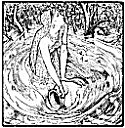

[Intangible Textual Heritage](../../index)  [Hinduism](../index.md) 
[Buddhism](../../bud/index)  [Index](index)  [Previous](ift06.md) 
[Next](ift08.md) 

------------------------------------------------------------------------

# The Magic Fiddle

 [  
Click to enlarge](img/23.jpg.md)

 NCE upon a time there lived
seven brothers and a sister. The brothers were married, but their wives
did not do the cooking for the family. It was done by their sister, who
stopped at home to cook. The wives for this reason bore their
sister-in-law much ill-will, and at length they combined together to
oust her from the office of cook and general provider, so that one of
themselves might obtain it. They said, "She does not go out to the
fields to work, but remains quietly at home, and yet she has not the
meals ready at the proper time." They then called upon their Bonga, and
vowing vows unto them they secured his good-will and assistance; then
they said to the Bonga, "At midday, when our sister-in-law goes to
bring, water, cause it thus to happen, that on seeing her pitcher, the
water shall vanish, and again slowly reappear. In this way she will be
delayed. Let the water not flow into her pitcher, and you may keep the
maiden as your own."

At noon, when she went to bring water, it suddenly dried up before her,
and she began to weep. Then after a while the water began slowly to
rise. When it reached her ankles she tried to fill her pitcher, but it
would not go under the water. Being frightened, she began to wail and
cry to her brother:

"Oh! my brother, the water reaches to my ankles,  
Still, Oh! my brother, the pitcher will not dip."

The water continued to rise until it reached her knee, when she began to
wail again:

"Oh! my brother, the water reaches to my knee,  
Still, Oh! my brother, the pitcher will not dip."

The water continued to rise, and when it reached her waist, she cried
again:

"Oh! my brother, the water reaches to my waist,  
Still, Oh! my brother, the pitcher will not dip."

The water still rose, and when it reached her neck she kept on crying:

"Oh! my brother, the water reaches to my neck,  
Still, Oh! my brother, the pitcher will not dip."

At length the water became so deep that she felt herself drowning, then
she cried aloud:

"Oh! my brother, the water measures a man's height,  
Oh! my brother, the pitcher begins to fill."

The pitcher filled with water, and along with it she sank and was
drowned. The Bonga then transformed her into a Bonga like himself, and
carried her off.

After a time she reappeared as a bamboo growing on the embankment of the
tank in which she had been drowned. When the bamboo had grown to an
immense size, a Jogi, who was in the habit of passing that way, seeing
it, said to himself, "This will make a splendid fiddle." So one day he
brought an axe to cut it down; but when he was about to begin, the
bamboo called out, "Do not cut at the root, cut higher up." When he
lifted his axe to cut high up the stem, the bamboo cried out, "Do not
cut near the top, cut at the root." When the Jogi again prepared himself
to cut at the root as requested, the bamboo said, "Do not cut at the
root, cut higher up;" and when he was about to cut higher up, it again
called out to him, "Do not cut high up, cut at the root." The Jogi by
this time felt sure that a Bonga was frying to frighten him, so becoming
angry he cut down the bamboo at the root, and taking it away made a
fiddle out of it. The instrument had a superior tone and delighted all
who heard it. The Jogi carried it with him when he went a-begging, and
through the influence of its sweet music he returned home every evening
with a full wallet.

He now and then visited, when on his rounds, the house of the Bonga
girl's brothers, and the strains of the fiddle affected them greatly.
Some of them were moved even to tears, for the fiddle seemed to wail as
one in bitter anguish. The elder brother wished to purchase it, and
offered to support the Jogi for a whole year if he would consent to part
with his wonderful instrument. The Jogi, however, knew its value, and
refused to sell it. It so happened that the Jogi some time after went to
the house of a village chief, and after playing a tune or two on his
fiddle asked for something to eat. They offered to buy his fiddle and
promised a high price for it, but he refused to sell it, as his fiddle
brought to him his means of livelihood. When they saw that he was not to
be prevailed upon, they gave him food and a plentiful supply of liquor.
Of the latter he drunk so freely that he presently became intoxicated.
While he was in this condition, they took away his fiddle, and
substituted their own old one for it. When the Jogi recovered, he missed
his instrument, and suspecting that it had been stolen asked them to
return it to him. They denied having taken it, so he had to depart
leaving his fiddle behind him. The chief's son, being a musician, used
to play on the Jogi's fiddle, and in his hands the music it gave forth
delighted the ears of all who heard it.

When all the household were absent at their labours in the fields, the
Bonga girl used to come out of the bamboo fiddle, and prepared the
family meal. Having eaten her own share, she placed that of the chief's
son under his bed, and covering it up to keep off the dust, re-entered
the fiddle. This happening every day, the other members of the
house-hold thought that some girl friend of theirs was in this manner
showing her interest in the young man, so they did not trouble
themselves to find out how it came about. The young chief, however, was
determined to watch, and see which of his girl friends was so attentive
to his comfort. He said in his own mind, "I will catch her to-day, and
give her a sound beating; she is causing me to be ashamed before the
others." So saying, he hid himself in a corner in a pile of firewood. In
a short time the girl came out of the bamboo fiddle and began to dress
her hair. Having completed her toilet, she cooked the meal of rice as
usual, and having eaten some herself, she placed the young man's portion
under his bed, as before, and was about to enter the fiddle again, when
he, running out from his hiding-place, caught her in his arms. The Bonga
girl exclaimed, "Fie! Fie! you may be a Don, or you maybe a Hadi of some
other caste with whom I cannot marry." He said, "No. But from to-day,
you and I are one." So they began lovingly to hold converse with each
other. When the others returned home in the evening, they saw that she
was both a human being and a Bonga, and they rejoiced exceedingly. Now
in course of time the Bonga girl's family became very poor, and her
brothers on one occasion came to the chiefs house on a visit.

The Bonga girl recognised them at once, but they did not know who she
was. She brought them water on their arrival, and afterwards set cooked
rice before 'them. Then sitting down near them, she began in wailing
tones to upbraid them on account of the treatment she had been subjected
to by their wives. She related all that had befallen her, and wound up
by saying," You must have known it all, and yet you did not interfere to
save me." And that was all the revenge she took.

 [  
Click to enlarge](img/24.jpg.md)

------------------------------------------------------------------------

[Next: The Cruel Crane Outwitted](ift08.md)
