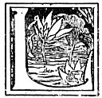
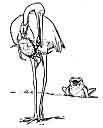

[Intangible Textual Heritage](../../index)  [Hinduism](../index) 
[Buddhism](../../bud/index)  [Index](index)  [Previous](ift07) 
[Next](ift09) 

------------------------------------------------------------------------

# The Cruel Crane Outwitted

 [  
Click to enlarge](img/25.jpg)

 ONG ago the Bodisat was born to
a forest life as the genius of a tree standing near a certain lotus
pond.

Now at that time the water used to run short at the dry season in a
certain pond, not over large, in which there were a good many fish. And
a crane thought on seeing the fish:

"I must outwit these fish somehow or other and make a prey of them."

And he went and sat down at the edge of the water, thinking hew he
should do it.

When the fish saw him, they asked him, "What are you sitting there for,
lost in thought?"

"I am sitting thinking about you," said he.

"Oh, sir what are you thinking about us?" said they.

"Why," he replied, "there is very little water in this pond, and but
little for you to eat; and the heat is so great! So I was thinking,
'What in the world will these fish do now?' "

"Yes, indeed, sir! what *are* we to do?" said they.

"If you will only do as I bid you, I will take you in my beak to a fine
large pond, covered with all the kinds of lotuses, and, put you into
it," answered the crane.

"That a crane should take thought for the fishes is a thing unheard of,
sir, since the world began. It's eating us, one after the other, that
you're aiming at."

"Not I! So long as you trust me, I won't eat you. But if you don't
believe me that there is such a pond, send one of you with me to go and
see it."

Then they trusted him, and handed over to him one of their number--a big
fellow, blind of one eye, whom they thought sharp enough in any
emergency, afloat or ashore.

Him the crane took with him, let him go in the pond, showed him the
whole of it, brought him back, and let him go again close to the other
fish. And he told them all the glories of the pond.

And when they heard what he said, they exclaimed, "All right, sir! You
may take us with you."

Then the crane took the old purblind fish first to the bank of the other
pond, and alighted in a Varana-tree growing on the bank there. But he
threw it into a fork of the tree, struck it with his beak, and killed
it; and then ate its flesh, and threw its bones away at the foot of the
tree. Then he went back and called out:

"I've thrown that fish in; let another one come."

And in that manner he took all the fish, one by one, and ate them, till
he came back and found no more!

But there was still a crab left behind there; and the crane thought he
would eat him too, and called him out:

"I say, good crab, I've taken all, the fish away, and put them into a
fine large pond. Come along. I'll take you too!"

"But how will you take hold of me to carry me along?"

"I'll bite hold of you with my beak."

"You'll let me fall if you carry me like that. I won't go with you!"

"Don't be afraid! I'll hold you quite tight all the way."

Then said the crab to himself, "If this fellow once got hold of fish, he
would never let them go in a pond! Now if he should really put me into
the pond, it would be capital; but if he doesn't--then I'll cut his
throat, and kill him!" So he said to him:

"Look here, friend, you won't be able to hold me tight enough; but we
crabs have a famous grip. If you let me catch hold of you round the neck
with my claws, I shall be glad to go with you."

And the other did not see that he was trying to outwit him, and agreed.
So the crab caught hold of his neck with his claws as securely as with a
pair of blacksmith's pincers and called out, "Off with you, now!"

And the crane took him and showed him the pond, and then turned off
towards the Varana-tree.

"Uncle! " cried the crab, "the pond lies that way, but you are taking me
this way!"

"Oh, that's it, is it?" answered the crane. "Your dear little uncle,
your very sweet nephew, you call me! You mean me to understand, I
suppose, that I am your slave, who has to lift you up and carry you
about with him! Now cast your eye upon the heap of fish-bones lying at
the root of yonder Varana-tree. Just as I have eaten those fish, every
one of them, just so I will devour you as well!"

"Ah! those fishes got eaten through their own stupidity," answered the
crab; "but I'm not going to let you eat *me.* On the contrary, it is
*you* that I am going to destroy. For you in your folly have not seen
that I was outwitting you. If we die we die both together; for I will
cut off this head of yours, and cast it to the ground!" And so saying,
he gave the crane's neck a grip with his claws, as with a vice.

Then gasping, and with tears trickling from his eyes, and trembling with
the fear of death, the crane beseeched him, saying, "O my lord! Indeed I
did not intend to eat you. Grant me my life!"

"Well, well! step down into the pond, and put me in there."

And he turned round and stepped down into the pond, and placed the crab
on the mud at its edge. But the crab cut through its neck as clean as
one would cut a lotus-stalk with a hunting-knife, and then only entered
the water!

When the Genius who lived in the Varana-tree saw this strange affair, he
made the wood resound with his plaudits, uttering in a pleasant voice
the verse:

"The villain, though exceeding clever,  
Shall prosper not by his villainy.  
He may win indeed, sharp-witted in deceit,  
But only as the Crane here from the Crab!"

 [  
Click to enlarge](img/27.jpg)

------------------------------------------------------------------------

[Next: Loving Laili](ift09)
