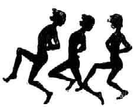
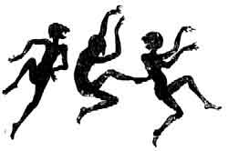
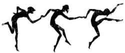
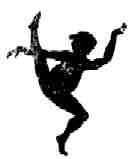

[Intangible Textual Heritage](../../index)  [Hinduism](../index) 
[Buddhism](../../bud/index)  [Index](index)  [Previous](ift18) 
[Next](ift20) 

------------------------------------------------------------------------

# Pride Goeth Before A Fall

 N a certain village there lived
ten cloth merchants, who always went about together. Once upon a time
they had travelled far afield, and were returning home with a great deal
of money which they had obtained by selling their wares. Now there
happened to be a dense forest near their village, and this they reached
early one morning. In it there lived three notorious robbers, of whose
existence the traders had never heard, and while they were still in the
middle of it the robbers stood before them, with swords and cudgels in
their hands, and ordered them to lay down all they had. The traders had
no weapons with them, and so, though they were many more in number, they
had to submit them-selves to the robbers, who took away everything from
them, even the very clothes they wore, and gave to each only a small
loin-cloth a span in breadth and a cubit in length.

The idea that they had conquered ten men and plundered all their
property, now took possession of the robbers' minds. They seated
themselves like three monarches before the men they had plundered, and
ordered them to dance to them before returning home. The merchants now
mourned their fate. They had lost all they had, except their loincloth,
and still the robbers were not satisfied, but ordered them to dance.

There was, among the ten merchants, one who was very clever. He pondered
over . calamity that had come upon him and his friends, the dance they
would have to perform, and the magnificent manner in which the three
robbers had seated themselves on the grass. At the same time he observed
that these last had placed their weapons on the ground, in the assurance
of having thoroughly cowed the traders, who were now commencing to
dance. So he took the lead in the dance, and, as a song is always sung
by the leader on such occasions, to which the rest keep time with hands
and feet, he thus began to sing:

'We are enty men,  
They are erith men:  
If each erith man,  
Surround eno men  
Eno man remains.  

Ta, tai, tom, tadingana."

The robbers were all uneducated, and thought that the leader was merely
singing a song as usual. So it was in one sense; for the leader
commenced from a distance, and had sung the song over twice before he
and his companions commenced to approach the robbers. They had
understood his meaning, because they had been trained in trade.

When two traders discuss the price of an article in the presence of a
purchaser, they use a riddling sort of language.

 

"What is the price of this cloth?" one trader will ask another.

"Enty rupees," another will reply, meaning "ten rupees."

Thus, there is no possibility of the purchaser knowing what is meant
unless he be acquainted with trade language. By the rules of this secret
language erith means "three" enty means "ten," and eno means "one." So
the leader by his song meant to hint to his fellow-traders that they
were ten men, the robbers only three, that if three pounced upon each of
the robbers, nine of them could hold them down, while the remaining one
bound the robbers' hands and feet.

 

The three thieves, glorying in their victory, and little understanding
the meaning of the song and the intentions of the dancers, were proudly
seated chewing betel and tobacco. Meanwhile the song was sung a third
time. *Ta tai tom* had left the lips of the singer; and, before
*tadingana* was out of them, the traders separated into parties of
three, and each party pounced upon a thief. The remaining one--the
leader himself--tore up into long narrow strips a large piece of cloth,
six cubits long, and tied the hands and feet of the robbers. These were
entirely humbled now, and rolled on the ground like three bags of rice!

 

The ten traders now took back all their property, and armed themselves
with the swords and cudgels of their enemies; and when they reached
their village, they often amused their friends and relatives by relating
their adventure.

 

 

------------------------------------------------------------------------

[Next: Raja Rasalu](ift20)
