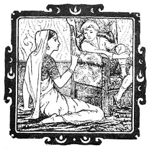

[Intangible Textual Heritage](../../index)  [Hinduism](../index) 
[Buddhism](../../bud/index) 

------------------------------------------------------------------------

<table width="75%">
<colgroup>
<col style="width: 50%" />
<col style="width: 50%" />
</colgroup>
<tbody>
<tr class="odd">
<td width="50%" data-valign="TOP"> 
</td>
<td width="50%" data-valign="TOP"><h1 id="indian-fairy-tales" data-align="CENTER">Indian Fairy Tales</h1>
<h2 id="by-joseph-jacobs" data-align="CENTER">by Joseph Jacobs</h2>
<h4 id="section" data-align="CENTER">[1912]</h4></td>
</tr>
</tbody>
</table>

------------------------------------------------------------------------

[Title Page](ift00)  
[Preface](ift01)  
[The Lion and the Crane](ift02)  
[How the Raja's Son won the Princess Labam](ift03)  
[The Lambikin](ift04)  
[Punchkin](ift05)  
[The Broken Pot](ift06)  
[The Magic Fiddle](ift07)  
[The Cruel Crane Outwitted](ift08)  
[Loving Laili](ift09)  
[The Tiger, The Brahman, and the Jackal](ift10)  
[The Soothsayers Son](ift11)  
[Harisarman](ift12)  
[The Charmed Ring](ift13)  
[The Talkative Tortoise](ift14)  
[A Lac of Rupees for a Piece of Advice](ift15)  
[The Gold-Giving Serpent](ift16)  
[The Son of Seven Queens](ift17)  
[A Lesson for Kings](ift18)  
[Pride Goeth Before a Fall](ift19)  
[Raja Rasalu](ift20)  
[The Ass in the Lion's Skin](ift21)  
[The Farmer and the Money-Lender](ift22)  
[The Boy who had a Moon on his Forehead and a Star on his Chin](ift23)  
[The Prince and the Fakir](ift24)  
[Why the Fish Laughed](ift25)  
[The Demon with the Matted Hair](ift26)  
[The Ivory City and its Fairy Princess](ift27)  
[Sun, Moon, and Wind go out to Dinner](ift28)  
[How the Wicked Sons were Duped](ift29)  
[The Pigeon and the Crow](ift30)  
[General Notes](ift31)  
[Story Notes](ift32)  
