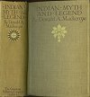
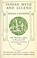

  
[Intangible Textual Heritage](../../index)  [Hinduism](../index.md) 
[Index](index)  [Next](iml01.md) 

------------------------------------------------------------------------

[Buy this Book at
Amazon.com](https://www.amazon.com/exec/obidos/ASIN/1421263637/internetsacredte.md)

------------------------------------------------------------------------

# INDIAN MYTH AND LEGEND

### DONALD A. MACKENZIE

##### With Illustrations in Colour

##### by Warwick Goble

##### and numerous monochrome Plates

#### THE GRESHAM PUBLISHING COMPANY LIMITED

#### 66 CHANDOS STREET COVENT GARDEN LONDON

#### \[1913\]

NOTICE OF ATTRIBUTION  
Scanned at Intangible Textual Heritage, December 2005. Proofed and
formatted by John Bruno Hare. This text is in the public domain in the
United States because it was published prior to January 1st, 1923. These
files may be used for any non-commercial purpose provided this notice of
attribution is left intact in all copies.

[  
Click to enlarge](img/front.jpg.md)  
SITA FINDS RAMA AMONG LOTUS BLOSSOMS  
From the painting by Warwick Goble  

[  
Click to enlarge](img/cover.jpg.md)  
Front Cover and Spine  

[  
Click to enlarge](img/title.jpg.md)  
Title Page  

 

*To My Indian Friends*

 

------------------------------------------------------------------------

[Next: Preface](iml01.md)
