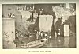
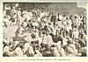

  
[Intangible Textual Heritage](../../index)  [Hinduism](../index) 
[Index](index)  [Previous](iml04)  [Next](iml06) 

------------------------------------------------------------------------

[Buy this Book at
Amazon.com](https://www.amazon.com/exec/obidos/ASIN/1421263637/internetsacredte)

------------------------------------------------------------------------

p. xvii

# INTRODUCTION

The triangular sub-continent of India is cut off from the rest of Asia
by the vast barriers of the Himalayas, the Hindu Kush, the Suleiman
mountains, and the Indian Ocean. Its population comprises about two
hundred and ninety-five millions, and is of greatest density on the
fertile northern plain, which is watered by three river systems, the
Indus and its tributaries on the west, and the Ganges and Brahmaputra
with their tributaries which pour into the Bay of Bengal. South of the
Vindhya mountain ranges is the plateau of the Deccan. The climate varies
from temperate on the Himalayan slopes to tropical in southern India,
and over the entire country there are two pronounced annual seasons, the
dry and the rainy.

Our interest abides in this volume chiefly with the northern plain and
the people who are familiar in varying degrees with the sacred and
heroic literature passed under review; that is, with the scenes of the
early Indian civilization known as Aryan and those numerous inheritors
of Aryan traditions, the Hindus, who exceed two hundred and seven
millions of the population of India. Modern Hinduism embraces a number
of cults which are connected with the early religious doctrines of the
Aryanized or Brahmanized India of the past; it recognizes, among other
things, the ancient caste system which includes distinct racial types
varying from what is known as the

p. xviii

Aryan to the pre-Dravidian stocks. Other religious organizations may be
referred to in passing. Buddhists are chiefly confined to Burma, Sikhs
number two millions, the Mohammedans nearly sixty-three millions, while
the Parsecs number roughly ninety-five thousand; less than three million
natives and half-castes are Christians.

Like Egypt, India is a land of ancient memories, but its history, or
rather pre-history, does not begin until about a thousand years after
the erection was completed of the great pyramids at Gizeh. Between 2000
B.C. and 1200 B.C. tribes of pastoral and patriarchal peoples of Aryan
speech were pouring over the north-western frontier and settling in the
Punjab. There are no written or inscribed records, or even native
traditions, of this historic migration, but we are able to follow
vaguely, from the references found in religious compositions, the
gradual conquest of northern India, which covered a period of several
centuries. To what extent this invasion was racial, rather than
cultural, it is extremely difficult to discover. But no doubt can be
entertained regarding the influence exercised by the ancient military
aristocracy and their religious teachers. Certain of the Aryan gods
still receive recognition in India after a lapse of over three thousand
years. This fact makes Indian mythology of special interest to the
ever-increasing number of students of comparative religion.

Indian mythology also possesses particular attractions for us on account
of its intimate association with what is known as the "Aryan problem".
Scholars of a past generation held pronounced views on Aryan matters,
and produced a considerable literature of highly controversial
character. In fact, theories regarding the Aryan languages and the Aryan
"race" are as varied as they are numerous; the wordy warfare which
occupied the greater

p. xix

and not infrequently with much brilliance; occasionally, however, it was
not awanting in the undesirable elements of personal feeling and
national antipathy. But, happily, we appear to have reached a time when
this fascinating and important problem can be considered dispassionately
in the proper scientific spirit, and without experiencing that
unnecessary dread of having to abandon decided opinions which may have
been formed when the accumulated data had less variety and bulk than
that which is now available. This change has been brought about by the
extended study of comparative religion and the wonderful and engaging
results which have attended modern-day methods of ethnic and
archaeological research.

The Aryan controversy had its origin at the close of the eighteenth
century, when that distinguished Oriental scholar Sir William Jones, who
acted for a period as a judge of the Supreme Court in Bengal, drew
attention to the remarkable resemblances between the Sanskrit, Greek,
Latin, German, and Celtic languages. In 1808, Schlegel published his
*Language and Wisdom of the Hindus*, and urged the theory that India was
the home of an ancestral race and a group of languages that were
progenitors of various European ones. Other scholars subsequently
favoured Zend, the language of Persia, and transferred the "racial
beehive" to that country; rival claims were afterwards set up for Asia
Minor and the Iranian plateau.

The science of Comparative Philology was a direct product of these early
controversies; it was established in the "thirties" when Bopp published
his Comparative Grammar in which a new term, having a racial
significance, was invented: he grouped all European languages, except
Basque, Magyar, Turkish, and Finnish, as "Indo-Germanic". After the
study of Sanskrit literature revealed, however,

p. xx

that the Aryans occupied but a small part of India when their sacred
hymns, the Vedas, were composed, the cradle of the Aryan race was
shifted to some uncertain area beyond the Himalayan mountains.

Max Müller, the distinguished Sanskrit authority, who in the words of an
Indian scholar "devoted his life-time to the elucidation of the
learning, literature, and religion of ancient India", [1](#fn_0) abandoned Bopp's patriotic term
"Indo-Germanic" and adopted Aryan, which he founded on the Sanskrit
racial designation "Arya". At first he accepted the theory of an Aryan
race and especially of an Aryan civilization which originated on the
Central Asian plateau, but, as will be seen, he subsequently modified
his views in this regard.

A new theory regarding the Aryans, who are now more commonly referred to
as Indo-Europeans, was strongly advocated in 1851 and later by Dr.
Robert Gordon Latham, who devoted many years to the study of ethnology
and philology. He argued that as the major part of the peoples speaking
Indo-European tongues was found in Europe, the cradle of the race might,
after all, be transferred westward. This theory was supported by the
fact (among others) that the Lithuanian language was no less archaic
than Sanskrit.

The European hypothesis found in time many able supporters, and the
advocates of rival Teutonic and Celtic claims waxed eloquent and heated
over the exact location of the Aryan homeland. An industrious search was
mean-while conducted for words common to all Aryan languages which
described the natural features of the racial "cradle". This work of
reconstruction was certainly not lacking in picturesque results, for
attractive visions were presented of Aryan Arcadias in which the simple
and contemplative

p. xxi

ancestors of many bitter controversialists dwelt together in exemplary
unity and peace. The question of location might remain unsettled, but it
was generally agreed that the ancient people were surrounded by cows,
sheep, and goats; sometimes they rode their horses or yoked them in
rough rumbling carts, and sometimes they ate them. No asses were
admitted to the fold because of their decided partiality for Central
Asian plains, which seemed quite reasonable. Trouble was occasionally
caused by wolves and bears, or, mayhap, a stray lion, but these and
other worries associated with the simple life might be compensated for
by the fact that the primitive people, as one writer [1](#fn_1) put it, "understood the art of drinking".
Mead, brewed from honey, was found to be "dear to the hearts of the
ancient Aryans"; had the Brahman ever forgotten his "madhu", the
Welsh-man his "medhu", or the Lithuanian his "medus"? Problems arose
regarding the ancients' knowledge of trees: it was found that "bhaga"
was applied indifferently by the family groups to the beech and the oak,
and more than one ingenious explanation was suggested to account for
this apparent discrepancy. Then, suddenly, Professor Max Müller swept
into the background the rival Aryan homeland pictures, pointing out the
while that it is "almost impossible to discover any animal or any plant
that is peculiar to the north of Europe and is not found sporadically in
Asia also". Destructive criticism proceeded apace, until now nothing has
been left to us of the ancestral Arcadia but "air, water, heat and
cold". In his review of the widely accepted philological "evidence"
regarding the Aryan homeland, Max Müller declared it to be so pliant
that it was possible "to make out a more or less plausible case for any
part of the world". The advanced group of philologists held, indeed,
that no racial

p. xxii

centre could be located. Ultimately "Delbrück went so far," says
Professor Ripley, "as to deny that any single parent language ever
existed in fact". [1](#fn_2)

Meanwhile ethnologists and archæologists were engaged accumulating
important data. It was found that Europe had been invaded at the close
of the Stone Age by a broad-headed (brachycephalic) people, who brought
no culture and even retarded the growth of civilization in their areas
of settlement. A new problem was thus presented: were the Aryans a
brachycephalic (broad-headed) or a dolichocephalic (long-headed) people?
Its solution was rendered all the more difficult when it was found that
living representatives of both racial types were peoples of Aryan
speech. The idea that skull shapes, which are associated with other
distinct physical characteristics, were due to habits of life and the
quality of food which had to be masticated, was in time advanced to
discredit new methods of ethnic research, but it has since been
thoroughly disproved. In many ancient graves are found skulls which do
not differ from those of modern men and women, living under different
conditions and eating different food.

Patriotic controversialists were not awanting again in dealing with the
problem of varying skull shapes. French scientists, for instance, have
identified the "broad heads", now generally known as the Alpine race,
with the ubiquitous Celts, but as present-day Hindus are mainly "long
heads", the Aryan racial connection here suggested remains obscure. A
clue to the mystery was sought for in Asia Minor, but no satisfactory
result could be obtained there to support philological theories, because
the Armenians, who are "broad heads", and their enemies and neighbours
the Kurds, who are "long heads", are

p. xxiii

both peoples of Aryan speech. A scornful scientist has dismissed as a
"prehistoric romance", the theory that the fair Scandinavian "long
heads" are identical with the brunet "long heads" of India. Both the
Celtic (Alpine) and Indo-Germanic racial theories are as inconclusive as
they are diametrically in opposition.

The science of philology, which, at its inception, "dazzled and silenced
all", has been proved to be no safe guide in racial matters. We must
avoid, as Professor Ripley says, "the error of confusing community of
language with identity of race. Nationality may often follow linguistic
boundaries, but race bears no necessary relation whatever to
them." [1](#fn_3)

By way of illustration, it may be pointed out in this connection that
English is spoken at the present day by, among others, the Hong Kong
Chinamen, the American Red Indians and negroes, by the natives of
Ireland, Wales, Cornwall, and the Scottish Highlands, besides the
descendants of the ancient Britons, the Jutes, the Angles, the Saxons,
the Norsemen, the Danes, and the Normans in England, but all these
peoples cannot be classified in the racial sense simply as Englishmen.
Similarly, the varied types of humanity who are Aryan in speech cannot
all be regarded as representatives of the "Aryan race", that is, if we
accept the theory of an "Aryan race", which Virchow, by the way, has
characterized as "a pure fiction".

Max Müller, in his closing years, faced this aspect of the problem
frankly and courageously. "Aryas", he wrote, "are those who speak Aryan
languages, whatever their colour, whatever their blood. In calling them
Aryas we predicate nothing of them except that the grammar of their
language is Aryan. . . . I have declared again

p. xxiv

and again that if I say Aryas, I mean neither blood, nor bones, nor
hair, nor skull; I mean simply those who speak an Aryan language. The
same applies to Hindus, Greeks, Romans, Germans, Celts, and Slays. When
I speak of these I commit myself to no anatomical characteristics. The
blue-eyed and fair-haired Scandinavians may have been conquerors or
conquered, they may have adopted the language of their darker lords or
their subjects, or vice versa. I assert nothing beyond their language
when I call them Hindus, Greeks, Romans, Germans, Celts, and Slays, and
in that sense, and in that sense only, do I say that even the blackest
Hindus represent an earlier stage of Aryan speech and thought than the
fairest Scandinavians. . . . To me an ethnologist who speaks of an Aryan
race, Aryan blood, Aryan eyes and hair, is as great a sinner as a
linguist who speaks of a dolichocephalic dictionary or a brachycephalic
grammar." [1](#fn_4)

Aryan, however, has been found to be a convenient term, and even
ethnologists do not scorn its use, although it has been applied "in a
confusing variety of signification by different philologists". One
application of it is to the language group comprising Sanskrit, Persian,
Afghan, &c. Some still prefer it to "Indo-European", which has found
rivals in "Afro-European", among those who connect the Aryan languages
with North Africa, and "Afro-Eurasian", which may be regarded as
universal in its racial application, especially if we accept Darwin's
theory that the Garden of Eden was located somewhere in Africa. [2](#fn_5) We may think of the Aryans as we do of the
British when that term is used to include the peoples embraced by the
British Empire.

p. xxv

In India the Aryans were from late Vedic times divided into four
castes--Brahmans (priests), Kshatriyas (kings and warriors), Vaisyas
(traders, &c.), and Sudras (aborigines).

Caste (Varna) signifies "colour", but it is not certain whether the
reference is to be given a physical or mythological application. The
first three castes were Aryans, the fairest people; the fourth caste,
that comprising the dark-skinned aborigines, was non-Aryan. "Arya",
however, was not always used in the sense that we have been accustomed
to apply "Aryo-Indian". In one of the sacred books of the ancient people
it is stated: "The colour of the Brahmans was white; that of the
Kshatriyas red; that of the Vaisyas yellow; and that of the Sudras
black". [1](#fn_6) This colour reference connects
"caste" with the doctrine of yugas, or ages of the universe ([Chapter
VI](iml11.htm#ch06)).

Risley, dealing with "the leading castes and tribes in Northern India,
from the Bay of Bengal to the frontiers of Afghanistan", concludes from
the data obtained from census returns, that we are able "to distinguish
two extreme types of feature and physique, which may be provisionally
described as Aryan and Dravidian. A third type, which in some respects
may be looked upon as intermediate between these two, while in other,
and perhaps the most important, points it can hardly be deemed Indian at
all, is found along the northern and eastern borders of Bengal. The most
prominent characters are a relatively short (brachycephalic) head, a
broad face, a short, wide nose, very low in the bridge, and in extreme
cases almost bridgeless; high and projecting cheekbones and eyelids,
peculiarly formed so as to give the impression that the eyes are
obliquely set in the head. . . .

p. xxvi

\[paragraph continues\] This type . . .
may be conveniently described as Mongoloid. . . ." [1](#fn_7)

According to Risley, the Aryan type is dolichocephalic (long-headed),
"with straight, finely-cut (lepto-rhine) nose, a long, symmetrical
narrow face, a well-developed forehead, regular features, and a high
facial angle". The stature is "fairly high", and the body is "well
proportioned, and slender rather than massive". The complexion is "a
very light transparent brown--'wheat coloured' is the common vernacular
description--noticeably fairer than the mass of the population".

The Dravidian head, the same authority states, "usually inclines to be
dolichocephalic", but "all other characters present a marked contrast to
the Aryan. The nose is thick and broad, and the formula expressing its
proportionate dimensions is higher than in any known race, except the
Negro. The facial angle is comparatively low; the lips are thick; the
face wide and fleshy; the features coarse and irregular." The stature is
lower than that of the Aryan type: "the figure is squat and the limbs
sturdy. The colour of the skin varies from very dark brown to a shade
closely approaching black. . . . Between these extreme types", adds
Risley, "we find a large number of intermediate groups." [2](#fn_8)

Of late years ethnologists have inclined to regard the lower types
represented by hill and jungle tribes, the Veddas of Ceylon, &c., as
pre-Dravidians. The brunet and long-headed Dravidians may have entered
India long before the Aryans: they resemble closely the Brahui of
Baluchistan and the Man-tse of China.

India is thus mainly long-headed (dolichocephalic). We have already
seen, however, that in northern and eastern Bengal there are traces of
an infusion of Mongolian

p. xxvii

\[paragraph continues\] "broad heads";
another brachycephalic element is pronounced in western India, but it is
not Mongolian; possibly we have here evidences of a settlement of Alpine
stock. According to Risley, these western broad heads are the
descendants of invading Scythians, [1](#fn_9) but
this theory is not generally accepted.

The Eur-Asian Alpine race of broad heads are a mountain people
distributed from Hindu Kush westward to Brittany. On the land bridge of
Asia Minor they are represented by the Armenians. Their eastern
prehistoric migrations is by some ethnologists believed to be marked by
the Ainus of Japan. They are mostly a grey-eyed folk, with dark hair and
abundant moustache and beard, as contrasted with the Mongols, whose
facial hair is scanty. There are short and long varieties of Alpine
stock, and its representatives are usually sturdy and muscular. In
Europe these broad-headed invaders overlaid a long-headed brunet
population, as the early graves show, but in the process of time the
broad heads have again retreated mainly to their immemorial upland
habitat. At the present day the Alpine race separates the long-headed
fair northern race from what is known as the long-headed dark
Mediterranean race of the south.

A slighter and long-headed brunet type is found south of Hindu Kush.
Ripley has condensed a mass of evidence to show that it is akin to the
Mediterranean race. [2](#fn_10) He refers to it
as the "eastern branch", which includes Afghans and Hindus. "We are all
familiar with the type," he says, "especially as it is emphasized by
inbreeding and selection among the Brahmans. . . . There can be no doubt
of their (the Eastern Mediterraneans) racial affinities with our
Berbers, Greeks, Italians, and

p. xxviii

Spaniards. They are all members of the same race, at once the widest in
its geographical extension, the most populous and the most primitive of
our three European types." [1](#fn_11)

Professor Elliot Smith supports Professor Ripley in this connection, and
includes the Arabs with the southern Persians in the same group, but
finding the terms "Hamitic" and "Mediterranean" insufficient, prefers to
call this widespread family the "Brown race", to distinguish its
representatives from the fair Northerners, the "yellow" Mongolians, and
the "black" negroes.

North of the Alpine racial area are found the nomadic Mongolians, who
are also "broad heads", but with distinguishing facial characteristics
which vary in localities. As we have seen, the Mongoloid features are
traceable in India. Many settlers have migrated from Tibet, but among
the high-caste Indians the Mongoloid eyes and high cheek bones occur in
families, suggesting early crossment.

Another distinctive race has yet to be accounted for--the tall, fair,
blue-eyed, long-headed Northerners, represented by the Scandinavians of
the present day. Sergi and other ethnologists have classed this type as
a variety of the Mediterranean race, which had its area of localization
on the edge of the snow belt on lofty plateaus and in proximity to the
Arctic circle. The theory that the distinctive blondness and great
stature of the Northerners were acquired in isolation and perpetuated by
artificial selection is, however, more suggestive than conclusive,
unless we accept the theory that acquired characteristics can be
inherited. How dark eyes became grey or blue, and dark hair red or
sandy, is a problem yet to be solved.

The ancestors of this fair race are believed to have

p. xxix

been originally distributed along the northern Eur-Asian plateaus;
Keane's blonde long-headed Chudes [1](#fn_12)
and the Wu-suns in Chinese Turkestan are classed as varieties of the
ancient Northern stock. An interesting problem is presented in this
connection by the fair types among the ancient Egyptians, the modern-day
Berbers, and the blondes of the Atlas mountains in Morocco. Sergi is
inclined to place the "cradle" of the Northerners on the edge of the
Sahara.

The broad-headed Turki and Ugrians are usually referred to as a blend of
the Alpine stock and the proto-Northerners, with, in places, Mongolian
admixture.

As most of the early peoples were nomadic, or periodically nomadic,
there must have been in localities a good deal of interracial and
intertribal fusion, with the result that intermediate varieties were
produced. It follows that the intellectual life of the mingling peoples
would be strongly influenced by admixture as well as by contact with
great civilizations.

It now remains for us to deal with the Aryan problem in India. Dr.
Haddon considers that the invading Aryans were "perhaps associated with
Turki tribes" when they settled in the Punjab. [2](#fn_13) Prior to this racial movement, the
Kassites, whose origin is obscure, assisted by bands of Aryans,
overthrew the Hammurabi dynasty in Babylon and established the Kassite
dynasty between 2000 B.C. and 1700 B.C. At this period the domesticated
horse was introduced, and its Babylonian name, "the ass of the East", is
an indication whence it came. Another Aryan invasion farther west is
marked by the establishment of the Mitanni kingdom between the area
controlled by the Assyrians and the Hittites. Its kings had names

p. xxx

which are clearly Aryan. These included Saushatar, Artatatama, Sutarna,
and Tushratta. The latter was the correspondent in the Tel-el-Amarna
letters of his kinsmen the Egyptian Pharaohs, Amenhotep the Magnificent,
and the famous Akhenaton. The two royal houses had intermarried after
the wars of Thothmes III. It is impossible to fix the date of the rise
of the Mitanni power, which held sway for a period over Assyria, but we
know that it existed in 1500 B.C. The horse was introduced into Egypt
before 1580 B.C.

It is generally believed that the Aryans were the tamers of the horse
which revolutionized warfare in ancient days, and caused great empires
to be overthrown and new empires to be formed. When the Aryans entered
India they had chariots and swift steeds.

There is no general agreement as to the date of settlement in the
Punjab. Some authorities favour 2000 B.C., others 1700 B.C.; Professor
Macdonell still adheres to 1200 B.C. [1](#fn_14)
It is possible that the infusion was at first a gradual one, and that it
was propelled by successive folk-waves. The period from the earliest
migrations until about 800 or 700 B.C. is usually referred to as the
Vedic Age, during which the Vedas, or more particularly the invocatory
hymns to the deities, were composed and compiled. At the close of this
Age the area of Aryan control had extended eastward as far as the upper
reaches of the Jumna and Ganges rivers. A number of tribal states or
communities are referred to in the hymns.

It is of importance to note that the social and religious organization
of the Vedic Aryans was based upon the principle of "father right", as
contrasted with the principle of "mother right", recognized by
representative communities of the Brown race.

p. xxxi

Like the Alpine and Mongoloid peoples, the Vedic Aryans were a
patriarchal people, mainly pastoral but with some knowledge of
agriculture. They worshipped gods chiefly: their goddesses were vague
and shadowy: their earth goddess Prithivi was not a Great Mother in the
Egyptian and early European sense; her husband was the sky-god Dyaus.

In Egypt the sky was symbolized as the goddess Nut, and the earth as the
god Seb, but the Libyans had an earth-goddess Neith. The "Queen of
Heaven" was a Babylonian and Assyrian deity. If the Brown race
predominated in the Aryan blend during the Vedic Age, we should have
found the Great Mother more in prominence.

The principal Aryan deities were Indra, god of thunder, and Agni, god of
fire, to whom the greater number of hymns were addressed. From the
earliest times, however, Aryan religion was of complex character. We can
trace at least two sources of cultural influence from the earlier
Iranian period. [1](#fn_15) The hymns bear
evidence of the declining splendour of the sublime deities Varuna and
Mitra (Mithra). It is possible that the conflicts to which references
are made in some of the hymns were not unconnected with racial or tribal
religious rivalries.

Indra, as we show ([Chapter I](iml06.htm#ch01)), bears resemblances to
other "hammer gods". He is the Indian Thor, the angry giant-killer, the
god of war and conquests. That his name even did not originate in India
is made evident by an inscription at Boghaz Koi, in Asia Minor,
referring to a peace treaty between the kings of the Hittites and
Mitanni. Professor Hugo Winckler has deciphered from this important
survival of antiquity "In-da-ra" as a Mitanni

p. xxxii

deity who was associated with Varuna, Mitra, and Nasatya.

No evidence has yet been forthcoming to indicate any connection between
the Aryans in Mitanni and the early settlers in India. It would appear,
however, that the two migrations represented by the widely separated
areas of Aryan control, radiated from a centre where the gods Indra,
Varuna, and Mitra were grouped in the official religion. The folk-wave
which pressed towards the Punjab gave recognition to Agni, possibly as a
result of contact, or, more probably, fusion with a tribe of specialized
fire-worshippers.

If we separate the Indra from the Agni, cremating worshippers, it will
be of interest to follow the ethnic clue which is thus suggested.
Modern-day Hindus burn their dead in accordance with the religious
practice of the Agni worshippers in the Vedic Age. It is doubtful,
however, if all the Aryan invaders practised cremation. There are
references to burial in the "house of clay", and Yama, god of the dead,
was adored as the first man who explored the path to the "Land of the
Pitris" (Fathers) which lay across the mountains. Professor Oldenberg
considers that these burials referred to the disposal of the bones and
ashes of the dead.

Professor Macdonell and Dr. Keith, however, do not share Professor
Oldenberg's view in this connection. [1](#fn_16)
They hold that the epithet *Agni-dagdhah*, "burnt with fire", "applies
to the dead who were burned on the funeral pyre"; the other custom being
burial--*An-agni-dagdhah*, "not burnt with fire". They also refer to
*Paroptah*, "casting out", and *Uddhitah*, "Exposure of the dead", which
are expressions of doubtful meaning

p. xxxiii

\[paragraph continues\] These authorities
add: "Burial was clearly not rare in the Rigvedic period: a whole hymn
(x, 18) describes the ritual attending it. The dead man was buried
apparently in full attire, with his bow in his hand, and probably at one
time his wife was immolated to accompany him. . . . But in the Vedic
period both customs appear in a modified form: the son takes the bow
from the hand of the dead man, and the widow is led away from her dead
husband by his brother or nearest kinsman. A stone is set up between the
dead and the living to separate them."

The Persian fire-worshippers, on the other hand, did not cremate their
dead, but exposed them on "towers of silence" to be devoured by
vultures, like their modern-day representatives the Parsees, who
migrated into India after displacement by the Mohammedans. In Persia the
sacred fire was called Atar, [1](#fn_17) and was
identified with the supreme deity Ahura-Mazda (Ormuzd).

Agni of the Vedic Age is the messenger between gods and men; he conducts
the deities to the sacrifice and the souls of the cremated dead to
Paradise; he is also the twin brother of Indra.

Now, it is of interest to note, in considering the racial significance
of burial rites, that cremation was not practised by the western
representatives of the Brown race. In pre-Dynastic Egypt the dead were
interred as in Babylon, [2](#fn_18) with food
vessels, &c. Neolithic man in Europe also favoured crouched burials, and
this practice obtained all through the Bronze Age.

The Buriats, who are Mongols dwelling in the vicinity of Lake Baikal,
still perpetuate ancient customs, which

p. xxxiv

resemble those of the Vedic Aryans, for they not only practise cremation
but also sacrifice the horse (see [Chap. V](iml10.htm#ch05)). In his
important study of this remarkable people, Mr. Curtin says: [1](#fn_19) "The Buriats usually burn their dead;
occasionally, however, there is what is called a 'Russian burial', that
is, the body is placed in a coffin and the coffin is put in the ground.
But generally if a man dies in the Autumn or the Winter his body is
placed on a sled and drawn by the horse which he valued most to some
secluded place in the forest. There a sort of house is built of fallen
trees and boughs, the body is placed inside the house, and the building
is then surrounded with two or three walls of logs so that no wolf or
other animal can get into it." The horse is afterwards slain. "If other
persons die during the winter their bodies are carried to the same
house. In this lonely silent place in the forest they rest through the
days and nights until the first cuckoo calls, about the ninth of May.
Then relatives and friends assemble, and without opening the house burn
it to the ground. Persons who die afterwards and during the Summer
months are carried to the forest, placed on a funeral pile, and burned
immediately. The horse is killed just as in the first instance."

When the dead are buried without being burned, the corpse is either
carried on a wagon, or it is placed upright in front of a living man on
horseback so as to ride to its last resting place. The saddle is broken
up and laid at the bottom of the grave, while the body is turned to face
the south-east. In this case they also sacrifice the horse which is
believed to have "gone to his master, ready for use

Cremation spread throughout Europe, as we have said,

p. xxxv

in the Bronze Age. It was not practised by the early folk-waves of the
Alpine race which, according to Mosso, [1](#fn_20) began to arrive after copper came into
use. The two European Bronze Age burial customs, associated with urns of
the "food vessel" and "drinking cup" types, have no connection with the
practice of burning the dead. The Archæological Ages have not
necessarily an ethnic significance. Ripley is of opinion, however, that
the practice of cremation indicates a definite racial infusion, but
unfortunately it has destroyed the very evidence, of which we are most
in need, to solve the problem. It is impossible to say whether the
cremated dead were "broad heads" or "long heads".

"Dr. Sophus Müller of Copenhagen is of opinion that cremation was not
practised long before the year 1000 B.C. though it appeared earlier in
the south of Europe than in the north. On both points Professor Ridgeway
of Cambridge agrees with him." [2](#fn_21)

The migration of the cremating people through Europe was westward and
southward and northward; they even swept through the British Isles as
far north as Orkney. They are usually referred to by archæologists as
"Aryans"; some identify them with the mysterious Celts, whom the French,
however, prefer to associate, as we have said, with the Alpine "broad
heads" especially as this type bulks among the Bretons and the hillmen
of France. We must be careful, however, to distinguish between the
Aryans and Celts of the philologists and archæologists.

It may be that these invaders were not a race in the proper sense, but a
military confederacy which maintained a religious organization
formulated in some unknown area where they existed for a time as a
nation. The Normans

p. xxxvi

who invaded these islands were Scandinavians [1](#fn_22); they settled in France, intermarried with
the French, and found allies among the Breton chiefs. It is possible
that the cremating people similarly formed military aristocracies when
they settled in Hindustan, Mitanni, and in certain other European areas.
"Nothing is commoner in the history of migratory peoples," says
Professor Myres, [2](#fn_23)" than to find a
very small leaven of energetic intruders ruling and organizing large
native populations, without either learning their subjects' language or
imposing their own till considerably later, if at all." The
archæological evidence in this connection is of particular value. At a
famous site near Salzburg, in upper Austria, over a thousand Bronze Age
graves were discovered, just over half of which contained unburnt
burials. Both methods of interment were contemporary in this district,
"but it was noticed that the cremated burials were those of the
wealthier class, or of the dominant race." [3](#fn_24) We find also that at Hallstatt "the bodies
of the wealthier class were reduced to ashes". [4](#fn_25) In some districts the older people may
have maintained their supremacy. At Watsch and St. Margaret in Carniola
"a similar blending of the two rites was observed . . . the unburnt
burials being the richer and more numerous". [5](#fn_26) The descent of the Achaens into Greece
occurred at a date earlier than the rise of the great Hallstatt
civilization. According to Homeric evidence they burned their dead;
"though the body of Patroklos was cremated," however, "the lords of
Mycenae were interred unburnt in richly furnished graves". [6](#fn_27) In Britain the cremating people mingled
with their predecessors perhaps more intimately

 

[  
Click to enlarge](img/_03600.jpg)  
THE CREMATION GHAT, BENARES  

 

p. xxxvii

than in other areas where there were large states to conquer. A
characteristic find on Acklam Wold, Yorkshire, may be referred to. In
this grave "a pile of burnt bones was in close contact with the legs of
a skeleton buried in the usual contracted position, and they seemed to
have been deposited while yet hot, for the knees of the skeleton were
completely charred. It has been suggested in cases like this, or where
an unburnt body is surrounded by a ring of urn burials, the entire
skeleton may be those of chiefs or heads of families, and the burnt
bones those of slaves, or even wives, sacrificed at the funeral. The
practice of suttee (sati) in Europe rests indeed on the authority of
Julius Cæsar, who represents such religious suicides as having, at no
remote period from his own, formed a part of the funeral rites of the
Gaulish chiefs; and also states that the relatives of a deceased
chieftain accused his wives of being accessory to his death, and often
tortured them to death on that account." [1](#fn_28) If this is the explanation, the cremating
invaders constituted the lower classes in Gaul and Britain, which is
doubtful. The practice of burning erring wives, however, apparently
prevailed among the Mediterranean peoples. In an Egyptian folk-tale a
Pharaoh ordered a faithless wife of a scribe to be burned at the
stake. [2](#fn_29) One of the Ossianic folk
tales of Scotland relates that Grainne, wife of Finn-mac-Coul, who
eloped with Diarmid, was similarly dealt with. [3](#fn_30) The bulk of the archæological evidence
seems to point to the invaders, who are usually referred to as "Aryans"
having introduced the cremation ceremony into Europe. Whence came they?
The problem is greatly complicated by the evidence from Palestine, where
cremation was practised by the hewers of the great artificial caves
which were constructed about

p. xxxviii

\[paragraph continues\] 3000 B.C. [1](#fn_31) As cremation did not begin in Crete,
however, until the end of period referred to as "Late Minoan Third"
(1450-1200 B.C.) [2](#fn_32) it may be that the
Palestinian burials are much later than the construction of the caves.

It seems reasonable to suppose that the cremation rite originated among
a nomadic people. The spirits of the dead were got rid of by burning the
body: they departed, like the spirit of Patroklos, after they had
received their "meed of fire". Burial sites were previously regarded as
sacred because they were haunted by the spirits of ancestors (the Indian
*Pitris* = "fathers"). A people who burned their dead, and were
therefore not bound by attachment to a tribal holy place haunted by
spirits, were certainly free to wander. The spirits were transferred by
fire to an organized Hades, which appears to have been conceived of by a
people who had already attained to a certain social organization and
were therefore capable of governing the communities which they subdued.
When they mingled with peoples practising other rites and professing
different religious beliefs, however, the process of racial fusion must
have been accompanied by a fusion of beliefs. Ultimately the burial
customs of the subject race might prevail. At any rate, this appears to
have been the case in Britain, where, prior to the Roman Age, the early
people achieved apparently an intellectual conquest of their conquerors;
the practice of the cremation rite entirely vanished.

We have gone far afield to find a clue to assist towards the solution of
the Aryan problem in India. The evidence accumulated is certainly
suggestive, and shows that the conclusions of the early philologists
have been narrow in the extreme. If the long-headed Kurds are, as Ripley

p. xxxix

believes, the descendants of the Mitanni raiders, then the Aryans of
history must be included in the Brown race. As, however, cremation was
not practised by the Berbers, the Babylonians, the early Cretans, or
other representatives of the ancient brunet dolichocephalic peoples, it
may be that the custom, which still lingers among the Mongolian Buriats,
was not in the narrow sense of Aryan origin. It may have been first
practised among an unknown tribe of fire-worshippers, who came under the
influence of a great teacher like Zoroaster. We cannot overlook in this
connection the possibility of an individual origin for a new and
revolutionary system of religious doctrines. Buddhism, for instance,
originated with Buddha.

As we have said, the Vedic religion of the Aryans in India was
characterized by the worship of male deities, the goddesses being of
secondary and even slight importance. A religious revolution, however,
occurred during the second or Brahmanical Age--the age of priestly
ascendancy. Fresh invasions had taken place and the Aryans were divided
into tribal groups of Westerners and Easterners, on either side of a
central power in Madhyadesa, the "Middle Country" which extended between
the upper reaches of the Saraswati and the Ganges and the Jumna rivers.
The Westerners included the peoples of the Punjab and the north-western
frontier, and the Easterners the kingdoms of Kasi (Benares) and Maghadha
as well as Kosala and Videha, which figure prominently in the *Ramáyana*
epic, where the kings are referred to as being of the "Solar race". The
Middle Kingdom was the centre of Brahmanical culture and influence: it
was controlled by those federated tribes, the Kuru Panchalas, with whom
were fused the Bháratas of the "Lunar race". It is believed that the
military aristocracy of the "Middle Country" were late comers

p. xl

who arrived by a new route and thrust themselves between the groups of
early settlers. [1](#fn_33) The Bharatas
worshipped a goddess Bharati who was associated with the Saraswati river
on the banks of which the tribe had for a period been located. Saraswati
became the wife of Brahma, the supreme god, and it would seem that she
had a tribal significance.

If the Bharatas of the "Lunar race" worshipped the moon and rivers, it
is possible that they belonged to the Brown race. The folk-religion of
the tribe would be perpetuated by the people even although their priests
became speculative thinkers like the unknown authors of the
*Upanishads*. It is significant to note, therefore, that the goddesses
ultimately came into as great prominence in India as in Egypt. This
change took place during the obscure period prior to the revival of
Brahmanism. In the sixth century before the Christian era Buddhism had
origin, partly as a revolt of the Kshatriya (aristocratic) class against
priestly ascendancy, and the new faith spread eastward where Brahmanic
influence was least pronounced. When the influence of Buddhism declined,
the Pantheon is found to have been revolutionized and rendered
thoroughly Mediterranean in character. The Vedic gods had in the
interval suffered eclipse; they were subject to the greater personal
gods Brahma, with Vishnu and Shiva, each of whom had a goddess for wife.
Brahma, as we have said, had associated with him the river deity
Saraswati of the Bharatas; the earth goddess, Lakshmi, was the wife of
Vishnu; she rose, however, from the Ocean of Milk. But the most
distinctive and even most primitive goddesses were linked with Shiva,
the Destroyer. The goddess Durga rivalled Indra as a deity of war. Kali,
another form of Durga, was as vengeful and bloodthirsty

 

[  
Click to enlarge](img/_04000.jpg)  
KALI  
*From a bronze in the Calcutta Art Gallery*  

 

p. xli

as the Scottish Cailleach, or the Egyptian Hathor, who, as the earlier
Sekhet, rejoiced in accomplishing the slaughter of the enemies of
Ra. [1](#fn_34) Kali, as we shall see ([Chapter
VIII](iml13.htm#ch08)) replaced the Vedic king of the gods as a
successful demon slayer. As the Egyptian Ra went forth to restrain
Hathor, so did Shiva hasten to the battlefield, flooded by gore, to
prevail upon his spouse Kali to spare the remnant of her enemies.

The rise of the goddesses may have been due in part to the influence of
Dravidian folk-religion. This does not, however, vitiate the theory that
moon, water, and earth worship was not unconnected with the ascendancy
of the Brown race in India. The Dravidian brunet long heads were, as we
have said, probably represented in the pre-Aryan, as well as the
post-Vedic folk-waves, which mingled with pre-Dravidian stocks. Mr.
Crooke inclines to the view that the Aryan conquest was more moral and
intellectual than racial. [2](#fn_35) The
decline of the patriarchal religion of the Vedic military aristocracy
may thus be accounted for; the religious practices of the earlier people
might ultimately have attained prominence in fusion with imported ideas.
If the Aryan racial type was distinctive, as it appears to have been, in
colour at any rate, the predominant people who flourished when the hymns
were composed, may have greatly declined in numbers owing to the ravages
of disease which in every new country eliminates the unfit in the
process of time. Even if Aryan conquest was more racial in character
than Mr. Crooke will allow, the physical phenomena of the present day
can be accounted for in this way, due allowance being made, of course,
for the crossment of types. In all countries which have sustained the
shock of invasion, the tendency to revert to the aboriginal type is very
marked.

p. xlii

\[paragraph continues\] At any rate, this
is the case in Egypt and Crete as present-day evidence shows. In Great
Britain, which was invaded by the broad heads of the Bronze Age, the
long-headed type is once again in the majority; a not inconsiderable
proportion of our people show Stone Age (Mediterranean) physical
characteristics.

In this connection it is of interest to refer to immemorial beliefs and
customs which survive in representative districts in Britain and India
where what may be called pre-Aryan influences are most pronounced. A
people may change their weapons and their language time and again, and
yet retain ancient modes of thought. In Devon, which the philologists
claim to be largely Celtic like Cornwall, the folk-lore shows marked
affinities with that of Ireland, Wales, and Scotland, suggesting the
survival of ancient Mediterranean racial influence, for much of what we
call Celtic links with what belongs to ancient Greece and the Egyptian
Delta. Mr. Gomme has shown [1](#fn_36) in an
interesting summary of recorded folk-practices that the "ram feast" of
Devon resembles closely in essential details similar ceremonies in
ancient Greece and modern India. At the beginning of May the people of
Devon were wont to sacrifice a ram lamb to the deity of waters. The
animal was tied to a pillar, its throat was cut, and young men scrambled
to obtain pieces of its flesh for girls. The devourer was assured of
good luck during the year. After the ceremony, dancing, wrestling, and
drinking were indulged in. A comparison is drawn between this and
similar rites among the ancient Semites and ancient Greeks. In India a
Dravidian Paria acts as the temporary village priest. He uses a whip
like the "gad whip" in Lincolnshire, and kills the lamb by tearing its
throat with his teeth. A scramble takes place for the flesh, the people

p. xliii

circulate the village, as some communities in our own country still
perpetuate the ceremony of "riding the marches" of ancient burghs; then
universal licence prevails. Similarly law was suspended at the ancient
Scottish Hallowe’en celebrations; in some districts even in our own day
Hallowe’en and New Year practical jokes and rowdyism is still prevalent.
Herodotus refers to the universal licence and debauchery which
characterized the Isis festival in Egypt.

A remarkable feature of post-Vedic religion in ancient India is the
prominence given to the doctrine of metempsychosis (transmigration of
souls) and the conception of the yugas or ages of the universe.

In *Rigveda* the soul of the dead proceeds at once, or at any rate after
burial, towards the next world. In one passage only is it spoken of "as
departing to the waters or the plants", and this reference, Professor
Macdonell suggests, [1](#fn_37) "may contain the
germs of the theory" of transmigration. In the speculative prose
treatises, the *Upanishads*, which were composed in the Middle Country,
the doctrine of metempsychosis is fully expounded. It does not follow,
however, that it originated in India although it may have obtained there
unrecognized by the priestly poets who composed the hymns to the
deities, long before it became an essential tenet of orthodox or
official religion. Other representative communities of the Brown race
professed this doctrine which appears to have evolved from the vague
belief shared by more than one primitive race, that the souls of the
dead, and especially of dead children, were ever on the outlook for
suitable mothers. Even in Central Australia a particular tribe has
perpetuated "the germs of the theory", which may also be traced in the
widespread custom of visiting standing

p. xliv

stones at a certain phase of the moon to perform a ceremony so that
offspring may be obtained. The Upanishadic doctrine of metempsychosis is
less likely to have been so much coincidental as racial when we find
that it is restricted to those areas where definite racial influences
must have been at work. The Greeks believed in transmigration. So did
also a section of the Egyptian people as Herodotus has stated and as is
proved by references in folk-tales, temple chants and
inscriptions. [1](#fn_38) As we show ([Chapter
VI](iml11.htm#ch06)), the Irish conception closely resembled the Indian,
and it also obtained among the Gauls. There is no trace, however, that
the Teutonic peoples were acquainted with the fully developed doctrine
of metempsychosis; the souls of the dead departed immediately to Valhal,
Hela, or the loathsome Nifelhel.

The doctrine of the world's ages is common to the Indian, Greek, and
Irish mythologies, but is not found in Teutonic mythology either. [2](#fn_39) There are indications that it may have at
one time obtained in Egypt, for there was an Age of Ra, then a deluge,
an Age of Osiris, an Age of Set, &c.; but the doctrine, like other
conceptions in Egypt, probably suffered from the process of priestly
transformation in the interests of sectarian propaganda.

In India the ages are called the yugas, and this term has a totally
different meaning in Vedic and Upanishadic times. Evidently the Bharata
invasion and the establishment of the middle country power of their
allies, the Kuru-Panchalas, was not unconnected with the introduction of
the doctrines of metempsychosis and the yugas, and the prominence
subsequently given to the worship of female deities.

p. xlv

If this theory can be established, we are confronted by an extremely
interesting problem. It would appear that the mythology of the Vedic
period bears a close resemblance to Teutonic, while that of the
post-Vedic period connects more intimately with Greek, Celtic, and
Egyptian. Assuming that the Vedic people were influenced by what we
recognize as Teutonic modes of thought, do we find here proof that the
Aryans came from Europe? In [Chapter II](iml07.htm#ch02) it is shown
that the Norse Heimdal displays points of resemblance to Agni. The
former, however, has been developed almost beyond recognition as a fire
god, and it is evident that we find him in northern Europe in his latest
and most picturesque form. On the other hand, there is no dubiety about
the origin of the Vedic Agni.

The evidence afforded by archæology is highly suggestive in this
connection. Scandinavia received its culture from the south at a
comparatively late period in the Bronze Age, and it certainly exercised
no intellectual influence in Europe in earlier times. Bronze is, of
course, of less ethnic significance than beliefs, but it is difficult to
believe, at the same time, that an isolated and poorly armed people
could have imposed its intellectual culture over a wide area without
having received anything in return. It is more probable that the
northern Germanic peoples were subjected to the same influences which
are traceable in their mythology and in the Vedic hymns, from a common
source, and there may be more than mere mythology in the persistent
tradition that the ancestors of the Teutons immigrated from Asia led by
Odin. We need not assume that the movement was so much a racial as a
cultural one, which emanated from a particular area where religious
conceptions were influenced by particular habits of life and "immemorial
modes of

p. xlvi

thought". Among the settled and agricultural peoples of the Brown race,
the development of religious ideas followed different lines, and were
similarly controlled by early ideas which sprang from different habits
and experiences.

In the opening chapters we present various phases of Aryan life and
religion in India, beginning with the worship of Indra, and concluding
with the early stages of modern Hinduism. From the ancient tribal
struggles of the Middle Country accumulated the hero songs which
received epic treatment in the *Mahábhárata*, while the traditions of
the "Easterners" were enshrined in the *Rámáyana*. Although neither of
these great works can be regarded as historical narratives, they contain
a mass of historical matter which throws much light on the habits and
customs and beliefs of the early peoples.

These epics were utilized by Brahmanical compilers for purposes of
religious propaganda, and survive to us mainly as sacred books. In our
pages we have given prominence to the heroic narrative which remains
embedded in the mass of doctrinal treatises and mythological
interpolations. The miraculous element is somewhat toned down in the
accounts of conflicts, and the more dramatic phases of the heroic
stories are presented in as full detail as space permits, so as to
afford our readers glimpses of ancient life in northern India at a time
when Vedic religion still held sway. This applies especially to the
*Mahábhárata*, the kernel of which, no doubt, contains the hero songs of
the Bharata and other tribes. The mythical conflicts of the *Rámáyana*
appeal less to western minds than its purely human episodes. We cannot
help being impressed by the chivalrous character of the leading heroes,
the high sense of honour displayed by the princes, and the obedience
shown by sons to their parents. We may weary of Rama's conflicts with
giants and demons,

p. xlvii

but will long remember him as the child who pronounced his name as
"’Ama" and cried for the moon, or sat on his father's knee at meetings
of the State Council. Our interest will also abide with him as a lover
and a faithful husband who suffered wrong. His brothers are noble and
heroic characters, worthy of Shakespeare. But even the Bard of Avon
never depicted more wonderful and fascinating women than the heroines of
the *Mahábhárata* and *Rámáyana*. Our gallery includes, among others,
the noble and self-sacrificing Savitri, who rescued her husband from the
clutches of death by exercise of her strong love and devotion; the
faithful and virtuous Sita, and the sorrowful and constant Damayantí,
and beautiful Shakuntalá. In western literature romance usually ends
with marriage; in India the devotion of wives is of more account than
the yearnings of love-smitten Juliets on moonlight nights.

Another aspect of Sanskrit literature is the feeling of the poets for
Nature. These voluminous writers revelled in the luxuriant loveliness
and splendour of Indian forests, and the charms of gleaming valleys and
serene, snow-capped mountains; even the gods loved to hear the hum of
insects and the songs of melodious birds, and, like mortals, to gather
flowers of sweet scents and brilliant colours. Hundreds of songs were
sung in praise of the lotus blooms that gemmed the clear waters of lakes
and ponds, and Paradise was pictured as a jungle of beauty, fanned by
soft winds, radiant with blossoms, and ever vocal with music and song.
To illustrate this phase of India's classic literature, we reproduce at
length the representative story of Nala with much of its poetic details.

The civilization revealed by the narrative poems was of no mean order.
The ancient Aryans were chivalrous knights. No such barbaric incident
occurs in the *Mahábhárata* battles as when in the *Iliad* the
victorious

p. xlviii

\[paragraph continues\] Achilles drags
behind his chariot the body of the slain Hector. When Arjuna, the Indian
Achilles, slays Karna, the Indian Hector, he honours his fallen foe and
performs those rites at the funeral pyre which assures the dead hero
immortal bliss in Paradise. When, again, Arjuna mortally wounds Bhishma,
he procures water to quench the thirst of his dying opponent. Even the
villains are not without their redeeming qualities. Duryodhana of the
*Mahábhárata*, who consents to the slaughter of his sleeping rivals,
dies with grief because the innocent children of his enemies were slain.
Rávana, the demon king of Ceylon, touches us in the *Rámáyana* by his
grief for his son, who was slain fighting against Laksmana, brother of
Rama.

To appreciate fully the sacred and romantic literature of India, we
should follow the advice of Robert Louis Stevenson. "To learn aright
from any teacher," he wrote, "we must first of all, like a historical
artist, think ourselves into sympathy with his position." And if in
endeavouring to understand the religious conceptions of the ancient
forest sages, we, at times, find ourselves in difficulties, it may be
that "if a saying is hard to understand, it is because we are thinking
of something else"--we are looking on India with European eyes and with
European prejudices. "There is always", said Stevenson, "a ruling spirit
behind the code of rules, an attitude, a relation, a point of the
compass, in virtue of which we conform or dissent." [1](#fn_40)

We are confident that our readers who peruse with sympathy and, we hope,
with enjoyment, the chapters which follow, will feel themselves drawn
closer than hitherto to the millions of our fellow subjects in the great
dependency of the British Empire, by whom Rama and Yudhishthira are
regarded as ideal types of strong manhood, and Savitri and Sita as
perfect women and exemplary lovers and wives.

 

[  
Click to enlarge](img/_04800.jpg)  
A VYASA, OR PUBLIC READER, RECITING THE MAHABHARATA  

 

------------------------------------------------------------------------

### Footnotes

[xx:1](iml05.htm#fr_0) Romesh C. Dutt's
*Ramáyana* dedication.

[xxi:1](iml05.htm#fr_1) Rydberg's *Teutonic
Mythology*.

[xxii:1](iml05.htm#fr_2) *The Races of Europe*,
W. Z. Ripley, p. 481.

[xxiii:1](iml05.htm#fr_3) *The Races of Europe*,
W. Z. Ripley, p. 17.

[xxiv:1](iml05.htm#fr_4) *Biographies of Words
and the Home of the Aryas*, pp. 120 and 245.

[xxiv:2](iml05.htm#fr_5) *The Descent of Man*,
Charles Darwin, chap. vi, p. 155 (1889 ed.), and *The Ancient
Egyptians*, G. Elliot Smith, pp. 63, 64 (1911).

[xxv:1](iml05.htm#fr_6) Muir's *Original Sanskrit
Texts*, vol. 1, p. 140.

[xxvi:1](iml05.htm#fr_7) *The Tribes and Castes
of Bengal*, H. H. Risley, vol. 1, xxxi.

[xxvi:2](iml05.htm#fr_8) *ibid*. xxxii-xxxiii.

[xxvii:1](iml05.htm#fr_9) *The People of India*,
H. H. Risley, p. 59.

[xxvii:2](iml05.htm#fr_10) *The Races of
Europe,* W. Z. Ripley, 450 *et seq*.

[xxviii:1](iml05.htm#fr_11) *The Races of
Europe*, W. Z. Ripley, p. 451.

[xxix:1](iml05.htm#fr_12) *Man, Past and
Present*, A. H. Keane, p. 270.

[xxix:2](iml05.htm#fr_13) *The Wanderings of
Peoples*, A. C. Haddon, p. 21.

[xxx:1](iml05.htm#fr_14) *Vedic Index of Names
and Subjects* (1912), p. viii.

[xxxi:1](iml05.htm#fr_15) A convenient term to
refer to the unknown area occupied by the Vedic Aryans before they
invaded India.

[xxxii:1](iml05.htm#fr_16) *Vedic Index of Names
and Subjects*, A. A. Macdonell and A. B. Keith, Vol. I, pp. 8, 9 (1912).

[xxxiii:1](iml05.htm#fr_17) Compared with the
Latin atrium, "the room that contained the hearthfire". Agni is cognate
with the Latin *ignis*, cf. [Lithuanian](errata.htm#0), *ugnis szwenta*,
"holy fire"--*Early Religious Poetry of Persia*, Professor Moulton, pp.
38, 39.

[xxxiii:2](iml05.htm#fr_18) The theory that
certain Babylonian graves show traces of cremation has been
abandoned.--*A History of Sumer and Akkad*, L. W. King, pp. 20, 21
(1910).

[xxxiv:1](iml05.htm#fr_19) *A Journey in
Southern Siberia*, Jeremiah Curtin, p. 101.

[xxxv:1](iml05.htm#fr_20) *The Dawn of
Mediterranean Civilization*, A. Mosso, London Trans., 1910.

[xxxv:2](iml05.htm#fr_21) British Museum *Guide
to the Antiquities of the Bronze Age*, pp. 23, 24.

[xxxvi:1](iml05.htm#fr_22) Associated, some
authorities urge, with Germans from the mouth of the Elbe.

[xxxvi:2](iml05.htm#fr_23) *The Dawn of
History*, J. L. Myres, p. 199.

[xxxvi:3](iml05.htm#fr_24) British Museum *Guide
to the Antiquities of the Bronze Age*, p. 98.

[xxxvi:4](iml05.htm#fr_25) British *Museum Guide
to the Antiquities of the Early Iron Age*, p. 8.

[xxxvi:5](iml05.htm#fr_26) *ibid*. p. 6.

[xxxvi:6](iml05.htm#fr_27) *ibid*. p. 8.

[xxxvii:1](iml05.htm#fr_28) British Museum Guide
to the *Antiquities of the Bronze Age*, pp. 16, 17.

[xxxvii:2](iml05.htm#fr_29) *Egyptian Myth and
Legend*, p. 143.

[xxxvii:3](iml05.htm#fr_30) Campbell's *West
Highland Tales*, vol. iii, p. 55.

[xxxviii:1](iml05.htm#fr_31) *A History of
Civilization in Palestine*, R. A. S. Macalister.

[xxxviii:2](iml05.htm#fr_32) *The Discoveries in
Crete*, Professor R. M. Burrows, p. 100. Dating according to *Crete the
Forerunner of Greece*, C. H. and H. B. Hawes, p. xiv.

[xl:1](iml05.htm#fr_33) *Vedic Index of Names
and Subjects*.

[xli:1](iml05.htm#fr_34) See *Egyptian Myth and
Legend*.

[xli:2](iml05.htm#fr_35) *The North-Western
Provinces of India*, 1897, p. 60.

[xlii:1](iml05.htm#fr_36) *Ethnology in
Folklore*, George Lawrence Gomme, p. 34 *et seq*.

[xliii:1](iml05.htm#fr_37) *A History of
Sanskrit Literature*, p.115.

[xliv:1](iml05.htm#fr_38) See *Egyptian Myth and
Legend*.

[xliv:2](iml05.htm#fr_39) The "Golden Age" of
the gods, and the regeneration of the world after Ragnarok, do not refer
to the doctrine of the world's ages as found in other mythologies.

[xlviii:1](iml05.htm#fr_40) Lay Morals.

------------------------------------------------------------------------

[Next: Chapter I. Indra, King of the Gods](iml06)
