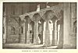

  
[Intangible Textual Heritage](../../index)  [Hinduism](../index.md) 
[Index](index)  [Previous](iml05)  [Next](iml07.md) 

------------------------------------------------------------------------

[Buy this Book at
Amazon.com](https://www.amazon.com/exec/obidos/ASIN/1421263637/internetsacredte.md)

------------------------------------------------------------------------

p. 1 

# INDIAN MYTH AND LEGEND

### CHAPTER I

### Indra, King of the Gods

Types of Hammer Gods--The Aryan Indra--Chinese World Shaper--Scottish
Hunting Deity--Egyptian Artisan God--Greek and Roman Thunder
Gods--Thor--Hittite, Assyrian, and other types--A Wail from
Palestine--Babylonian Influence--Indra's Indian Character--A Nature
Myth--Drought Demon slain--Gods and Demons in conflict--Origin of
Indra's Thunderbolt--Demons' plot to destroy Universe--Babylonian
Creation Myth--How Indra Shaped the World--Elfin Artisans in India,
Egypt, and Germania--Babylonian Artisan God--Indra the Harvest God--The
God of Battle--Comparison with Thor--Aryan Cattle Lifters--Indra's Queen
and Attendants.

THE ancient Eur-Asian "hammer god", bearing the tribal name of Indra,
accompanied the earliest invading bands of hunting and pastoral Aryans,
who hailed with joy the "fresh woods and pastures new" of the Punjab,
the green country of "Five Rivers". This deity of wanderers and invaders
was already of great antiquity and wide distribution; his attributes
were in accord with the habits and ideals of his worshippers; they
multiplied with the discoveries of man and were ever influenced by the
conditions prevailing in new areas of localization. He Was the Thunderer
who brought rain to quicken dried-up

p. 2

pasture lands; he was the god of fertility, and he became the corn
spirit; he was "the friend of man"; he was the artisan of the Universe
which he shaped with his hammer, the dragon slayer, the giant killer,
the slaughterer of enemies, the god of war. His racial significance must
ever remain obscure. We cannot identify his original home, or even fix
with certainty the archæological period in which he first took definite
shape. It is possible that he may have been invoked and propitiated by
Neolithic, or even by Palæolithic, flint knappers who struck fire from
stone long ere they suspected the existence of metal; the primitive
hunting and pastoral wanderers may have conceived of a thunder deity
engaged in splintering the hills with his stone hammer, and fighting
demons in the rude manner in which they themselves contended against
beasts of prey. Memories of the Stone Age cling to the hammer god.
Indra's bolt was "the all-dreaded thunder-stone" of Shakespeare's lyric;
until recently Palæolithic and Neolithic artifacts were reputed to be
"elf bolts" and "thunder bolts" which fell from the sky; in Scandinavian
folklore "the flint hills" are the fragments of the weapon wielded by
the thunder giant Hrungner. The bolt or hammer ultimately became an axe;
and according to the modern Greeks, lightning flashes are caused by the
blows of the "sky axe" (astropeléki); Scottish Gaelic retains an
immemorial reference to the "thunder ball" (peleir-tarnainaich).

The hammer god's close association with hilly countries suggests that he
was first worshipped on the steppes and then distributed by the nomads
whose migrations were propelled by changing climatic conditions. He is
found as far east as China, where, as P’an Ku, the dwarfish "first man",
he smites primeval rocks with his thunder hammer while engaged in the
work of shaping the hills;

p. 3

he is found as far west as Scotland, where, as the hunting giant
Finn-mac-Coul, "in height sixty feet", he strikes with his hammer, "Ord
na Feinne", such mighty blows on his shield that he is heard by his
followers in Lochlann (Scandinavia). From ancient Egypt come distant
echoes of the world artisan Ptah, now a dwarf and anon a giant, who
hammers out the copper sky, suggesting the presence in Memphis of early
Asian settlers at the very dawn of history. In southern Europe the deity
is Zeus-pater (Jupiter), the sublime wielder of the thunderbolt; in
northern Europe he is lusty Thor, hurling Mjolner through the air
against Jotuns, or cleaving valleys with it in the mountain range which
he mistook for the giant Skrymer. We find the hammer god as Tarku among
the Hittites; he is Indra in Mitanni as in the Punjab; he is Rammon, or
Adad, who is carried aloft in triumph by the soldiers of Assur-banipal,
the Assyrian Emperor; he is remembered in Palestine by the wail of
Naaman, who cried: "When my master goeth into the house of Rimmon to
worship there, and he leaneth on my hand, and I how myself in the house
of Rimmon: when I bow down myself in the house of Rimmon, the Lord
pardon thy servant in this thing . . ." [1](#fn_41.md) The thunder god is also known in Babylon,
which received many of its settlers from the hills of Elam and where
Kassites, associated with Aryans, established a dynasty after successful
invasion, prior to the discovery of the Punjab. The authorities are
agreed that Aryan culture shows traces of Babylonian influence; it does
not follow, however, that Indra is of Babylonian origin.

But although his name, which has been deciphered as "In-da-ra" at
Boghaz-Köi in Asia Minor, may belong to the early Iranian period, the
Vedic "King of the gods"

p. 4

assumed a distinctly Indian character after localization in the land of
the "Five Rivers"; he ultimately stepped from his chariot, drawn by the
steeds of the Aryan horse tamers, and mounted an elephant; his Heaven,
called Swarga, which is situated on the summit of Mount Meru, eclipses
Olympus and Valhal by reason of its dazzling Oriental splendour; his
combats are reflections of the natural phenomena of Hindustan.

When the hot Indian summer draws to a close, the whole land is parched
and athirst for rain; rivers are low and many hill streams have dried
up; man and beast are weary and await release in the breathless
enervating atmosphere; they are even threatened by famine. Then dense
masses of cloud gather in the sky; the tempest bellows, lightnings flash
and thunder peals angrily and loud; rain descends in a deluge; once
again torrents pour down from the hills and rivers become swollen and
turgid. Indra has waged his battle with the Drought Demons, broken down
their fortress walls, and released the imprisoned cow-clouds which give
nourishment to his human "friends"; the withered pastures become green
with generous and rapid growth, and the rice harvest follows.

According to Vedic myth, Indra achieved his first great victory
immediately after birth. Vritra, "the encompasser", the Demon of
Drought, was holding captive in his mountain fortress the cloud-cattle
which he had harried in the approved manner of the Aryan raiders. [1](#fn_42.md) Mankind entreated the aid of the gods,
"the shining ones, the world guardians":

Who will take pity? Who will bring refreshment?  
Who will come nigh to help us in distress?

 

[  
Click to enlarge](img/00400.jpg.md)  
INDRA  
*From the Indra Temple, Ellora*  

 

p. 5

Counsels the thoughts within our hearts are counselling,  
Wishes are wished and soar towards the highest--  
O none but them, the shining ones, are merciful,  
My longing wings itself towards the Eternals.

Indra arose heroically to do battle for the sacrificers. Impulsively he
seized the nectar of the gods, called Soma, and drank a deep draught of
that intoxicating juice. Then he snatched up his thunderstone which had
been fashioned by the divine artisan Twashtri, who resembles the
Germanic Mimer, the "wonder smith". His "favourite bays", named the Bold
and the Brown, were yoked in his golden chariot by his attendants and
followers, the youthful Maruts.

Now, at the very beginning, Indra, the golden child, became the king of
the three worlds. He it was who gave the air of life; he gave strength
also. All the shining gods revered him and obeyed his commands. "His
shadow is immortality; his shadow is death."

The Maruts, the sons of red Rudra, were the spirits of tempest and
thunder. To each of their chariots were yoked two spotted deer and one
swift-footed, never-wearying red deer as leader. They were stalwart and
courageous youths, "full of terrible designs like to giants"; on their
heads were golden helmets and they had golden breastplates, and wore
bright skins on their shoulders; their ankles and arms were decked with
golden bracelets. The Maruts were always strongly armed with bows and
arrows and axes, and especially with gleaming spears. All beings feared
those "cloud shakers" when they hastened forth with their lightning
spears which "shattered cattle like the thunderstone"; they were wont to
cleave cloud-rocks and drench the earth with quickening showers.

When Indra drove forth to attack the Drought

p. 6

\[paragraph continues\] Demon, the
"hastening Maruts" followed him, shouting with loud voices: in "a
shower" were the Maruts "let loose"; they dashed towards the imprisoned
cows of the clouds and "chased them aloft".

The dragon Vritra roared when Indra drew nigh; whereat heaven shook and
the gods retreated. Mother Earth, the goddess Prithivi (prit´hi-vee),
was troubled regarding her golden son. But Indra advanced boldly with
the roaring Maruts; he was inspired by the hymns of the priests; he had
drunken deeply of Soma; he was strengthened by the sacrifices offered on
earth's altars; and he wielded the thunderstone.

The Drought Demon deemed itself invulnerable, but Indra cast his weapon
and soon discovered the vulnerable parts of its writhing body. He slew
the monster; it lay prone before him; the torrents burst forth and
carried it away to the sea of eternal darkness. Then Indra rejoiced and
cried out:

I have slain Vritra, O ye hast’ning Maruts;  
I have grown mighty through my own great vigour;  
I am the hurler of the bolt of Thunder  
For man flow freely now the gleaming waters.

On earth the worshippers of the god were made glad; the Rishi hymned his
praises:

I will extol the manly deeds of Indra:  
The first was when the Thunder stone he wielded  
And smote the Dragon; he released the waters,  
He oped the channels of the breasted mountains.

He smote the dragon Vritra in its fortress--  
Twashtri had shaped for him the thunder weapon--  
Then rushing freely like to bellowing cattle  
The gladsome waters to the sea descended, p. 7

Bull-spirited did Indra choose the Soma,  
He drank its juices from the triple ladles;  
Then clutched the Bounteous One his thunder weapon,  
And fiercely smote the first-born of the Dragons.

The smitten monster fell amidst the torrents,  
That pause nor stay, for ever surging onward;  
Then Vritra covered by the joyful billows  
Was carried to the darksome deeps of Ocean.  
                                           --*Rigveda*, i. 32.

A post-Vedic version of the encounter between Indra and the demon Vritra
is given in the "Vana Parva" section of *Mahābhārata*. Although it is
coloured by the change which, in the process of time, passed over the
religious beliefs of the Aryans, it retains some features of the
original myth which are absent in the Vedic hymns. It should be
understood that, at the period referred to, the belief obtained that the
gods derived their powers from the saintly Rishis, [1](#fn_43.md) who fed them with sacrifices and underwent
terrible penances, which enabled them to support or destroy the Universe
at will.

It is related that in the Krita Age (the first Age of the Universe) a
host of Dānāvas (giants and demons) were so strongly armed that they
were invincible in battle. They selected the dragon Vritra as their
leader, and waged war against the gods, whom they scattered in all
directions.

Realizing that they could not regain their power until they accomplished
the death of Vritra, the Celestials appeared before their Grandsire, the
Supreme Being, Brahma the incarnation of the Soul of the Universe.
Brahma instructed them to obtain the bones of a Rishi named Dadhicha,
from which to construct a demon-slaying weapon So the gods visited the
Rishi and bowed

p. 8

down before him, and begged the boon according to Brahma's advice.

Said Dadhicha: "O ye gods, I will renounce my body for your benefit."

Then the Rishi gave up his life, and from his bones the artisan god,
Twashtri, shaped Indra's great weapon, which is called Vajra. [1](#fn_44.md)

Twashtri spake to Indra and said: "With this, the best of weapons, O
exalted one, reduce that fierce foe of the gods to ashes! And, having
slain the foe, rule thou happily the entire domain of heaven, O chief of
the celestials, with those that follow thee." [2](#fn_45.md)

Then Indra led the gods against the mighty host. They found that Vritra
was surrounded by dreaded Danavas, who resembled mountain peaks. A
terrible conflict was waged, but once again the gods were put to flight.
Then Indra saw Vritra growing bolder, and he became dejected. But the
Supreme Being protected him and the gods endowed him with their
strength, so that he became mightier than before. Thereupon Vritra was
enraged, and roared loudly and fiercely, so that the heavens shook and
the earth trembled with fear. Deeply agitated, Indra flung his divine
weapon, which slew the leader of the Danavas. But Indra, thinking the
demon was still alive, fled from the field in terror to seek shelter in
a lake. The Celestials, however, perceived that Vritra had been slain,
and they rejoiced greatly and shouted the praises of Indra. Then,
rallying once more, the gods attacked the panic-stricken Danavas, who
turned and fled to the depths of ocean. There in the fathomless darkness

p. 9

they assembled together, and began to plot how they would accomplish the
destruction of the three worlds. [1](#fn_46.md)

At length the dread conspirators resolved to destroy all the Rishis who
were possessed of knowledge and ascetic virtue, because the world was
supported by them. So they made the ocean their abode, raising billows
high as hills for their protection, and they began to issue forth from
their fortress to make attacks on the mighty saints.

In the Babylonian Story of Creation the female dragon Tiawath (Tiamat),
whose name signifies "the sea", [1](#fn_46.md)
desired to possess the world, and plotted against the gods with her
horde of giant serpents, "raging dogs, scorpion men, fish men, and other
terrible beings". The gods then selected Belus (Bel-Merodach) as their
leader, and proclaimed him their king. He slew Tiawath and covered the
heavens with one part of her body, and fashioned the earth with the
other half. Then he set the moon and the stars in the sky, and
afterwards created man: "he divided the darkness, separated the heavens
from the earth, and reduced the universe to order". [2](#fn_47.md) The sun was the offspring of the moon.

The Indian Vedic and Epic dragon-slaying stories have evidently no
connection, however, with a lost Creation myth. It is possible that they
are part of the floating material from which Babylonian mythology was
framed. At the same time Babylonian influences may not have been absent
in the post-Vedic Age. Indra bears points of resemblance to
Bel-Merodach, but he is not a Creator in the sublime sense; he is rather
an artisan god like the Chinese P’an Ku, the lonely hammerman, and

p. 10

the Egyptian Ptah, who acquired a potter's wheel, in addition to his
hammer, in the Nile valley.

Indra fashioned the universe in the simple manner that the early Aryans
built their wooden houses. [1](#fn_48.md) How he
obtained the requisite material puzzled the Vedic poets. It may be that
there was a World Tree, however, like the great ash Ygdrasil of Teutonic
mythology. After measuring space with the sun, Indra set up four corner
posts and constructed the world walls; the roof was the cloud-thatched
sky. The wide doors of the world opened to the east, and every morning
they were opened to admit the sun, which Indra flung at evening into the
darkness as a Neolithic man may have flung out a house torch. These
doors are the "gates", celebrated in the Vedic hymns, through which the
gods entered to partake of the sacrifices and libations. Indra, who is
called "an accomplished artisan", is lauded as the god who "firmly
secured the dominion of air in the frame of heaven and earth". In
another hymn it is told: "Indra measured six broad spaces, from which no
existing thing is excluded: he it is who made the wide expanse of earth
and the lofty dome of the sky, even he". (V. i, 47. 3, 4.)

In the work of shaping the universe Indra is assisted by the shadowy
deities Savitri, who merged with Surya, the sun god, Brihaspati, "Lord
of Prayer", who merged with Agni, god of fire, and Vishnu, god of grace.
He was also aided by the Ribhus, the artisans of the gods, who dwelt in
the region of mid-air. Their number is given variously as three or the
multiples of three; they were the sons of Sudhanvan, who was apparently
identical with Indra, because "Indra is a Ribhu when he confers gifts";
indeed, the artisans are referred to as the children of the Thunder god.
They make grass

 

[  
Click to enlarge](img/01000.jpg.md)  
INTERIOR OF A TEMPLE TO VISHNU (BRINDABAN)  

 

p. 11

and herbs, and also channels for streams. In some respects they resemble
the earth-gnomes, the Khnumu, "the modellers", the helpers of the
Egyptian artisan god Ptah, who shaped the world. "Countless little
figures of these gods are found in Egyptian tombs; for even as once the
Khnumu had helped in the making of the world, so would they help to
reconstruct in all its members the body of the dead man in whose tomb
they were laid." [1](#fn_49.md) The Ribhus
similarly renovated aged and decrepit parents; "they reunited the old
cow to the calf"; they are also credited with having shaped the heavens
and the earth, [2](#fn_50.md)and with having
fashioned the "cow of plenty", and also a man named Vibhvan. [3](#fn_51.md)

According to the *Oxford Dictionary*, they are "the three genii of the
seasons in Hindu mythology". The Sanskrit word "Ribhu" is sometimes
compared with the Germanic word "Elf". Professor Macdonell considers it
"likely that the Ribhus were originally terrestrial or aerial
elves" [4](#fn_52.md) They are evidently of common
origin with the Teutonic elfin artisans who are associated with Thor,
the Germanic Indra.

The mother of the Ribhus was Saranyu, daughter of Twashtri, "the Hindu
Vulcan", the "master workman". Twashtri forms the organism in maternal
wombs and supports the races of man. [5](#fn_53.md)
As we have seen, he was the fashioner of Indra's thunderbolt: similarly
the Teutonic elfin artisan Sindre makes Thor's hammer. [6](#fn_54.md)

The two groups of Teutonic wonder-smiths were rivals; so were the Ribhus
and Twashtri. The elfin artisans prove their skill in both cases by
producing

p. 12

wonderful gifts for the gods. Loke acts as a mischief, making spy in
Germanic myth, and Dadyak in Indian, and both lose their heads for
wagers, but save them by cunning.

The Ribhus had provided the Celestials with horses and chariots, but
Twashtri fashioned a wonderful bowl which filled itself with Soma for
the gods. In the contest that ensued the Ribhus transformed the bowl
into four cups. "This bowl", says Professor Macdonell, "perhaps
represents the moon, the four cups being its phases." One of the Ribhus
was a famous archer, like the elfin artisan Egil of Teutonic mythology.

The artisan of Babylonian mythology is Ea, father of Bel-Merodach. He is
"King of the abyss, creator of everything, lord of all". He was the god
of artisans in general, and is identified with the sea-deity of the
Persian Gulf--half-fish, half-man--who landed "during the day to teach
the inhabitants the building of houses and temples, the gathering of
fruits, and also geometry, law and letters". His pupils included
"potters, blacksmiths, sailors, stonecutters, gardeners, farmers,
&c." [1](#fn_55.md)

The Ribhus and Twashtri were the artisans of nature, the spirits of
growth, the genii of the seasons, the elves of earth and air. Indra's
close association with them emphasizes his character as a god of
fertility, who brought the quickening rain, and as the corn god, and the
rice god. He was the son of Father Heaven and Mother Earth, two vague
deities who were never completely individualized, but were never
forgotten. Heaven was the sky-god Dyaus-pita (from div = to shine), the
Zeus pater of the Greeks, Jupiter of the Romans, and Tivi [2](#fn_56.md) (later,

p. 13

\[paragraph continues\] Odin) of the
Germanic peoples, whose wife was the earth-goddess Jord, mother of Thor.
The Hindu earth-mother (Terra mater) was Prithivi. Dyaus is sometimes
referred to as a ruddy bull, whose bellowing is the thunder; as the
Night heaven he is depicted as a black steed decked with pearls which
are the stars; in one of the Vedic hymns reference is made to his
"thunder-stone". Prithivi, who is sometimes symbolized as a cow, is the
source of all vegetation, the supporter of earth, the female principle.
She never assumes the importance of the Assyrian Ishtar, or the north
Egyptian "earth-mother" Neith, or the "earth-mothers" of Europe. The
Vedic Aryans were Great Father worshippers rather than Great Mother
worshippers: their female deities were Night, Dawn, Earth, and the
Rivers, but they were not sharply individualized until late; they are
vague in the Vedas.

As the Greek Cronus (Roman Saturn) slew his father Urănus (Heaven), so
did Indra slay his father Dyaus (Heaven). His earth-mother addresses
him, saying: "Who has made thy mother a widow? Who has sought to slay
the sleeping and the waking? What deity has been more gracious than
thou, since thou hast slain thy father, having seized him by the
foot?" [1](#fn_57.md)

The Indian father-slaying myth appears to be connected with the doctrine
of reincarnation. In the *Laws of Manu* it is stated that "the husband,
after conception by his wife, becomes an embryo and is born again of
her; for that is the wifehood of a wife, that he is born again by
her". [2](#fn_58.md) In the famous story of
Shakuntălā, the husband is similarly referred to as the son of his wife,
the son being a reincarnation of the father. [3](#fn_59.md) This belief

p. 14

resembles the Egyptian conception which is summed up in the phrase
"husband of his mother". [1](#fn_60.md)

At the barley harvest in spring and the rice harvest in autumn offerings
were made to the gods. A sacrificial cake of the new barley or rice was
offered to Indra and Agni, a mess of old grain boiled and mixed with
milk and water was given to the other gods, and a cake was also offered
to Father Heaven and Mother Earth in which clarified butter was an
important ingredient; or the offering might consist entirely of butter,
because "clarified butter is manifestly the sap of these two, Heaven and
Earth; . . . he (the offerer) therefore gladdens these two with their
own sap or essence".

The reason for this harvest offering is explained as follows: The gods
and the demons contended for supremacy. It chanced that the demons
defiled, partly by magic and partly by poison, the plants used by men
and beasts, hoping thus to overcome the gods. Men ceased to eat and the
beasts stopped grazing; all creatures were about to perish because of
the famine.

Said the gods: "Let us rid the plants of this."

Then they offered sacrifices and "accomplished all that they wanted to
accomplish, and so did the Rishis".

A dispute then arose among the gods as to who should partake of the
offerings of the firstfruits--that is, of the new plants which replaced
those the demons had poisoned. It was decided to run a race to settle
the matter. Indra and Agni won the race and were therefore awarded the
cake. These two gods were divine Kshatriyas (noblemen), the others were
"common people". Whatever Kshatriyas conquer, the commoners are
permitted to share; therefore the other gods received the mess of old
grain.

p. 15

After the magic spell was removed from the plants by the gods, men ate
food and cattle grazed once again. Ever afterwards, at the beginning of
each harvest, the first fruits were offered up to Indra and Agni. The
fee of the priest was the first-born calf "for that is, as it were, the
firstfruits of the cattle". [1](#fn_61.md)

The popular Thunder god of the Vedic period bears a close resemblance to
the hard-drinking, kindly, and impulsive Thor, the Teutonic god of few
words and mighty deeds, the constant "friend of man" and the inveterate
enemy of demons. In the hymns Indra is pictured as a burly man, with
"handsome, prominent nose", "good lips", and "comely chin"; he is
"long-necked, big-bellied, strongly armed", and has a weakness for
ornaments. He is much addicted to drinking "sweet, intoxicating Soma";
he "fills his stomach"; he quaffs "thirty bowls" at a single draught ere
he hastens to combat against "hostile air demons". Sometimes he is
placed in a difficulty when two tribes of his worshippers are in
conflict: both cry to him for victory, but

The god giveth victory unto him  
Who with generous heart pours out  
The draught he thirsts for  
Nor feels regret in giving;  
Indra joins with him upon the battlefield.  
                                *Rigveda*, iv, 24. 2-6.

The Aryans, who were as notorious cattle lifters as the Gauls and the
Scottish Highlanders, were wont to invoke the god ere they set out on a
raid, chanting with loud voices:

Indra, whose riches are boundless, O grant us  
  Thousands of beautiful cows and horses: p.
16  
Destroy, thou mighty one, all who despise us,  
  Visit with death all those who would harm us, and  
Indra, whose riches are boundless, O grant us,  
  Thousands of beautiful cows and horses.  
                                      *Wilson's translation*.

In other hymns the Thor-like character of Indra, the war god, is naively
depicted. A sceptic is supposed to say: "Many men declare that there is
no Indra. Who ever saw him? Why should we adore him?"

The god makes answer: "O singer, *I am*: behold me! I am here now, and I
am greater than any living being. I delight in the performance of holy
rites. I am also the Destroyer; I can hurl creation to ruin." *Rigveda*,
viii, 89.

I never knew a man to speak so to me,  
When all his enemies are safely conquered;  
Yea, when they see how fierce the battle rages,  
They even promise me a pair of bullocks.

When I am absent in far distant places,  
Then all with open hands their gifts would bring me . . .  
Lo! I will make the wealthy niggard needy,  
Seize by the foot and on the hard rock dash him.  
                                              *Rigveda*, x, 27.

The lord of both the worlds hates all the haughty,  
He cares for those who feel themselves but human.  
                                           Rigveda, vi, 47. [1](#fn_62.md)

These verses recall: "Silence, thou evil one," roared Thor, "or else
with my hammer shall I strike thy head off and end thy life."

Then did Loke answer humbly: "Silent indeed I shall be now, O Thor, for
I know full well thou wilt strike." [2](#fn_63.md)

 

[  
Click to enlarge](img/01600.jpg.md)  
THE PARADISE OF INDRA  
*From a rock sculpture at Mamallapuram*  

 

p. 17

The human qualities of Indra are illustrated in epic narrative. Arjuna,
the Indian Achilles, is his son, and pays a visit to the brilliant
Celestial city on the summit of Mount Meru, where flowers are ever
blooming, and pretty nymphs dance to pleasure battle-slain warriors.

Arjuna saluted his divine sire. "And Indra thereupon embraced him with
his round and plump arms. And taking his hand, Shakra (Indra) made him
sit on a portion of his own seat . . . And the lord of the
Celestials--that slayer of hostile heroes--smelt the head of Arjuna,
bending in humility, and even took him upon his lap . . . Moved by
affection, the slayer of Vritra touched that beautiful face with his own
perfumed hands. And the wielder of the thunderbolt, patting and rubbing
gently again and again with his own hands, which bore the marks of the
thunderbolt, the handsome and large arms of Arjuna, which resembled a
couple of golden columns and were hard in consequence of drawing the
bowstring and shooting arrows, began to console him. And the slayer of
Vritra . . . eyeing his son of curling locks smilingly and with eyes
expanded with delight, seemed scarcely to be gratified. The more he
gazed, the more he liked to gaze on. And seated on one seat, the father
and son enhanced the beauty of the assembly, like the sun and moon
beautifying the firmament together." [1](#fn_64.md)

Indra was attended in his heaven by vague spirits, called Vasus, who
appear to have acted as his counsellors. When Bhishma, a hero of the
great Bhărata war, was slain in battle, he was given a place among the
Vasus. The Thunder god's queen is a shadowy personality, and is called
Indrani.

Indra was attended by a dog, as befitted a deity of

p. 18

primitive huntsmen. After the early Aryan period, he showed less favour
for his bays and chariot, and seated himself upon a great white
elephant, "the handsome and ever victorious", named Airavata; it "was
furnished with four tusks" and "resembled the mountain of Kailasa with
its summits".

------------------------------------------------------------------------

### Footnotes

[3:1](iml06.htm#fr_41.md) *2 Kings*, v, 18.

[4:1](iml06.htm#fr_42.md) One of the sections of
the epic Mahabharata is called "Go-Harran", which signifies "cattle
harrying".

[7:1](iml06.htm#fr_43.md) The deified poets and
sages. See [Chapter VIII](iml13.htm#ch08.md).

[8:1](iml06.htm#fr_44.md) Adolf Kaegi says: "Also
Vadha or Vadhar", which he compares with German, *Wetter*; O.H. German,
*Wetar*: Anglo-Saxon, *Weder*; English, *Weather*. The original word
signifying the sudden change in atmospheric conditions caused by the
thunderstorm was ultimately applied to all states of the air.

[8:2](iml06.htm#fr_45.md) Roy's translation of
*Mahabharata*.

[9:1](iml06.htm#fr_47.md) Like the giants and
demons of Teutonic mythology, who fought with the gods in the Last
Battle.

[9:2](iml06.htm#fr_48.md) *The Religion of
Babylonia and Assyria*, by T. G. Pinches, LL.D.

[10:1](iml06.htm#fr_49.md) *Cosmology of Rigveda*,
Wallis.

[11:1](iml06.htm#fr_50.md) *Religion of the Ancient
Egyptians*, Professor A. Wiedemann, p. 137.

[11:2](iml06.htm#fr_51.md) *Rigveda*, iv, 34. 9.

[11:3](iml06.htm#fr_52.md) *Cosmology of Rigveda*,
Wallis.

[11:4](iml06.htm#fr_53.md) *A History of Sanskrit
Literature*, pp. 106, 107.

[11:5](iml06.htm#fr_54.md) *Rigveda*, ii, 53; iii,
55.

[11:6](iml06.htm#fr_55.md) *Teutonic Myth and
Legend*, pp. 35-9.

[12:1](iml06.htm#fr_56.md) *The Religion of
Babylonia and Assyria*, T. G. Pinches, LL.D.

[12:2](iml06.htm#fr_57.md) An old Germanic name of
Odin related to Divus. Odin's descendants were the "Tivar". (Pronounce
*Dyaus* as one syllable rhiming with *mouse*.)

[13:1](iml06.htm#fr_58.md) *Rigveda*, iv, 18.
Wilson, vol. iii, p. 153.

[13:2](iml06.htm#fr_59.md) *The Laws of Manu*, ix,
8; p. 329. (*Sacred Books of the East*, vol. xxv.)

[13:3](iml06.htm#fr_60.md) *Adi Parva*, sect. lxxiv
of *Mahabharata*, Roy's translation.

[14:1](iml06.htm#fr_61.md) See *Egyptian Myth and
Legend*.

[15:1](iml06.htm#fr_62.md) The *Satapatha
Brahmana*, translated by Professor J. Eggeling, Part I, pp. 369, 373,
(*Sacred Books of the East*, vol. xii.)

[16:1](iml06.htm#fr_63.md) Arrowsmith's
translation.

[16:2](iml06.htm#fr_64.md) *Teutonic Myth and
Legend*, p. 173.

[17:1](iml06.htm#fr_65.md) *Vana Parva* section of
Mahābhārata, sect. xliii, Roy's translation.

------------------------------------------------------------------------

[Next: Chapter II. The Great Vedic Deities](iml07.md)
