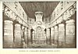

  
[Intangible Textual Heritage](../../index)  [Hinduism](../index) 
[Index](index)  [Previous](iml12)  [Next](iml14) 

------------------------------------------------------------------------

[Buy this Book at
Amazon.com](https://www.amazon.com/exec/obidos/ASIN/1421263637/internetsacredte)

------------------------------------------------------------------------

p. 138 

### CHAPTER VIII

### Divinities of the Epic Period

The Great Indian Epics--Utilized by the Brahmans--The Story of
Manu--Universal Cataclysm--How Amrita (Ambrosia) was obtained--Churning
of the Ocean--The Demon Devourer of Sun and Moon--Garuda, the Man
Eagle--Attributes of the God Shiva--Comparison with Irish Bator--Rise of
the Goddesses--Saraswati and Lakshmi or Sri--Fierce Durga and
Kali--Sati, the Ideal Hindu Wife--Legend of the Ganges--The Celestial
Rishis--Vishwamitra and Vasishtha--History in the Vedas--Wars between
Aryan Tribes--Kernel of Mahábhárata Epic.

THE history of Brahmanism during the Buddhist Age is enshrined in the
great epics *Mahábhárata* and *Ramáyana*, which had their origin before
B.C. 500, and continued to grow through the centuries.

The *Mahabharata*, which deals with the Great War for ascendancy between
two families descended from King Bharata, has been aptly referred to as
"the Iliad of India". It appears to have evolved from a cycle of popular
hero songs, but after assuming epic form it was utilized by the Brahmans
for purposes of religious propaganda. The warriors were represented as
sons of gods or allies of demons, and the action of the original
narrative was greatly hampered by inserting long speeches and
discussions regarding Brahmanic conceptions and beliefs. An excellent
example of this process is afforded by the famous *Bhagavad-gita*, from
which we have quoted in the previous chapter. The narrative of the first
day's battle is interrupted to allow Krishna to expound the

p. 139

doctrines of the Vaishnava faith, with purpose to make converts to the
cult of Vishnu. Almost every incident in the poem is utilized in a
similar manner. In fact the epic, as we are informed in the opening
section, "furnisheth the means of arriving at the knowledge of Brahma".
The priests, with this aim in view, loaded the chariots of heroes with
religious treatises, and transformed a tribal struggle for supremacy
into a great holy war. If the *Iliad* survived to us only in Pope's
translation, and our theologians had scattered through it, say, metrical
renderings of Bunyan's *Pilgrim's Progress*, the Thirty-nine Articles of
the Church of England, the *Westminster Confession of Faith*, Fox's
*Book of Martyrs*, and a few representative theological works of rival
sects, a fate similar to that which has befallen the *Mahabharata* would
now overshadow the great Homeric masterpiece. The "Iliad of India" is a
part of what may be called the Hindu Bible, which embraces the
*Ramayana*, the *Vedas*, the *Upanishads*, the *Puranas*, &c.

The *Ramáyana*, which is called "the Odyssey of India", because it deals
with the wanderings and adventures of the exiled prince Rama, was
utilized mainly by the cult of Vishnu, but both Vishnu and Shiva figure
as great gods in the *Mahábhárata*, and now one and anon the other is
given first place.

If the documentary material, which is available in India for dealing
with its ancient religious beliefs, were as scanty as those which
survive to us from Ancient Egypt, comparisons might have been drawn
between the Brahmanic cults and the priestly theorists of Heliopolis,
Memphis, Sais, &c., and it might have been remarked of the one nation as
of the other that its people clung to archaic beliefs long after new and
higher religious conceptions obtained as tenets of orthodox religion. In
India

p. 140

the process of change and development can, however, be not only traced,
but partially accounted for, as we have shown. Old myths were embraced
in the epics and the *Puranas* for the purpose of educating the people
by effecting a compromise between folk religion and the profound
doctrines of the ancient forest sages.

"Father Manu" of the *Vedas*, who appears to have been worshipped as a
patriarchal ancestor, was, for instance, embraced in the *Mahábhárata*
by the cult of Vishnu. He had been exalted by the ritualists as one who
was greater than the gods, because he had been the first to inaugurate
sacrificial rites, and he was afterwards associated with Brahma in
performing some of the acts of Creation at the beginning of one of the
Yugas (Ages). It was necessary, therefore, to show that he owed his
power and opportunities to Vishnu.

In the *Mahábhárata* the sage Markandeya refers to Manu as the great
Rishi, who was equal unto Brahma in glory. He had practised rigid
austerities in a forest for ten thousand years, standing on one leg with
uplifted hand. One day while he brooded in wet clothes, a fish rose from
a stream and asked for his protection against the greater fish which
desired to swallow it, at the same time promising to reward him. Manu
placed the fish in an earthen jar and tended it carefully till it
increased in size; then he put it in a tank. The fish continued to grow
until the tank became small for it, and Manu heard it pleading to be
transferred to the Ganges, "the favourite spouse of Ocean". He carried
it to the river, and in time the fish spoke to him, saying: "I cannot
move about in the river on account of my great length and bulk. Take me
quickly to the Ocean." Manu was enabled to carry the fish from the
Ganges to the sea, and then it spoke with a smile and said:

 

[  
Click to enlarge](img/14000.jpg)  
INTERIOR OF A ROCK-HEWN BUDDHIST TEMPLE (AJANTA)  

 

p. 141

"Know thou, O worshipful one, my protector, that the dissolution of the
Universe is at hand. The time is ripe for purging the world. I will
therefore advise thee what thou shouldst do, so that it may be well with
thee. Build a strong and massive ark, and furnish it with a long rope;
thou wilt ascend in it with the seven Rishis (the Celestial Rishis), and
take with thee all the different seeds enumerated by Brahmans in days of
yore, and preserve them carefully. Wait for me and I will appear as a
horned animal. Act according to my instructions, for without mine aid
thou canst not save thyself from the terrible deluge."

Manu gathered together all the different seeds and "set sail in an
excellent vessel on the surging sea". He thought of the fish, and it
arose out of the waters like an island; he cast a noose which he
fastened to the horns on its head, and the fish towed the ark over the
roaring sea; tossed by the billows the vessel reeled about like one who
is drunk. No land was in sight. "There was water everywhere, and the
waters covered the heaven and the firmament also. . . . When the world
was thus flooded none but Manu, the seven Rishis, and the fish could be
seen."

After many long years the vessel was towed to the highest peak of the
Himavat, which is still called Naubandhana (the harbour), and it was
made fast there. The fish then spoke and said: "I am Brahma, the Lord of
all Creatures; there is none greater than me. I have saved thee from
this cataclysm. Manu will create again all beings--gods, Asuras, and
men, and all those divisions of creation which have the power of
locomotion and which have it not. By practising severe austerities he
will acquire this power. . . ."

Then Manu set about creating all beings in proper and exact order. [1](#fn_177)

Markandeya elsewhere described the universal cataclysm

p. 142

with more detail. After a drought lasting for many years, seven blazing
suns will appear in the firmament; they will drink up all the waters.
Then wind-driven fire will sweep over the earth, consuming all things;
penetrating to the nether world it will destroy what is there in a
moment; it will burn up the Universe. Afterwards many-coloured and
brilliant clouds will collect in the sky, looking like herds of
elephants decked with wreaths of lightning. Suddenly they will burst
asunder, and rain will fall incessantly for twelve years until the whole
world with its mountains and forests is covered with water. The clouds
will vanish. Then the Self-created Lord, the First Cause of everything,
will absorb the winds and go to sleep. The Universe will become one
dread expanse of water.

Account has to be taken of the persistent legend regarding the ambrosia
which gave strength to the gods and prolonged their existence. In
"Teutonic mythology" it is snatched by Odin from the giants of the
Underworld, and is concealed in the moon, which is ever pursued by the
demon wolf Managarm, who seeks to devour it.

The development of the Indian form of the myth is found in the story of
"The Churning of the Ocean", which is dealt with in the *Mahábhárata*,
the *Ramáyana*, and several of the *Puranas*.

According to the epics, the ambrosia, the Indian name of which is amrita
(both words implying immortality), was required by the gods so as to
enable them to overcome the demons. In *Vishnu Parva*, however, a
Brahmanic addition to the myth was made so as to exalt a sage and
illustrate the power he could exercise over the old Vedic deities. It is
related that Durvásas obtained from a merry nymph a sweet-scented,
inspiring garland which made him dance. He presented it to Indra, who

p. 143

placed it on the head of his elephant. The elephant then began to prance
about, and grew so excited that it cast the garland on the ground.
Durvásas was enraged because that his gift was slighted in this manner,
and cursed Indra and foretold the ruin of his kingdom. Thereafter the
king of the gods began to suffer loss of power, whereat the other
deities became alarmed, fearing that the demons would overcome him in
battle. Appeal was made to Brahma, who referred the gods to Vishnu, the
Preserver. That supreme being commanded that the ocean should be churned
for amrita.

In the epics the gods allied themselves with the demons to procure
amrita from Vishnu's Sea of Milk. The "churning stick" was the mountain
Mandara, and the "churning rope" the serpent Vasuka [1](#fn_178) (Ananta or Shesha). Vishnu said: "The
demons must share in the work of churning, but I will prevent them from
tasting of the amrita, which must be kept for Indra and the gods only."

The gods carried the mountain Mandara to the ocean, and placed it on the
back of Kurma, the king of tortoises, who was an incarnation of
Vishnu. [2](#fn_179) Round the mountain they
twisted the serpent, which was "a part of a part of Vishnu", the Asuras
holding its hood and the gods its tail. As a result of the friction
caused by the churning, masses of vapour issued from the serpent's mouth
which, becoming clouds charged with lightning, poured down refreshing
rains on the weary workers. Fire darted forth and enwrapped the
mountain, burning its trees and destroying many birds, and the lions and
elephants that crouched on its slopes. In time the Sea of Milk produced
butter flavoured by the gums and juices which dropped from

p. 144

the mountain. The gods grew weary, but Vishnu gave them fresh strength
to proceed with the work. At length the moon emerged from the ocean;
then arose the Apsaras, who became nymphs in Indra's heaven; they were
followed by the goddess Lakshmi, Vishnu's white steed, and the gleaming
gem which the god wears on his breast. Then came Dhanwantari, the
physician of the gods, who carried a golden cup brimming with amrita.
Beholding him, the Asuras cried out: "The gods have taken all else; the
physician must be ours."

Next arose the great elephant Airávata, which Indra took for himself.
The churning still went on until the blue, devastating poison appeared
and began to flow over the earth, blazing like a flame mixed with fumes.
To save the world from destruction, Shiva swallowed the poison and held
it in his throat. From that time he was called Nilakantha, "the
blue-throated".

Meanwhile the demons desired to combat against the gods for the
possession of the beautiful goddess Lakshmi and the amrita. But Vishnu
assumed a bewitching female form, and so charmed the Asuras that they
presented the amrita to that fair woman.

Vishnu immediately gave the amrita to the gods, but soon it was
discovered that a demon named Rahu had assumed Celestial form with
purpose to drink it. The amrita had only reached his throat when the sun
and moon discovered him and informed Vishnu. The divine Preserver then
flung his discus and cut off Rahu's huge head, which resembled a
mountain peak. Rendered immortal by the amrita the head soared to the
sky, roaring loud and long. From that day Rahu's head, with mouth agape,
has followed sun and moon, and when he swallows one or the other he
causes the eclipses.

Meanwhile the demons fought against the gods, but

 

[  
Click to enlarge](img/14400.jpg)  
LAKSHMI ARISING FROM THE SEA OF MILK  
From a sculpture at Mámallapuram  

 

p. 145

were defeated, although they flung rocks and mountains. Thousands were
slain by the sky-scouring discus of Vishnu, and those who survived
concealed themselves in the bowels of the earth and the depths of the
ocean of salt waters.

Once upon a time the ambrosia was robbed from the gods by Gar´uda, half
giant and half eagle, the enemy of serpents. This "lord of birds" was
hatched from an enormous egg five hundred years after it had been laid
by Diti, mother of giants; his father was Kas´yapa, a Brahman identified
with the Pole Star, who had sacrificed with desire for offspring. It
happened that Diti, having lost a wager, was put under bondage by the
demons, and could not be released until she caused the amrita to be
taken from a Celestial mountain where it was surrounded by terrible
flames, moved by violent winds, which leapt up to the sky. Assuming a
golden body, bright as the sun, Garuda drank up many rivers and
extinguished the fire. A fiercely revolving wheel, sharp-edged and
brilliant, protected the amrita, but Garuda diminished his body and
entered between the spokes. Two fire-spitting snakes had next to be
overcome. Garuda blinded them with dust and cut them to pieces. Then,
having broken the revolving wheel, that bright sky-ranger flew forth
with the amrita which was contained in the moon goblet.

The gods went in pursuit of Garuda. Indra flung his thunderbolt, but the
bird suffered no pain and dropped but a single feather. When he
delivered the amrita to the demons his mother was released, but ere the
demons could drink Indra snatched up the golden moon-goblet and wended
back to the heavens. The demon snakes licked the grass where the goblet
had been placed by Garuda, and their tongues were divided. From that day
all the snakes have had divided tongues. . . . Garuda

p. 146

became afterwards the vehicle of Vishnu; he has ever "mocked the wind
with his fleetness".

Shiva, as we have indicated, developed from Rudra, the storm god. He is
first mentioned as Mahadeva, "the great god", in the *Yajurveda*, and in
the *Mahábhárata* he is sometimes exalted above Vishnu. In one part he
is worshipped by Krishna. He is the "blue-necked, three-eyed
trident-bearing lord of all creatures". The trident is a lightning
symbol which appears to have developed from the three wriggling flashes
held in the left hand of hammer-gods like Tarku and Rammon. Shiva's
third eye was on his forehead, and from it issued on occasion a flame of
fire which could consume an enemy; once he slew Kamadeva, the love god,
who wounded him with flowery arrows, by causing the flame to spring
forth.

Balor, the night god of Irish mythology, had similarly a destroying eye;
"its gaze withered all who stood before it"; [1](#fn_180) he was the god of lightning and death,
the "eye-flame" being the thunderbolt.

Shiva's dwelling is on the Himalayan mount Kaila´sa [2](#fn_181). He is Girisha, "the lord of the hills",
and Chandra-Shekara, "the moon crested", Bhuteswara, "lord of goblins",
and Sri Kanta, "beautiful throated". When he is depicted with five
heads, he is regarded as the source of the five sacred rivers flowing
from the mountains. As the god with snow-white face, he is the spirit of
asceticism (Maha-Yogi) adored by Brahmans performing penances. In the
*Mahábhárata* Arjuna, the warrior, invoked him by engaging in
austerities until smoke issued from the earth. Then Shiva, "the
illustrious Hara", appeared in huge and stalwart form and wrestled with
him. Arjuna's limbs were bruised and he was deprived of his senses. When
he recovered he hailed the god, saying: "Thou art

p. 147

\[paragraph continues\] Shiva in the form
of Vishnu and Vishnu in the form of Shiva . . . . [1](#fn_182) O Hari, O Rudra, I bow to thee. Thou
hast a (red) eye on thy forehead. . . . Thou art the source of universal
blessing, the cause of the cause of the Universe. . . . Thou art
worshipped of all the worlds. I worship thee to obtain thy grace. . . .
This combat in which I was engaged with thee (arose) from ignorance. . .
. I seek thy protection. Pardon me all I have done."

Shiva, whose sign is the bull, embraced Arjuna and said, "I have
pardoned thee."

The god was invoked by another warrior, Ashwattaman; son of Drona.
Having naught else to sacrifice, the worshipper flung himself upon the
altar fire; Shiva accepted him and entered his body so as to assist him
in slaughtering his sleeping enemies. Bloody rites were at one time
associated with Shiva worship. As the Destroyer of the Hindu Trinity, he
is armed with a discus, a sword, a bow, and a club; but his most
terrible weapon is the trident. Sometimes he is clad in the skin of an
elephant and sometimes in that of a leopard, the tail dangling behind. A
serpent, coiled on his head, rears itself to strike; another serpent
darts from his right shoulder against an enemy.

The bull symbol, Nandi, the moon crescent on his forehead, and the
serpent girdle, indicate that Shiva is a god of fertility. A phallic
symbol is associated with his worship. In localities he is adored at the
present day in the form of a great boulder painted red which usually
stands below a tree. Offerings are made to this stone, and women visit
it during the period of the moon's increase to pray for offspring.

As Natesa, the dancer, Shiva dances triumphantly on the body of a slain
Asura. A fine bronze in the Madras

p. 148

\[paragraph continues\] Museum depicts him
with four arms, and a beaming, benevolent face, wearing a tiara, and
surrounded by a halo of fire; he absorbed the attributes of Agni as well
as those of Rudra. He is the destroyer of evil and disease, the giver of
long life and the god of medicine, and is accordingly invoked to cure
sickness. Victims of epilepsy are believed to be possessed by Shiva.

In early Puranic times, when Brahmanism was revived and reformed, the
worship of goddesses came into prominence. This was one of the most
pronounced features of the anti-Buddhist movement, and was due probably
to the influence of Great Mother worshippers. In the Vedic Age, as we
have seen, the goddesses were vague and shadowy; as wives of the gods
they were strictly subordinate, reflecting, no doubt, the social customs
which prevailed among the Aryans. Ushas, the dawn, and Ratri, the night,
were mainly poetic conceptions. Even Prithivi, the Earth Mother, who was
symbolized as a cow, played no prominent part in Vedic religion: a
magical influence was exercised by water goddesses. The male origin of
life appears to have been an accepted tenet of Vedic belief. Aditi,
mother of the Adityas, is believed to be of more recent origin than her
sons. Indra seems to have similarly had existence before his mother,
like the other hammer gods, and especially P’an Ku and Ptah.

Female water spirits are invariably regarded as givers of boons,
inspiration and wisdom; holy wells have from remote times been regarded
as sources of luck; by performing ceremonial acts those who visit them
obtain what they wish for in silence; their waters have, withal,
curative properties, or they may be used for purposes of divination. The
name of the goddess Saraswati signifies "waters"; she was originally the
spirit of the Saraswati river, and was probably identical with Bharati,
the goddess

 

[  
Click to enlarge](img/14800.jpg)  
SHIVA DANCING ON TRIPURA  
*From a bronze in the Madras Museum*.  

 

p. 149

of the Vedic Bharata tribe. In Puranic times she became the wife of
Brahma and the Minerva of the Hindu Pantheon. She is identical with
Vach, "Mother of the Vedas", the goddess of poetry and eloquence, and
Viraj, the female form of Purusha, who divided himself to give origin to
the gods and demons and all living creatures. When Brahma took for a
second wife Gayatri, the milk-maid, she cursed him so that he could only
be worshipped once a year.

Saranyu, who may have developed from Ushas, the Dawn, is the bride of
Surya, the sun god, and mother of the twin Aswins; she fashioned the
trident of Shiva and the discus of Vishnu, and other weapons besides.

Lakshmi, or Sri, who had her origin at the Churning of the Ocean, became
the wife of Vishnu, and the goddess of beauty, love, and prosperity. She
has had several human incarnations, and in each case was loved by the
incarnation of Vishnu. She is Sita in the *Ramáyana*, and the beautiful
herdswoman beloved by Krishna. Lakshmi is "the world-mother, eternal,
imperishable; as Vishnu is all-pervading, she is omnipresent. Vishnu is
meaning, she is speech; Vishnu is righteousness, she is devotion; Sri is
the earth, and Vishnu is the support of the earth." This benevolent
goddess is usually depicted as a golden lady with four arms, seated on a
lotus.

Shiva's complex character is reflected in the various forms assumed by
his bride. As the Destroyer he is associated with Durga, who has great
beauty and is also a war goddess. As Kali she is the black earth-mother,
and as Jagadgauri, the yellow woman, the harvest bride. Armed with
Celestial weapons, Durga is a renowned slayer of demons. In her Kali
form she is of hideous aspect. Sculptors and painters have depicted her
standing on the prostrate form of Shiva and grinning with outstretched

p. 150

tongue. Her body is smeared with blood because she has waged a ferocious
and successful war against the giants. Like Shiva, she has a flaming
third eye on her forehead. Her body is naked save for a girdle of
giants' hands suspended from her waist; round her neck she wears a long
necklace of giants' skulls: like the Egyptian Isis, Kali can conceal
herself in her long and abundant hair. She has four arms: in one she
holds a weapon, and in another the dripping head of a giant; two empty
hands are raised to bless her worshippers. Like the Egyptian Hathor or
Sekhet, the "Eye of Ra", she goes forth to slay the enemies of the gods,
rejoicing in slaughter. Like Hathor, too, she is asked to desist, but
heeds not. Then Shiva approaches her and lies down among her victims.
Kali dances over the battlefield and leaps on her husband's body. When
she observes, however, what she has done, she ejects her tongue with
shame.

As Sati, Shiva's wife is the ideal of a true and virtuous Hindu woman.
When Sati's husband was slighted by her father, the Deva-rishi, Daksha,
she cast herself on the sacrificial fire. Widows who died on the funeral
pyres of their husbands were called Sati [1](#fn_183), because in performing this rite they
imitated the faithful goddess.

Sati was reborn as Uma, "Light", the impersonation of divine wisdom; as
Amvika the same goddess was a sister of Rudra, or his female
counterpart, Rudra taking the place of Purusha, the first man. Par´vati
was another form of the many-sided goddess. Shiva taunted her for being
black, and she went away for a time and engaged in austerities, with the
result that she assumed a golden complexion.

A trinity of goddesses is formed by Saraswati, the white one, Lakshmi,
the red one, and Par´vati, the black one. The three were originally
one--a goddess who

 

[  
Click to enlarge](img/15000.jpg)  
GANESA  
*From a sculpture in the Victoria and Albert Museum*.  

(see page [151](#page_151))

 

p. 151

came into existence when Brahma, Vishnu, and Shiva spoke of the dreaded
Asura, Andhaka (Darkness) and looked one at another. The goddess was
coloured white, red, and black, and divided herself, according to the
Varaha Purana, into three forms representing the Past, Present, and
Future.

It was after Sati burned herself that the sorrowing Shiva was wounded by
Kamadeva, the love god, whom he slew by causing a flame of fire to dart
from his third eye. This god is the son of Vishnu and Lakshmi. He is
usually depicted as a comely youth like the Egyptian Khonsu; he shoots
flowery arrows from his bow; his wife Rati symbolizes Spring, the
cuckoo, the humming bee, and soft winds. As Manmatha he is the
"mind-disturber"; as Mara, "the wounder"; as Madan, "he who makes one
love-drunk"; and as Pradyumna he is the "all-conqueror".

Gane´sa [1](#fn_184), the four-armed,
elephant-headed god of wisdom, is the son of Shiva and Parvati. He is
the general of Shiva's army, the patron of learning and the giver of
good fortune. At the beginning of books he is invoked by poets, his
image is placed on the ground when a new house is built, and he is
honoured before a journey is begun or any business is undertaken. The
elephant's head is an emblem of sagacity. A myth in one of the Puranas
relates that the planet Saturn, being under a curse, decapitated Ganesa
simply by looking at him. Vishnu mounted on the back of the man-eagle
Garuda and came to the child's aid. He cut off the head of Indra's
elephant and placed it on Ganesa's neck. In a conflict with a Deva-rishi
Ganesa lost one of his tusks. Several myths have gathered round this
popular, elephant-headed deity, who is also identified with the wise
rat.

p. 152

Another son of Shiva and Parvati is Kartikeya, the Celestial general and
slayer of demons. He is also regarded as the son of Agni and the Ganges.

The goddess of the Ganges is Gangá. This most sacred of all Indian
rivers, the cleanser of sins and the giver of immortality, was
originally confined to the Celestial regions, where it flowed from a toe
of Vishnu. How it came to earth is related in the following myth:
Sag´ara, a King of Ayodha (Oude), had great desire for offspring. He
performed penance, with the result that one wife became the mother of a
single son and the other of sixty thousand sons. He prepared to perform
a horse sacrifice, but Indra stole the sacred animal. All the sons went
in search of it by digging each for the depth of a league towards the
centre of the earth. They were, however, consumed by the fire of Kapila,
a form of Vishnu, who protected the earth goddess, his bride. Sagara was
informed that his sons would come to life again and rise to heaven when
the Ganges flowed down to the earth. His grandson went through rigid
penances, and at length Brahma consented to grant the prayer that the
sacred river should descend from the Himalayas. Shiva broke the fall of
the waters by allowing them to flow through his hair, and they were
divided into seven streams. When the waters reached the ashes of the
slain princes, their spirits rose to heaven and secured eternal bliss.
Sagra island, at the mouth of the Ganges, is invested with great
sanctity, on account of its association with the King of Ayodha of this
legend. All the Indian rivers are female, with the exception of the Sona
and Brahmaputra, the spirits of which are male.

Other goddesses include Man´asa, sister of Vasuka, King of the Nagas,
who gives protection against snake bites, and is invoked by the serpent
worshippers: Sasti,

 

[  
Click to enlarge](img/15200.jpg)  
KARTIKEYA, THE WAR GOD  
*From a painting by Surendra Nalh Gangoly*.  
(By permission of the Indian Society of Oriental Art, Calcutta)  

 

p. 153

the feline goddess of maternity and protectress of children, who rides
on a cat; and Shitala, the Bengali goddess of smallpox, who is mounted
on an ass, carries a bundle of reeds in her hand, and is clad in red;
she is propitiated on behalf of victims of the dreaded disease.

A prominent part is played in the Brahmanic mythology of the Restoration
period by the Deva-rishis, the deified Vedic poets, sages, and priests,
who stand between the Vedic gods and the Trinity of Brahma, Vishnu, and
Shiva.

Originally there were seven Deva-rishis, and these were identified with
the seven stars of the Great Bear, their wives being represented by the
Pleiades. Their number was, however, increased in time. [1](#fn_185) Sometimes they visit the earth in the
form of swans, but more often they are brooding sages who curse gods and
mortals on receiving the slightest provocation.

One of the most prominent of these Rishis is Na´rada [2](#fn_186), who cursed and was cursed by Brahma. In
the *Mahábhárata* he is a renowned teacher and a counsellor of kings,
and also a messenger between Indra and heroes. He is a patron of music,
and invented the Vina (lute) on which he loves to play. His great rival
is Parvata, who also acts as a Celestial messenger.

Daksha is the father of Sati, the peerless wife of Shiva. It was on
account of this rishi's quarrel with her husband, who was not invited to
a great feast, that she flung herself upon the sacrificial fire. Shiva
cut off Daksha's head and replaced it with the head of a goat.

Bhrigu was the patriarch of a Vedic priestly family. He married a
daughter of Daksha, and was the father of

p. 154

\[paragraph continues\] Lakshmi, wife of
Vishnu, who rose from the ocean of milk. Bhrigu once cursed Agni, whom
he compelled to consume everything. Angiras, Kratu, and Pulaha were
Deva-rishis who also married daughters of Daksha. Pulastya was a famous
slayer of Rakshasas. He once cursed a king who refused to make way for
him on a narrow forest path, and the king became a Rakshasa.

Marichi was the grandfather of the dwarf incarnation of Vishnu, and Atri
was the father of the irascible sage Durvasas, a master curser.

Vasishtha is sometimes referred to as identical with Vyasa, the reputed
arranger of the Vedas, and author of the *Mahábhárata*. He possessed a
wonderful cow which granted whatever he wished for. A king named
Vishwamitra desired to possess this wonderful animal, and when he found
that he was unable to obtain it by force, he determined to raise himself
from the Kshatriya to the Brahman caste by performing prolonged
austerities. When Vishwamitra secured this elevation he fought with his
rival.

Some Vedic scholars regard Vishwamitra and Vasishtha as actual
historical personages. They argue that Vishwamitra was originally a
Purohita (family priest) in the service of Sudas, the king of an Aryan
tribe called the Tritsus. References are found in the *Rigveda* to the
wars of Sudas, who once defeated a coalition of ten kings. Vishwamitra
is believed to have been deposed by Sudas in favour of Vasishtha, and to
have allied himself afterwards with the enemies of the Tritsus. [1](#fn_187)

Professor Oldenberg, the German Sanskrit scholar, is convinced, however,
that there is no evidence in the *Rigveda* of the legendary rivalry
between Vishwamitra and Vasishtha. He regards the Vasishthas as the
family priests of the Bharata tribe and identical with the Tritsus.

 

[  
Click to enlarge](img/15400.jpg)  
PARVATI, WIFE OF SHIVA  
*From a South Indian temple*.  

(see page [150](#page_150))

 

p. 155

Among the tribes which opposed the advance of the conquering King Sudas,
who appears to have been a late comer, was the Puru people on the banks
of the Saraswati river. We find that the early authors suddenly cease to
refer to them, and the problem is presented: What fate had befallen the
Purus? Professor Oldenberg, whose view is accepted by Professor
Macdonell, Oxford, explains that the Purus merged in the Kuru coalition.
The Kurus gave their name to Kuru-kshetra, the famous battlefield of the
epic *Mahábhárata*; they had already fused with the Panchala tribe and
formed the Kuru-Panchala nation in Madhyadesa, the "Middle Country", the
home of Brahmanic culture, the birthplace of the famous old
*Upanishads*.

The Bharatas, and their priestly aristocracy of Tritsus, the Vasishthas,
appear to have joined the Kuru-Panchala confederacy about the time that
the *Brahmanas* were being composed, and these were probably influenced
by the ritualistic practices of the Vasishthas. There are references to
Agni of the Bharatas, and a goddess Bharati is mentioned in connection
with the Saraswati river.

It appears highly probable that the Bharatas and the Kuru-Panchalas
represent late invasions of peoples who displaced the earlier Aryan
settlers in Hindustan. Among the enemies of the invaders were the Kasis,
a tribe which became associated with Benares. It is not possible to
prove the theory that this people had any connection with the Kassites
who established a Dynasty at Babylon. The Kassites are believed to be
identical with the Cossæi of later times, who were settled between
Babylon and the Median highlands. Some think the Kassites came from Asia
Minor after the Hittite raid on Babylon, if the Kassites, as Hittite
allies, were not the actual raiders. The fact that the Maltese cross,
which is found on

p. 156

\[paragraph continues\] Elamite neolithic
pottery, first appears on Babylonian seals during the Kassite Dynasty,
suggests, however, that the Kassites came from the east and not the
west, with the horse, called in Babylon "the ass of the east".

The great epic *Mahábhárata*, "the Iliad of India", may have been
founded on the hero songs which celebrated the Aryan tribal wars in
India. Its action is centred in Kuru-kshetra, "the country of the
Kurus", in which the Bharatas had settled. Two rival families contend
for supremacy; these are the Kauravas (the Kurus) and the Pandavas who
are supported by the Panchalas and others. The Pandavas and Kauravas are
cousins and the descendants of the eponymous King Bharata. In the royal
family tree the tribal names of Kuru and Puru appear as names of kings.

A popular rendering is given in several chapters which follow of the
epic narrative embedded in the *Mahábhárata*, which is about eight times
as long as the *Iliad* and *Odyssey* combined. This monumental work is
divided into eighteen books; a supplementary nineteenth book alone
exceeds in length the two famous Greek epics.

As we have stated, the *Mahábhárata* had its origin as an epic prior to
B.C. 500. It was added to from time to time until it assumed its present
great bulk. The kernel of the narrative, however, which appears to have
dealt with the early wars between the Kurus and Panchalas, must be
placed beyond B.C. 1000.

Our narrative begins with the romantic stories which gathered round the
names of the legendary ancestors of the Kauravas and the Pandavas. The
sympathies of the Brahmanic compilers are with the latter, who are
symbolized as "a vast tree formed of religion and virtue", while their
opponents are "a great tree formed of passion".

------------------------------------------------------------------------

### Footnotes

[141:1](iml13.htm#fr_178) Condensed from Vana
Parva section of *Mahábhárata*, sec. clxxxvii, Roy's trans.

[143:1](iml13.htm#fr_179) Va´suki.

[143:2](iml13.htm#fr_180) Brahma, as Prajapati,
assumes, in one of the myths, the form of a tortoise to "create
offspring".

[146:1](iml13.htm#fr_181) *Celtic Myth and
Legend*, p. 49.

[146:2](iml13.htm#fr_182) Or Kailāsa.

[147:1](iml13.htm#fr_183) Combined with Vishnu
he is Hari-hara.

[150:1](iml13.htm#fr_184) Often spelled Suttee.

[151:1](iml13.htm#fr_185) A familiar Bengali
rendering is "Gonesh", which is often given as a pet name to an
exemplary boy.

[153:1](iml13.htm#fr_186) In *Vishnu Purana*
the Rishis are divided as follows: 1, Brahmarishis, sons of Brahma; 2,
Devarishis, semi-divine saints; 3, Rajarishis, royal saints who had
practised austerities. There are variants in other sacred books which
refer to Maharishis, Paramarishis, &c.

[153:2](iml13.htm#fr_187) Or Nãrada.

[154:1](iml13.htm#fr_188) *Rigveda*, viii, 53.
9-11, and vii, 18.

------------------------------------------------------------------------

[Next: Chapter IX. Prelude to the Great Bharata War](iml14)
