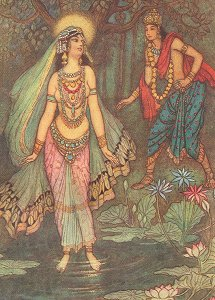

  
[Intangible Textual Heritage](../../index)  [Hinduism](../index) 

------------------------------------------------------------------------

[Buy this Book at
Amazon.com](https://www.amazon.com/exec/obidos/ASIN/1421263637/internetsacredte)

------------------------------------------------------------------------

<table width="75%">
<colgroup>
<col style="width: 50%" />
<col style="width: 50%" />
</colgroup>
<tbody>
<tr class="odd">
<td width="50%" data-valign="CENTER"> 
</td>
<td width="50%" data-valign="CENTER"><h1 id="indian-myth-and-legend" data-align="CENTER">Indian Myth and Legend</h1>
<h2 id="by-donald-a.-mackenzie" data-align="CENTER">by Donald A. Mackenzie</h2>
<h4 id="section" data-align="CENTER">[1913]</h4></td>
</tr>
</tbody>
</table>

------------------------------------------------------------------------

[Contents](#contents)    [Start Reading](iml00)

------------------------------------------------------------------------

|                                                                                                                           |
|---------------------------------------------------------------------------------------------------------------------------|
|  |

This is the Gresham Myths and Legends volume for India. Of course, one
person's myth is another's religion, in this case nearly a billion
people. As opposed to most of the other volumes in this series (e.g.
[Egypt](../../egy/eml/index), [Crete](../../cla/moc/index),
[Celtic](../../neu/celt/cml/index)), these 'Myths and Legends' are the
basis for contemporary Hindu beliefs. Certainly, many Jews and
Christians would take offense if the events of the Pentateuch were
described as 'myths', and I beg the kind indulgence of Hindu readers of
this etext.

Like most of the other books at this site, this was written prior to
World War I. Mackenzie's discussion of the 'Aryan race' and Indian
parallels to Germanic mythology have to be taken in that context. This
shouldn't be taken as an endorsement of racist doctrine. Nobody has
seriously questioned the reality of Indo-European as a linguistic group,
or the aspects of comparative mythology which crop up from India to
Iceland. However, the misuse and misrepresentation of these theories led
to tragic consequences (unintended by the 19th century scholars who
first proposed them), and that has to be kept in mind.

These big caveats aside, this is an enjoyable journey through deep
horizons of Hindu mythology, from the earliest nomadic period, through
the Vedic and Brahmanic eras, concluding with an extended synopsis of
the Mahabharata and Ramayana. The Hindu gods and goddesses are difficult
to sort out for beginners; there is no neatly organized family tree, as
with Greek, Roman or Northern mythology. This is because the pantheon
evolved radically over the millennia that Hinduism has been in practice.
Also, there are many non-mutually-exclusive strands of Hindu belief,
each of which has its own body of lore of the gods and goddesses.
Therefore having a survey of this nature at hand while reading the
primary texts is extremely useful.

One last aspect of this book deserves a mention, the transliteration of
Sanskrit vowels. Sanskrit actually has a very simple vowel system;
however, Mackenzie used a strange variety of acute accents, tildes,
umlauts, macrons, and breves, in a very inconsistent fashion. I have
scrupulously preserved the transliteration from the book throughout, per
site policy. However, these accents can be ignored.

Addendum: after I posted this book, I started to get sporadic mail
complaining about the the chapter heading 'Rape of Sita.' This is an
archaic variant usage which means '*abduct* or *carry off*,' not, as at
present '*sexually assualt*.' I am certain, because of the narrative
context, that it was the former usage intended by the author.

------------------------------------------------------------------------

 [Title Page](iml00)  
[Preface](iml01)  
[Contents](iml02)  
[Plates in Colour](iml03)  
[Plates in Monochrome](iml04)  
[Introduction](iml05)  
[Chapter I. Indra, King of the Gods](iml06)  
[Chapter II. The Great Vedic Deities](iml07)  
[Chapter III. Yama, the First Man, and King of the Dead](iml08)  
[Chapter IV. Demons and Giants and Fairies](iml09)  
[Chapter V. Social and Religious Developments of the Vedic Age](iml10)  
[Chapter VI. Mysteries of Creation, the World's Ages, and Soul
Wandering](iml11)  
[Chapter VII. New Faiths: Vishnu Religion, Buddhism, and
Jainism](iml12)  
[Chapter VIII. Divinities of the Epic Period](iml13)  
[Chapter IX. Prelude to the Great Bharata War](iml14)  
[Chapter X. Royal Rivals: the Pandavas and Kauravas](iml15)  
[Chapter XI. The Tournament](iml16)  
[Chapter XII. First Exile of the Pandavas](iml17)  
[Chapter XIII. The Choice of Draupadi](iml18)  
[Chapter XIV. Triumph of the Pandavas](iml19)  
[Chapter XV. The Great Gambling Match](iml20)  
[Chapter XVI. Second Exile of the Pandavas](iml21)  
[Chapter XVII. Defiance of Duryodhana](iml22)  
[Chapter XVIII. The Battle of Eighteen Days](iml23)  
[Chapter XIX. Atonement and the Ascent to Heaven](iml24)  
[Chapter XX. Nala and Damayantí](iml25)  
[Chapter XXI. Wanderings in the Forest](iml26)  
[Chapter XXII. Nala in Exile](iml27)  
[Chapter XXIII. The Homecoming of the King](iml28)  
[Chapter XXIV. Story of Rama: How Sita was Won](iml29)  
[Chapter XXV. The Rape of Sita](iml30)  
[Chapter XXVI. Rama's Mission Fulfilled](iml31)  

### Index

[A-C](iml32)  
[D-G](iml33)  
[H-L](iml34)  
[M-P](iml35)  
[Q-S](iml36)  
[T-Z](iml37)  
