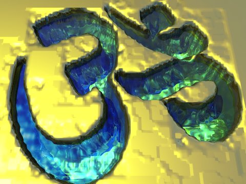

<table width="75%">
<colgroup>
<col style="width: 50%" />
<col style="width: 50%" />
</colgroup>
<tbody>
<tr class="odd">
<td width="50%"></td>
<td><h1 id="hinduism">Hinduism</h1></td>
</tr>
</tbody>
</table>

------------------------------------------------------------------------

[Vedas](#vedas)   [Upanishads](#upan)   [Puranas](#puranas.md)   [Other
Primary Texts](#other)   [Epics](#epics)   [Mahabharata](#maha.md)  
[Ramayana](#rama)   [Bhagavad Gita](#gita)   [Vedanta](#vedanta.md)  
[Later texts](#later)   [Modern books](#modern.md)

------------------------------------------------------------------------

### The Vedas

There are four Vedas, the Rig Veda, Sama Veda, Yajur Veda and Atharva
Veda. The Vedas are the primary texts of Hinduism. They also had a vast
influence on Buddhism, Jainism, and Sikhism. Traditionally the text of
the Vedas was coeval with the universe. Scholars have determined that
the Rig Veda, the oldest of the four Vedas, was composed about 1500
B.C., and codified about 600 B.C. It is unknown when it was finally
committed to writing, but this probably was at some point after 300 B.C.

The Vedas contain hymns, incantations, and rituals from ancient India.
Along with [the Book of the Dead](../egy/ebod/index.md), the [Enuma
Elish](../ane/enuma), the [I Ching](../ich/index.md), and the
[Avesta](../zor/index.md), they are among the most ancient religious texts
still in existence. Besides their spiritual value, they also give a
unique view of everyday life in India four thousand years ago. The Vedas
are also the most ancient extensive texts in an Indo-European language,
and as such are invaluable in the study of comparative linguistics.

#### Rig Veda

 [The
Rig-Veda](rigveda/index.md)  
translated by Ralph Griffith \[1896\]   A complete English
translation of the Rig Veda.   
 [Rig-Veda
(Sanskrit)](rvsan/index.md)   The complete Rig
Veda in Sanskrit, in Unicode Devanagari script and standard
romanization. 

 [Vedic Hymns, Part I (SBE
32)](sbe32/index.md)  
Hymns to the Maruts, Rudra, Vâyu and Vâta, tr.
by F. Max Müller \[1891\]   A masterpiece of
linguistics and comparative mythology: translations and deep analysis of
the Vedic Hymns to the Storm Gods.   
 [Vedic Hymns, Part II (SBE
46)](sbe46/index.md)  
Hymns to Agni, tr. by Hermann
Oldenberg \[1897\]   The Vedic Hymns to Agni.   

 [A Vedic Reader for
Students](vedaread) (excerpts.md)   by A.A.
Macdonell \[1917\]   An introduction to the Dramatis Personæ of the Rig
Veda. 

#### Sama Veda

 [The Sama-Veda](sv.md)  
translated by Ralph Griffith \[1895\]   A collection of hymns used
by the priests during the Soma sacrifice. Many of these duplicate
in part or in whole hymns from the Rig Veda. This is a complete
translation. 

#### Yajur Veda

 [The Yajur Veda (Taittiriya
Sanhita)](yv/index.md)  
translated by Arthur Berriedale Keith \[1914\]   A complete translation of
the Black Yajur Veda. The Yajur Veda is a detailed manual of the
Vedic sacrificial rites.   
 [The Texts of the White
Yajurveda](wyv/index.md)  
translated by Ralph T.H. Griffith \[1899\]   A complete translation of
the White Yajur Veda. 

#### Atharva Veda

The Atharva Veda also contains material from the Rig Veda, but of
interest are the numerous incantations and metaphysical texts, which
this anthology (part of the Sacred Books of the East series) collects
and categorizes. The Atharva Veda was written down much later than the
rest of the Vedas, about 200 B.C.; it may have been composed about 1000
B.C.

 [The Hymns of the
Atharvaveda](av/index.md)  
translated by Ralph T.H. Griffith \[1895-6\]   The unabridged Atharva
Veda translation by Ralph Griffith.   
 [The
Atharva-Veda](sbe42/index.md)  
translated by Maurice Bloomfield \[1897\]  
(Sacred Books of the East, Vol. 42)   The Sacred Books
of the East translation of the Atharva-veda. Selected hymns from
the Atharva-veda.   

### Upanishads

The Upanishads are a continuation of the Vedic philosophy, and were
written between 800 and 400 B.C. They elaborate on how the soul
(*Atman*) can be united with the ultimate truth (*Brahman*) through
contemplation and mediation, as well as the doctrine of *Karma*-- the
cumulative effects of a persons' actions.

[The Upanishads](upan/index.md) (Sacred Books of the East, vols. 1 and
15):  

 [The Upanishads, Part I (SBE
1)](sbe01/index.md)  
Max Müller, translator \[1879\]   The Chandogya, Talavakara,
Aitreya-Aranyaka, the Kaushitaki-Brahmana, and the Vajasaneyi Samhita
Upanishads  
  [The Upanishads, Part II
(SBE 15)](sbe15/index.md)  
Max Müller, translator \[1884\]   Katha, Mundaka,
Taittirîyaka, Brihadâranyaka, Svetâsvatara, Prasña, and Maitrâyana
Brâhmana Upanishads. 

 [Thirty Minor
Upanishads](tmu/index.md)   by K. Narayanasvami
Aiyar \[1914\]   Thirty shorter Upanishads, principally dealing with Yogic
thought and practice. 

 [From the
Upanishads](ftu/index.md)  
Charles Johnston, translator \[1889\]   Translations from the
Katha, Prasna and Chhandogya Upanishads. 

### Puranas

The Puranas are post-Vedic texts which typically contain a complete
narrative of the history of the Universe from creation to destruction,
genealogies of the kings, heroes and demigods, and descriptions of Hindu
cosmology and geography. There are 17 or 18 canonical Puranas, divided
into three categories, each named after a deity: Brahma, Vishnu and
Shiva. There are also many other works termed Purana, known as
'Upapuranas.'

 [The Vishnu
Purana](vp/index.md)   by H.H. Wilson
\[1840\]   A primary text of
the Vaishnava branch of Hinduism, and one of the canonical Puranas of
the Vishnu category. Among the portions of interest are a cycle
of legends of the boyhood deeds of Krishna and Rama. H.H. Wilson was one
of the first Europeans to translate a Hindu sacred text from the
original Sanskrit. His style and annotations are exceptional and very
readable.   
 [The Garuda
Purana](gpu/index.md)  
translated by Ernest Wood and S.V. Subrahmanyam \[1911\]  
A Vishnu Purana with Dantesque descriptions of the
afterlife, and details of Hindu funeral rites. 

 [The S'rimad Devî
Bhâgawatam](db/index.md)  
translated by Swami Vijnanananda (Hari Prasanna Chatterji) \[1921\]   One of the Upapuranas,
devoted to the Devi (Goddess).   
 [The Devî Gita](dg/index.md)  
translated by Swami Vijnanananda (Hari Prasanna Chatterji) \[1921\]   The Song of the
Goddess. An excerpt from the S'rimad Devî Bhâgawatam (above)
  
 [The Prem
Sagur](psa/index.md)  
(Prem Sagar) by Lallu Lal, translated by W. Hollings \[1848\]   English translation of a popular Hindi retelling of the
Krishna cycle, based on the tenth book of the Bhagavata Purana.
  
 [The Transmigration of the Seven
Brahmans](tsb/index.md)  
translated by Henry David Thoreau \[1931\]   An excerpt from the
Harivamsa, a Puranic text, translated by the American transcendentalist
philosopher.   
 [Kundalini: The Mother of the
Universe](kmu/index.md)   by Rishi Singh
Gherwal \[1930\]   Includes an English translation of the Lalita Sahasranama,
the 'Thousand Names of the Goddess,' from the Brahmanda Purana.

### Other Primary Texts

 [The Laws of Manu](manu.md)  
George Bühler, translator \[1886\]  
(Sacred Books of the East, vol. 25)   Manu was the
legendary first man, the Adam of the Hindus. This is a collection of
laws attributed to Manu.   
 [The Sacred Laws of the Âryas, Part
I (SBE 2)](sbe02/index.md)  
George Bühler translator \[1879\]  
(Sacred Books of the East, Vol. 2)   Hindu law books
written by the sages Âpastamba and Gautama, in the first
millenium B.C.   
 [The Sacred Laws of the Âryas, Part
II (SBE 14)](sbe14/index.md)  
George Bühler translator \[1879\]  
(Sacred Books of the East, Vol. 14)   Hindu law books
written by the sages Vasishtha and Baudhâyana, in the first
millenium B.C.   
 [The Institutes of Vishnu (SBE
7)](sbe07/index.md)  
Julius Jolly, translator \[1880\]  
(Sacred Books of the East, Vol. 7)   This Hindu law
book contains descriptions of yogic practises, and a moving hymn to the
Goddess Prajapati.   
 [The Minor Law Books (SBE
33)](sbe33/index.md)  
Julius Jolly, translator \[1880\]  
(Sacred Books of the East, Vol. 33)   Later Hindu law
books written by Narada and Brihaspati about 600 CE.   

[The Satapatha Brahmana](sbr/index.md)  
A primary source for Vedic-era mythology, philosophy and magical
practices. The complete five part Sacred Books of the East Satapatha
Brahmana translation is now online:  
[Satapatha Brahmana, Part I
(SBE12)](sbr/sbe12/index.md)  
[Satapatha Brahmana, Part II
(SBE26)](sbr/sbe26/index.md)  
[Satapatha Brahmana, Part III
(SBE41)](sbr/sbe41/index.md)  
[Satapatha Brahmana, Part IV
(SBE43)](sbr/sbe43/index.md)  
[Satapatha Brahmana, Part V
(SBE44)](sbr/sbe44/index.md)  

 [The Grihya Sutras, Part 1 (SBE
29)](sbe29/index.md)  
Hermann Oldenberg, tr. \[1886\]      [The Grihya Sutras, Part 2 (SBE
30)](sbe30/index.md)  
Hermann Oldenberg, tr. \[1892\]   Ancient Hindu household
rites, including fertility, marriage, purity, initiations, and
funerals. 

### The Epics

The Mahabharata and Ramayana are the national epics of India. They are
probably the longest poems in any language. The Mahabharata, attributed
to the sage Vyasa, was written down from 540 to 300 B.C. The Mahabharata
tells the legends of the Bharatas, a Vedic Aryan group. The Ramayana,
attributed to the poet Valmiki, was written down during the first
century A.D., although it is based on oral traditions that go back six
or seven centuries earlier. The Ramayana is a moving love story with
moral and spiritual themes that has deep appeal in India to this day.

In addition, a key Hindu sacred text, the [Bhagavad Gita](#gita.md), is
embedded in Book Six of the Mahabharata.

#### Mahabharata

 [The
Mahabharata](maha/index.md)  
translated by Kisari Mohan Ganguli \[1883-1896\]   Digitizing this
unabridged translation of the Mahabharata was a joint venture between
sacred-texts and Project Gutenberg.   

 [The Mahabharata in
Sanskrit](mbs/index.md)   The text of the
Mahabharata with parallel Devanagari and Romanization Unicode.

#### The Ramayana

 [Rámáyan Of
Válmíki](rama/index.md)  
translated by Ralph T. H. Griffith \[1870-1874\]   The first complete
public domain translation of the Ramayana to be placed online.

 [The Ramayana in
Sanskrit](rys/index.md)   The text of the Ramayana
with parallel Unicode Devanagari and Romanization. 

#### Abridged Versions

 [The Ramayana and
Mahabharata](dutt/index.md)  
R. Dutt translator \[1899\]   A very readable abridged
version of these epics. 

 [Indian Idylls](ii.md)  
Sir Edwin Arnold, translator \[1883\]   More stories from the
Mahabharata, rendered in poetry. 

 [Love and Death](lad/index.md)
  by Sri Arobindo \[1921\]   The popular story of Ruru
and Priyumvada from the Mahabharata. 

#### Bhagavad Gita

The Bhagavad Gita, usually considered part of the sixth book of the
Mahabharata (dating from about 400 or 300 B.C.), is a central text of
Hinduism, a philosphical dialog between the god Krishna and the warrior
Arjuna. This is one of the most popular and accessible of all Hindu
scriptures, required reading for anyone interested in Hinduism. The Gita
discusses selflessness, duty, devotion, and meditation, integrating many
different threads of Hindu philosophy.

 [The Bhagavadgîtâ (SBE
8)](sbe08/index.md)  
with the Sanatsugâtîya and the Anugîtâ translated by Kâshinâth Trimbak Telang, (Sacred Books of the East,
Vol. 8) \[1882\]   A
scholarly prose translation of the Bhagavad Gita with two other
similar, less well known, works from the Mahabharata. 

 [The Bhagavad Gita in
Sanskrit](bgs/index.md)   A Unicode presentation
of the Gita in Romanized Sanskrit. 

 [Srimad-Bhagavad-Gita](sbg/index.md)   by Swami Swarupananda \[1909\]
  A modern English prose translation of the Gita with
commentary. 

[The Bhagavad Gita](gita/agsgita.md)   A modern prose translation of the Gita, sanctioned by
the International Gita Society.

 [The Bhagavad
Gita](gita/index.md)  
Sir Edwin Arnold, translator \[1885\]   A classic poetic version
of the Gita. 

### Vedanta

 [The Vedântâ-Sûtras (SBE
48)](sbe48/index.md)  
with commentary by Râmânuja, translated by
George Thibaut; (Sacred Books of the East, Vol.
48) \[1904\]   
 [The Vedântâ-Sûtras Part I (SBE
34)](sbe34/index.md)  
with commentary by Sa<u>n</u>karâ*k*ârya,
translated by George Thibaut; (Sacred Books of
the East, Vol. 34) \[1890\]   
 [The Vedântâ-Sûtras Part II (SBE
38)](sbe38/index.md)  
with commentary by Sa<u>n</u>karâ*k*ârya,
translated by George Thibaut; (Sacred Books of
the East, Vol. 38) \[1896\]   
 [The Crest-Jewel of
Wisdom](cjw/index.md)  
and other writings of Śankarâchârya;
translation and commentaries by Charles
Johnston \[1946\]   
 [Brahma-Knowledge](brk/index.md)   by L.D. Barnett \[1911\]  
A short exposition of the Hindu Vedanta
philosophy.   
 [Select Works of Sri
Sankaracharya](wos/index.md)  
tr. by S. Venkataramanan \[1921\]   A selection of works by
the non-dualist Vedanta philosopher. 

### Later Texts

 [The Yoga Sutras of
Patanjali](ysp/index.md) by Charles
Johnston \[1912\]  
 This concise work describes
an early stage in the philosophy and practise of Yoga. Dating
from about 150 B.C., the work shows dualist and Buddhist influences.
Required reading if you are interested in Yoga or meditation.   
 [The Yoga Sutras of
Patanjali](yogasutr.md)   Another translation of
this classic text of Yoga.   
 [The Hatha Yoga
Pradipika](hyp/index.md)  
translated by Pancham Sinh \[1914\]   The oldest extant work
about Hatha Yoga, including the full Sanskrit text.   
 [Dakshinamurti
Stotra](dast/index.md)  
translated by Alladi Mahadeva Sastri \[1920\]   Comparing Hindu schools of
thought on the nature of reality.   
 [The Sánkhya Aphorisms of
Kapila](sak/index.md)  
translated by James R. Ballantyne \[1885\]   
 [Kalidasa: Translations of
Shakuntala and Other Works](sha/index.md)   by Kalidasa, (fifth century C.E.), tr. by Arthur W. Ryder \[1914\]  
The master dramas of the 'Shakespeare of India,'
including Shakuntala.   
 [The Little Clay
Cart](lcc/index.md)   by Shudraka tr. by
Arthur W. Ryder \[1905\]   The earliest Indian drama,
a screwball comedy of manners, with a cast of courtesans, kings and
scoundrels.   
 [Verses of
Vemana](vov/index.md)   by Vemana (17th
century), tr. from the Telugu by C.P. Brown
\[1829\] Verses of devotion
by a Dravidian South Indian poet.   
 [Black
Marigolds](bilhana/index.md)  
(Caurapañcāśikā) by Bilhana, tr. by Edward Powys
Mathers \[1919\]   A
free verse translation of Bilhana, an 11th century Kashmiri poet.
  
 [Vikram and the
Vampire](../goth/vav/index.md)  
tr. by Sir Richard Burton. \[1870\]   Tales of a Vampire
Scheherazade.   
 [Hymns of the Tamil Saivite
Saints](htss/index.md)  
tr. by F. Kingsbury and G.P.
Phillips \[1829\]   Popular Tamil Hindu devotional poetry by worshippers of the
god Shiva.   
  
 [Songs of
Kabîr](sok/index.md)  
Kabir, tr. by Rabindranath
Tagore, Introduction by Evelyn
Underhill; New York, The Macmillan Company; \[1915\]   Kabir's mystical and
devotional poetry has been found inspirational by people of many
different faiths. Kabir tried to find common ground between
Hindus and Muslims.  
  [Yoga Vashisht or Heaven
Found](yvhf/index.md)   by Rishi Singh
Gherwal \[1930\]   Excerpts from the shorter Yoga Vasishta   

### Modern Books

 [Relax with Yoga](rwy/index.md)
  by Arthur Liebers \[1960\]   An introduction to modern
Raja Yoga, with photos of asanas.   
 [Great Systems of
Yoga](gsoy/index.md)   by Ernest Wood
\[1954\]   A review of the
Yogic systems.   
 [Old Deccan Days](odd/index.md)
  by Mary Frere \[1868\]   
 [Ramakrishna, His Life and
Sayings](rls/index.md)   by F. Max Müller
\[1898\]   The collected
words of the Hindu sage from a humble background who transcended
arbitrary religious boundaries.   
 [The Gospel of
Ramakrishna](gork/index.md)   by Mahendra Nath
Gupta, ed. by Swami Abhedananda \[1907\]   First-hand accounts of the
Bengali holy man who preached the unity of religions.   
 [Hindu Mythology, Vedic and
Puranic](hmvp/index.md)   by W.J. Wilkins
\[1900\]   A detailed
walkthrough of the Hindu Gods and Goddesses.   
 [How To Be A
Yogi](hby/index.md)   by Swâmi Abhedânanda
\[1902\] A road-map of the
Yogic schools.   
 [Twenty-two
Goblins](ttg/index.md)   by Arthur W. Ryder
\[1912\]   
 [Indian Fairy
Tales](ift/index.md)   by Joseph Jacobs
\[1912\]   
 [Indian Myth and
Legend](iml/index.md)   by Donald A.
Mackenzie \[1913\]   Hindu mythology from the earliest times through the
Mahabharata and Rayamaya.   
 [Karma-Yoga](kyog/index.md)  
by Swami Vivekananda \[1921\]   Can work be holy?

 [Hindu Mysticism](hm/index.md)
  by S.N. Dasgupta \[1927\] 

*[Writings of Sister Nivedita (Margaret E. Noble)](niv/index.md)*

 [Kali the Mother](ktm/index.md)
  by Sister Nivedita (Margaret E. Noble) \[1900\]
  Sister Nivedita's devotional writings to the Mother
goddess Kali.   [The
Web of Indian Life](wil/index.md)   by Sister
Nivedita (Margaret E. Noble) \[1904\]  
  [Studies from an Eastern
Home](seh/index.md)   by Sister Nivedita
(Margaret E. Noble) \[1913\]  

*[Writings of Rabindranath Tagore](tagore/index.md)*

[Gitanjali](tagore/gitnjali.md)
\[1913\]  
[Saddhana, The Realisation of
Life](tagore/sadh/index.md) \[1915\]  
[The Crescent
Moon](tagore/cresmoon/index.md) \[1916\]  
[Fruit-Gathering](tagore/frutgath.md) \[1916\]  
[Stray
Birds](tagore/strybrds.md) \[1916\]  
[The Home and the
World](tagore/homewrld/index.md) \[1915\]  
[Thought
Relics](tagore/tr/index.md) \[1921\]  
[Songs of Kabîr](sok/index.md)
\[1915\]  

[The Indian Stories of F.W. Bain](bain/index.md)

### Also of Interest

[Journal articles: Hinduism](etc/index.md)  
[Sacred Sexuality](../sex/index.md) Kama Sutra, Ananga Ranga, and more.  
 [Sanskrit
dictionary](sktdict.txt.md)  
Also refer to [Sanskrit resources at
WordGumbo.com](https://www.wordgumbo.com/ie/ini/skt/index.md) \[External
Site\]   

------------------------------------------------------------------------

### Links

[Autobiography of a
Yogi](https://www.crystalclarity.com/yogananda/contents.html.md) by
Paramhansa Yogananda \[1946\] \[External Site\]  
