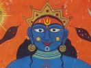

  
[Intangible Textual Heritage](../../index)  [Hinduism](../index.md) 
[Yoga](../yoga/index)  [Index](index)  [Previous](kmu11)  [Next](kmu13.md) 

------------------------------------------------------------------------

[Buy this Book at
Amazon.com](https://www.amazon.com/exec/obidos/ASIN/1428628258/internetsacredte.md)

------------------------------------------------------------------------

  
*Kundalini, The Mother of the Universe*, by Rishi Singh Gherwal,
\[1930\], at Intangible Textual Heritage

------------------------------------------------------------------------

p. 89

### THE LALITA SAHASRANAMA.

#### THE BHAGAVATI: MOTHER KUNDALINI.

##### The Thousand Names

1\. The Holy Mother.

2\. The Great Queen.

3\. The Ruler of the Highest Throne.

4\. Thou art born from the Altar of Fire (dispeller of ignorance and
darkness).

5\. Thou art manifested for the seeker of Devas (to kill the Asura
darkness).

6\. Thou shineth greater than a thousand suns.

7\. Thou hast four arms.

8\. Thou holdest the noose of desire.

9\. Thou shinest with the elephant hook of wrath and knowledge (she is
both hatred and worldly knowledge).

10\. Thou art armed with the bow of mind (lower and higher).

11\. Thou art the arrow of the five elements.

12\. Thou sprinklest the whole Universe with its rose effulgence.

13\. Thy hair is adorned with the Champaka flowers.

14\. Thy crown is made of gems.

p. 90

15\. Thy forehead shines like the Moon of the Eighth day.

16\. Thou art the spot of Kasturi as the moon.

17\. Thy eyebrows are like arches.

18\. Thy eyes are most beautiful.

19\. Thy nose is like the beautiful Champaka flower.

20\. The jewel on Thy nose shineth like the stars.

21\. The Kadamba flowers are worn on Thy ears.

22\. Thy two rings are the Sun and Moon.

23\. Thy cheeks are brighter than the ruby.

24\. Thy lips are brighter than the red-cherries.

25\. Thy teeth shine like wisdom.

26\. The betel is in Thy mouth.

27\. Thy sweet speech is golden.

28\. With Thy sweet smile all are overpowered.

29\. There is no other chin like Thine.

30\. Thou hast a thread like a marriage vow around Thy neck.

31\. The golden ornaments are on Thy arms.

32\. Thou hast a necklace of pearls, gems and gold.

p. 91

33\. Thy two breasts are like two fruits.

34\. Thy two breasts are like the most beautiful of gems.

35\. Thy waist is most beautiful.

36\. There is a golden belt about Thy waist.

37\. Thou hast shining, rose tinted garments.

38\. Thy garments are laden with gems.

39\. Thy thighs are adorable and exquisitely beautiful.

40\. Thou hast delightful knees.

41\. Thou hast the most lovely calves.

42\. Thy ankles are beautifully rounded.

43\. Thou art possessed with an instep arched like a tortoise back.

44\. Rays of brightness from Thy nails dispell darkness of Thy
worshippers.

45\. The soles of Thy feet are most beautiful.

46\. Thou hast Lotus feet.

47\. Thy walk is like a swan.

48\. Thou art the Beauty of the Beautiful.

49\. Thou art all rosy.

50\. Thou hast a faultless body.

51\. Thou hast every ornament.

52\. Thou sittest on the lap of Siva.

53\. Thou art Omnipresent.

p. 92

54\. Thou art the Giver of Happiness and Liberation.

55\. Thou livest in the middle peak of Mount Sumeru (the Gold Mountain).

56\. Thou art the Ruler of the Beautiful City.

57\. Thou livest in the house made of Lucky Stones.

58\. Thou sittest on the seat Formed by Five Brahmas.

59\. Thou resideth in the great forest of Lotuses (symbol of Chakras).

60\. Thou livest in the garden of Kadamba trees.

61\. Thou livest in the center of the Ocean of Nectar.

62\. Thou art lovely-eyed.

63\. Thou art the Fulfiller of Desires.

64\. Devas and Rishis praise Thy powers.

65\. Thou art the Master of Power.

66\. Thou art attended by herds of Deities.

67\. Thou art surrounded by many million Goddesses.

68\. Thou are seated on the Chariot and armed with all Power.

69\. Thou art attended by Mantriui (a Deity).

p. 93

70\. Thou art preceded by Dandanatha and other Goddesses.

71\. Thou resideth in the fortress of the bodies.

72\. Thou art pleased at the action of Shaktis that destroy ignorance.

73\. Thou art pleased to see the rising of the Nityas (the fifteen
Devatas).

74\. Thou gladden in the power of Bala (who killed the evil doer).

75\. Thou art delighted at the destruction of Vishanga.

76\. Thou art pleased at the power of Varahi.

77\. Sri Ganesvara was formed by Thy glances.

78\. When Ganesa broke the obstacle of the magic, Thou wast delighted.

79\. Thou dischargeth [Missiles](errata.htm#20.md) to answer the Bhandasura
(realization of self and overcoming ignorance).

80\. From Thy nails the ten Vishnu take form.

81\. From Thy third eye Thou burn the arms of Daitya (the mental
modification that gives birth to ignorance).

82\. Thou with Thy power burned all the

p. 94

army of Bhandasura (Bhandasura is the cause of duality).

83\. Thy pleasure is by Brahma (Creator), Vishnu (Keeper), Mahendra
(Deities).

84\. Thou giveth life to Manmatha (who was burned by the fire of Siva's
third eye).

85\. Thy face represents the Divinity.

86\. From throat to waist Thou represents the desire of Creation.

87\. From thy waist downward Thou represents the Shakti.

88\. Thou art the root of all Mantras.

89\. Thy body is the form of three Mantras.

90\. Thou art the taste of Nectar.

91\. Thou art the Protector of the Family.

92\. Thou art the Family Woman.

93\. Thou art in the Kula (Knowledge).

94\. Thou belongeth to Kula.

95\. Kulayogini (Thou unitest the Chakras with Yoga).

96\. Thou hast no Kula (Thou art above the Powers).

97\. Thou liveth in the Samaya.

98\. Thou art devoted to the conduct of Samaya, (who awakes her).

99\. Thou resideth in the Muladhara (Chakra).

p. 95

100\. Thou severeth the Knot (open the Chakra).

101\. Thou openeth the Vishugaranthi.

102\. Thou appeareth in the Manipura Chakra.

103\. Thou openeth the Rudragranthi (the Anahata Chakra).

104\. Thou goest to Ajna Chakra.

105\. Thou reacheth the Thousand Petals.

106\. Thou showereth down the Ambrosia.

107\. Thou art brighter than the flash of lightning.

108\. Thou resideth above the Six Chakras.

109\. Thou art attached to Siva.

110\. Thou art Kundalini.

111\. Thou art Finer than the fiber of the Lotus stalk.

112\. Thou art Bhavani (Giver of Life).

113\. Thou canst be attained by Meditation.

114\. Thou art the Woodcutter of the forest of earthly existence.

115\. Thou delighteth in Benevolence.

116\. Thou art of Benevolent Appearance.

p. 96

117\. Thou art the Giver of Prosperity to Thy devotees.

118\. Thou art pleased by Devotion.

119\. Thou canst be reached by Devotion.

120\. Thou art controlled by Devotion.

121\. Thou art the Dispeller of Fear.

122\. Thou art Sambhavi (Mudra also can be Mother of the devotees).

123\. Thou art worshipped by Sarada (the Deities of Speech).

124\. Thou art Sarvani.

125\. Thou art the Giver of Happiness.

126\. Thou art Sankari (a state of consciousness known to Yogis).

127\. Thou art the Giver of Success.

128\. Thou art above the Past, the Present and the Future.

129\. Thy face is like the Spring Moon.

130\. Thou art slender waisted.

131\. Thou art Peaceful.

132\. Thou art not Dependent on any but Support all.

133\. Thou art Stainless.

134\. Thou art Pure.

135 Thou art Spotless.

136\. Thou art the Eternal.

137\. Thou art Formless.

p. 97

138\. Thou art Ever Calm.

139\. Thou art without quality (above all).

140\. Thou art Partless.

141\. Thou art the State of Tranquility.

142\. Thou art Desirableness.

143\. Thou art Indestructible.

144\. Thou art Ever Free.

145\. Thou art Changless.

146\. Thou art Extentionless.

147\. Thou art Bodiless.

148\. Thou art Ever Pure.

149\. Thou art Ever Wise.

150\. Thou art Blameless.

151\. Thou art the Compact.

152\. Thou art Causeless.

153\. Thou art Faultless.

154\. Thou art without Limitation.

155\. Thou art without Superior.

156\. Thou art Passionless.

157\. Thou art the Destroyer of attachments or lower desire.

158\. Thou art Prideless.

159\. Thou art the Killer of Pride.

160\. Thou art without Care.

161\. Thou art without Egoism.

p. 98

162\. Thou art without Bewilderment.

163\. Thou art the Killer of Bewilderment.

164\. Thou art Disinterestedness.

165\. Thou art the Killer of Selfishness.

166\. Thou art without Sin.

167\. Thou art the Destroyer of Sin.

168\. Thou art above Anger.

169\. Thou overcometh Anger.

170\. Thou art Greedless.

171\. Thou art the Destroyer of Greed.

172\. Thou art without Doubt.

173\. Thou art the Destroyer of Doubt.

174\. Thou art without Origin.

175\. Thou art the Destroyer of Samsara (the cause of the misery of the
people of this world).

176\. Thou art without a fault.

177\. Thou art undisturbed (because above the illusion).

178\. Thou art Difference-less.

179\. Thou art the Destroyer of Difference.

180\. Thou art Imperishable.

181\. Thou art the Destroyer of Death (Giver of Immortality.)

182\. Thou art Actionless.

p. 99

183\. Thou receiveth nothing.

184\. Thou art Incomparable.

185\. Thou art blue-haired.

186\. Thou wilt not perish.

187\. Thou art without transgression.

188\. Thou art difficult to attain.

189\. Thou art difficult to approach.

190\. Thou art a Durga (Goddess).

191\. Thou art the Destroyer of Pain.

192\. Thou art the Giver of Happiness.

193\. Thou art unattainable by ignorant.

194\. Thou puttest an End to evil.

195\. Thou art above Love, Hate. etc.

196\. Thou art Omnipresent.

197\. Thou art Intense Compassion.

198\. Thou art Above all Else.

199\. Thou possesseth all Shaktis (powers).

200 Thou art the Source of All.

201\. Thou art the Way to the Right Path.

202\. Thou art the Ruler of All.

203\. Thou art All.

204\. Thou art the Essence of all Mantras

205\. Thou art the Soul of all Yantras.

206\. Thou art the Spirit of all Tantras.

207\. Thou art Manonmani (the Shakti of Siva).

p. 100

208\. Thou art Mahasvari (The Supreme).

209\. Thou art Mahadevi (Great Goddess).

210\. Thou art Mahalakshami (Greatest Goddess of Wealth).

211\. Thou art the Beloved of Mrida (The Maker of Happiness).

212\. Thou art the Great Shape.

213\. Thou art the Mighty Object of Worship.

214\. Thou art the Destroyer of Crime.

215\. Thou art Mahamaya (Great Illusion).

216\. Thou art the Great Reality.

217\. Thou art the Great Energy.

218\. Thou art the Great Delight.

219\. Thou art the Great Extension.

220\. Thou art the Great Ruler.

221\. Thou art the Great Strength.

222\. Thou art the Almighty.

223\. Thou art the Great Intelligence.

224\. Thou art the Great Attainment.

225\. Thou art the Ruler of the Great Ruler.

226\. Thou art the Great Tantra.

227\. Thou art the Great Mantra.

p. 101

228\. Thou art the Great Yantra.

229\. Thou art the Great Asan (Posture).

230\. Thou art the Worship of Mahagaga (Great Secret).

231\. Thou art Worshipped by Mahabhairava (the Creator, Preserver and
Destroyer.

232\. Thou art witness to the Great Cycle.

233\. Thou art the Wife of Mahakavasvara.

234\. Thou art the Great Tripurasundari (the city of Three).

235\. Thou art to be adorned by Sixty-four Ceremonies (worshipped by
all).

236\. Thou art Sixty-four Sciences.

237\. Thou art attended by Six Hundred and Forty million Yogis.

238\. Thou art Manu Vidya (Knowledge).

239\. Thou art Chandar Vidya, (Wisdom of the Moon).

240\. Thou art residing in the Moon Center (She goes to Second Chakra).

241\. Thou art the Most Beautiful.

242\. Thou art with the Most Beautiful Smile.

243\. Thou art the Beautiful Moon (in the p.
102 form of Consciousness).

244\. Thou art Ruler of All Worlds.

245\. Thou resideth in the Six Chakras.

246\. Thou art Parvati (daughter of the Himalaya).

247\. Thou art Lotus-eyed.

248\. Thou art Light of Light.

249\. Thou art Seated on the seat of Five Forms.

250\. Thou art the Five Brahmas.

251\. Thou art Consciousness.

252\. Thou art the Bliss of Bliss.

253\. Thou art the Essence of Consciousness.

254\. Thou art the Meditator and the Meditation.

255\. Thou art above Virtue and Vice.

256\. Thou art Omnipresent.

257\. Thou art the Waking State.

258\. Thou art the Dreaming State.

259\. Thou art the Conscious State.

260\. Thou art the Sleeping State.

261\. Thou art the Knower of All.

262\. Thou art the State of Ecstacy.

263\. Thou art the All [Transcending](errata.htm#21.md) State.

264\. Thou art the Creator.

265\. Thou art in the Form of Brahma.

266\. Thou art the Protector.

p. 103

267\. Thou art in the Form of Vishnu.

268\. Thou art the Destroyer.

269 Thou art in the Form of Rudra.

270\. Thou art the Ever-invisible.

271\. Thou art the Isvari (Ruler).

272\. Thou art the Sada Siva.

273\. Thou art the Giver of Bliss.

274\. Thou art devoted to the five factions.

275\. Thou art residing in the Sun (Third Chakra).

276\. Thou art Bhairavi (who takes the form—some times Siva, other time
Devi).

277\. Thou hast a Garland of Prosperity.

278\. Thou art seated on the Lotus (Padmasan).

279\. Thou art Bhagaveti (the Source of all Goodness).

280\. Thou art the Sister of Vishnu.

281\. At Thy Command all worlds appear and disappear.

282\. Thou hast unlimited Heads and Faces.

283\. Thou hast unlimited Eyes.

284\. Thou art Infinite footed.

285\. Thou art the Mother of All,—from worm to Brahma.

286\. Thou hast Established All.

p. 104

287\. The Vedas are the expression of Thy Command.

288\. Thou art the Giver of all Results.

289\. All is formed from Thy Self.

290\. Thou art enclosed in the shell (Om comes from shell—a symbol).

291\. Thou art the Fulfillment of all Men.

292\. Thou art the Fullness.

293\. Thou art the Enjoyer.

294\. Thou art the Ruler of the Universe.

295\. Thou art the Mother.

296\. Thou art without Beginning or End.

297\. Thou art attended by all deities (Brahma).

298\. Thou art Narayani.

299\. Thou art in the Sound.

300\. Thou art above Name and Form.

301\. Thy syllable Hrim (is a symbol word; Hrim has been used for
purposely controlling the Three).

302\. Thou art possession of Hrim.

303\. Thou resideth in the Heart.

304\. Thou hast no regret—Thou dost not receive.

305\. Thou art worshipped by Rajaraja.

306\. Thou art the Queen of the Universe.

307\. Thou art the Beautiful One.

308\. Thou hast eyes like the deer.

p. 105

309\. Thou delighteth everyone.

310\. Thou art the Gladdener.

311\. Thou shouldst be tasted.

312\. Thou art covered with Gold.

313\. Thou art Rama.

314\. Thy face is like a Full Moon.

315\. Thou art in the form of Sita (Holy woman).

316\. Thou art the Beloved of Sita.

317\. Thou art the Protector.

318\. Thou art the Slayer of Rakshassas (A human being in wild state).

319\. Thou art Woman.

320\. Thou art the Devoted of Husbands.

321\. Thou art the Desired of All.

322\. Thou art in the forms of Siva and Shakti.

323\. Thou art fond of Flowers.

324\. Thou art [Beneficent](errata.htm#22.md).

325\. Thou art the Root of the World.

326\. Thou art Compassion (like as the ocean).

327\. Thou art the Possessor of all Sciences.

328\. Thou art in the Science.

329\. Thou art Beautiful.

330\. Thou art fond of Mead.

331\. Thou art the Giver of Boons.

p. 106

332\. O Beautiful-Eyed!

333\. Thou art disturbed by liquor.

334\. Thou [transcendest](errata.htm#23.md) the Universe.

335\. Thou canst be known thru the Vedas (Holy book of Wisdom).

336\. Thou art living in the Vindhya Mountain.

337\. Thou art the Supporter of All.

338\. Thou art Mother.

339\. Thou art Maya of Vishnu.

340\. Thou art playful.

341\. Thy Body is the Matter.

342\. Thou art the Ruler of Matter.

343\. Thou art the Protector of Matter.

344\. Thou art free from Old age and Decay.

345\. Thou art worshiped by Kshetrapala.

346\. Thou art the Knowledge Itself.

347\. Thou art Spotless.

348\. Thou art Worthy of love.

349\. Thou art fond of the Devotee.

350\. Thou art the Speaker of the Word.

351\. O Beautiful-Haired!

352\. Thou art in the Fire.

353\. Thou art the Kalpa Creeper of the Bhaktas (the Kalpa Creeper
yields everything desired).

354\. Thou freeth the Ignorant from p. 107
Bondage.

355\. Thou art the Destroyer of Heretics.

356\. Thou leadeth to right Action.

357\. Thou art the Moon to protect those who are burning with the Fire
of Misery.

358\. Thou art ever the Same.

359\. Thou art worshiped by the Wise.

360\. O slender-Waisted!

361\. Thou art the Giver of Light.

362\. Thou art Intelligence.

363\. Thou art Tat.

364\. Thou art Essence of Intelligence.

365\. Thou art Bliss of Brahma.

366\. Thou art Para.

367\. Thou art the Inner Consciousness.

368\. Thou canst see All in Thyself.

369\. Thou art the Supreme Deity.

370\. Thou art the Middle (or Middle Path).

371\. Thou art in the form of Vikhari.

372\. Thou art the Swan of Bhakta.

373\. Thou art the Vital Force.

374\. Thou art the Judge above All.

375\. Thou art worshipped by Kama.

376\. Thou art the Essence of Love.

377\. Thou art Victorious.

378\. Thou art residing in the Jalandhara.

p. 108

379\. Thou art remaining in the center called Odhyana.

380\. Thou art abiding in the Bindu.

381\. Thou art to be worshipped in all sacrificial rites.

382\. Thou art pleased in the offering.

383\. Thou art the giver of Grace.

384\. Thou art the witness of the Universe.

385\. Thou art not seen by Any.

386\. Thou art [accompanied](errata.htm#24.md) by Deities.

387\. Thou art the Possessor of the Six Qualities.

388\. Thou art Ever Compassionate.

389\. No one is equal to Thee.

390\. Thou art the Giver of Nirvana.

391\. Thou art the Sixteen Eternal Deities.

392\. Thou possesseth the half-body of Siva.

393\. Thou art the Giver of Light.

394\. Thou art the form of Brightness.

395\. Thou art Celibate.

396\. Thou art the Supreme Ruler.

397\. Thou art the First Cause.

398\. Thou art the Unmanifested.

399\. Thou art the Manifested.

400 Thou art All-Pervading.

401\. Thou possesseth All Forms

p. 109

402\. Thou art Knowledge and Ignorance.

403\. Thou art the Moonlight which gladdens the flower Kumuda.

404 Thou art the Sunbeam that gives light to Bhakta.

405\. Thou art worshipped by Siva.

406\. Thou art in the form of Siva.

407\. Siva is Thy messenger.

408\. Thou art the Giver of Happiness.

409\. Thou art the Beloved of Siva.

410 Thou art beyond Siva.

411\. Thou art desired by the Wise.

412\. Thou art worshipped by the Great One.

413\. Thou canst not be measured.

414\. Thou art Self-light.

415\. Thou art beyond the reach of Mind and Speech.

416\. Thou art the Power of the Mind.

417\. Thou art in the form of Consciousness.

418\. Thou art the energy of the Inanimate Creation (Power of Vishnu or
Maya).

419\. Thou art the object of the World.

420\. Thou art Gayatiti (Mother of Vedas or Holy Woman).

421\. Thou art Vyahritih (A Mantra).

422\. Thou art Sandhya (morning and p. 110
evening junction time or meditation. Also means Brahma).

423\. Thou art worshiped by all the Twice-born.

424\. Thou art Asana Thy seat.

425\. Thou art Tat (That).

426\. Thou art Tavam (Thou).

427\. Thou art Asi (Art).

428\. Thou art residing in the Five Bodies.

429\. Thou canst not be Bounded.

430\. Thou art ever young.

431\. Thou art shining (brilliantly).

432\. Thy eyes roll (away from worldly things).

433\. Thou art with rose-colored Cheeks.

434\. Thy body is smeared with Sandal wood.

435\. Thou art fond of flowers.

436\. Thou art Skillful.

437\. Thou art Graceful.

438\. Thou art in the Sir Chakras.

439\. Thou art of the Tried.

440\. Thou art abiding in the Bindu (Muladhara).

441\. Thou art worshipped by Devotees.

442\. Thou art Mother of Ganesa.

443\. Thou art Contentment.

444\. Thou art Nourishment.

p. 111

445\. Thou art Intelligence.

446\. Thou art Dhritah (which gives strength—calmness to endure pain).

447\. Thou art Tranquility.

448\. Thou art ever True.

449\. Thou art shining resplendent.

450\. Thou art Daughter of Nanda.

451\. Thou art destroyer of Obstacles.

452\. Thou art the support of the Sun.

453\. Thou art Three-eyed (Fire, Moon and Sun).

454\. Thou art the desire of women.

455\. Thou art Garlanded.

456\. Thou art a Swan (wise).

457\. Thou art our Mother.

458\. Thou art in the Himalayas.

459\. O Beautiful-faced!

460\. Thou art the Lotus.

461\. Thou hast beautiful Eyebrows.

462\. Thou art Handsome.

463\. Thou art Leader of Devas.

464\. Thou art Wife of Siva

465\. Thou art Radiant.

466\. Thou art the cause of Motion.

467\. Thou art in the Finer Form.

468\. Thou art Deity of Jalandhara.

469\. Thou art Vamadevi (worshipped by all).

p. 112

470\. Thou art above Childhood, Youth, Old age, etc.

471\. Thou art the Ruler of Sidhas.

472\. Thou art the Sciences of Sidha.

473\. Thou art Mother of Sidha.

474\. Thou art Famous.

475\. Thou art abiding in the Visudha Chakra.

476\. O Rosy Color!

477\. Thou art Three-eyed.

478\. Thou art armed with the Club, etc.

479\. Thou art One-Faced.

480\. Thou art fond of Milk.

481\. Thou art Deity of Feeling.

482\. Thou inspirest fear in the Ignorant.

483\. Thou art surrounded by other Powers.

484\. Thou art the Nine Attributes.

485\. Thou art in the Anahata Chakra.

486\. Thou art the Black Color.

488\. Thou art with Tusks.

487\. Thou art Two-faced.

489\. Thou weareth the Aksha beads.

490\. Thou art in the Blood.

491\. Thou art attended by All Power.

492\. Thou art lover of Oily Foods.

493\. Thou art giving Boons to Bliss.

494\. Thou art Mother Rakini.

p. 113

495\. Thou stayest in the Manipura.

696\. Thou art Three-faced.

497\. Thou art armed with Thunderbolt, etc.

498\. Thou art attended by Damari.

499\. Thou art Raktauarni (blood color).

500\. Thou art the Ruler of Flesh.

501\. Thou giveth happiness to all Thy devotees.

502\. Thou art fond of Sweets.

503\. Thou assumeth the form of Mother Lakini.

504\. Thou art in the Svadhisthana Chakra.

505\. Thou art Four-faced. (Charming).

506\. Thou art armed with Weapons.

507\. Thou art Yellow.

508\. Thou art Splendid.

509\. Thou art Ruler over Fat.

510\. Thou art fond of Honey.

511\. Thou art attended by Bandhini (one of the six deities).

512\. Thou art fond of Curd.

513\. Thou assumeth the form of Kakini.

514\. Thou art climbing to the Muladhara Chakra.

515\. Thou art Five-faced.

p. 114

516\. Thou art the Ruler over the Bones.

517\. Thou hast Power with the elephant hook.

518\. Thou art attended by Varada and others.

519\. Thou art fond of Food.

520\. Thou assumeth the form of Sakani.

521\. Thou resideth over the Ajna Chakra.

522\. Thou art White (pure).

523\. Thou art Six-faced.

524\. Thou art Ruler of the Marrow.

525\. Thou art attended by Hamsavati and others.

526\. Thou art fond of Flavored Foods.

527\. Thou taketh the Hakini form.

528\. Thou resideth in the Thousand-Petaled Lotus.

529\. Thou shineth with colors.

530\. Thou hast all weapons.

531\. Thou art in the Semen.

532\. Thou art facing Everywhere.

533\. Thou art in all Foods.

534\. Thou art taking the form of Mother Yakini.

535\. Thou art Svaha.

536\. Thou art Svadha.

537\. Thou art Non-intelligence.

p. 115

538\. Thou art Intelligence.

539\. Thou art Srutih (Scriptures).

540\. Thou art Smrithih.

541\. Thou art the Best.

542\. Thou art Righteousness.

543\. Thou canst be attained by Righteousness.

544\. Thou heareth the praises of the Holy Three.

545\. Thou art worshiped by Indra's wife.

546 Thou freeth the Ignorant.

547\. Thou art Wavy haired.

548\. Thou art Parabrahama (God).

549\. Thou art Wisdom.

550\. Thou art the Mother of the Universe, Ether, etc.

551\. Thou art the cure of all Disease.

552\. Thou art dispelling all Death.

553\. Thou art the First.

554\. Thou art Unthinkable.

555\. Thou art the destroyer of Sin.

556\. Thou art daughter of the Rishi Kata.

557\. Thou art the destroyer of Time.

558\. Thou art worshipped by Vishnu (the Preserver).

559\. Thou hold the betel in Thy mouth.

560\. Thou art the hue of many Flowers.

p. 116

561\. Thou art Fawn-eyed.

562\. Thou art Fascinating.

563\. Thou art the First Born of Truth.

564\. Thou art Maridani (the Giver of Happiness).

565\. Thou art The Friend.

566\. Thou art Eternal Bliss.

567\. Thou hast fulfilled the desires of Bhaktas.

568\. Thou art The Guide.

569\. Thou art the Ruler of All.

570\. Thou can be attained by Cheerfulness.

571\. Thou art the witness of the dissolution of the Universe.

572\. Thou art perfect [Energy](errata.htm#25.md).

573\. Thou art [perfect](errata.htm#26.md) Endlessness.

574\. Thou art pure Wisdom.

575\. Thou art the Essence of Wine.

576\. Thou art Enthusiasm.

577\. Thou art in the form of A.

578\. Thou art in the Kailasa (Holy of the Holy.)

579\. Thou hast soft arms.

580\. Thou art Illustrious.

581\. Thou art Mercy.

582\. Thou art holding the Wide Dominion.

p. 117

583\. Thou art Atmavidya (wisdom of the self).

584\. Thou art the Science of Aspiration.

585\. Thou art the Sacred Science.

586\. Thou art attended by the God of Love.

587\. Thou art the Science of the Sixteen Syllables.

588\. Thou art Three-peaked.

589\. Thou art the Spirit of Kama.

590\. Thou art attended by Millions.

591\. Thou art in the Head.

592\. Thou art Moon-like.

593\. Thou art in the Forehead.

594\. Thou art of the Rainbow Color.

595\. Thou art in the Heart.

596\. Thou art Sun-like.

597\. Thou art light in the Triangle.

598\. Thou art Daughter of Daksha or Wife of Siva.

599\. Thou art killer of Datyas.

601\. Thou art Destroyer of Daksha's sacrifice.

600\. Thou art within the Large Eyes.

602\. Thou art The Within-whose face shines with a smile.

603\. Thou art in the form of Teacher.

604\. Thou art All Qualities.

p. 118

605\. Thou art Mother of the Cow.

606\. Thou art Mother of Guha.

607\. Thou art Ruler of Gods.

608\. Thou art in Justice.

609\. Thou art Brahma in the Heart.

610\. Thou art worshipped fifteen days of the Full Moon.

611\. Thou art in the Kala. (12 Suns, 16 Moons, etc).

612\. Thou art Ruler of Kala, etc.

613\. Thou art the Speech of the Poets.

614\. Thou art attended by [Lakshmi](errata.htm#27.md) and Saraswati
(Goddess’ of Wealth and Wisdom).

615\. Thou art the First Energy.

616\. Thou art Immeasurable.

617\. Thou art Atma.

618\. Thou art the Supreme.

619 Thou art the pure One.

620\. Thou art Creator of the many millions of worlds.

621\. Thou art divinely Formed.

622\. Thou art the Klim. (Other name of Siva).

623\. Thou art the Absolute.

624\. Thou art the Secret.

625\. Thou art bestower of the Fifth State of Consciousness.

p. 119

626\. Thou art older than the Three.

627\. Thou art worshipped by the Three Worlds.

628\. Thou art in the (Three) Forms.

629\. Thou art Ruler of the Thrice-Ten.

630\. Thou art in the Three syllabled.

631\. Thou art the divine Perfume.

632\. Thou hast the. Red Forehead Mark.

633\. Thou art Uma.

634\. Thou art Daughter of the Mountain King.

635\. Thou art Gauri (yellow).

636\. Thou art attended by Gandharvas.

637\. Thou containest all the Universe in Thyself.

638\. Thou art born from the Golden.

639\. Thou art the Punisher of the Fool.

640\. Thou art the Ruler of Speech.

641\. Thou art attained by Meditation.

642\. Thou art the Unlimited.

644\. Thou art the Embodiment of Knowledge.

643\. Thou art the Giver of Knowledge.

645\. Thou canst be known thru the [Vedanta](errata.htm#28). (Wisdom..md)

646\. Thou art Truth and Bliss.

647\. Thou art worshiped by Lopamudra.

p. 120

648\. Thou hast created the world system as it were, in sport.

649\. Thou art Invisible.

650\. Thou art above the Visible.

651\. Thou art the Perceiver.

652\. Thou art transcending all Knowledge.

653\. Thou art Yogini.

654\. Thou art Bestower of Yoga.

655\. Thou art Yoga.

656\. Thou art the Bliss of Yoga.

657\. Thou supportest the Universe.

658\. Thou art the Desire, the Action and the Wisdom.

659\. Thou art the Supporter of All.

660\. Thou art firmly Established.

661\. Thou art the Foundation of Truth and Untruth.

662\. Thou art Eight-Formed,

663\. Thou art [Conqueror](errata.htm#29.md) of Ignorance.

664\. Thou art the Director of the Worlds.

665\. Thou art One.

666\. Thou holdeth all things together.

667\. Thou art Non-duality.

668\. Thou art above Duality.

669\. Thou art the Giver of Food.

670\. Thou art the Giver of Wealth.

p. 121

671\. Thou art the ancient Om.

672\. Thou unitest the Atma to Brahma.

673\. Thou art Great.

674\. Thou art Brahmani (Divine Wisdom).

675\. Thou art Brahmi; female part of Brahma.

676\. Thou art the Bliss of Brahma.

677\. Thou art the Enjoyment in the Mighty.

678\. Thou art in all Languages.

679\. Thou art with the mighty Army.

680\. Thou art above Existence and Nonexistence.

681\. Thou art very easily Worshipable.

682\. Thou doeth good to the Worshiper.

683\. Thou art the Right means and not hard to attain.

684\. Thou art the King of Kings.

685\. Thou art the Giver of [Dominion](errata.htm#30.md).

686\. Thou art the Spirit of Gladness in Dominion. (in the six Chakras).

687\. Thou art Compassionate.

688\. Thou art the Supporter of all Kings.

689\. Thou art their Wealth.

690\. Thou art the Ruler of all Treasures.

691\. Thou art the Commander of all Armies.

p. 122

692\. Thou art the Giver of Samrajya (the sacrifice by the King of
Kings).

693\. Thou art devoted to Truth.

694\. Thou art girdled by the Ocean.

695\. Thou art the Initiator.

696\. Thou art the Controller of all Daityas (bad doers).

697\. Thou art the Controller of all the Worlds.

698\. Thou art the fulfiller of all Desires.

699\. Thou art the Creator of the Universe.

700\. Thou art Satchitanandarupini (Truth, Consciousness and Bliss).

701\. Thou art above Time and Space (or Force).

702\. Thou art Omnipresent.

703\. Thou art all Bewilderment (to the ignorant.

704\. Thou art the Mother of Wisdom.

705\. Thou art the Sciences.

706\. Thou abidest in the Heart.

707 Thou art the Secret One.

708\. Thou art free from All.

709\. Thou art always with Siva.

710\. Thou art the supreme of Wisdom.

711\. Thou art the Well-doer.

712\. Thou art I.

p. 123

713\. Thou art always with Gurus (spiritual teachers).

714\. Thou art above the Senses.

715\. Thou art worshiped in the Sun.

716\. Thou art back of Maya.

717\. Thou art as Honey. (or art Honey-like).

718\. Thou art the Earth.

719\. Thou art Mother of All.

120\. Thou art worshiped by All.

721\. Thou art Tender.

722\. Thou art the Beloved of the Guru.

723\. Thou art Independent.

724\. Thou art the Ruler of the Tantras.

725\. Thou art born of Siva.

726\. Thou art worshiped by the Yogi.

727\. Thou art the Giver of Knowledge of Siva (Siva is founder of Yoga).

728\. Thou art Chitkala (Knowledge, Existence, Bliss).

729\. Thou art the Gem of Bliss.

730\. Thou art Affection.

731\. Thou art the Cause of Affection.

732 Thou art glad in the Repetition.

733\. Thou art the science of Nandi.

734\. Thou art Natesvari.

735\. Thou art the Root of the Illusion of the Worlds.

p. 124

736\. Thou art the Giver of Liberation.

737\. Thou art Liberation.

738\. Thou art fond of Rhythm.

739\. Thou causest Absorption (a state higher than Meditation).

740\. Thou art Shame.

741\. Thou art adorned by Yogin.

742\. Thou showereth with Nectar (rain on the world that is burning with
worldly fire).

743\. Thou art the First Fire to burn the Sin.

744\. Thou art the Gale.

745\. Thou art the beams of the Sun.

746\. Thou art the beams of the Moon.

747\. Thou art the Cloud (giver of spiritual rain).

748 Thou art the thunderbolt to all diseases.

749\. Thou art the Axe that cuts the root of death.

750\. Thou art the Mahesvari.

751\. Thou art the Mahakali.

752\. Thou art the Great Destroyer.

753\. Thou art the Great Absorber.

754\. Thou art the Great Discharger of Debt.

p. 125

755\. Thou art the Spirit of Anger.

756\. Thou art the Devourer of all Daityas (who fight against gods in
olden times).

757\. Thou art the Perishable and the Imperishable.

758\. Thou art the Ruler of Worlds and Heaven.

759\. Thou art the Supporter of the Universe.

760\. Thou art the Giver of Desired Objects.

761\. Thou art Good Fortune.

762\. Thou art Three-Sun, Moon and Fire.

763\. Thou art Three Qualities.—Raja, Tamas and [Sattva](errata.htm#31.md).

764\. Thou art the Giver of Heaven and Liberation.

765\. Thou art Pure.

766\. Thou hast a form like the Rose.

767\. Thou art Vitality.

768\. Thou art the Bearer of Light.

769\. Thou art the Sacrifice.

770\. Thou art fond of Vows.

771\. Thou art difficult to worship by the Uncontrolled Mind.

772\. Thou art difficult to Control.

p. 126

773\. Thou art fond of red and white Flowers.

774\. Thou art Great.

775\. Thou art in the Meru (Chakra).

776\. Thou art fond of Mandara Flowers.

777\. Thou art worshiped by Warriors.

778\. Thou art the Old Age of the warriors.

779\. Thou art Passionless.

780\. Thou faceth Everywhere.

781\. Thou art the Interior.

782\. Thou art the Highest Ether.

783\. Thou art the Giver of Life.

784\. Thou art the Life.

785\. Thou art worshipped by Martandabharava (a Goddess above the Mental
Chakra, can also be Sun).

786\. Thou hast given your Kingdom to Mantrini (the protected of the
Yogis).

787\. Thou art Tri-puresi (the Deity).

788\. Thou art the Victorious Army.

789\. Thou art above Qualities.

790\. Thou art the Superior and the Inferior.

791\. Thou art the Truth, Wisdom and Bliss.

792\. Thou art the Supreme Abode.

p. 127

793\. Thou art Water of the Ganges.

794\. Thou art the Sixty-four Arts.

795\. Thou art the Cow of Plenty (the fulfiller of desires.

796\. Thou art the desire that creates the Worlds.

797\. Thou art the Reservoir of Science.

798\. Thou art the Poets Art.

799\. Thou art the Queen of Literary Composition.

800\. Thou art the Treasury of Spiritual Nectar.

801 Thou art Nourishment.

802\. Thou art the Ancient or the First of All.

803\. Thou art worshiped by All.

804\. Thou art Lotus-faced.

805\. Thou art Lotus-eyed.

806\. Thou art Light of Lights.

807\. Thou art the Highest Abode.

808\. Thou art the Highest Atom.

809\. Thou art Supreme of the Supreme.

810\. Thou art holding the noose in Hand.

811\. Thou art the destroyer of the Noose.

812\. Thou art the Destroyer of the Hostile force.

813\. Thou art finely Formed.

814\. Thou art without fine Form.

p. 128

815\. Thou art satisfied with any Offering.

816\. Thou art the Swan of the Manasa Lake.

817\. Thou art the Vows of Truth.

818\. Thou art Reality.

819\. Thou art in every Heart.

820\. Thou art Faithful Sati (the one who is ever true to her husband).

821\. Thou art the Giver of life. to Brahma.

822\. Thou art Brahma.

823\. Thou art Mother of All.

824\. Thou art manifold in Form.

825\. Thou art worshiped by the Wise.

826\. Thou art the Creator.

827\. Fear of Thy sunshine and the fear of Thy wind.

828\. Thou art the Ordinances.

829\. Thou art the Foundation of All.

830\. Thou [art](errata.htm#32.md) experienced in all Forms.

831\. Thou art Master of the Senses.

832\. Thou art the Energy of the senses.

833\. Thou art the Fifty Seats.

834\. Thou art without Bondage.

835\. Thou livest in the Holy place.

836\. Thou art the Mother of Heroes.

837\. Thou art Ether.

p. 129

838\. Thou art the Giver of Liberation.

839\. Thou art the Home of Liberation.

840 Thou art the root of all Powers.

841\. Thou art the Knower of Mind Qualities (of different states of
Mind).

842\. Thou art the remedy of all Diseases.

843\. Thou art the Mover of the earthly wheel (she moves the world).

844\. Thou art the Means to attain Wisdom.

845\. Thou art the Essence of Wisdom.

846\. Thou art the Essence of Mantras.

847\. Thou art the Lightest of Forms.

848\. Thou art the Highest Yama.

849\. Thy glory is very High.

850\. Thou art the Letters.

851\. Thou giveth peace. birth and death to men.

852\. Thou art claimed by all the Upanishads.

853\. Thou art Kala (nature's finer fortes).

854\. Thou art Fathomless.

855\. Thou art in the Ether.

856\. Thou art elevated above Creation.

857\. Thou art the Joy in all songs.

p. 130

858\. Thou art free from the world bondage.

859\. Thou art the Goal of All.

860\. Thou art the End of Pain and Sin.

861\. Thou art the Heaven and all other Spheres.

862\. Thou art above Cause and Effect.

863\. Thou outflowest with Pleasure.

864\. Thou wearest Golden Rings.

865\. Thou takest Thy body for Fun.

866\. Thou art Unborn.

867\. Thou art free from Decay.

868\. Thou art Beautiful.

869\. Thou art easily Pleased.

870\. Thou art worshiped Internally.

871\. Thou art difficult to attain by the Ignorant.

872\. Thou art Rig, Yojur and Saman (Revelation in Three Vedas, Holy
Book of Wisdom).

873\. Thou art the Object of three Desires (A. U. M. or past, present
and future).

874\. Thou art living in the Three.

875\. Thou art Goddess of Antardasera Chakra.

876\. Thou art free from Disease.

877\. Thou art without Support.

878\. Thou art enjoying Thyself.

p. 131

879\. Thou art the Stream of Nectar.

880\. Thou knowest how to raise Above worldly misery of those who pray
to Thee.

881\. Thou art fond of Sacrifice.

882\. Thou performs the Sacrifice.

883\. Thou art the Sacrificer.

884\. Thou art the Supporter of Dharma (righteousness or right duty).

885\. Thou art the Ruler of Wealth.

886\. Thou increaseth Wealth.

887\. Thou art fond of Knowledge.

888\. Thou art manifestation of Knowledge.

889\. Thou art Revolution.

890\. Thou art the Absorber of All.

891\. Thou art the Tree of Knowledge.

892\. Thou art Mother of Vishnu.

893\. Thou art in the form of Vishnu (one who preserves the world).

894\. Thou art without Origin.

895\. Thou art the Home of Origin.

896\. Thou art the [Manifester](errata.htm#33.md) of ignorance.

897\. Thou art worshipped Externally.

898\. Thou art in the assembly of Warriors.

599\. Thou art [Valorous](errata.htm#34.md).

900 Thou art above Actions.

p. 132

901\. Thou art in the Nada (self in the Anahata Chakra).

902\. Thou art in the direct Perception.

903\. Thou art Skilful.

904\. Thou art Artful.

905\. Thou art seated on Bindu.

906\. Thou art above the Tattvas (nature's finer Forces).

907\. Thou art Reality Itself.

908\. Thou art the meaning of the World.

909\. Thou art fond of the song of Sama Veda.

910\. Thou art fit to be Worshiped.

911\. Thou art the Deities.

912\. Thou art in the right and left Palti.

913\. Thou cleareth the Path.

914\. Thou art Independent.

915\. Thou art Sweet.

916\. Thou art Wise.

917\. Thou art worshiped by the Wise.

918\. Thou art worshiped by Meditation. as Consciousness.

919\. Thou art fond of Consciousness.

920\. Thou art Ever Truth in the Wise.

921\. Thou art Ever the Contented.

922\. Thou art like the Morning Sun.

923\. Thou art worshiped by the Right and Left (wise and fool).

p. 133

924\. Thou wearest a sweet Smile.

925\. Thou art Pure and worshipped by All.

926\. Thou art Giver of Liberation.

927\. Thou art fond of Praise.

928\. Thou art the receiver of Praise.

929\. Thou art celebrated in the Scriptures.

930\. Thou art Intelligence.

931\. Thou art the Higher Mind.

932\. Thou art wife of Siva.

933\. Thou art the Doer of Good.

934\. Thou art Mother of the Universe.

935\. Thou art the Supporter. of the Universe.

936\. Thou art worshipped at [Benares](errata.htm#35.md), Himalaya (between
both eyes).

937\. Thou art free from Passion.

938\. Thou art Strong.

939\. Thou art Generous.

940\. Thou art highly Delightful.

941\. Thou art in the Mind.

942\. The ether becomes Thy hair.

943\. Thou remaineth ever in the Celestial Chariot.

944\. Thou art the Wife of Indra, Ruler of the World.

945\. Thou art fond of Tantra.

946\. Thou art fond of the Five sacrifices.

p. 134

947\. Thou art in the five forms, Brahma, Vishnu, Rudra, Isvara and
Sadasiva.

948\. Thou art The Fifth.

949\. Thou art Ruler of Five.

950\. Thou art worshipped with five Objects.

951\. Thou art Eternal.

952\. Thou art Ruler of Eternal.

953\. Thou art the Giver of Happiness.

954\. Thou produces confusion on the Earth.

955\. Thou art the Supporter of the Earth.

956\. Thou art the Daughter of the Himalayas.

957\. Thou art the Possessor of Wealth.

958\. Thou art Righteousness.

959\. Thou art the Increaser of Righteousness.

960\. Thou art above the World.

961\. Thou art above the attributes.

962\. Thou art above All.

963\. Thou art above the World Peace.

964\. Thou art Flower-like.

965\. Thou art Feminine.

966\. Thou art the pleased in Amusement.

967\. Thou art the Seed of Success.

968\. Thou giveth Happiness.

969\. Thou art Beautiful.

p. 135

970\. Thou art the Ever Uniting One.

971\. Thou art delighted by married Women.

972\. Thou art Ever Beautiful.

973\. Thou art Pure Minded.

974\. Thou art pleased by meditation on the Bindu, (in Chakra).

975\. Thou art the First Born.

976\. Thou art the Deity of the Chakras.

977\. Thou art worshipped by Ten Mudras.

978\. Thou art Deity of the Fifth Chakras.

979\. Thou art Jnanamudra.

980\. Thou art to be attained by Wisdom.

981\. Thou art the Wisdom and the Knowing Principle.

982\. Thou art Yoni Mudra.

983\. Thou art the Ruler of the Ten Mudras.

984\. Thou art the Possessor of the Three Qualities.

985\. Thou art the Mother.

986\. Thou art in the Triangle.

987\. Thou art Sinless.

988\. Thy work in Wonderful.

989\. Thou fullfillest desire.

990\. Thou art ever known by Meditation.

991\. Thou art above the Six Methods.

p. 136

992\. Thou art Just and Compassionate.

993\. Thou art the Light that dispels the Darkness.

994\. Thou art ever known to Children.

995\. At Thy command, all obey.

996\. Thou art residing in the Six Chakras.

997\. Thou art the Divine.

998\. Thou art the Divine Siva.

999\. Thou art Union of Siva and Sakti.

1000\. Thou art Mother Lalita, Aum (Om).

------------------------------------------------------------------------

[Next: Why We Worship Siva](kmu13.md)
