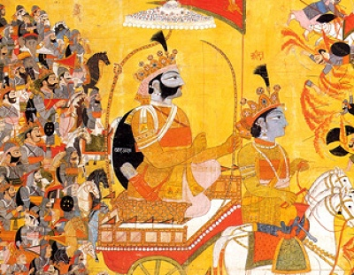

  
[Intangible Textual Heritage](../../index)  [Hinduism](../index) 

------------------------------------------------------------------------

<table width="75%">
<colgroup>
<col style="width: 50%" />
<col style="width: 50%" />
</colgroup>
<tbody>
<tr class="odd">
<td width="50%" data-valign="TOP"></td>
<td width="50%" data-valign="CENTER"><h1 id="karma-yoga" data-align="CENTER">Karma-Yoga</h1>
<h2 id="by-swami-vivekananda" data-align="CENTER">by Swami Vivekananda</h2>
<h4 id="section" data-align="CENTER">[1921]</h4></td>
</tr>
</tbody>
</table>

------------------------------------------------------------------------

[Contents](#contents)    [Start Reading](kyog00)    [Page
Index](pageidx)    [Text \[Zipped\]](kyog.txt.gz)

------------------------------------------------------------------------

This a set of lectures by Swami Vivekananda on the subject of Karma
Yoga, one of the several yogic paths to enlightenment. Karma Yoga is a
mental discipline which allows one to carry out one's duties as a
service to the entire world, as a path to enlightenment. By working in
the real world, but giving up attachment to work, we can obtain
spiritual liberation. Vivekananda discusses the concept of Karma in the
Bhagavada-Gita, and singles out the Buddha as a primary example of this
form of yoga.

------------------------------------------------------------------------

 [Title Page](kyog00)  
[Chapter I. Karma In Its Effect On Character](kyog01)  
[Chapter II. Each Is Great In His Own Place](kyog02)  
[Chapter III. The Secret of Work](kyog03)  
[Chapter IV. What is Duty?](kyog04)  
[Chapter V. We Help Ourselves, Not the World](kyog05)  
[Chapter VI. Non-Attachment Is Complete Self-Abnegation](kyog06)  
[Chapter VII. Freedom](kyog07)  
[Chapter VIII. The Ideal of Karma-Yoga](kyog08)  
