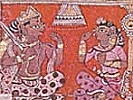

  
[Intangible Textual Heritage](../../index)  [Hinduism](../index.md) 
[Index](index)  [Previous](lcc11)  [Next](lcc13.md) 

------------------------------------------------------------------------

[Buy this Book at
Amazon.com](https://www.amazon.com/exec/obidos/ASIN/1417982012/internetsacredte.md)

------------------------------------------------------------------------

  
*The Little Clay Cart*, by Shudraka, tr. Arthur William Ryder, \[1905\],
at Intangible Textual Heritage

------------------------------------------------------------------------

p. 93

### ACT THE SIXTH

#### THE SWAPPING OF THE BULLOCK-CARTS

\[*Enter a maid*.\]

*Maid*.

ISN'T my mistress awake yet? Well, I must go in and wake her. \[*She
walks about. Vasantasenā appears, dressed, but still asleep. The maid
discovers her*.\] It is time to get up, mistress. The morning is here.

Vasantasenā. \[*Awakening*.\] What! is the night over? is it morning?

*Maid*. For us it is morning. But for my mistress it appears to be night
still.

*Vasantasenā*. But girl, where is your gambler?

*Maid*. Mistress, after giving Vardhamānaka his orders, Chārudatta went
to the old garden Pushpakaranda.

*Vasantasenā*. What orders?

*Maid*. To have the bullock-cart ready before daylight; for, he said,
Vasantasenā was to come—

*Vasantasenā*. Where, girl?

*Maid*. Where Chārudatta is.

*Vasantasenā*. \[*Embraces the maid*.\] I did not have a good look at
him in the evening. But to-day I shall see him face to face. Tell me,
girl. Have I found my way into the inner court?

*Maid*. You have found your way not only into the inner court, but into
the heart of every one who lives here.

*Vasantasenā*. Tell me, are Chārudatta's servants vexed?

*Maid*. They will be.

*Vasantasenā*. When?

*Maid*. When my mistress goes away.

*Vasantasenā*. But not so much as I shall be. \[*Persuasively*.\] Here,

p. 94

girl, take this pearl necklace. You must go and give it to my lady
sister, his good wife. And give her this message: "Worthy Chārudatta's
virtues have won me, made me his slave, and therefore your slave also.
And so I hope that these pearls may adorn your neck."

*Maid*. But mistress, Chārudatta will be angry with you.

*Vasantasenā*. Go. He will not be angry.

*Maid*. \[*Takes the necklace*.\] Yes, mistress. \[*She goes out, then
returns*.\] Mistress, his lady wife says that her lord made you a
present of it, and it would not be right for her to accept it. And
further, that you are to know that her lord and husband is her most
excellent adornment.

\[*Enter Radanikā, with Chārudatta's little son*.\]

*Radanikā*. Come, dear, let's play with your little cart.

*Rohasena*. \[*Peevishly*.\] I don't like this little clay cart,
Radanikā. Give me my gold cart.

*Radanikā*. \[*Sighing wearily*.\] How should we have anything to do
with gold now, my child? When your papa is rich again, then you shall
have a gold cart to play with. But I'll amuse him by taking him to see
Vasantasenā. \[*She approaches Vasantasenā*.\] Mistress, my service to
you.

*Vasantasenā*. I am glad to see you, Radanikā. But whose little boy is
this? He wears no ornaments, yet his dear little face makes my heart
happy.

*Radanikā*. This is Chārudatta's son, Rohasena.

*Vasantasenā*. \[*Stretches out her arms*.\] Come, my boy, and put your
little arms around me. \[*She takes him on her lap*.\] He looks just
like his father.

*Radanikā*. More than looks like him, he is like him. At least I think
so. His father is perfectly devoted to him.

*Vasantasenā*. But what is he crying about?

*Radanikā*. He used to play with a gold cart that belongs to the son of
a neighbor. But that was taken away, and when he asked

p. 95

for it, I made him this little clay cart. But when I gave it to him, he
said "I don't like this little clay cart, Radanikā. Give me my gold
cart."

*Vasantasenā*. Oh, dear! To think that this little fellow has to suffer
because others are wealthy. Ah, mighty Fate! the destinies of men,
uncertain as the water-drops which fall upon a lotus-leaf, seem to thee
but playthings! \[*Tearfully*.\] Don't cry, my child. You shall have a
gold cart to play with.

*Rohasena*. Who is she, Radanikā?

*Vasantasenā*. A slave of your father's, won by his virtues.

*Radanikā*. My child, the lady is your mother.

*Rohasena*. That's a lie, Radanikā. If the lady is my mother, why does
she wear those pretty ornaments?

*Vasantasenā*. My child, your innocent lips can say terrible things.
\[*She removes her ornaments. Weeping*.\] Now I am your mother. You
shall take these ornaments and have a gold cart made for you.

*Rohasena*. Go away! I won't take them. You're crying.

*Vasantasenā*. \[*Wiping away her tears*.\] I'll not cry, dear. There!
go and play. \[*She fills the clay cart with her jewels*.\] There, dear,
you must have a little gold cart made for you.

\[*Exit Radanikā, with Rohasena*.

\[*Enter Vardhamānaka, driving a bullock-cart*.\]

*Vardhamānaka*. Radanikā, Radanikā! Tell mistress Vasantasenā that the
covered cart is standing ready at the side-door.

*Radanikā*. \[*Entering*.\] Mistress, Vardhamānaka is here, and he says
that the cart is waiting at the side-door.

*Vasantasenā*. He must wait a minute, girl, while I get ready.

*Rad*. Wait a minute, Vardhamānaka, while she gets ready.

\[*Exit*.

*Vardhamānaka*. Hello, I've forgotten the cushion. I must go and get it.
But the nose-rope makes the bullocks skittish. I suppose I had better
take the cart along with me.

\[*Exit*.

p. 96

*Vasantasenā*. Bring me my things, girl. I must make myself ready.
\[*She does so*.\]

 

\[*Enter, driving a bullock-cart, Sthāvaraka, servant to Sansthānaka*.\]

*Sthāvaraka*. Sansthānaka, the king's brother-in-law, said to me "Take a
bullock-cart, Sthāvaraka, and come as quick as you can to the old garden
Pushpakaranda." Well, I'm on my way there. Get up, bullocks, get up!
\[*He drives about and looks around*.\] Why, the road is blocked with
villagers' carts. What am I to do now? \[*Haughtily*.\] Get out of my
way, you! Get out of my way! \[*He listens*.\] What's that? you want to
know whose cart this is? This cart belongs to Sansthānaka, the king's
brother-in-law. So get out of my way—and this minute, too! \[*He looks
about*.\] Why, here's a man going in the other direction as fast as he
can. He is trying to hide like a runaway gambler, and he looks at me as
if I were the gambling-master. I wonder who he is. But then, what
business is it of mine? I must get there as soon as I can. Get out of my
way, you villagers, get out of my way! What's that? you want me to wait
a minute and put a shoulder to your wheel? Confound you! A brave man
like me, that serves Sansthānaka, the king's brother-in-law, put a
shoulder to your wheel? After all, the poor fellow is quite alone. I'll
do it. I'll stop my cart at the side-door to Chārudatta's orchard. \[*He
does so*.\] I'm coming!

\[*Exit*.

*Maid*. Mistress, I think I hear the sound of wheels. The cart must be
here.

*Vasantasenā*. Come, girl. My heart grows impatient. Go with me to the
side-door.

*Maid*. Follow me, mistress.

*Vasantasenā*. \[*Walks about*.\] You have earned a rest, girl.

*Maid*. Thank you, mistress.

\[*Exit*.

*Vasantasenā*. \[*Feels her right eye twitch* [1](#fn_67.md) *as she enters the cart*.\]

p. 97

Why should my right eye twitch now? But the sight of Chārudatta will
smooth away the bad omen.

\[*Enter Sthāvaraka*.\]

*Sthāvaraka*. I've cleared the carts out of the way, and now I'll go
ahead. \[*He mounts and drives away. To himself*.\] The cart has grown
heavy. But I suppose it only seems so, because I got tired helping them
with that wheel. Well, I'll go along. Get up, bullocks, get up!

*A voice behind the scenes*. Police! Police! Every man at his post! The
young herdsman has just broken jail, killed the jailer, broken his
fetters, escaped, and run away. Catch him! Catch him!

\[*Enter, in excited haste, Aryaka, an iron chain on one foot. Covering
his face, he walks about*.\]

*Sthāvaraka*. \[*To himself*.\] There is great excitement in the city. I
must get out of the way as fast as I possibly can.

\[*Exit*.

*Aryaka*. I leave behind me that accursèd sea

Of human woe and human misery,  
  The prison of the king.  
Like elephants that break their chains and flee,  
I drag a fettered foot most painfully  
  In flight and wandering.1

King Pālaka was frightened by a prophecy, took me from the hamlet where
I lived, fettered me, and thrust me into a solitary cell, there to await
my death. But with the help of my good friend Sharvilaka I escaped.
\[*He sheds tears*.\]

If such my fate, no sin is mine at least,  
That he should cage me like a savage beast.  
A man may fight with kings, though not with fate—  
And yet, can helpless men contend with great?2

Whither shall I go with my wretchedness? \[*He looks about*.\] Here is
the house of some good man who hasn't locked the side-door.

The house is old, the door without a lock,  
          The hinges all awry. p. 98  
Some man, no doubt, who feels misfortune's shock  
          As cruelly as I.3

I will enter here and wait.

*A voice behind the scenes*. Get up, bullocks, get up!

*Aryaka*. \[*Listening*.\] Ah, a bullock-cart is coming this way.

If this should prove to be a picnic rig,  
  Its occupants not peevishly inclined;  
Some noble lady's waiting carriage trig;  
  Or rich man's coach, that leaves the town behind—  
And if it empty be, fate proving kind,  
’Twould seem a godsend to my anxious mind.4

\[*Enter Vardhamānaka with the bullock-cart*.\]

*Vardhamānaka*. There, I've got the cushion. Radanikā, tell mistress
Vasantasenā that the cart is ready and waiting for her to get in and
drive to the old garden Pushpakaranda.

*Aryaka*. \[*Listening*.\] This is a courtezan's cart, going out of the
city. Good, I'll climb in. \[*He approaches cautiously*.\]

*Vardhamānaka*. \[*Hears him coming*.\] Ah, the tinkling of ankle-rings!
The lady is here. Mistress, the nose-rope makes the bullocks skittish.
You had better climb in behind. \[*Aryaka does so*.\] The ankle-rings
tinkle only when the feet are moving, and the sound has ceased. Besides,
the cart has grown heavy. I am sure the lady must have climbed in by
this time. I'll go ahead. Get up, bullocks, get up! \[*He drives about.
Enter Vīraka*.\]

*Vīraka*. Come, come! Jaya, Jayamāna, Chandanaka, Mangala, Phullabhadra,
and the rest of you!

So calm, when the herdsman, slipping his tether,  
Breaks jail and the heart of the king together?5

Here! You stand at the east gate of the main street, you at the west,
you at the south, you at the north. I'll climb up the broken wall here
with Chandanaka and take a look. Come on, Chandanaka, come on! This way!
\[*Enter Chandanaka, in excitement*.\]

p. 99

*Chandanaka*. Come, come! Vīraka, Vishalya, Bhīmāngada, Dandakāla,
Dandashūra, and the rest of you!

Come quick, my reliables! Work! Now begin!  
Lest the old king go out, and a new king come in.6  
Search gardens, and dives, and the town, and the street,  
The market, the hamlet, wherever you meet7  
With what looks suspicious. Now, Vīraka, say,  
Who saved the young herdsman that just broke away?8  
Who was born when the sun in his eighth mansion stood,  
Or the moon in her fourth, or when Jupiter could  
Be seen in his sixth, or when Saturn was resting  
In his ninth, in her sixth house when Venus was nesting,  
Or Mars in his fifth? [1](#fn_68.md) Who will dare
to be giving  
The herdsman protection, while I am still living?9, 10

*Vīraka*. Chandanaka, you mercenary!

I swear on your heart, he's been long out of prison,  
For the herdsman escaped ere the sun was half risen.11

*Vardhamānaka*. Get up, bullocks, get up!

*Chandanaka*. \[*Discovers him*.\] Look, man, look!

A covered cart is moving in the middle of the road;  
Investigate it, whose it is, and where it takes its load!12

*Vīraka*. \[*Discovers him*.\] Here, driver, stop your cart! Whose cart
is this? who is in it? where is it going?

*Vardhamānaka*. This is Chārudatta's cart. Mistress Vasantasenā is in
it. I am taking her to the old garden Pushpakaranda to meet Chārudatta.

*Vīraka*. \[*Approaches Chandanaka*.\] The driver says it is
Chārudatta's cart; that Vasantasenā is in it; that he is taking her to
the old garden Pushpakaranda.

*Chandanaka*. Then let it pass.

*Vīraka*. Without inspection?

p. 100

*Chandanaka*. Certainly.

*Vīraka*. On whose authority?

*Chandanaka*. On Chārudatta's.

*Vīraka*. Who is Chārudatta, or who is Vasantasenā, that the cart should
pass without inspection?

*Chandanaka*. Don't you know Chārudatta, man? nor Vasantasenā? If you
don't know Chārudatta, nor Vasantasenā, then you don't know the moon in
heaven, nor the moonlight.

Who doesn't know this moon of goodness, virtue's lotus-flower,  
This gem of four broad seas, this savior in man's luckless hour?13  
These two are wholly worshipful, our city's ornaments,  
Vasantasenā, Chārudatta, sea of excellence.14

*Vīraka*. Well, well, Chandanaka! Chārudatta? Vasantasenā?

I know them perfectly, as well as I know anything;  
But I do not know my father when I'm serving of my king.15

*Aryaka*. \[*To himself*.\] In a former existence the one must have been
my enemy, the other my kinsman. For see!

Their business is the same; their ways  
  Unlike, and their desire:  
Like flames that gladden wedding days,  
  And flames upon the pyre.16

*Chandanaka*. You are a most careful captain whom the king trusts. I am
holding the bullocks. Make your inspection.

*Vīraka*. You too are a corporal whom the king trusts. Make the
inspection yourself.

*Chandanaka*. If I make the inspection, that's just the same as if you
had made it?

*Vīraka*. If you make the inspection, that's just the same as if King
Pālaka had made it.

p. 101

*Chandanaka*. Lift the pole, man! \[*Vardhamānaka does so*.\]

*Aryaka*. \[*To himself*.\] Are the policemen about to inspect me? And I
have no sword, worse luck! But at least,

Bold Bhīma's spirit I will show;  
  My arm shall be my sword.  
Better a warrior's death than woe  
  That cells and chains afford.17

But the time to use force has not yet come. \[*Chandanaka enters the
cart and looks about*.\] I seek your protection.

*Chandanaka*. \[*Speaking in Sanskrit*.\] He who seeks protection shall
be safe.

*Aryaka*. Whene’er he fight, that man will suffer hurts,

  Will be abandoned of his friends and kin,  
Becomes a mock forever, who deserts  
  One seeking aid; ’tis an unpardoned sin.18

*Chandanaka*. What! the herdsman Aryaka? Like a bird that flees from a
hawk, he has fallen into the hand of the fowler. \[*Reflecting*.\] He is
no sinner, this man who seeks my protection and sits in Chārudatta's
cart. Besides, he is the friend of good Sharvilaka, who saved my life.
On the other hand, there are the king's orders. What is a man to do in a
case like this? Well, what must be, must be. I promised him my
protection just now.

He who gives aid to frightened men,  
  And joys his neighbor's ills to cure,  
If he must die, he dies; but then,  
  His reputation is secure.19

\[*He gets down uneasily*.\] I saw the gentleman—\[*correcting
himself*.\] I mean, the lady Vasantasenā, and she says "Is it proper, is
it gentlemanly, when I am going to visit Chārudatta, to insult me on the
highway?"

*Vīraka*. Chandanaka, I have my suspicions.

*Chandanaka*. Suspicions? How so?

p. 102

*Vīr*. You gurgled in your craven throat; it seems a trifle shady. You
said "I saw the gentleman," and then "I saw the lady." That's why I'm
not satisfied.

*Chandanaka*. What's the matter with you, man? We southerners don't
speak plain. We know a thousand dialects of the barbarians—the Khashas,
the Khattis, the Kadas, the Kadatthobilas, the Karnātas, the Karnas, the
Prāvaranas, the Drāvidas, the Cholas, the Chīnas, the Barbaras, the
Kheras, the Khānas, the Mukhas, the Madhughātas, and all the rest of
’em, and it all depends on the way we feel whether we say "he" or "she,"
"gentleman" or "lady."

*Vīraka*. Can't I have a look, too? It's the king's orders. And the king
trusts me.

*Chandanaka*. I suppose the king doesn't trust me!

*Vīraka*. Isn't it His Majesty's command?

*Chandanaka*. \[*Aside*.\] If people knew that the good herdsman escaped
in Chārudatta's cart, then the king would make Chārudatta suffer for it.
What's to be done? \[*Reflecting*.\] I'll stir up a quarrel the way they
do down in the Carnatic. \[*Aloud*.\] Well, Vīraka, I made one
inspection myself—my name is Chandanaka—and you want to do it over
again. Who are you?

*Vīraka*. Confound it! Who are you, anyway?

*Chandanaka*. An honorable and highly respectable person, and you don't
remember your own family.

*Vīraka*. \[*Angrily*.\] Confound you! What is my family?

*Chandanaka*. Who speaks of such things?

*Vīraka*. Speak!

*Chandanaka*. I think I'd better not.

I know your family, but I won't say;  
'T would not be modest, such things to betray;  
What good's a rotten apple anyway?21

*Vīraka*. Speak, speak! \[*Chandanaka makes a significant gesture*.\]
Confound you! What does that mean?

p. 103

*Chand*. A broken whetstone in one hand—a thing

That looks like scissors in the other wing  
To trim the scrubby beards that curl and cling,  
And you—why, you're a captain of the king!22

*Vīraka*. Well, Chandanaka, you highly respectable person, you don't
remember your own family either.

*Chandanaka*. Tell me. What is the family I belong to, I, Chandanaka,
pure as the moon?

*Vīraka*. Who speaks of such things?

*Chandanaka*. Speak, speak! \[*Vīraka makes a significant gesture*.\]
Confound you! What does that mean?

*Vīraka*. Listen.

Your house is pure; your father is a drum,  
Your mother is a kettledrum, you scum!  
Your brother is a tambourine—turn, turn!  
And you—why, you're a captain of the king!23

*Chandanaka*. \[*Wrathfully*.\] I, Chandanaka, a tanner! You can look at
the cart.

*Vīraka*. You! driver! turn the cart around. I want to look in.
\[*Vardhamānaka does so. Vīraka starts to climb in. Chandanaka seizes
him violently by the hair, throws him down, and kicks him*.\] Vīraka.
\[*Rising. Wrathfully*.\] Confound you! I was peaceably going about the
king's business, when you seized me violently by the hair and kicked me.
So listen! If I don't have you drawn and quartered in the middle of the
court-room, my name's not Vīraka. Chandanaka. All right. Go to court or
to a hall of justice. What do I care for a puppy like you?

*Vīraka*. I will.

\[*Exit*.

*Chandanaka*. \[*Looks about him*.\] Go on, driver, go on! If anybody
asks you, just say "The cart has been inspected by Chandanaka and
Vīraka." Mistress Vasantasenā, let me give you a passport. \[*He hands
Aryaka a sword*.\]

p. 104

*Aryaka*. \[*Takes it. Joyfully to himself*.\]

A sword, a sword! My right eye twitches fast. [1](#fn_69.md)  
Now all is well, and I am safe at last.24

*Chandanaka*. Madam,

As I have given you a passage free,  
So may I live within your memory.  
To utter this, no selfish thoughts could move;  
Ah no, I speak in plenitude of love.25

*Aryaka*. Chandanaka is rich in virtues pure;

My friend is he—Fate willed it—true and tried.  
I'll not forget Chandanaka, be sure,  
What time the oracle is justified.26

*Chand*. May Shiva, Vishnu, Brahma, Three in One,

Protect thee, and the Moon, and blessèd Sun;  
Slay all thy foes, as mighty Pārvatī  
Slew Shumbha and Nishumbha—fearfully.27

\[*Exit Vardhamānaka, with the bullock-cart. Chandanaka looks toward the
back of the stage*.\] Aha! As he goes away, my good friend Sharvilaka is
following him. Well, I've made an enemy of Vīraka, the chief constable
and the king's favorite; so I think I too had better be following him,
with all my sons and brothers.

\[*Exit*.

------------------------------------------------------------------------

### Footnotes

[96:1](lcc12.htm#fr_67.md) A bad omen, in the case
of a woman.

[99:1](lcc12.htm#fr_68.md) Lallādīkshita says that
these horoscopes indicate respectively distress, colic, stupidity,
poverty, sorrow, destruction.

[104:1](lcc12.htm#fr_69.md) A good omen, in the
case of a man.

------------------------------------------------------------------------

[Next: Act the Seventh: Aryaka's Escape](lcc13.md)
