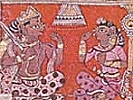

  
[Intangible Textual Heritage](../../index)  [Hinduism](../index.md) 
[Index](index)  [Previous](lcc12)  [Next](lcc14.md) 

------------------------------------------------------------------------

[Buy this Book at
Amazon.com](https://www.amazon.com/exec/obidos/ASIN/1417982012/internetsacredte.md)

------------------------------------------------------------------------

  
*The Little Clay Cart*, by Shudraka, tr. Arthur William Ryder, \[1905\],
at Intangible Textual Heritage

------------------------------------------------------------------------

p. 105

### ACT THE SEVENTH

#### ARYAKA'S ESCAPE

\[*Enter Chārudatta and Maitreya*.\]

*Maitreya*.

HOW beautiful the old garden Pushpakaranda is.

*Chārudatta*. You are quite right, my friend. For see!

The trees, like merchants, show their wares;  
Each several tree his blossoms bears,  
While bees, like officers, are flitting,  
To take from each what toll is fitting.1

*Maitreya*. This simple stone is very attractive. Pray be seated.

*Chārudatta*. \[*Seats himself*.\] How Vardhamānaka lingers, my friend!

*Maitreya*. I told Vardhamānaka to bring Vasantasenā and come as quickly
as he could.

*Chārudatta*. Why then does he linger?

Is he delayed by some slow-moving load?  
  Has he returned with broken wheel or traces?  
Obstructions bid him seek another road?  
  His bullocks, or himself, choose these slow paces?2

\[*Enter Vardhamānaka with the bullock-cart, in which Aryaka lies
hidden*.\]

*Vardhamānaka*. Get up, bullocks, get up!

*Aryaka*. \[*Aside*.\]

And still I fear the spies that serve the king;  
Escape is even yet a doubtful thing,  
While to my foot these cursèd fetters cling.

Some good man ’tis, within whose cart I lie,  
Like cuckoo chicks, whose heartless mothers fly,  
And crows must rear the fledglings, or they die.3

I have come a long distance from the city. Shall I get out of the

p. 106

cart and seek a hiding-place in the grove? or shall I wait to see the
owner of the cart? On second thoughts, I will not hide myself in the
grove; for men say that the noble Chārudatta is ever helpful to them
that seek his protection. I will not go until I have seen him face to
face.

’Twill bring contentment to that good man's heart  
To see me rescued from misfortune's sea.  
This body, in its suffering, pain, and smart,  
Is saved through his sweet magnanimity.4

*Vardhamānaka*. Here is the garden. I'll drive in. \[*He does so*.\]
Maitreya!

*Maitreya*. Good news, my friend. It is Vardhamānaka's voice.
Vasantasenā must have come.

*Chārudatta*. Good news, indeed.

*Maitreya*. You son of a slave, what makes you so late?

*Vardhamānaka*. Don't get angry, good Maitreya. I remembered that I had
forgotten the cushion, and I had to go back for it, and that is why I am
late.

*Chārudatta*. Turn the cart around, Vardhamānaka. Maitreya, my friend,
help Vasantasenā to get out.

*Maitreya*. Has she got fetters on her feet, so that she can't get out
by herself? \[*He rises and lifts the curtain of the cart*.\] Why, this
isn't mistress Vasantasenā—this is Mister Vasantasena.

*Chārudatta*. A truce to your jests, my friend. Love cannot wait. I will
help her to get out myself. \[*He rises*.\]

*Aryaka*. \[*Discovers him*.\] Ah, the owner of the bullock-cart! He is
attractive not only to the ears of men, but also to their eyes. Thank
heaven! I am safe.

*Chārudatta*. \[*Enters the bullock-cart and discovers Aryaka*.\] Who
then is this?

As trunk of elephant his arms are long,  
His chest is full, his shoulders broad and strong, p. 107  
  His great eyes restless-red; [1](#fn_70.md)  
Why should this man be thus enforced to fight—  
So noble he—with such ignoble plight,  
  His foot to fetters wed?5

Who are you, sir?

*Aryaka*. I am one who seeks your protection, Aryaka, by birth a
herdsman.

*Chārudatta*. Are you he whom King Pālaka took from the hamlet where he
lived and thrust into prison?

*Aryaka*. The same.

*Chārudatta*. ’Tis fate that brings you to my sight;

May I be reft of heaven's light,  
Ere I desert you in your hapless plight.6

\[*Aryaka manifests his joy*.\]

*Chārudatta*. Vardhamānaka, remove the fetters from his foot.

*Vardhamānaka*. Yes, sir. \[*He does so*.\] Master, the fetters are
removed.

*Aryaka*. But you have bound me with yet stronger fetters of love.

*Maitreya*. Now you may put on the fetters yourself. He is free anyway.
And it's time for us to be going.

*Chārudatta*. Peace! For shame!

*Aryaka*. Chārudatta, my friend, I entered your cart somewhat
unceremoniously. I beg your pardon.

*Chārudatta*. I feel honored that you should use no ceremony with me.

*Aryaka*. If you permit it, I now desire to go.

*Chārudatta*. Go in peace.

*Aryaka*. Thank you. I will alight from the cart.

*Chārudatta*. No, my friend. The fetters have but this moment been
removed, and you will find walking difficult. In this spot

p. 108

where men seek pleasure, a bullock-cart will excite no suspicion.
Continue your journey then in the cart.

*Aryaka*. I thank you, sir.

*Chārud*. Seek now thy kinsmen. Happiness be thine!

*Aryaka*. Ah, I have found thee, blessèd kinsman mine!

*Chārud*. Remember me, when thou hast cause to speak.

*Aryaka*. Thy name, and not mine own, my words shall seek.

*Chārud*. May the immortal gods protect thy ways!

*Aryaka*. Thou didst protect me, in most perilous days.

*Chārud*. Nay, it was fate that sweet protection lent.

*Aryaka*. But thou wast chosen as fate's instrument.7

*Chārudatta*. King Pālaka is aroused, and protection will prove
difficult. You must depart at once.

*Aryaka*. Until we meet again, farewell.

\[*Exit*.

*Chārud*. From royal wrath I now have much to fear;

It were unwise for me to linger here.  
Then throw the fetters in the well; for spies  
Serve to their king as keen, far-seeing eyes.8

\[*His left eye twitches*.\] Maitreya, my friend, I long to see
Vasantasenā. For now, because

I have not seen whom I love best,  
My left eye twitches; and my breast  
Is causeless-anxious and distressed.9

Come, let us go. \[*He walks about*.\] See! a Buddhist monk approaches,
and the sight bodes ill. \[*Reflecting*.\] Let him enter by that path,
while we depart by this.

\[*Exit*.

------------------------------------------------------------------------

### Footnotes

[107:1](lcc13.htm#fr_70.md) Lallādīkshita says that
these are signs of royalty.

------------------------------------------------------------------------

[Next: Act the Eighth: The Strangling of Vasantasenā](lcc14.md)
