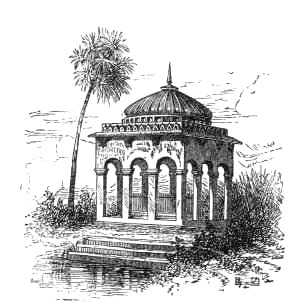

[Intangible Textual Heritage](../../index)  [Hinduism](../index.md) 

------------------------------------------------------------------------

<table width="75%">
<colgroup>
<col style="width: 50%" />
<col style="width: 50%" />
</colgroup>
<tbody>
<tr class="odd">
<td width="50%" data-valign="TOP"> 
</td>
<td width="50%" data-valign="TOP"><h1 id="old-deccan-days" data-align="CENTER">Old Deccan Days</h1>
<h2 id="by-mary-frere" data-align="CENTER">by Mary Frere</h2>
<h4 id="section" data-align="CENTER">[1868]</h4></td>
</tr>
</tbody>
</table>

------------------------------------------------------------------------

[Title Page](odd00.md)  
[Preface to the Third English Edition](odd01.md)  
[Introduction](odd02.md)  
[The Collector's Apology](odd03.md)  
[The Narrator's Narrative](odd04.md)  
[I. Punchkin](odd05.md)  
[II. A Funny Story](odd06.md)  
[III. Brave Seventee Bai](odd07.md)  
[IV. Truth's Triumph](odd08.md)  
[V. Rama and Luxman; or the Learned Owl](odd09.md)  
[VI. Little Surya Bai](odd10.md)  
[VII. The Wanderings of Vicram Maharajah](odd11.md)  
[VIII. Less Inequality than Men Deem](odd12.md)  
[IX. Panch-Phul Ranee](odd13.md)  
[X. How the Sun, the Moon, and the Wind Went Out to Dinner](odd14.md)  
[XI. Singh Rajah and the Cunning Little Jackals](odd15.md)  
[XII. The Jackal, the Barber, and the Brahman who had seven
daughters](odd16.md)  
[XIII. Tit for Tat](odd17.md)  
[XIV. The Brahman, the Tiger, and the Six Judges](odd18.md)  
[XV. The Selfish Sparrow and the Houseless Crows](odd19.md)  
[XVI. The Valiant Chattee-Maker](odd20.md)  
[XVII. The Raksha's Palace](odd21.md)  
[XVIII. The Blind Man, the Deaf Man, and the Monkey](odd22.md)  
[XIX. Muchie-Lal](odd23.md)  
[XX. Chundun Rajah](odd24.md)  
[XXI. Sodewa Bai](odd25.md)  
[XXII. Chandra's Revenge](odd26.md)  
[XXIII. How the Three Clever Men Outwitted the Demons](odd27.md)  
[XXIV. The Alligator and the Jackal](odd28.md)  
[Notes on the Narrator's Narrative](odd29.md)  
[Notes on the Fairy Legends](odd30.md)  
[Glossary](odd31.md)  
