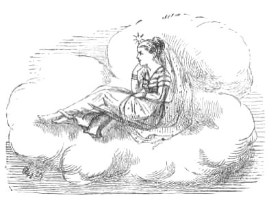

[Intangible Textual Heritage](../../index)  [Hinduism](../index) 
[Index](index)  [Previous](odd13)  [Next](odd15) 

------------------------------------------------------------------------

# X

# HOW THE SUN, THE MOON, AND THE WIND, WENT OUT TO DINNER.

 

ONE day the Sun, the Moon, and the Wind went out to dine with their
uncle and aunt, the Thunder and Lightning. Their mother (one of the most
distant stars you see far up in the sky) waited alone for her children's
return.

Now both the Sun and the Wind were greedy and selfish. They enjoyed the
great feast that had been prepared for them, without a thought of saving
any of it to take home to their mother--but the gentle Moon did not
forget her. Of every dainty dish that was brought round she placed a
small portion under one of her beautiful long finger-nails, that the
Star might also have a share in the treat.  [1](#fn_57)

On their return, their Mother, who had kept watch for them all night
long with her little bright eye, said, 'Well, children, what have you
brought home for me?' Then the Sun (who was eldest) said, 'I have
brought nothing home for you. I went out to enjoy myself with my
friends--not to fetch a dinner for mymother!' And the Wind said,
'Neither have I brought anything home for you, mother. You could hardly
expect me to bring a collection of good things for you, when I merely
went out for my own pleasure.' But the Moon said, 'Mother, fetch a
plate, see what I have brought you.' And shaking her hands she showered
down such a choice dinner as never was seen before.

Then the Star turned to the Sun and spoke thus, 'Because you went out to
amuse yourself with your friends, and feasted and enjoyed yourself,
without any thought of your mother at home--you shall be cursed.
Henceforth, your rays shall ever be hot and scorching, and shall burn
all that they touch. And men shall hate you, and cover their heads when
you appear.'

(And that is why the Sun is so hot to this day.)

Then she turned to the Wind and said, 'You also, who forgot your mother
in the midst of your selfish pleasures--hear your doom. You shall always
blow in the hot dry weather, and shall parch and shrivel all living
things. And men shall detest and avoid you from this very time.'

(And that is why the Wind in the hot weather is still so disagreeable.)

But to the Moon she said, 'Daughter, because you remembered your mother,
and kept for her a share in your own enjoyment, from henceforth you
shall be ever cool, and calm, and bright No noxious glare shall
accompany your pure rays, and men shall always call you "blessed."

(And that is why the Moon's light is so soft, and cool, and beautiful
even to this day.)

 

------------------------------------------------------------------------

### Footnotes

[1](odd14.htm#fr_57) See Notes.

------------------------------------------------------------------------

[Next: XI. Singh Rajah and the Cunning Little Jackals](odd15)
