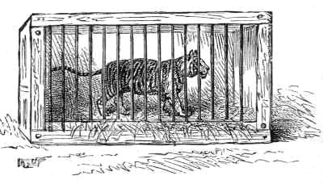

[Intangible Textual Heritage](../../index)  [Hinduism](../index) 
[Index](index)  [Previous](odd17)  [Next](odd19) 

------------------------------------------------------------------------

# XIV.

# THE BRAHMAN, THE TIGER, AND THE SIX JUDGES.

 

ONCE upon a time a Brahman, who was walking along the road, came upon an
iron cage, in which a great Tiger had been shut up by the villagers who
caught him.

As the Brahman passed by, the Tiger called out and said to him, 'Brother
Brahman, brother Brahman, have pity on me, and let me out of this cage
for one minute only, to drink a little water, for I am dying of thirst.'
The Brahman answered, 'No, I will not; for if I let you out of the cage
you will eat me.'

'O father of mercy,' answered the Tiger, 'in truth that will not. I will
never be so ungrateful; only let me out, that I may drink some water and
return.' Then the Brahman took pity on him, and opened the cage-door;
but no sooner had he done so than the Tiger, jumping out, said, 'Now, I
will eat you first, and drink the water afterwards.' But the Brahman
said, 'Only do not kill me hastily. Let us first ask the opinion of six,
and if all of them say it is just and fair that you should put me to
death, then I am willing to die.'--' Very well,' answered the Tiger, 'it
shall be as you say; we will first ask the opinion of six.'

So the Brahman and the Tiger walked on till they came to a Banyan-tree;
and the Brahman said to it, 'Banyan-tree, Banyan-tree, hear and give
judgment.'--' On what must I give judgment?' asked the Banyan-tree.
'This Tiger,' said the Brahman, 'begged me to let him out of his cage to
drink a little water, and he promised not to hurt me if I did so; but
now that I have let him out he wishes to eat me. Is it just that he
should do so, or no?'

The Banyan-tree answered, 'Men often come to take refuge in the cool
shade under my boughs from the scorching rays of the sun; but when they
have rested, they cut and break my pretty branches, and wantonly scatter
the leaves that sheltered them. Let the Tiger eat the man, for men are
an ungrateful race.'

At these words the Tiger would have instantly killed the Brahman; but
the Brahman said, 'Tiger, Tiger, you must not kill me yet, for you
promised that we should first hear the judgment of six.'--' Very well,'
said the Tiger, and they went on their way. After a little while they
met a Camel. 'Sir Camel, Sir Camel,' cried the Brahman, 'hear and give
judgment. '--' On what shall I give judgment?' asked the Camel. And the
Brahman related how the Tiger had begged him to open the cage-door, and
promised not to eat him if he did so; and how he had afterwards
determined to break his word, and asked if that were just or not. The
Camel replied, 'When I was young and strong, and could do much work, my
master took care of me and gave me good food; but now that I am old, and
have lost all my strength in his service, he overloads me, and starves
me, and beats me without mercy. Let the Tiger eat the man, for men are
an unjust and cruel race.'

The Tiger would then have killed the Brahman, but the latter said,
'Stop, Tiger, for we must first hear the judgment of six.'

So they both went again on their way. At a little distance they found a
Bullock lying by the roadside. The Brahman said to him, 'Brother
Bullock, brother Bullock, hear and give judgment.'--' On what must I
give judgment?' asked the Bullock. The Brahman answered, 'I found this
Tiger in a cage, and he prayed me to open the door and let him out to
drink a little water, and promised not to kill me if I did so; but when
I had let him out he resolved to put me to death. Is it fair he should
do so or not?' The Bullock said, 'When I was able to work, my master fed
me well and tended me carefully, but now I am old he has forgotten all I
did for him, and left me by the roadside to die. Let the Tiger eat the
man, for men have no pity.'

Three out of the six had given judgment against the Brahman, but still
he did not lose all hope, and determined to ask the other three.

They next met an Eagle flying through the air, to whom the Brahman
cried, 'O Eagle, great Eagle, hear and give judgment.'--' On what must I
give judgment?' asked the Eagle. The Brahman stated the case, but the
Eagle answered, 'Whenever men see me they try to shoot me; they climb
the rocks and steal away my little ones. Let the Tiger eat the man, for
men are the persecutors of the earth.'

Then the Tiger began to roar, and said, 'The judgment of all is against
you, O Brahman!' But the Brahman answered, 'Stay yet a little longer,
for two others must first be asked' After this they saw an Alligator,
and the Brahman related the matter to him, hoping for a more favourable
verdict. But the Alligator said, 'Whenever I put my nose out of the
water, men torment me, and try to kill me. Let the Tiger eat the man,
for as long as men live we shall have no rest.'

The Brahman gave himself up as lost; but once more he prayed the Tiger
to have patience, and to let him ask the opinion of the sixth judge. Now
the sixth was a Jackal. The Brahman again told his story, and said to
him, 'Mama Jackal, Mama Jackal, say what is your judgment?' The Jackal
answered, 'It is impossible for me to decide who is in the right and who
in the wrong, unless I see the exact position in which you were when the
dispute began. Show me the place.' So the Brahman and the Tiger returned
to the place where they first met, and the Jackal went with them. When
they got there, the Jackal said, 'Now, Brahman, show me exactly where
you stood.'--' Here,' said the Brahman, standing by the iron tiger-cage.
'Exactly there, was it?' asked the Jackal. 'Exactly here,' replied the
Brahman. 'Where was the Tiger then?' asked the Jackal 'In the cage,'
answered the Tiger. 'How do you mean?' said the Jackal, 'how were you
within the cage; which way were you looking?'--' Why, I stood so,' said
the Tiger, jumping into the cage, 'and my head was on this side.'--'
Very good,' said the Jackal, 'but I cannot judge without understanding
the whole matter exactly. Was the cage-door open or shut?'--' Shut, and
bolted,' said the Brahman. 'Then shut and bolt it,' said the Jackal.

When the Brahman had done this, the Jackal said, 'Oh, you wicked and
ungrateful Tiger--when the good Brahman opened your cage-door, is to eat
him the only return you would make? Stay there, then, for the rest of
your days, for no one will ever let you out again. Proceed on your
journey, friend Brahman. Your road lies that way, and mine this.'

So saying, the Jackal ran off in one direction, and the Brahman went
rejoicing on his way in the other.

 

------------------------------------------------------------------------

[Next: XV. The Selfish Sparrow and the Houseless Crows](odd19)
