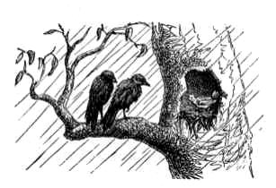
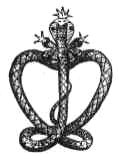

[Intangible Textual Heritage](../../index)  [Hinduism](../index) 
[Index](index)  [Previous](odd18)  [Next](odd20) 

------------------------------------------------------------------------

# XV.

# THE SELFISH SPARROW AND THE HOUSELESS CROWS.

 

A SPARROW once built a nice little house for herself, and lined it well
with wool, and protected it with sticks, so that it equally resisted the
summer sun and the winter rains. A Crow, who lived close by, had also
built a house, but it was not such a good one, being only made of a few
sticks laid one above another on the top of a prickly pear hedge. The
consequence was, that one day when there was an unusually heavy shower,
the Crow's nest was washed away, while the Sparrow's was not at all
injured.

in this extremity the Crow and her mate went to the Sparrow, and said,
'Sparrow, Sparrow, have pity on us, and give us shelter, for the wind
blows, and the rain beats, and the prickly pear hedge thorns stick into
our eyes.' But the Sparrow answered, 'I am cooking the dinner, I cannot
let you in now, come again presently.' In a little while the Crows
returned, and said, 'Sparrow, Sparrow, have pity on us, and give us
shelter, for the wind blows, and the rain beats, and the prickly pear
hedge thorns stick into our eyes.' The Sparrow answered, 'I 'm eating my
dinner, I cannot let you in now, come again presently.' The Crows flew
away, but in a little while returned, and cried once more, 'Sparrow,
Sparrow, have pity on us, and give us shelter, for the wind blows, and
the rain beats, and the prickly pear hedge thorns stick into our eyes.'
The Sparrow replied, 'I'm washing the dishes, I cannot let you in now,
come again presently.' The Crows waited a while and then called out,
'Sparrow, Sparrow, have pity on us, and give us shelter, for the wind
blows, and the rain beats, and the prickly pear hedge thorns stick into
our eyes.' But the Sparrow would not let them in, she only answered, 'I
'm sweeping the floor, I cannot let you in now, come again presently.'
Next time the Crows came and cried, 'Sparrow, Sparrow, have pity on us,
and give us shelter, for the wind blows, and the rain beats, and the
prickly pear hedge thorns stick into our eyes '--she answered, 'I 'm
making the beds, I cannot let you in now, come again presently.' So, on
one pretence or another, she refused to help the poor birds. At last,
when she and her children had had their dinner, and she had prepared and
put away the dinner for next day, and had put all the children to bed
and gone to bed herself she cried to the Crows, 'You may come in now,
and take shelter for the night' The Crows came in, but they were very
vexed at having been kept out so long in the wind and the rain, and when
the Sparrow and all her family were asleep, the one said to the other,
'This selfish Sparrow had no pity on us, she gave us no dinner, and
would not let us in, till she and all her children were comfortably in
bed; let us punish her.' So the two Crows took all the nice dinner the
Sparrow had prepared for herself and her children to eat next day, and
flew away with it.

 

------------------------------------------------------------------------

[Next: XVI. The Valiant Chattee-Maker](odd20)
