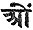

  
[Intangible Textual Heritage](../../index)  [Hinduism](../index.md) 
[Index](index)  [Previous](rls25)  [Next](rls27.md) 

------------------------------------------------------------------------

### The Sayings of Râmak*ri*sh*n*a: 100-199

100\. A man who finds all the hairs of his body standing on end at the
bare mention of *S*rî Hari's name, through sheer ecstasy, and who sheds
tears of love on hearing the name of God, he has reached his last birth.

101\. The more you scratch the ringworm, the greater grows the itching,
and the more pleasure do you find in scratching. Similarly, the devotees
once beginning to sing His praises, never get tired of it, but continue
for hours and hours together.

102\. When grains are measured out to the purchaser in

p. 121

the granary of a rich merchant, the measurer unceasingly goes on
measuring, while the attending women supply him with basket-fulls of
grain from the main store. The measurer does not leave his seat, while
the women incessantly supply him with grain. But a small grocer has
neither such attendants, nor is his store so inexhaustible. Similarly,
it is God Himself who is constantly inspiring thoughts and sentiments in
the hearts of His devotees, and that is the reason why the latter are
never in lack of new and wise thoughts and sentiments; while, on the
other hand, the book-learned, like petty grocers, soon find that their
thoughts have become exhausted.

103\. A born farmer does not leave off tilling the soil, though it may
not rain for twelve consecutive years, while a merchant who has but
lately taken himself to the plough is discouraged by one season of
drought. The true believer is never discouraged, if even with his
lifelong devotion he fails to see God.

104\. A true devotee who has drunk deep of the Divine Love is like a
veritable drunkard, and, as such, cannot always observe the rules of
propriety.

105\. Dala (sedge) does not grow in large and pure water-tanks, but in
small stagnant and miasmatic pools. Similarly, Dala (schism) does not
take place in a party whose adherents are guided by pure, broad, and
unselfish motives, but it takes firm root in a party whose advocates are
given to selfishness, insincerity, and bigotry. ('Dala,' in Bengâli,
means both sedges and schism.)

p. 122

106\. The Yogins and Sa*m*yâsins are like snakes. The snake never digs a
hole for itself, but it lives in the hole made by the mouse. When one
hole becomes uninhabitable, it enters into another hole. So the Yogins
and the Sa*m*yâsins make no houses for themselves; they pass their days
in other men's houses--to-day in one house, to-morrow in another.

107\. The sage alone can recognise a sage. He who deals in cotton twists
can alone tell of what number and quality a particular twist is made.

108\. A sage was lying in a deep trance (Samâdhi) by a roadside; a thief
passing by, saw him, and thought within himself, This fellow, lying
here, is a thief. He has been breaking into some house by night, and now
sleeps exhausted. The police will very soon be here to catch him. So let
me escape in time.' Thus thinking, he ran away. Soon after a drunkard
came upon the sage, and said, Hallo! thou hast fallen into the ditch by
taking a drop too much. I am steadier than thou, and am not going to
tumble.' Last of all came a sage, and understanding that a great sage
was in a trance (Samâdhi), he sat down, and touched him, and began to
rub gently his holy feet.

109\. An itinerant Sâdhu came once upon the Kâlî temple of Râni
Râsama*n*i, and seeing a dog eating the remains of a feast, he went up
to him and said, embracing him, 'Brother, how is it that thou eatest
alone, without giving me a share?' So saying, he began to eat along with
the dog. The people of the place naturally thought

p. 123

him mad, but when standing before the temple of the Goddess, he began to
chant forth some hymns in praise of Kâlî, and the temple appeared to
shake through the fervour of his devotion. Then the people knew him to
be a great Sâdhu. The true Sâdhus roam about like children or mad men,
in dirty clothes, and various other disguises.

110\. The true religious man is he who does not do anything wrong or act
impiously when he is alone, i.e. when there is none to look after and
blame him.

111\. In the Bengâli alphabet no three letters are alike in sound except
the three sibilants (*S*a, sha, and sa), all meaning
'forbear,' 'forbear,' 'forbear.' This shows that even from our childhood
we are made to learn forbearance in our very alphabets. The quality of
forbearance is of the highest importance to every man.

112\. Sugar and sand may be mixed together, but the ant rejects the sand
and goes off with the sugar-grain; so pious men sift the good from the
bad.

113\. It is the nature of the winnowing basket to reject the bad and
keep the good; even such is the case with pious men.

114\. He is truly a pious man who is dead even in life, i.e. whose
passions and desires have been all destroyed as in a dead body.

115\. Worldly persons perform many pious and charitable acts with a hope
of worldly rewards, but when misfortune, sorrow, and poverty approach
them, they forget them all.

p. 124

\[paragraph continues\] They are like the parrot that repeats the Divine
name 'Râdhâ-K*ri*sh*n*a, Râdhâ-K*ri*sh*n*a' the livelong day, but cries
'Kaw, Kaw' when caught by a cat, forgetting the Divine name.

116\. A spring cushion is squeezed down when one sits upon it, but it
soon resumes its original shape when the pressure is removed. So it is
with worldly men. They are full of religious sentiments, so long as they
hear religious talks; but no sooner do they enter into the daily routine
of the world, than they forget all those high and noble thoughts, and
become as impure as before.

117\. So long as the iron is in the furnace it is red-hot, but it
becomes black as soon as it is taken out of the fire. So also is the
worldly man. As long as he is in church or in the society of pious
people, he is full of religious emotions, but no sooner does he come out
of those associations than he loses them all.

118\. Some one said, 'When my boy Harish grows up, I will get him
married, and give him the charge of the family; I shall then renounce
the world, and begin to practise Yoga.' At this a Sâdhu remarked, 'You
will never find any opportunity of practising Yoga (devotion). You will
say afterwards, "Harish and Girish are too much attached to me. They do
not like to leave my company as yet." Then you will desire perhaps, "Let
Harish have a son, and let me see that son married." And thus there will
be no end of your desires.'

119\. Flies sit at times on the sweetmeats kept exposed

p. 125

for sale in the shop of a confectioner; but no sooner does a sweeper
pass by with a basket full of filth than the flies leave the sweetmeats
and sit upon the filth-basket. But the honey-bee never sits on filthy
objects, and always drinks honey from the flowers. The worldly men are
like flies. At times they get a momentary taste of Divine sweetness, but
their natural tendency for filth soon brings them back to the dunghill
of the world. The good man, on the other hand, is always absorbed in the
beatific contemplation of Divine Beauty.

N.B. The worldly man is like a filthy worm that always lives and dies in
filth, and has no idea of higher things; the good man of the world is
like the fly that sits now on the filth and now on the sweet; while the
free soul of a Yogin is like the bee that always drinks the honey of
God's holy presence, and nothing else.

120\. When it was argued that a family-man (G*ri*hastha) may remain in
the family, but may have no concern with it, and consequently may remain
uncontaminated by the world, an illustration was cited to refute such an
argument, which is as follows:

A poor Brâhma*n*a once came to one of those family-men, who are
unconcerned with family affairs, to beg some money. When the beggar
asked of him some money, he replied, 'Sir, I never touch money. Why are
you wasting your time in begging of me?' The Brâhma*n*a, however, would
not go away. Tired with his importunate entreaties the man at last
resolved in his mind to give him a rupee,

p. 126

and told him, 'Well, sir, come to-morrow, I shall see what I can do for
you.' Then going in, this typical family-man told his wife, who was the
manager of all his affairs, he being unconcerned, 'Look here, dear, a
poor Brâhma*n*a is in great difficulty, and wants something of me. I
have made up my mind to give him a rupee. What is your opinion about
it?' 'Aha! what a generous fellow you are!' she replied, in great
excitement at the name of a rupee. 'Rupees are not, like leaves or
stones, to be thrown away without any thought.' 'Well, dear,' replied
the husband, in an apologising tone, 'the man is very poor and we should
not give him less than a rupee.' 'No!' replied the wife, 'I cannot spare
that much; here is a two-anna-bit and you can give him that, if you
like.' The man of course had no other alternative, being himself
unconcerned in all such worldly matters, and he took what his wife gave
him. Next day the beggar came, and received only a two-anna-bit. Such
uncontaminated family-men are really henpecked persons who are solely
guided by their wives, and as such are very poor specimens of humanity.

121\. Seeing the water pass glittering through the net of bamboo
frame-work [1](#fn_15.md), the small fry enter into
it with great pleasure, and having once entered they cannot get out
again--and are caught. Similarly, foolish men enter into the world
allured by its false glitter, but as it is easier to enter the net than
to get out of it, it is easier to enter the world than renounce it,
after having once entered it.

p. 127

122\. Men always quote the example of the king *G*anaka, as that of a
man who lived in the world and yet attained perfection. But throughout
the whole history of mankind there is only this solitary example. His
case was not the rule, but the exception. The general rule is that no
one can attain spiritual perfection unless he renounces lust and greed.
Do not think yourself to be a *G*anaka. Many centuries have rolled away
and the world has not produced another *G*anaka.

123\. This world is like a stage, where men perform many parts under
various disguises. They do not like to take off the mask, unless they
have played for some time. Let them play for a while, and then they will
leave off the mask of their own accord.

124\. The heart of the devotee is like a dry match; and the slightest
mention of the name of the Deity kindles the fire of love in his heart.
But the mind of the worldly, soaked in lust and greed, is like the moist
match, and can never be heated to enthusiasm, though God may be preached
to him innumerable times.

125\. A worldly man may be endowed with intellect as great as that of
*G*anaka, may take as much pains and trouble as a Yogin, and make as
great sacrifices as an ascetic; but all these he makes and does, not for
God, but for worldliness, honour, and wealth.

126\. As water does not enter into a stone, so religious advice produces
no impression on the heart of a worldly man.

p. 128

127\. As a nail cannot enter into a stone, but can easily be driven into
the earth, so the advice of the pious does not affect the soul of a
worldly man. It enters into the heart of a believer.

128\. As soft clay easily takes an impression, but not so a stone, so
also the Divine Wisdom impresses itself on the heart of the devotee, but
not on the soul of the worldly man.

129\. The characteristic of a thoroughly worldly man is that he does not
only not listen to hymns, religious discourses, praises of the Almighty,
&c., but also prevents others from hearing them, and abuses religious
men and societies, and scoffs at prayers.

130\. The alligator has got such a thick and scaly hide that no weapons
can pierce it; on the contrary, they fall off harmless. So,
howmuchsoever you may preach religion to a worldly man, it will have no
effect upon his heart.

131\. As the water enters in on one side under the bridge, and soon
passes out on the other, so religious advice affects worldly souls. It
enters into them by one ear and goes out by the other, without making
any impression upon their minds.

132\. By talking with a worldly man one can feel that his heart is
filled with worldly thoughts and desires, even as the crop of a pigeon
is filled with grains.

133\. So long as the fire is beneath, the milk boils and bubbles. Remove
the fire and it is quiet again. So the

p. 129

heart of the neophyte boils with enthusiasm, so long as he goes on with
his spiritual exercises, but afterwards it cools down.

134\. As to approach a monarch one must ingratiate oneself with the
officials that keep the gate and surround the throne, so to reach the
Almighty one must practise many devotions, as well as serve many
devotees and keep the company of the wise.

135\. Keep thy own sentiments and faith to thyself. Do not talk about
them abroad. Otherwise thou wilt be a great loser.

136\. There are three kinds of dolls; the first made of salt, the second
made of cloth, and the third made of stone. If these dolls be immersed
in water, the first will get dissolved and lose its form, the second
will absorb a large quantity of water but retain its form, while the
third will be impervious to the water. The first doll represents the man
who merges his self in the Universal and All-pervading Self and becomes
one with it, that is the 'Mukta purusha'; the second represents a true
lover or Bhakta, who is full of Divine bliss and knowledge; and the
third represents a worldly man, who will not absorb the least drop of
true knowledge.

137\. As when fishes are caught in a net some do not struggle at all,
some again struggle hard to come out of the net, while a few are happy
enough to effect their escape by rending the net; so there are three
sorts of men,

p. 130

viz. fettered (Baddha), wriggling (Mumukshu), and released (Mukta).

138\. As sieves separate the finer and coarser parts of a pulverized or
ground substance, keeping the coarser and rejecting the finer, even so
the wicked man takes the evil and rejects the good.

139\. Two men went into a garden. The worldly-wise man no sooner entered
the gate than he began to count the number of the mango-trees, how many
mangoes each tree bore, and what might be the approximate price of the
whole orchard. The other went to the owner, made his acquaintance, and
quietly going under a mango-tree began to pluck the fruit and eat it
with the owner's consent. Now who is the wiser of the two? Eat mangoes,
it will satisfy your hunger. What is the good of counting the leaves and
making vain calculations? The vain man of intellect is uselessly busy in
finding out the 'why and wherefore' of creation, while the humble man of
wisdom makes acquaintance with the Creator and enjoys Supreme Bliss in
this world.

140\. The vulture soars high up in the air, but all the while he is
looking down into the charnel-pits in search of putrid carcasses. So the
book-read pandits speak glibly and volubly about Divine Knowledge, but
it is all mere talk, for all the while their mind is thinking about how
to get money, respect, honour, power, &c., the vain guerdon of their
learning.

141\. Once a dispute arose in the court of the Maharajah

p. 131

of Burdwan among the learned men there, as to who was the greater Deity,
*S*iva or Vish*n*u. Some gave preference to *S*iva, others to Vish*n*u.
When the dispute grew hot a wise pandit remarked, addressing the Raja,
'Sire, I have neither met *S*iva nor seen Vish*n*u; how can I say who is
the greater of the two?' At this the dispute stopped, for none of the
disputants really had seen the Deities. Similarly none should compare
one Deity with another. When a man has really seen a Deity, he comes to
know that all the Deities are manifestations of one and the same
Brahman.

142\. As the elephant has two sets of teeth, the external tusks and the
inner grinders, so the God-men, like *S*rî K*ri*sh*n*a, &c., act and
behave to all appearances like common men, while their heart and soul
rest far beyond the pale of Karman.

143\. The Sâdhu who distributes medicines, and uses in-toxicants, is not
a proper Sâdhu; avoid the company of such.

144\. A Brâhma*n*a was laying down a garden, and looked after it day and
night. One day a cow straying into the garden browsed away a mango
sapling which was one of the most carefully-watched trees of the
Brâhma*n*a. The Brâhma*n*a seeing the cow destroy his favourite plant
gave it such a sound beating that it died of the injuries received, The
news soon spread like wildfire that the Brâhma*n*a killed the sacred
animal.

Now the Brâhma*n*a was a so-called Vedântist, and when taxed with the
sin denied it, saying,--'No, I have not

p. 132

killed the cow; it is my hand that has done it, and as Indra is the
presiding Deity of the hand, so if any one has incurred the guilt of
killing the cow, it is Indra and not I.'

Indra in his Heaven heard all this, assumed the shape of an old
Brâhma*n*a, came to the owner of the garden, and said, 'Sir, whose
garden is this?'

Brâhma*n*a--' Mine.'

Indra--' It is a beautiful garden. You have got a skilful gardener, for
see how neatly and artistically he has planted the trees!'

Brâhma*n*a--' Well, sir, that is also my work. The trees are planted
under my personal supervision and direction.'

Indra--' Indeed! O, you are very clever. But who has laid out this road?
It is very ably planned and neatly executed.'

Brâhma*n*a--' All this has been done by me.'

Then Indra with joined hands said, 'When all these things are yours, and
you take credit for all the works done in this garden, it is hard lines
for poor Indra to be held responsible for the killing of the cow.'

145\. If thou art in right earnest to be good and perfect, God will send
the true and proper Master (Sad-Guru) to thee. Earnestness is the only
thing necessary.

146\. As when going to a strange country, one must abide by the
directions of him who knows the way, while taking the advice of many may
lead to confusion, so in trying to reach God one should follow
implicitly the advice of one single Guru who knows the way to God.

p. 133

147\. Whoever can call on the Almighty with sincerity and intense
earnestness needs no Guru. But such a man is rare, hence the necessity
of a Guru or Guide. The Guru should be only one, but Upagurus (assistant
Gurus) may be many. He from whom any thing whatsoever is learned is an
Upaguru. The great Avadhûta had twenty-four such Gurus.

148\. Many roads lead to Calcutta. A certain man started from his home
in a distant village towards the metropolis. He asked a man on the road,
'What road must I take to reach Calcutta soon?' The man said, 'Follow
this road.' Proceeding some distance, he met another man and asked him,
'Is this the shortest road to Calcutta?' The man replied, 'O, no! You
must retrace your footsteps and take the road to your left.' The man did
so. Going in that new road for some distance he met a third man who
pointed him out another road to Calcutta. Thus the traveller made no
progress, but spent the day in changing one road for another. As he
wanted to reach Calcutta he should have stuck to the road pointed out to
him by the first man. Similarly those who want to reach God must follow
one and one only Guide.

149\. The disciple should never criticise his own Guru. He must
implicitly obey whatever his Guru says. Says a Bengâli couplet:

Though my Guru may visit tavern and still,  
My Guru is holy Rai Nityânanda still.

150\. The Guru is a mediator. He brings man and God together.

p. 134

151\. Take the pearl and throw the oyster-shell away. Follow the mantra
(advice) given thee by thy Guru and throw out of consideration the human
frailties of thy teacher.

152\. Listen not, if any one criticises and censures thy Guru. Leave his
presence at once.

153\. As the moon is the uncle of every child, so God is the Father and
Guide of the whole Humanity. (The children in Bengal call the moon their
'maternal uncle.')

154\. A disciple, having firm faith in the infinite power of his Guru,
walked over a river even by pronouncing his name. The Guru, seeing this,
thought within himself, 'Well, is there such a power even in my name?
Then I must be very great and powerful, no doubt!' The next day he also
tried to walk over the river pronouncing 'I, I, I,' but no sooner had he
stepped into the waters than he sank and was drowned. Faith can achieve
miracles, while vanity or egoism is the death of man.

155\. Gurus can be had by hundreds, but good Chelas (disciples) are very
rare.

156\. It is easy to utter 'do, re, mi, fa, sol, la, si,' by mouth, but
not so easy to sing or play them on any instrument. So it is easy to
talk religion, but it is difficult to act religion.

157\. Common men talk bagfuls of religion, but act not a grain of it,
while the wise man speaks little, but his whole life is a religion acted
out.

p. 135

158\. What you wish others to do, do yourself.

159\. Verily, verily, I say unto you, that he who yearns for God, finds
Him.

160\. The petals of the lotus drop off in time, but they leave scars
behind. So when true knowledge comes egoism goes off, but its traces
remain. These, however, are not at all active for evil.

161\. There are two Egos in man, one ripe and the other unripe. The ripe
Ego thinks, 'Nothing is mine; whatever I see, or feel, or hear, nay,
even this body is not mine, I am always free and eternal.' The unripe
Ego, on the contrary, thinks, 'This is my house, my room, my child, my
wife, my body, &c.'

162\. The cup in which garlic juice is kept retains the nasty odour,
though it may be rubbed and scoured hundreds of times. Egohood also is
such an obstinate creature. It never leaves us completely.

163\. The leaves of the cocoa-palm fall off, but leave still their marks
behind on the trunk. Similarly, so long as one has this body, there will
remain the mark of egoism, how high soever a man may advance in
spirituality. But these traces of egoism do not bind such men to the
world nor cause their re-birth.

164\. The sun can give heat and light to the whole world, but it can do
nothing when the clouds are in the sky and shut out its rays, Similarly,
so long as egoism is in the soul, God cannot shine upon the heart.

p. 136

165\. Vanity is like a heap of rubbish or ashes on which the water, as
soon as it falls, dries away. Prayers and contemplations produce no
effect upon the heart puffed up with vanity.

166\. Of all the birds of the air the crow is considered to be the
wisest, and he thinks himself so too. He never falls into a snare. He
flies off at the slightest approach of danger, and steals the food with
the greatest dexterity. But all this wisdom can supply him with no
better living than filth and foul matter. This is the result of his
having the wisdom of the pettifogger.

167\. Once upon a time conceit entered the heart of the Divine Sage
Nârada, and he thought there was no greater devotee than himself.
Reading his heart, the Lord *S*rî Vish*n*u said, 'Nârada, go to such and
such a place, there is a great Bhakta of mine there, and cultivate his
acquaintance.' Nârada went there and found an agriculturist, who rose
early in the morning, pronounced the name of Hari only once, and taking
his plough went out to till the ground all day long. At night he went to
bed after pronouncing the name of Hari once more. Nârada said within
himself, 'How can this rustic be called a lover of God? I see him busily
engaged in worldly duties, and he has no signs of a pious man in him.'
Nârada then went back to the Lord and said all he thought of his new
acquaintance. The Lord said, 'Nârada, take this cup full of oil, go
round this city and come back with it, but beware lest a drop of it fall
to the ground.' Nârada did as he was told, and on his

p. 137

return he was asked, 'Well, Nârada, how often did you remember me in
your walk?' 'Not once, my Lord,' replied Nârada, 'and how could I when I
had to watch this cup brimming over with oil?' The Lord then said, 'This
one cup of oil did so divert your attention that even you did forget me
altogether, but look to that rustic who, carrying the heavy load of a
family, still remembers me twice every day.'

168\. There are three kinds of love, selfish, mutual, and unselfish. The
selfish love is the lowest. It only looks towards its own happiness, no
matter whether the beloved suffers weal or woe. In mutual love the lover
not only wants the happiness of his or her beloved, but has an eye
towards his or her own happiness also. The unselfish love is of the
highest kind. The lover only minds the welfare of the beloved.

169\. A true lover sees his God as his nearest and dearest relative,
just as the shepherd women of V*ri*ndâvana saw in *S*rî K*ri*sh*n*a, not
the Lord of the Universe (*G*agannâtha), but their own beloved
(Gopînâtha).

170\. 'I must attain perfection in this life, yea, in three days I must
find God; nay, with a single utterance of His name I will draw Him to
me.' With such a violent love the Lord is attracted soon. The lukewarm
lovers take ages to go to Him, if at all.

171\. A lover and a knower of God were once passing through a forest. On
their way they saw a tiger at a distance. The *Gñ*ânin or knower of God
said, 'There

p. 138

is no reason why we should flee; the Almighty God will certainly protect
us.' At this the lover said, 'No, brother, come let us run away. Why
should we trouble the Lord for what can be accomplished by our own
exertions?'

172\. The Knowledge of God may be likened to a man, while the Love of
God is like a woman. Knowledge has entry only up to the outer rooms of
God, but no one can enter into the inner mysteries of God save a lover,
for a woman has access even into the harem of the Almighty.

173\. Knowledge and love of God are ultimately one and the same. There
is no difference between pure knowledge and pure love.

174\. A group of fisherwomen on their way home from a distant market
held on an afternoon, were overtaken by a heavy hailstorm at nightfall
in the middle of their way, and so were compelled to take shelter in a
florist's house near at hand. Through the kindness of the florist they
were allowed to sleep that night in one of his rooms, where some baskets
of sweet-smelling flowers had been kept for supplying his customers. The
atmosphere of the room was too good for the fisherwomen, and they could
not, owing to it, get even a wink of sleep, till one of them suggested a
remedy by saying, 'Let each of us keep her empty basket of fish close to
her nose, and thus prevent this troublesome smell of flowers from
attacking our nostrils and killing our sleep.' Every one gladly agreed
to the proposal, and did accordingly; and soon all began to snore. Such,
indeed, is

p. 139

the power and influence of bad habits over all those who are addicted to
them.

175\. A tame mungoose had its home high up on the wall of a house. One
end of a rope was tied to its neck, while the other end was fastened to
a weight. The mungoose with the appendage runs and plays in the parlour
or in the yard of the house, but no sooner does it get frightened than
it at once runs up and hides itself in its home on the wall. But it
cannot stay there long, as the weight at the other end of the rope draws
it down, and it is constrained to leave its home. Similarly, a man has
his home high up at the feet of the Almighty. Whenever he is frightened
by adversity and misfortune he goes up to his God, his true home; but in
a short time he is constrained to come down into the world by its
irresistible attractions.

176\. As Helonchâ (*Hingcha repens*) should not be counted among
pot-herbs, or sugar-candy among common sweets, because even a sick man
can use them without injuring his health; or as the pra*n*ava ( ) is not to be counted as a
word, but as Divinity itself; so the desires of holiness, devotion, and
love are not to be reckoned as desires at all.

177\. When the fruit grows the petals drop off of themselves. So when
the Divinity in thee increases, the weakness of humanity in thee will
vanish.

178\. The new-born calf falls and tumbles down scores of times before it
learns to stand steady. So in the path of devotion, the slips are many
before success is achieved.

p. 140

179\. Some get tipsy with even a small glass of wine. Others require two
or three bottles to make them intoxicated. But both get equal and full
pleasure of intoxication. Similarly, some devotees get intoxicated with
celestial bliss by coming in direct contact with the Lord of the
Universe, while others become full of ecstasy even by a glimpse of the
Divine Glory. But both are equally fortunate, since both are deluged
with Divine bliss.

180\. The snake is very venomous. It bites when any one approaches to
catch it. But the person who has learnt the snake-charm can not only
catch a snake, but carries about several of them like so many ornaments.
Similarly, he who has acquired spiritual knowledge can never be polluted
by lust and greed.

181\. When a man realises one of the following states he becomes
perfect:--(1) All this am I; (2) All this art thou; (3) Thou the Master,
and I the servant.

182\. Thou shouldst sacrifice thy body, mind, and riches, to find God.

183\. Humanity must die before Divinity manifests itself. But this
Divinity must, in turn, die before the higher manifestation of the
Blissful Mother takes place. It is on the bosom of dead Divinity
(*S*iva) that the Blissful Mother dances Her dance celestial.

184\. He finds God the quickest whose yearning and concentration are the
greatest.

185\. Samâdhi is the state of bliss which is experienced

p. 141

by a live fish which, being kept out of water for some time, is again
put into it.

186\. There are hills and mountains, dales and valleys, under the sea,
but they are not visible from the surface. So in the state of Samâdhi,
when one floats upon the ocean of Sat-*k*it-ânanda, all human
consciousness lies latent in him.

187\. If you fill an earthen vessel with water, and set it apart upon a
shelf, the water in it will dry up in a few days; but if you place the
same pot into water it will remain filled as long as it is kept there.
Even such is the case with your love to the Lord God. Fill and enrich
your bosom with the love of God for a time, and then employ yourself in
other affairs, forgetting Him all the while, and then you are sure to
find within a short time that your heart has become poor and vacant and
devoid of that precious love. But if you keep your heart immersed always
in the depth of that holy love, your heart is sure to remain ever full
to overflowing with the Divine fervour of sacred love.

188\. He who at the time of contemplation is entirely unconscious of
everything outside, has acquired the perfection of contemplation.

189\. A jar kept in water is full of water inside and outside. Similarly
the soul immersed in God sees the all-pervading spirit within and
without.

190\. When the grace of the Almighty descends, every

p. 142

one will understand his mistakes; knowing this you should not dispute.

191\. The darkness of centuries is dispersed at once as soon as a light
is brought into the room. The accumulated ignorances and misdoings of
innumerable births vanish before the single glance of the Almighty's
gracious look.

192\. When the Malaya breeze blows, all trees, having stamina in them,
become converted into sandal-trees; but those which have no stamina
remain unchanged as before, like bamboo, plantain, palm-tree, &c. So
when Divine Grace descends, men having the germs of piety and goodness
in them are changed at once into holy beings and are filled with
Divinity, but worthless and worldly men remain as before.

193\. As the dawn heralds in the rising sun, so unselfishness, purity,
righteousness, &c., precede the advent of the Lord.

194\. As a king, before going to the house of his servant, sends from
his own stores the necessary seats, ornaments, food, &c., to his
servant, so that the latter may properly receive him; so before the Lord
cometh, He sends love, reverence, faith, yearning, &c., into the heart
of the devotee.

195\. Shallow water in an open field will in time be dried up though no
one may lessen it by using it. So a sinner is sometimes purified by
simply resigning himself totally and absolutely to the mercy and grace
of God.

p. 143

196\. A policeman can see with a dark lantern (bull's-eye) every one
upon whom he throws the rays, but no one can see him so long as he does
not turn the light towards himself. So does God see every one, but no
one seeth Him until the Lord revealeth Himself to him in His mercy.

197\. There are some fish which have many sets of bones, and others have
one; but as the eater cleans all the bones and eats the fish, so some
men have many sins and others have few; but the grace of God purifies
them all in time.

198\. The breeze of His grace is blowing night and day over thy head.
Unfurl the sails of thy boat (mind) if thou wantest to make rapid
progress through the ocean of life.

199\. Fans should be discarded when the wind blows. Prayers and penances
should be discarded when the grace of God descends.

------------------------------------------------------------------------

### Footnotes

[126:1](rls26.htm#fr_15.md) A trap for catching
small fish.

------------------------------------------------------------------------

[Next: The Sayings of Râmak*ri*sh*n*a: 200-299](rls27.md)
